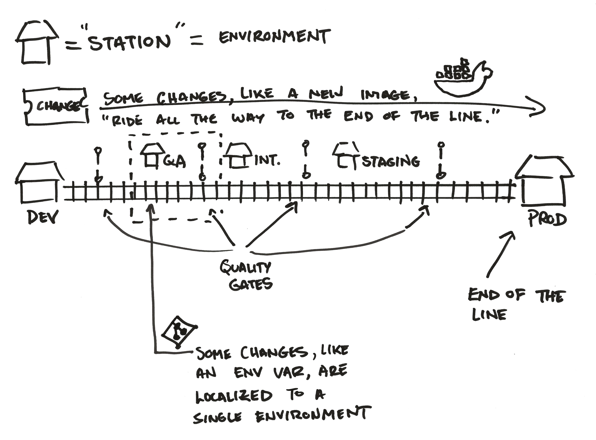

# K8sTA -- The Kubernetes Transit Authority

K8sTA is a _prototype_ tool built on top of Argo CD for orchestrating
application deployments through a logical progression of environments, usually
ending with production.

> 🟡&nbsp;&nbsp;K8sTA is highly experimental at this time and breaking changes
> should be anticipated between pre-GA minor releases.

## The Rail Line Paradigm

Up until now, "pipelines" have been the predominant conceptual model for the
movement of application changes through a logical progression of environments
and into production. Many _configuration_ changes, however, can legitimately be
environment-specific. Consider, for instance, that the address of a
hypothetical, externally hosted database almost certainly differs from one
environment to the next. While many existing CD tools may, in fact, account for
this, the notion of a "pipe," wherein something always enters one end and
emerges from the other, may be overly simplistic and does not map neatly onto
this reality.

K8sTA eschews the notion of pipelines and models the delivery of application
changes as movement along a _rail line_ instead. Every environment can be
thought of as a stop or station along the line and while some changes may ride
the rail all the way from one end of the line to the other, many other changes
may board the train or disembark at various stations in between.

## Design Philosophy

K8sTA is highly experimental at this time, but from inception, its design
embraces the
[Unix philosophy of doing one thing and doing it well](https://en.wikipedia.org/wiki/Unix_philosophy#Do_One_Thing_and_Do_It_Well).
Specifically, this means leaning on Argo CD and other, well-established GitOps
tools and patterns wherever possible in order to maintain a narrow focus on the
problem of orchestrating application deployments through a logical progression
of environments.

_K8sTA is also opinionated._ Rather than providing users with a litany of
options, it favors support for specific best-in-class tools and patterns, and
embraces convention over configuration. K8sTA's goal is to provide a
vertically-integrated experience that "just works."

Here is a small set of assumptions we are embracing, although none are immutable
at this early phase of development:

* You intend to continuously deliver a first-party application using a SaaS
  model.
  
  You're interested in getting your _own_ code into a your _own_ live
  environments as quickly as possible (without sacrificing quality). You're
  _not_ "shrink wrapping" software (in the form of a Helm chart, for instance)
  for another party to install in _their_ environments.

* Your environments/applications are hosted in Kubernetes clusters.

* You're using GitOps to describe your infrastructure, applications,
  configuration, etc. as code -- specifically, _declarative_ code in the
  form of Kubernetes manifests (or something that can be rendered into
  Kubernetes manifests).

  This assumption, apart from allowing K8sTA to know where the source of truth
  is for each environment/application, also unburdens K8sTA from many other
  concerns since GitOps has its own answers to questions of access control, the
  auditability of changes, etc.

* You're using [ytt](https://github.com/vmware-tanzu/carvel-ytt) or
  [kustomize](https://github.com/kubernetes-sigs/kustomize) to render
  environment-specific Kubernetes manifests from base manifests overlaid with
  environment-specific configuration.

* You're using Argo CD to deploy applications by syncing your Kubernetes-based
  environments with your Git repositories.

  This assumption unburdens K8sTA from needing to know anything about _how_ to
  deploy applications.

## Getting Started

> 📝&nbsp;&nbsp;Stay tuned for a comprehensive quick start. For now, the best way
> to get started is by building/deploying locally from source. See the 
> [K8sTA Contribution Guide](docs/CONTRIBUTING.md) for details.

## Roadmap

Visit our dedicated [Roadmap](docs/ROADMAP.md) doc for details about what we've
accomplished so far and what we're currently working on.

## Contributing

The K8sTA project accepts contributions via GitHub pull requests.

Visit our [K8sTA Contribution Guide](docs/CONTRIBUTING.md) for more info on how
to get started quickly and easily.

## Support & Feedback

To report an issue, request a feature, or ask a question, please open an issue
[here](https://github.com/akuityio/k8sta-prototype/issues).

## Code of Conduct

Participation in the K8sTA project is governed by the
[Contributor Covenant Code of Conduct](docs/CODE_OF_CONDUCT.md).
