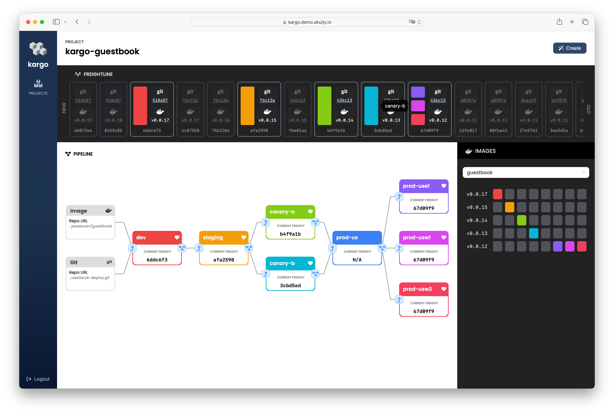

Kargo is a next-generation continuous delivery and application lifecycle
orchestration platform for Kubernetes. It builds upon
[GitOps](https://opengitops.dev/) principles and integrates with existing
technologies, like [Argo CD](https://argoproj.github.io/cd/), to streamline and
automate the progressive rollout of changes across the many stages of an
application's lifecycle.

> ⚠️&nbsp;&nbsp;Kargo is undergoing active development and everyone is invited
> to join us in the journey to a GA release (`v1.0.0`)! Please expect breaking changes
> between pre-GA releases (`v0.x.x`).

## Getting Started

Read more about Kargo in our [docs](https://docs.kargo.io) or get hands-on
right away by following our 
[Quickstart documentation](https://docs.kargo.io/quickstart) or watch the *Multi-Stage Deployment Pipelines the GitOps Way* talk by Jesse Suen & Kent Rancourt of Akuity at GitOpsCon EU 2024:

This documentation is very new, so please open issues against this repository if
you encounter any difficulties.

## Contributing

The Kargo project accepts contributions via GitHub pull requests.

Visit our
[Kargo Contributor Guide](https://docs.kargo.io/contributor-guide/) for more
info on how to get started quickly and easily.

## Support & Feedback

To report an issue, request a feature, or ask a question, please open an issue
[here](https://github.com/akuity/kargo/issues).

Please also feel free to join us on [Discord](https://discord.gg/dHJBZw6ewT)!

## Code of Conduct

Participation in the Kargo project is governed by the
[Contributor Covenant Code of Conduct](https://docs.kargo.io/contributor-guide/code-of-conduct/).
