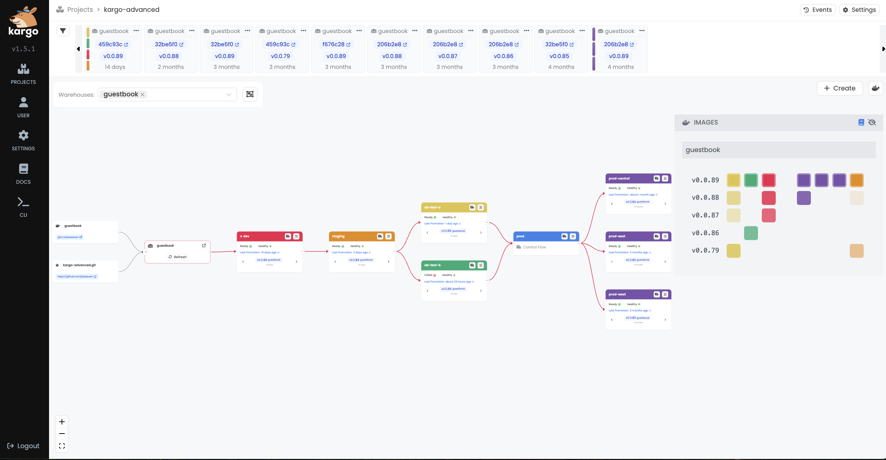

Kargo builds upon
[GitOps](https://opengitops.dev/) principles to manage and automate the
promotion of software artifacts through the many stages of their lifecycle.

## Getting Started

Read about Kargo in our [docs](https://docs.kargo.io), get hands-on right away
with our [Quickstart](https://docs.kargo.io/quickstart) tutorial, or watch the
*Multi-Stage Deployment Pipelines the GitOps Way* talk presented by Jesse Suen &
Kent Rancourt of [Akuity](https://akuity.io/) at GitOpsCon EU 2024:

## Support & Feedback

To report a bug or request a feature, please open an
[issue](https://github.com/akuity/kargo/issues). For general questions, please
start a [discussion](https://github.com/akuity/kargo/discussions) instead.

Please also feel free to join fellow users in discusions in our
[Discord Community](https://akuity.community)!

If you are interested in enterprise-scale Kargo hosted, managed, and
professionally supported by Akuity, inquire at https://akuity.io/kargo-enterprise.

## Contributing

The Kargo project accepts contributions via GitHub pull requests. If you wish to
implement a bug fix or new feature, please engage our maintainers by opening an
[issue](https://github.com/akuity/kargo/issues) first.

Visit our
[Kargo Contributor Guide](https://docs.kargo.io/contributor-guide/) for more
info on how to start hacking on Kargo quickly and easily.

## Code of Conduct

Participation in the Kargo project is governed by the
[Contributor Covenant Code of Conduct](https://docs.kargo.io/contributor-guide/code-of-conduct/).
