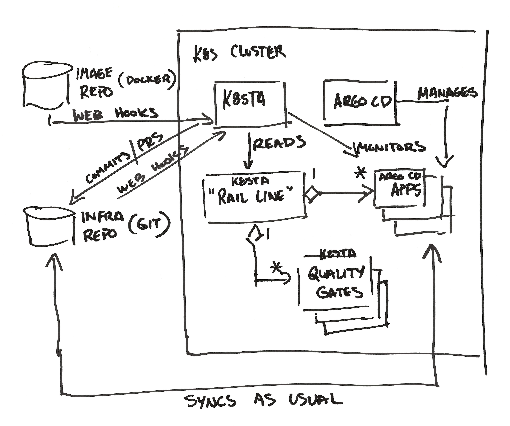

# K8sTA Roadmap

> 🟡&nbsp;&nbsp;K8sTA is highly experimental at this time and breaking changes
> should be anticipated between pre-GA minor releases.

The current goal with K8sTA is to discover and add value in small increments. If
the road ahead were more clear, we'd document it here -- and someday we will. In
the meantime, we'll document the road _behind us_ and _currently under our
tires_ to highlight what we've already experimented with, or are experimenting
with currently, what has worked, and what hasn't.

# First Iteration

In this iteration, our goal is only to move a new Docker image through a series
of environments _with no manual intervention and no "glue code" required._

"Hard configuration" (not user-defined) will be ingested from files at startup.
(This can be user-defined in the future.) This configuration describes
proverbial "rail lines" (`Line`s) wherein every application instance
(environment) can be compared to a stop or station along the line. _They are
ordered_, so progressing to any given station requires passing through all those
that come before it. Each line also has a name and subscribes to webhooks from
an image repository. (Only Docker Hub will be supported initially.)

> 📝&nbsp;&nbsp;If you have need to modify the configuration, you can find it in
`charts/k8sta/values.yaml`.

If a `Line` is subscribed to the image repository referenced by an inbound
webhook, the webhook triggers the creation of a `Ticket` resource. The ticket
will hold state as the new image rides the proverbial rail line all the way
to production.

The K8sTA controller actively monitors `Ticket` resources. A new `Ticket`
triggers execution of a job that will prepare and push a `git commit` that
effectively moves the new image into the first environment in the `Line`.

The K8sTA controller also actively monitors Argo CD `Application` resources.
When it is observed that a previous change has been synced to its target
environment and the target environment is healthy, this will trigger a job that
will prepare and push a `git commit` that will effectively "promote" the image
into the next environment in the `Line`.

This process repeats until the new image reaches production. Throughout, Argo CD
operates 100% as normal.

