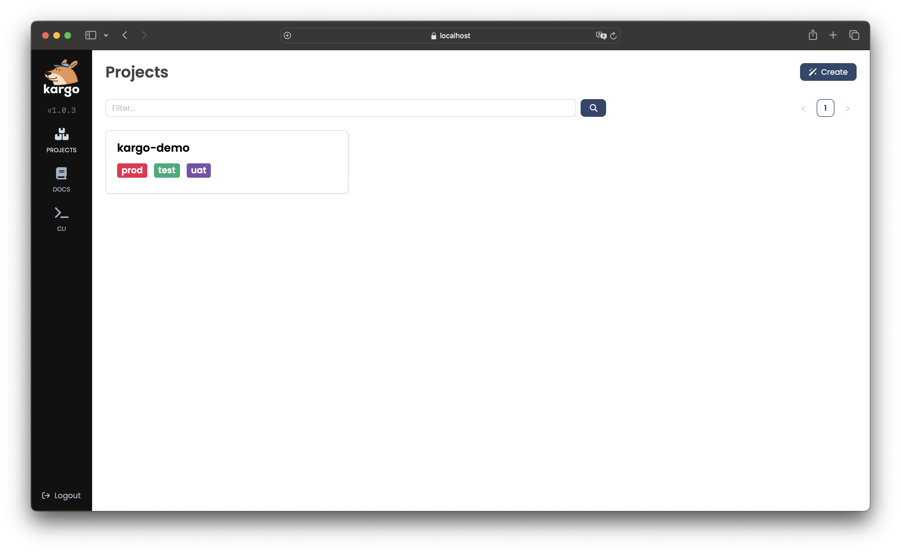
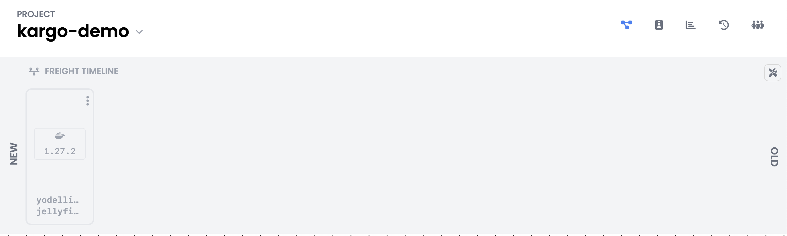
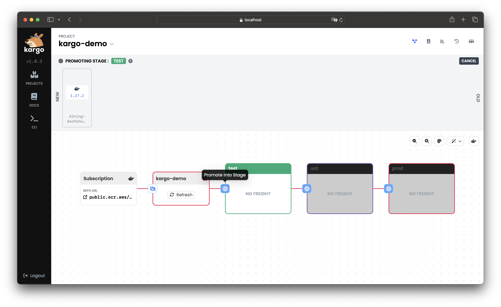
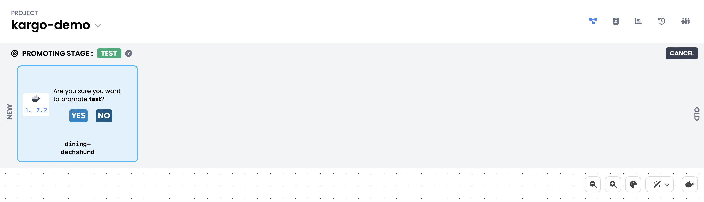
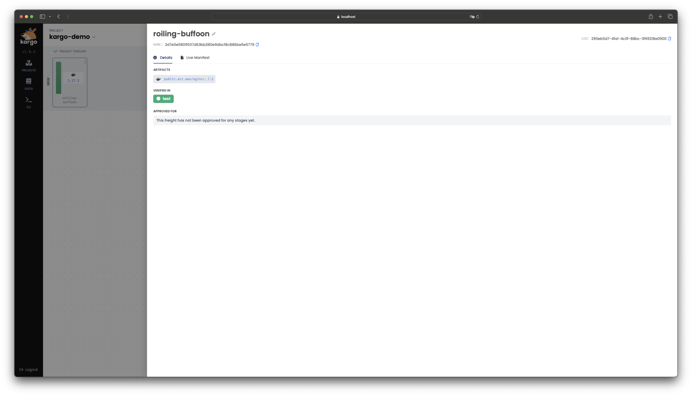

# Kargo Quickstart

This guide presents a basic introduction to Kargo. Together, we will:

1. Install Kargo and its dependencies into an existing, local Kubernetes
   cluster.

    OR

    Create a new local Kubernetes cluster with Kargo and its dependencies
    already installed.

1. Demonstrate how Kargo can progress changes through multiple stages by
   interacting with your GitOps repository and Argo CD `Application` resources.

1. Clean up.

:::info
If you're looking to contribute to Kargo, you may wish to consult the
[contributor guide](./contributor-guide) instead.
:::

### Starting a Local Cluster

Any of the following approaches require [Helm](https://helm.sh/docs/) v3.13.1 or
greater to be installed.

<Tabs groupId="cluster-start">
<TabItem value="docker-desktop" label="Docker Desktop">

If you are a
[Docker Desktop](https://www.docker.com/products/docker-desktop/)
user, you can follow
[these instructions](https://docs.docker.com/desktop/kubernetes/) to enable
its built-in Kubernetes support.

:::info
Although this is one of the fastest paths to a local Kubernetes cluster, be
aware that Docker Desktop supports only a _single_ Kubernetes cluster. If
that cluster reaches a state you are dissatisfied with, resetting it will
remove not just Kargo-related resources, but _all_ your workloads and data.
:::

```shell
curl -L https://raw.githubusercontent.com/akuity/kargo/main/hack/quickstart/install.sh | sh
```

</TabItem>
<TabItem value="orbstack" label="OrbStack">

[OrbStack](https://orbstack.dev/) is a fast, lightweight, drop-in replacement
for Docker Desktop for Mac OS only. You can follow
[these instructions](https://docs.orbstack.dev/kubernetes/) to enable its
built-in Kubernetes support.

:::info
Although this is one of the fastest paths to a local Kubernetes cluster, be
aware that OrbStack supports only a _single_ Kubernetes cluster. If
that cluster reaches a state you are dissatisfied with, resetting it will
remove not just Kargo-related resources, but _all_ your workloads and data.
:::

```shell
curl -L https://raw.githubusercontent.com/akuity/kargo/main/hack/quickstart/install.sh | sh
```

</TabItem>
<TabItem value="kind" label="kind">

If you have any Docker-compatible container runtime installed (including native
Docker, Docker Desktop, or OrbStack), you can easily launch a disposable cluster
just for this quickstart using
[kind](https://kind.sigs.k8s.io/#installation-and-usage).

```shell
curl -L https://raw.githubusercontent.com/akuity/kargo/main/hack/quickstart/kind.sh | sh
```

:::info
While this option is a bit more complex than using Docker Desktop or OrbStack
directly, it offers the advantage of being fully-disposable. If your cluster
reaches a state you are dissatisfied with, you can simply destroy it and
launch a new one.
:::

</TabItem>
<TabItem value="k3d" label="k3d">

If you have any Docker-compatible container runtime installed (including native
Docker, Docker Desktop, or OrbStack), you can easily launch a disposable cluster
just for this quickstart using [k3d](https://k3d.io).

```shell
curl -L https://raw.githubusercontent.com/akuity/kargo/main/hack/quickstart/k3d.sh | sh
```

:::info
While this option is a bit more complex than using Docker Desktop or OrbStack
directly, it offers the advantage of being fully-disposable. If your cluster
reaches a state you are dissatisfied with, you can simply destroy it and
launch a new one.
:::

</TabItem>
<TabItem value="more-info" label="More Info">

:::info
If you are averse to piping a downloaded script directly into a shell, please
feel free to download the applicable script and inspect its contents prior to
execution.

Any approach you select should only:

1. Launch a new, local Kubernetes cluster, if applicable
1. Install cert-manager
1. Install Argo CD
1. Install Argo Rollouts
1. Install Kargo
:::

</TabItem>
</Tabs>

:::note
If Kargo installation fails with a `401`, verify that you are using Helm v3.13.1
or greater.

If Kargo installation fails with a `403`, it is likely that Docker is configured
to authenticate to `ghcr.io` with an expired token. The Kargo chart and images
are accessible anonymously, so this issue can be resolved simply by logging out:

```shell
docker logout ghcr.io
```
:::

At the end of this process:

* The Argo CD dashboard will be accessible at [localhost:31443](https://localhost:31443).

  The username and password are both `admin`.

* The Kargo dashboard will be accessible at [localhost:31444](https://localhost:31444).

  The admin password is `admin`.

* You can safely ignore all cert errors for both of the above.

## Trying It Out

### Create a GitOps Repository

Let's begin by creating a repository on GitHub to house variations of our
application manifests for three different stages of a sample application: test,
UAT, and production.

1. Visit https://github.com/akuity/kargo-demo and fork the repository into your
   own GitHub account.

1. You can explore the repository and see that the `main` branch contains common
   configuration in a `base/` directory as well as stage-specific overlays in
   paths of the form `stages/<stage name>/`.

    :::note
    This layout is typical of a GitOps repository using
    [Kustomize](https://kustomize.io/) for configuration management and is not
    at all Kargo-specific.

    Kargo also works just as well with [Helm](https://helm.sh).
    :::

1. We'll be using it later, so save the location of your GitOps repository in an
   environment variable:

   ```shell
   export GITOPS_REPO_URL=<your repo URL, starting with https://>
   ```

### Create Argo CD `Application` Resources

In this step, we will use an Argo CD `ApplicationSet` resource to create and
manage three Argo CD `Application` resources that deploy the sample application
at three different stages of its lifecycle, with three slightly different
configurations, to three different namespaces in our local cluster:

```shell
cat <<EOF | kubectl apply -f -
apiVersion: argoproj.io/v1alpha1
kind: ApplicationSet
metadata:
  name: kargo-demo
  namespace: argocd
spec:
  generators:
  - list:
      elements:
      - stage: test
      - stage: uat
      - stage: prod
  template:
    metadata:
      name: kargo-demo-{{stage}}
      annotations:
        kargo.akuity.io/authorized-stage: kargo-demo:{{stage}}
    spec:
      project: default
      source:
        repoURL: ${GITOPS_REPO_URL}
        targetRevision: stage/{{stage}}
        path: .
      destination:
        server: https://kubernetes.default.svc
        namespace: kargo-demo-{{stage}}
      syncPolicy:
        syncOptions:
        - CreateNamespace=true
EOF
```

If you visit [your Argo CD dashboard](https://localhost:31443), you will notice
all three Argo CD `Application`s have not yet synced because they're not
configured to do so automatically, and in fact, the branches referenced by their
`targetRevision` fields do not even exist yet.


:::info
Our three stages all existing in a single cluster is for the sake of expediency.
A single Argo CD control plane can manage multiple clusters, so these could just
as easily have been spread across multiple clusters.
:::

### Your First Kargo Project

Up to this point, we haven't done anything with Kargo -- in fact everything
we've done thus far should be familiar to anyone who's already using Argo CD and
Kustomize. Now it's time to see what Kargo can do!

To get started, you will need a GitHub
[personal access token](https://github.com/settings/tokens)
with adequate permissions to read from and write to the repository you forked in
the previous section.

1. Save your GitHub handle and your personal access token in environment
   variables:

   ```shell
   export GITHUB_USERNAME=<your github handle>
   export GITHUB_PAT=<your personal access token>
   ```

1. Next, we'll create several Kargo resource:

    1. A `Project`, which, when reconciled, will effect all boilerplate project
       initialization, including the creation of a specially-labeled `Namespace`
       with the same name as the `Project`

    1. A `Secret` containing credentials for our GitOps repository

    1. A `Warehouse` that subscribes to a container image repository

    1. Three `Stage` resources -- `test`, `uat`, and `prod`

    Using CLI allows us to create resources declaratively, making it easier to manage and understand the setup.

    There are two ways to interact with Kargo i.e. using the `kubectl` CLI or using the Kargo CLI.

    :::info
      For demo purposes, using `kubectl` is the quickest way to declaratively define your first Project. However, in 
      practical, day-to-day use cases, where users may not have direct access to the underlying cluster, the Kargo CLI 
      offers additional functionality and uses OpenID Connect for authentication.
    :::
      <Tabs groupId="login-method">
      <TabItem value="kubectl-cli" label="Using kubectl" default>

            ```shell
            cat <<EOF | kubectl apply -f -
            apiVersion: kargo.akuity.io/v1alpha1
            kind: Project
            metadata:
              name: kargo-demo
            ---
            apiVersion: v1
            kind: Secret
            type: Opaque
            metadata:
              name: kargo-demo-repo
              namespace: kargo-demo
              labels:
                kargo.akuity.io/cred-type: git
            stringData:
              repoURL: ${GITOPS_REPO_URL}
              username: ${GITHUB_USERNAME}
              password: ${GITHUB_PAT}
            ---
            apiVersion: kargo.akuity.io/v1alpha1
            kind: Warehouse
            metadata:
              name: kargo-demo
              namespace: kargo-demo
            spec:
              subscriptions:
              - image:
                  repoURL: public.ecr.aws/nginx/nginx
                  semverConstraint: ^1.26.0
                  discoveryLimit: 5
            ---
            apiVersion: kargo.akuity.io/v1alpha1
            kind: Stage
            metadata:
              name: test
              namespace: kargo-demo
            spec:
              requestedFreight:
              - origin:
                  kind: Warehouse
                  name: kargo-demo
                sources:
                  direct: true
              promotionTemplate:
                spec:
                  steps:
                  - uses: git-clone
                    config:
                      repoURL: ${GITOPS_REPO_URL}
                      checkout:
                      - branch: main
                        path: ./src
                      - branch: stage/test
                        create: true
                        path: ./out
                  - uses: git-clear
                    config:
                      path: ./out
                  - uses: kustomize-set-image
                    as: update-image
                    config:
                      path: ./src/base
                      images:
                      - image: public.ecr.aws/nginx/nginx
                  - uses: kustomize-build
                    config:
                      path: ./src/stages/test
                      outPath: ./out/manifests.yaml
                  - uses: git-commit
                    as: commit
                    config:
                      path: ./out
                      messageFromSteps:
                      - update-image
                  - uses: git-push
                    config:
                      path: ./out
                      targetBranch: stage/test
                  - uses: argocd-update
                    config:
                      apps:
                      - name: kargo-demo-test
                        sources:
                        - repoURL: ${GITOPS_REPO_URL}
                          desiredCommitFromStep: commit
            ---
            apiVersion: kargo.akuity.io/v1alpha1
            kind: Stage
            metadata:
              name: uat
              namespace: kargo-demo
            spec:
              requestedFreight:
              - origin:
                  kind: Warehouse
                  name: kargo-demo
                sources:
                  stages:
                  - test
              promotionTemplate:
                spec:
                  steps:
                  - uses: git-clone
                    config:
                      repoURL: ${GITOPS_REPO_URL}
                      checkout:
                      - branch: main
                        path: ./src
                      - branch: stage/uat
                        create: true
                        path: ./out
                  - uses: git-clear
                    config:
                      path: ./out
                  - uses: kustomize-set-image
                    as: update-image
                    config:
                      path: ./src/base
                      images:
                      - image: public.ecr.aws/nginx/nginx
                  - uses: kustomize-build
                    config:
                      path: ./src/stages/test
                      outPath: ./out/manifests.yaml
                  - uses: git-commit
                    as: commit
                    config:
                      path: ./out
                      messageFromSteps:
                      - update-image
                  - uses: git-push
                    config:
                      path: ./out
                      targetBranch: stage/uat
                  - uses: argocd-update
                    config:
                      apps:
                      - name: kargo-demo-uat
                        sources:
                        - repoURL: ${GITOPS_REPO_URL}
                          desiredCommitFromStep: commit
            ---
            apiVersion: kargo.akuity.io/v1alpha1
            kind: Stage
            metadata:
              name: prod
              namespace: kargo-demo
            spec:
              requestedFreight:
              - origin:
                  kind: Warehouse
                  name: kargo-demo
                sources:
                  stages:
                  - uat
              promotionTemplate:
                spec:
                  steps:
                  - uses: git-clone
                    config:
                      repoURL: ${GITOPS_REPO_URL}
                      checkout:
                      - branch: main
                        path: ./src
                      - branch: stage/prod
                        create: true
                        path: ./out
                  - uses: git-clear
                    config:
                      path: ./out
                  - uses: kustomize-set-image
                    as: update-image
                    config:
                      path: ./src/base
                      images:
                      - image: public.ecr.aws/nginx/nginx
                  - uses: kustomize-build
                    config:
                      path: ./src/stages/test
                      outPath: ./out/manifests.yaml
                  - uses: git-commit
                    as: commit
                    config:
                      path: ./out
                      messageFromSteps:
                      - update-image
                  - uses: git-push
                    config:
                      path: ./out
                      targetBranch: stage/prod
                  - uses: argocd-update
                    config:
                      apps:
                      - name: kargo-demo-prod
                        sources:
                        - repoURL: ${GITOPS_REPO_URL}
                          desiredCommitFromStep: commit
            EOF
            ```
      </TabItem>

      <TabItem value="kargo-cli" label="Using Kargo CLI">
        
        1. Install the Kargo CLI

            <Tabs groupId="os">
            <TabItem value="general" label="Mac, Linux, or WSL" default>

            ```shell
            arch=$(uname -m)
            [ "$arch" = "x86_64" ] && arch=amd64
            curl -L -o kargo https://github.com/akuity/kargo/releases/latest/download/kargo-"$(uname -s | tr '[:upper:]' '[:lower:]')-${arch}"
            chmod +x kargo
            ```

            Then move `kargo` to a location in your file system that is included in the
            value of your `PATH` environment variable.

            </TabItem>
            <TabItem value="windows" label="Windows Powershell">

            ```shell
            Invoke-WebRequest -URI https://github.com/akuity/kargo/releases/latest/download/kargo-windows-amd64.exe -OutFile kargo.exe
            ```

            Then move `kargo.exe` to a location in your file system that is included in the value
            of your `PATH` environment variable.

            </TabItem>
            </Tabs>

        1. Log into Kargo:

            ```shell
            kargo login https://localhost:31444 \
              --admin \
              --password admin \
              --insecure-skip-tls-verify
            ```

        1. Create Kargo resources using Kargo CLI

            ```shell
            cat <<EOF | kargo apply -f -
            apiVersion: kargo.akuity.io/v1alpha1
            kind: Project
            metadata:
              name: kargo-demo
            ---
            apiVersion: v1
            kind: Secret
            type: Opaque
            metadata:
              name: kargo-demo-repo
              namespace: kargo-demo
              labels:
                kargo.akuity.io/cred-type: git
            stringData:
              repoURL: ${GITOPS_REPO_URL}
              username: ${GITHUB_USERNAME}
              password: ${GITHUB_PAT}
            ---
            apiVersion: kargo.akuity.io/v1alpha1
            kind: Warehouse
            metadata:
              name: kargo-demo
              namespace: kargo-demo
            spec:
              subscriptions:
              - image:
                  repoURL: public.ecr.aws/nginx/nginx
                  semverConstraint: ^1.26.0
                  discoveryLimit: 5
            ---
            apiVersion: kargo.akuity.io/v1alpha1
            kind: Stage
            metadata:
              name: test
              namespace: kargo-demo
            spec:
              requestedFreight:
              - origin:
                  kind: Warehouse
                  name: kargo-demo
                sources:
                  direct: true
              promotionTemplate:
                spec:
                  steps:
                  - uses: git-clone
                    config:
                      repoURL: ${GITOPS_REPO_URL}
                      checkout:
                      - branch: main
                        path: ./src
                      - branch: stage/test
                        create: true
                        path: ./out
                  - uses: git-clear
                    config:
                      path: ./out
                  - uses: kustomize-set-image
                    as: update-image
                    config:
                      path: ./src/base
                      images:
                      - image: public.ecr.aws/nginx/nginx
                  - uses: kustomize-build
                    config:
                      path: ./src/stages/test
                      outPath: ./out/manifests.yaml
                  - uses: git-commit
                    as: commit
                    config:
                      path: ./out
                      messageFromSteps:
                      - update-image
                  - uses: git-push
                    config:
                      path: ./out
                      targetBranch: stage/test
                  - uses: argocd-update
                    config:
                      apps:
                      - name: kargo-demo-test
                        sources:
                        - repoURL: ${GITOPS_REPO_URL}
                          desiredCommitFromStep: commit
            ---
            apiVersion: kargo.akuity.io/v1alpha1
            kind: Stage
            metadata:
              name: uat
              namespace: kargo-demo
            spec:
              requestedFreight:
              - origin:
                  kind: Warehouse
                  name: kargo-demo
                sources:
                  stages:
                  - test
              promotionTemplate:
                spec:
                  steps:
                  - uses: git-clone
                    config:
                      repoURL: ${GITOPS_REPO_URL}
                      checkout:
                      - branch: main
                        path: ./src
                      - branch: stage/uat
                        create: true
                        path: ./out
                  - uses: git-clear
                    config:
                      path: ./out
                  - uses: kustomize-set-image
                    as: update-image
                    config:
                      path: ./src/base
                      images:
                      - image: public.ecr.aws/nginx/nginx
                  - uses: kustomize-build
                    config:
                      path: ./src/stages/test
                      outPath: ./out/manifests.yaml
                  - uses: git-commit
                    as: commit
                    config:
                      path: ./out
                      messageFromSteps:
                      - update-image
                  - uses: git-push
                    config:
                      path: ./out
                      targetBranch: stage/uat
                  - uses: argocd-update
                    config:
                      apps:
                      - name: kargo-demo-uat
                        sources:
                        - repoURL: ${GITOPS_REPO_URL}
                          desiredCommitFromStep: commit
            ---
            apiVersion: kargo.akuity.io/v1alpha1
            kind: Stage
            metadata:
              name: prod
              namespace: kargo-demo
            spec:
              requestedFreight:
              - origin:
                  kind: Warehouse
                  name: kargo-demo
                sources:
                  stages:
                  - uat
              promotionTemplate:
                spec:
                  steps:
                  - uses: git-clone
                    config:
                      repoURL: ${GITOPS_REPO_URL}
                      checkout:
                      - branch: main
                        path: ./src
                      - branch: stage/prod
                        create: true
                        path: ./out
                  - uses: git-clear
                    config:
                      path: ./out
                  - uses: kustomize-set-image
                    as: update-image
                    config:
                      path: ./src/base
                      images:
                      - image: public.ecr.aws/nginx/nginx
                  - uses: kustomize-build
                    config:
                      path: ./src/stages/test
                      outPath: ./out/manifests.yaml
                  - uses: git-commit
                    as: commit
                    config:
                      path: ./out
                      messageFromSteps:
                      - update-image
                  - uses: git-push
                    config:
                      path: ./out
                      targetBranch: stage/prod
                  - uses: argocd-update
                    config:
                      apps:
                      - name: kargo-demo-prod
                        sources:
                        - repoURL: ${GITOPS_REPO_URL}
                          desiredCommitFromStep: commit
            EOF
            ```

      </TabItem>
      </Tabs>

1. View the pipeline you just created using the [Kargo Dashboard](https://localhost:31444/):

   1. Log in using the password `admin`.

      - This will take you to a list of `Project`s. 
        It currently includes only the one created in the previous step.
        

   1. Select your `Project`, <Hlt>kargo-demo</Hlt>, from the list.
      Here you can see a detailed overview of the `Project` we created
      using the CLI, including:

      - An interactive, visual representation of your pipeline, composed of:
        - A container image repository.
        - A `Warehouse` that discovers new images as they are pushed to the repository.
        - Three `Stage`s representing distinct instances of our demo application.

        

      - An interactive <Hlt>Freight timeline</Hlt>:
        - `Freight` discovered by the `Warehouse` are ordered chronologically, 
        with newer `Freight` on the left and older `Freight` on the right.
      
        

1. After a few seconds, a piece of `Freight` should appear in the <Hlt>Freight timeline</Hlt>, if it isn't there already.

    :::note
    Note that the timeline _may_ not refresh automatically and you may need to refresh the page to see new `Freight`.

    This inconvenience will be addressed in a forthcoming update.
    :::


    :::info
    `Freight` is a set of references to one or more versioned artifacts, which
    may include:

      * Container images (from image repositories)

      * Kubernetes manifests (from Git repositories)

      * Helm charts (from chart repositories)

    This introductory example has `Freight` that references only a specific
    version of the `public.ecr.aws/nginx/nginx` container image.
    :::

### Your First Promotion

1. To promote `Freight` to the `test` `Stage`, start by selecting the `test` `Stage`, then click on
    <Hlt>Promote into Stage</Hlt>:
    
    

    Next, select the existing `Freight` from the <Hlt>Freight timeline</Hlt> and
    confirm the promotion by selecting **Yes**:
    
    

    As soon as the promotion process is completed, you'll see a **check mark**, indicating
    that the promotion was successful.

    

    After the promotion, periodic health checks will run. When the `test` `Stage` reaches a
    **Healthy** state, this will be reflected with a **heart icon**. You can also verify the
    status by visiting the test instance of the site at [localhost:30081](http://localhost:30081).

    The <Hlt>Freight timeline</Hlt> will automatically update to show the current `Stage` of
    your `Freight`, with color-coding to indicate which `Stage`s are actively using
    it. Additionally, the `test` `Stage` details will display the current `Freight`
    status, along with a history of previously promoted `Freight`, listed from most
    recent to oldest.

1. If we select the `Freight` from the <Hlt>Freight timeline</Hlt>, we'll see that by virtue of
   the `test` `Stage` having achieved a **Healthy** state, the `Freight` is now
   _verified_ in `test`, which designates it as eligible for promotion to the
   next `Stage` -- in our case, `uat`.

   

    :::note
    Although this example does not demonstrate it, it is also possible to verify
    the `Freight` in a `Stage` using user-defined processes. See the
    [relevant section](./15-concepts.md#verifications) of the concepts page to
    learn more.
    :::

### Behind the Scenes

So what has Kargo done behind the scenes?

Visiting our fork of https://github.com/akuity/kargo-demo, we will see that
Kargo has recently created a `stage/test` branch for us. It has taken the latest
manifests from the `main` branch as a starting point, run `kustomize edit set
image` and `kustomize build` within the `stages/test/` directory, and written
the resulting manifests to a stage-specific branch -- the same branch referenced
by the `test` Argo CD `Applicaton`'s `targetRevision` field.

:::info
Although not strictly required for all cases, using stage-specific branches is a
suggested practice that enables Kargo to transition each `Stage` into any new or
previous state, at any time, with a new commit that replaces the entire contents
of the branch -- all without disrupting the `main` branch.
:::

### Promote to UAT and then Production

Unlike our `test` `Stage`, which subscribes directly to an image repository,
our `uat` and `prod` `Stage`s both subscribe to other, _upstream_ `Stage`s,
thereby forming a _pipeline_:

1. `uat` subscribes to `test`
1. `prod` subscribes to `uat`.

We leave it as an exercise to the reader to use the `kargo promote` command
to progress the `Freight` from `test` to `uat` and again from `uat` to `prod`.

:::info
The `uat` and `prod` instances of our site should be accessible at:

* `uat`: [localhost:30082](http://localhost:30082)
* `prod`: [localhost:30083](http://localhost:30083)
:::

:::info
It is possible to automate promotion of new, qualified `Freight` for designated
`Stage`s and also possible to used RBAC to limit who can trigger manual
promotions for each `Stage`, however, both these topics are beyond the scope of
this introduction.
:::

## Cleaning up

Congratulations! You've just gotten hands on with Kargo for the first time!

Now let's clean up!

<Tabs groupId="cluster-start">
<TabItem value="docker-desktop" label="Docker Desktop">

Docker Desktop supports only a _single_ Kubernetes cluster. If you are
comfortable deleting not just just Kargo-related resources, but _all_ your
workloads and data, the cluster can be reset from the Docker Desktop
Dashboard.

If, instead, you wish to preserve non-Kargo-related workloads and data, you
will need to manually uninstall Kargo and its prerequisites:

```shell
curl -L https://raw.githubusercontent.com/akuity/kargo/main/hack/quickstart/uninstall.sh | sh
```

</TabItem>
<TabItem value="orbstack" label="OrbStack">

OrbStack supports only a _single_ Kubernetes cluster. If you are
comfortable deleting not just just Kargo-related resources, but _all_ your
workloads and data, you can destroy the cluster with:

```shell
orb delete k8s
```

If, instead, you wish to preserve non-Kargo-related workloads and data, you
will need to manually uninstall Kargo and its prerequisites:

```shell
curl -L https://raw.githubusercontent.com/akuity/kargo/main/hack/quickstart/uninstall.sh | sh
```

</TabItem>
<TabItem value="kind" label="kind">

Simply destroy the cluster:

```shell
kind delete cluster --name kargo-quickstart
```

</TabItem>
<TabItem value="k3d" label="k3d">

Simply destroy the cluster:

```shell
k3d cluster delete kargo-quickstart
```

</TabItem>
</Tabs>
