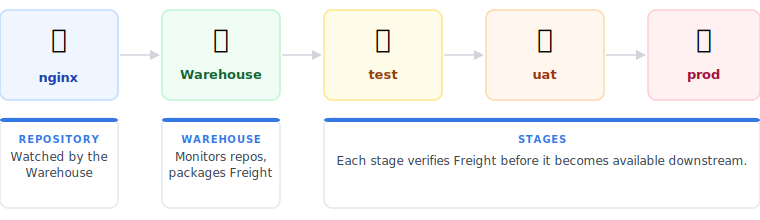
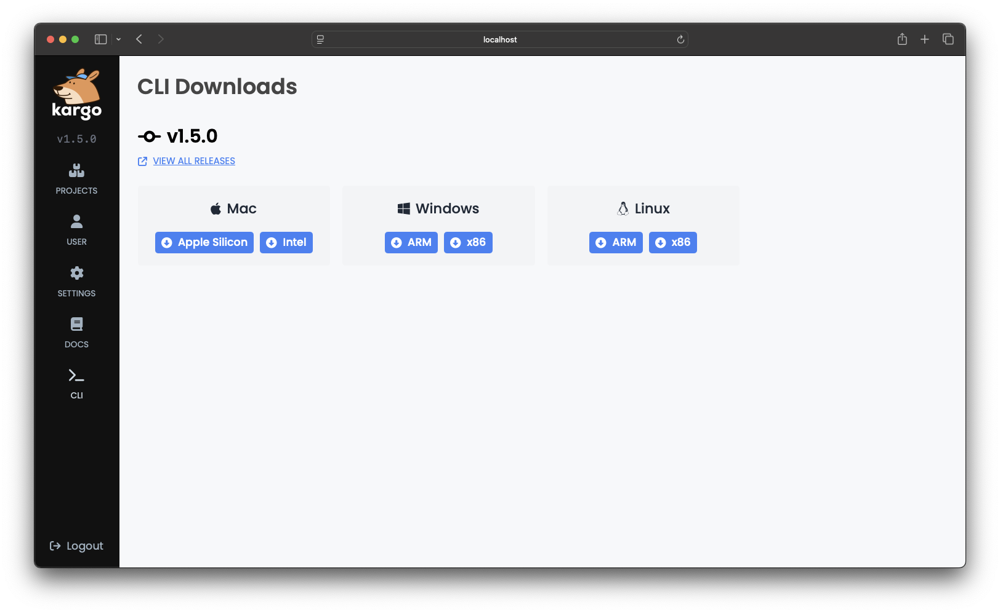
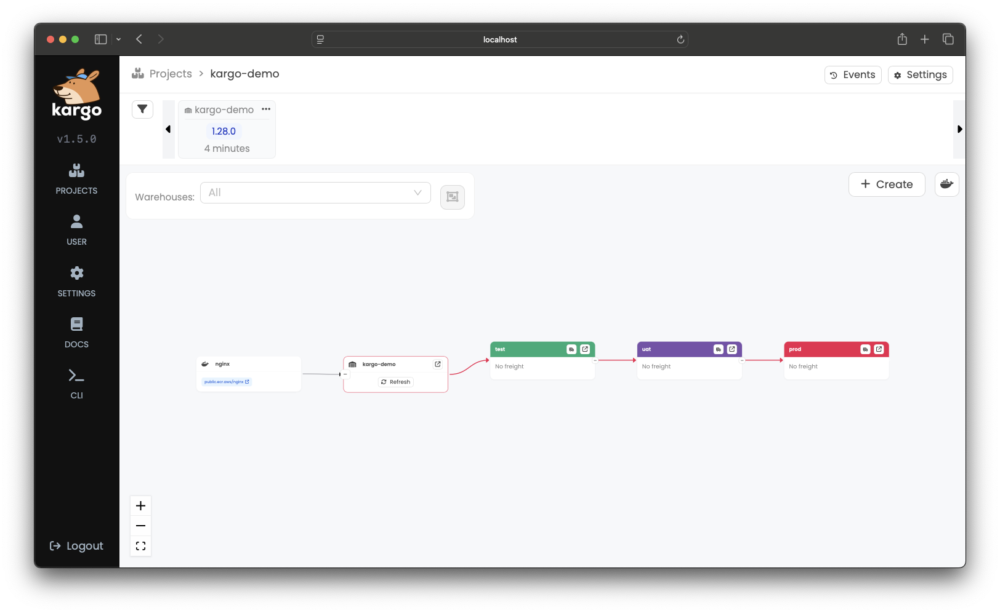
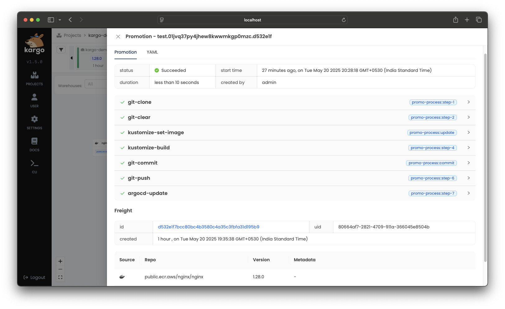

# Kargo Quickstart

**Kargo** is an open-source project that streamlines how applications are promoted across
environments, extending GitOps beyond deployment.

## The Pipeline You'll Create



## Spin Up a Local Cluster With Kargo Installed

Pick your local Kubernetes setup. One command installs cert-manager, Argo CD, and Kargo.

:::info Requires Helm v3.13.1+

:::

<Tabs groupId="cluster-start">
<TabItem value="docker-desktop" label="Docker Desktop">

If you are a
[Docker Desktop](https://www.docker.com/products/docker-desktop/)
user, you can follow
[these instructions](https://docs.docker.com/desktop/kubernetes/) to enable
its built-in Kubernetes support.

```shell
curl -L https://raw.githubusercontent.com/akuity/kargo/main/hack/quickstart/install.sh | sh
```

:::info

This is one of the fastest paths to a local Kubernetes cluster, but be
aware that Docker Desktop supports only a _single_ Kubernetes cluster. If
that cluster reaches a state you are dissatisfied with, resetting it will
remove not just Kargo-related resources, but _all_ your workloads and data.

:::

</TabItem>
<TabItem value="orbstack" label="OrbStack">

[OrbStack](https://orbstack.dev/) is a fast, lightweight, drop-in replacement
for Docker Desktop for Mac OS only. You can follow
[these instructions](https://docs.orbstack.dev/kubernetes/) to enable its
built-in Kubernetes support.

```shell
curl -L https://raw.githubusercontent.com/akuity/kargo/main/hack/quickstart/install.sh | sh
```

:::info

This is one of the fastest paths to a local Kubernetes cluster, but be
aware that OrbStack supports only a _single_ Kubernetes cluster. If
that cluster reaches a state you are dissatisfied with, resetting it will
remove not just Kargo-related resources, but _all_ your workloads and data.

:::

</TabItem>
<TabItem value="kind" label="kind">

If you have any Docker-compatible container runtime installed (including native
Docker, Docker Desktop, or OrbStack), you can easily launch a disposable cluster
just for this quickstart using
[kind](https://kind.sigs.k8s.io/#installation-and-usage).

```shell
curl -L https://raw.githubusercontent.com/akuity/kargo/main/hack/quickstart/kind.sh | sh
```

:::info

While this option is a bit more complex than using Docker Desktop or OrbStack
directly, it offers the advantage of being fully-disposable. If your cluster
reaches a state you are dissatisfied with, you can simply destroy it and
launch a new one.

:::

</TabItem>
<TabItem value="k3d" label="k3d">

If you have any Docker-compatible container runtime installed (including native
Docker, Docker Desktop, or OrbStack), you can easily launch a disposable cluster
just for this quickstart using [k3d](https://k3d.io).

```shell
curl -L https://raw.githubusercontent.com/akuity/kargo/main/hack/quickstart/k3d.sh | sh
```

:::info

While this option is a bit more complex than using Docker Desktop or OrbStack
directly, it offers the advantage of being fully-disposable. If your cluster
reaches a state you are dissatisfied with, you can simply destroy it and
launch a new one.

:::

</TabItem>
<TabItem value="more-info" label="Custom">

:::info

If you are averse to piping a downloaded script directly into a shell, feel free to download the applicable script and inspect its contents prior to execution.

Any approach you select should only:

1. Launch a new, local Kubernetes cluster, if applicable
1. Install cert-manager
1. Install Argo CD
1. Install Argo Rollouts
1. Install Kargo

:::

</TabItem>
</Tabs>

<details>
<summary>Troubleshooting</summary>

- **401 Unauthorized:**  
  Ensure you are using **Helm v3.13.1 or later**. Earlier versions may not authenticate properly when pulling the Kargo chart.

- **403 Forbidden:**  
  This is commonly caused by Docker attempting to authenticate to `ghcr.io` with an expired token. The Kargo chart and container images are publicly accessible and do not require authentication. To resolve the issue, log out of `ghcr.io`:

  ```bash
  docker logout ghcr.io
  ```

</details>
  
  
  <table style={{width: '100%', display: 'table', tableLayout: 'fixed'}}>
  <tr>
    <th width="50%">🚀 Argo CD</th>
    <th width="50%">📦 Kargo</th>
  </tr>
  <tr>
    <td>
URL: https://localhost:31443  
Username: `admin`  
Password: `admin`  
⚠️ Ignore certificate warnings
</td>
<td>
URL: https://localhost:31444  
Password: `admin`  
⚠️ Ignore certificate warnings
<br/>
</td>
  </tr>
</table>

✅ Argo CD and Kargo are now running locally.

## Set Up Your Demo Repository

1. Fork the sample repository:  
  Go to https://github.com/akuity/kargo-demo and click <Hlt>Fork</Hlt>.  
  (In a real setup, you would create your own repository from scratch.)

1. Copy your fork URL `https://github.com/YOUR_NAME/kargo-demo`

1. Get a GitHub personal access token (PAT):  
  Kargo will push changes to your fork for **test**, **uat**, and **prod** environments. You need a PAT with **write access** to your fork.

<details>
<summary>Need a GitHub personal access token (PAT)?</summary>

Go to GitHub → <Hlt>Settings</Hlt> → <Hlt>Developer settings</Hlt> → <Hlt>Personal Access Tokens</Hlt> → <Hlt>Fine-grained tokens</Hlt> → <Hlt>Generate new token</Hlt>

- Select your forked repository
- Under <Hlt>Permissions</Hlt>, enable <Hlt>Actions</Hlt> → <Hlt>Read and Write</Hlt>
- Generate the token and copy it — this is your GITHUB_PAT

⚠️ Make sure the token has write access to your fork, otherwise Kargo won’t be able to push changes.

</details>

3. Save it in your terminal:

``` bash
export GITOPS_REPO_URL=<your fork URL>

export GITHUB_USERNAME=<your github username>

export GITHUB_PAT=<your personal access token>
```

:::info Why Kargo writes to Git

Kargo follows GitOps principles: your cluster's desired state always comes from Git. Kargo promotes artifacts by committing updated configurations to Git. Argo CD picks it up and syncs the cluster. Git becomes a full audit trail of every promotion.

:::

<details>
<summary>What's in the `kargo-demo` repository?</summary>

You can explore the repository and see that the `main` branch contains common configuration in a `base/` directory as well as stage-specific overlays in `stages/<stage name>/` directories.

- This layout is typical of a GitOps repository using [Kustomize](https://kustomize.io/) for configuration management of Kubernetes manifests and is not specific to Kargo.
- Kargo also works just as well with [Helm](https://helm.sh).

</details>

## Create Argo CD Applications For Each Stage

We’ll use an Argo CD `ApplicationSet` to create and manage three `Applications`, deploying the sample app to **test**, **uat**, and **prod** namespaces—each with its own configuration.

```yaml {18,23}
cat <<EOF | kubectl apply -f -
apiVersion: argoproj.io/v1alpha1
kind: ApplicationSet
metadata:
  name: kargo-demo
  namespace: argocd
spec:
  generators:
  - list:
      elements:
      - stage: test
      - stage: uat
      - stage: prod
  template:
    metadata:
      name: kargo-demo-{{stage}}
      annotations:
        kargo.akuity.io/authorized-stage: kargo-demo:{{stage}}
    spec:
      project: default
      source:
        repoURL: ${GITOPS_REPO_URL}
        targetRevision: stage/{{stage}}
        path: .
      destination:
        server: https://kubernetes.default.svc
        namespace: kargo-demo-{{stage}}
      syncPolicy:
        syncOptions:
        - CreateNamespace=true
EOF
```

✅ Argo CD Applications created.

<details>
<summary>What you'll see in Argo CD</summary>

When you visit the [Argo CD dashboard](https://localhost:31443), the branches referenced by the `targetRevision` fields do not exist yet, and the `Applications` will be out of sync. Kargo will create them on first promotion.


</details>

## Create Your Kargo Project and Pipeline

Run the following command to set up your pipeline. This will create:

- A `Warehouse` that polls the nginx image registry for new versions  
- A `PromotionTask` which is a reusable recipe: clone the repo, run `kustomize` to stamp in the new image version, push to the stage branch, and tell Argo CD to sync  
- 3 `Stages` that define how Freight moves through your pipeline

<Tabs groupId="login-method">
<TabItem value="kubectl" label="Using kubectl" default>

```yaml {3,8,21,28,33,44,53,56,63,67,72,75,84,86,89,103,105,108,114,123,125,128}
cat <<EOF | kubectl apply -f -
apiVersion: kargo.akuity.io/v1alpha1
kind: Project
metadata:
  name: kargo-demo
---
apiVersion: v1
kind: Secret
type: Opaque
metadata:
  name: kargo-demo-repo
  namespace: kargo-demo
  labels:
    kargo.akuity.io/cred-type: git
stringData:
  repoURL: ${GITOPS_REPO_URL}
  username: ${GITHUB_USERNAME}
  password: ${GITHUB_PAT}
---
apiVersion: kargo.akuity.io/v1alpha1
kind: Warehouse
metadata:
  name: kargo-demo
  namespace: kargo-demo
spec:
  subscriptions:
  - image:
      repoURL: public.ecr.aws/nginx/nginx
      constraint: ^1.26.0
      discoveryLimit: 5
---
apiVersion: kargo.akuity.io/v1alpha1
kind: PromotionTask
metadata:
  name: demo-promo-process
  namespace: kargo-demo
spec:
  vars:
  - name: gitopsRepo
    value: ${GITOPS_REPO_URL}
  - name: imageRepo
    value: public.ecr.aws/nginx/nginx
  steps:
  - uses: git-clone
    config:
      repoURL: \${{ vars.gitopsRepo }}
      checkout:
      - branch: main
        path: ./src
      - branch: stage/\${{ ctx.stage }}
        create: true
        path: ./out
  - uses: git-clear
    config:
      path: ./out
  - uses: kustomize-set-image
    as: update
    config:
      path: ./src/base
      images:
      - image: \${{ vars.imageRepo }}
        tag: \${{ imageFrom(vars.imageRepo).Tag }}
  - uses: kustomize-build
    config:
      path: ./src/stages/\${{ ctx.stage }}
      outPath: ./out
  - uses: git-commit
    as: commit
    config:
      path: ./out
      message: \${{ task.outputs.update.commitMessage }}
  - uses: git-push
    config:
      path: ./out
  - uses: argocd-update
    config:
      apps:
      - name: kargo-demo-\${{ ctx.stage }}
        sources:
        - repoURL: \${{ vars.gitopsRepo }}
          desiredRevision: \${{ task.outputs.commit.commit }}
---
apiVersion: kargo.akuity.io/v1alpha1
kind: Stage
metadata:
  name: test
  namespace: kargo-demo
spec:
  requestedFreight:
  - origin:
      kind: Warehouse
      name: kargo-demo
    sources:
      direct: true
  promotionTemplate:
    spec:
      steps:
      - task:
          name: demo-promo-process
        as: promo-process
---
apiVersion: kargo.akuity.io/v1alpha1
kind: Stage
metadata:
  name: uat
  namespace: kargo-demo
spec:
  requestedFreight:
  - origin:
      kind: Warehouse
      name: kargo-demo
    sources:
      stages:
      - test
  promotionTemplate:
    spec:
      steps:
      - task:
          name: demo-promo-process
        as: promo-process
---
apiVersion: kargo.akuity.io/v1alpha1
kind: Stage
metadata:
  name: prod
  namespace: kargo-demo
spec:
  requestedFreight:
  - origin:
      kind: Warehouse
      name: kargo-demo
    sources:
      stages:
      - uat
  promotionTemplate:
    spec:
      steps:
      - task:
          name: demo-promo-process
        as: promo-process
EOF
```

</TabItem>

<TabItem value="kargo-cli" label="Using the Kargo CLI">

Download the Kargo CLI for your operating system and CPU architecture from
the [Kargo Dashboard's Downloads page](https://localhost:31444/downloads):



Rename the downloaded binary to `kargo` (or `kargo.exe` for Windows) and move it to a location in your file system that is included in the value of your `PATH` environment variable.

Log in:

```shell
kargo login https://localhost:31444 \
  --admin \
  --password admin \
  --insecure-skip-tls-verify
```

To create Kargo resources, use the following command:

```yaml
cat <<EOF | kargo apply -f -
apiVersion: kargo.akuity.io/v1alpha1
kind: Project
metadata:
  name: kargo-demo
---
apiVersion: v1
kind: Secret
type: Opaque
metadata:
  name: kargo-demo-repo
  namespace: kargo-demo
  labels:
    kargo.akuity.io/cred-type: git
stringData:
  repoURL: ${GITOPS_REPO_URL}
  username: ${GITHUB_USERNAME}
  password: ${GITHUB_PAT}
---
apiVersion: kargo.akuity.io/v1alpha1
kind: Warehouse
metadata:
  name: kargo-demo
  namespace: kargo-demo
spec:
  subscriptions:
  - image:
      repoURL: public.ecr.aws/nginx/nginx
      constraint: ^1.26.0
      discoveryLimit: 5
---
apiVersion: kargo.akuity.io/v1alpha1
kind: PromotionTask
metadata:
  name: demo-promo-process
  namespace: kargo-demo
spec:
  vars:
  - name: gitopsRepo
    value: ${GITOPS_REPO_URL}
  - name: imageRepo
    value: public.ecr.aws/nginx/nginx
  steps:
  - uses: git-clone
    config:
      repoURL: \${{ vars.gitopsRepo }}
      checkout:
      - branch: main
        path: ./src
      - branch: stage/\${{ ctx.stage }}
        create: true
        path: ./out
  - uses: git-clear
    config:
      path: ./out
  - uses: kustomize-set-image
    as: update
    config:
      path: ./src/base
      images:
      - image: \${{ vars.imageRepo }}
        tag: \${{ imageFrom(vars.imageRepo).Tag }}
  - uses: kustomize-build
    config:
      path: ./src/stages/\${{ ctx.stage }}
      outPath: ./out
  - uses: git-commit
    as: commit
    config:
      path: ./out
      message: \${{ task.outputs.update.commitMessage }}
  - uses: git-push
    config:
      path: ./out
  - uses: argocd-update
    config:
      apps:
      - name: kargo-demo-\${{ ctx.stage }}
        sources:
        - repoURL: \${{ vars.gitopsRepo }}
          desiredRevision: \${{ task.outputs.commit.commit }}
---
apiVersion: kargo.akuity.io/v1alpha1
kind: Stage
metadata:
  name: test
  namespace: kargo-demo
spec:
  requestedFreight:
  - origin:
      kind: Warehouse
      name: kargo-demo
    sources:
      direct: true
  promotionTemplate:
    spec:
      steps:
      - task:
          name: demo-promo-process
        as: promo-process
---
apiVersion: kargo.akuity.io/v1alpha1
kind: Stage
metadata:
  name: uat
  namespace: kargo-demo
spec:
  requestedFreight:
  - origin:
      kind: Warehouse
      name: kargo-demo
    sources:
      stages:
      - test
  promotionTemplate:
    spec:
      steps:
      - task:
          name: demo-promo-process
        as: promo-process
---
apiVersion: kargo.akuity.io/v1alpha1
kind: Stage
metadata:
  name: prod
  namespace: kargo-demo
spec:
  requestedFreight:
  - origin:
      kind: Warehouse
      name: kargo-demo
    sources:
      stages:
      - uat
  promotionTemplate:
    spec:
      steps:
      - task:
          name: demo-promo-process
        as: promo-process
EOF
```

</TabItem>
</Tabs>

Open the [Kargo Dashboard](https://localhost:31444/) and select the `kargo-demo` project. You should see the pipeline, and `Freight` should appear in the upper left after a few seconds.

<details>
<summary>What you'll see in Kargo</summary>



</details>

✅ Pipeline created, and `Freight` is available to promote.

## Promote Freight to "test"

In the Kargo dashboard, locate the `Freight` in the top menu.

- Drag it using the <strong>⋮⋮</strong> handle.
- Drop it into the **test** `Stage`.

<details>
<summary>Alternative: Use the Promote action</summary>

In the **test** `Stage`, click the truck icon (🚚) in the header.

1. Select <Hlt>Promote</Hlt>
1. Choose the `Freight` you want to promote
1. Click <Hlt>Promote</Hlt> to confirm

</details>

A summary of the `Promotion` will pop up and will be updated in real-time as the steps of the promotion process complete. Once the steps have completed, the `Promotion`'s status will change to <Hlt>Succeeded</Hlt>.



<details>
<summary>What Freight is deployed to what Stage?</summary>

- Every piece of `Freight` in the timeline is color-coded to indicate which `Stages` (if any) are actively using it.
- In this example, `Freight` matches the **test** `Stage`’s color once it has been successfully promoted.

</details>

<details>
<summary>What happened behind the scenes?</summary>

When you visit your fork `https://github.com/YOUR_NAME/kargo-demo`:  

- Kargo created a **stage/test** branch  
- It read the latest manifests from `main`, ran `kustomize edit set image` and `kustomize build` in `stages/test/`  
- The resulting manifests were committed to the stage-specific branch — the same branch referenced by the **test** Argo CD `Application`’s `targetRevision` field  

**Best Practice:** The Kargo team recommmends using stage-specific branches.

</details>

✅ After the `Freight` passes the health checks, you'll see a ❤️ on the **test** node. Click the `Freight` to confirm it shows <Hlt>Verified</Hlt> in **test** which will unlock it for promotion to **uat**.

## Promote to UAT and then Production

Repeat the same steps for **uat**, then **prod**. Click the truck icon on each stage, select `Freight`, and confirm. The `Freight` node will progressively color-match each stage as it passes through.

<table style={{width: '100%', display: 'table', tableLayout: 'fixed'}}>
  <tr>
    <th width="33%">🧪 test</th>
    <th width="33%">🔬 uat</th>
    <th width="33%">🚀 prod</th>
  </tr>
  <tr>
    <td align="center">
[localhost:30081](http://localhost:30081)
    </td>
    <td align="center">
[localhost:30082](http://localhost:30082)
    </td>
    <td align="center">
[localhost:30083](http://localhost:30083)
    </td>
  </tr>
</table>

 ✅ **All stages promoted!** 🎉

## Cleaning up

Congratulations! You've successfully set up your first promotion pipeline!

Now let's clean up!

<Tabs groupId="cluster-start">
<TabItem value="docker-desktop" label="Docker Desktop">

Docker Desktop supports only a _single_ Kubernetes cluster. If you are
comfortable deleting not just just Kargo-related resources, but _all_ your
workloads and data, the cluster can be reset from the Docker Desktop
Dashboard.

If, instead, you wish to preserve non-Kargo-related workloads and data, you
will need to manually uninstall Kargo and its prerequisites:

```shell
curl -L https://raw.githubusercontent.com/akuity/kargo/main/hack/quickstart/uninstall.sh | sh
```

</TabItem>
<TabItem value="orbstack" label="OrbStack">

OrbStack supports only a _single_ Kubernetes cluster. If you are
comfortable deleting not just just Kargo-related resources, but _all_ your
workloads and data, you can destroy the cluster with:

```shell
orb delete k8s
```

If, instead, you wish to preserve non-Kargo-related workloads and data, you
will need to manually uninstall Kargo and its prerequisites:

```shell
curl -L https://raw.githubusercontent.com/akuity/kargo/main/hack/quickstart/uninstall.sh | sh
```

</TabItem>
<TabItem value="kind" label="kind">

Simply destroy the cluster:

```shell
kind delete cluster --name kargo-quickstart
```

</TabItem>
<TabItem value="k3d" label="k3d">

Simply destroy the cluster:

```shell
k3d cluster delete kargo-quickstart
```

</TabItem>
</Tabs>
