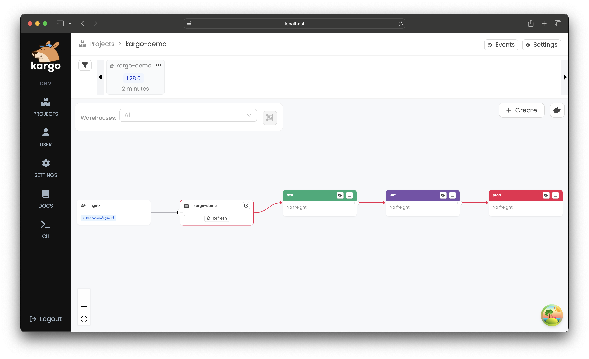
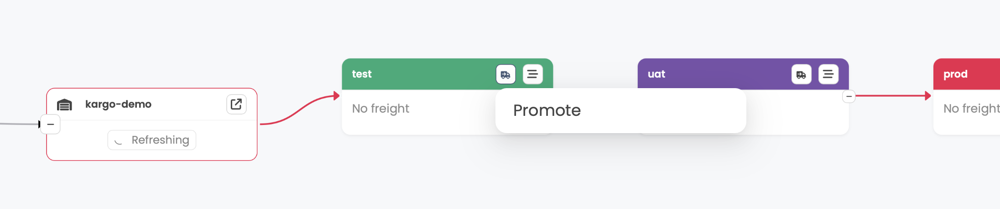

# Kargo Quickstart

**Kargo** is an open-source project that streamlines how applications are promoted across environments, extending GitOps beyond deployment.


:::info Did you know?

Kargo was created by the original authors of Argo CD—the declarative, GitOps-based continuous delivery system for Kubernetes.

If you’ve used Argo CD, you’re building on the same experience and engineering that helped define modern GitOps—now focused on simplifying how applications are promoted across environments.

:::

## How Apps Are Promoted

### :x: Before Kargo

Promoting apps to different environments was manual:

```bash
CI builds: myapp:v2.0.0

For dev:
  $ vim env/dev/deployment.yaml
  $ git commit -m "Deploy v2.0.0 to dev"
  $ git push
  (wait for Argo CD to sync)

For staging:
  $ vim env/staging/deployment.yaml
  $ git commit -m "Deploy v2.0.0 to staging"
  $ git push
  (wait for Argo CD to sync)

For prod:
  $ vim env/prod/deployment.yaml
  $ git commit -m "Deploy v2.0.0 to prod"
  $ git push
  (wait for Argo CD to sync)
```

### :white_check_mark: After Kargo

Kargo handles git commits and yaml updates:

```bash
CI builds: myapp:v2.0.0

Kargo UI shows:
  [ Promote to dev ]     ← click
  [ Promote to staging ] ← click
  [ Promote to prod ]    ← click

(Argo CD syncs as usual)
```

## Full Pipeline Visibility


:::info Know the State of Your Pipeline

- **Versions**: What is running in each environment
- **Health**: Which apps have passed tests and are running successfully
- **Promotion**: Which artifacts are ready for the next stage

:::

## Let's Build It

#### What You'll Build


#### The Pipeline You'll Create


## Spin Up a Local Cluster With Kargo Installed

Pick your local Kubernetes setup. One command installs cert-manager, Argo CD, and Kargo.

<Tabs groupId="cluster-start">
<TabItem value="docker-desktop" label="Docker Desktop">

If you are a
[Docker Desktop](https://www.docker.com/products/docker-desktop/)
user, you can follow
[these instructions](https://docs.docker.com/desktop/kubernetes/) to enable
its built-in Kubernetes support.

```shell
curl -L https://raw.githubusercontent.com/akuity/kargo/main/hack/quickstart/install.sh | sh
```

:::info

This is one of the fastest paths to a local Kubernetes cluster, but be
aware that Docker Desktop supports only a _single_ Kubernetes cluster. If
that cluster reaches a state you are dissatisfied with, resetting it will
remove not just Kargo-related resources, but _all_ your workloads and data.

:::

</TabItem>
<TabItem value="orbstack" label="OrbStack">

[OrbStack](https://orbstack.dev/) is a fast, lightweight, drop-in replacement
for Docker Desktop for Mac OS only. You can follow
[these instructions](https://docs.orbstack.dev/kubernetes/) to enable its
built-in Kubernetes support.

```shell
curl -L https://raw.githubusercontent.com/akuity/kargo/main/hack/quickstart/install.sh | sh
```

:::info

Although this is one of the fastest paths to a local Kubernetes cluster, be
aware that OrbStack supports only a _single_ Kubernetes cluster. If
that cluster reaches a state you are dissatisfied with, resetting it will
remove not just Kargo-related resources, but _all_ your workloads and data.

:::

</TabItem>
<TabItem value="kind" label="kind">

If you have any Docker-compatible container runtime installed (including native
Docker, Docker Desktop, or OrbStack), you can easily launch a disposable cluster
just for this quickstart using
[kind](https://kind.sigs.k8s.io/#installation-and-usage).

```shell
curl -L https://raw.githubusercontent.com/akuity/kargo/main/hack/quickstart/kind.sh | sh
```

:::info

While this option is a bit more complex than using Docker Desktop or OrbStack
directly, it offers the advantage of being fully-disposable. If your cluster
reaches a state you are dissatisfied with, you can simply destroy it and
launch a new one.

:::

</TabItem>
<TabItem value="k3d" label="k3d">

If you have any Docker-compatible container runtime installed (including native
Docker, Docker Desktop, or OrbStack), you can easily launch a disposable cluster
just for this quickstart using [k3d](https://k3d.io).

```shell
curl -L https://raw.githubusercontent.com/akuity/kargo/main/hack/quickstart/k3d.sh | sh
```

:::info

While this option is a bit more complex than using Docker Desktop or OrbStack
directly, it offers the advantage of being fully-disposable. If your cluster
reaches a state you are dissatisfied with, you can simply destroy it and
launch a new one.

:::

</TabItem>
<TabItem value="more-info" label="Custom">

:::info

If you are averse to piping a downloaded script directly into a shell, feel free to download the applicable script and inspect its contents prior to execution.

Any approach you select will:

1. Launch a new, local Kubernetes cluster, if applicable
1. Install cert-manager
1. Install Argo CD
1. Install Argo Rollouts
1. Install Kargo

:::

</TabItem>
</Tabs>

:::warning Requires Helm v3.13.1+
If you see a 401 error, upgrade Helm. If you see a 403, run `docker logout ghcr.io` to clear expired tokens.
:::

<table style={{width: '100%', display: 'table', tableLayout: 'fixed'}}>
  <tr>
    <th width="50%">🚀 Argo CD</th>
    <th width="50%">📦 Kargo</th>
  </tr>
  <tr>
    <td>
URL: https://localhost:31443  
Username: `admin`  
Password: `admin`  
</td>
<td>
URL: https://localhost:31444  
Password: `admin`  
⚠️ Ignore certificate warnings
<br/>
</td>
  </tr>
</table>

✅ Argo CD and Kargo are now running locally.

## Fork the Sample GitOps Repository

Kargo manages promotions by writing to Git. In this example, we'll use Kustomize manifests for **test**, **uat**, and **prod**. You'll need your own fork so Kargo can push to it.

:::info WHY DOES KARGO WRITE TO GIT?
This is the GitOps way. Your cluster's desired state always comes from Git. Kargo promotes an artifact by committing updated configurations to Git. Argo CD picks it up and syncs the cluster. Git becomes a full audit trail of every promotion.
:::

1. Visit https://github.com/akuity/kargo-demo and click **Fork**

<details>
<summary>What's in the `kargo-demo` repository?</summary>

You can explore the repository and see that the `main` branch contains common configuration in a `base/` directory as well as stage-specific overlays in the `stages/<stage name>/` directory.

- This layout is typical of a GitOps repository using [Kustomize](https://kustomize.io/) for configuration management and is not at all Kargo-specific.
- Kargo also works just as well with [Helm](https://helm.sh).

</details>

1. Copy your fork URL (https://github.com/YOUR_NAME/kargo-demo)

1. Save it in your terminal:

``` bash
export GITOPS_REPO_URL=<your fork URL>

export GITHUB_USERNAME=<your github username>

export GITHUB_PAT=<your personal access token>
```

<details>
<summary>Need a GitHub personal access token (PAT)?</summary>

Go to: GitHub → Settings → Developer Settings →
- Personal Access Tokens → Fine-grained tokens → Generate new token →
- Only select repositories → &lt;your forked repository> →
- Add permisions  → Actions  → Access: Read and Write → Generate token

</details>

## Create Argo CD Applications For Each Stage

:::info

In this step, we will use an Argo CD `ApplicationSet` resource to create and manage three Argo CD `Application` resources that deploy the sample application at three different stages of its lifecycle, with three different configurations, to three different namespaces in our local cluster:

:::

```yaml {18,23}
cat <<EOF | kubectl apply -f -
apiVersion: argoproj.io/v1alpha1
kind: ApplicationSet
metadata:
  name: kargo-demo
  namespace: argocd
spec:
  generators:
  - list:
      elements:
      - stage: test
      - stage: uat
      - stage: prod
  template:
    metadata:
      name: kargo-demo-{{stage}}
      annotations:
        kargo.akuity.io/authorized-stage: kargo-demo:{{stage}}
    spec:
      project: default
      source:
        repoURL: ${GITOPS_REPO_URL}
        targetRevision: stage/{{stage}}
        path: .
      destination:
        server: https://kubernetes.default.svc
        namespace: kargo-demo-{{stage}}
      syncPolicy:
        syncOptions:
        - CreateNamespace=true
EOF
```

✅ Argo CD Applications created.

<details>
<summary>What you'll see in Argo CD</summary>

When you visit the [Argo CD dashboard](https://localhost:31443), the branches referenced by the `targetRevision` fields do not exist yet, and the `Applications` will be out of sync. Kargo will create them on first promotion.


</details>

## Create Your Kargo Project and Pipeline

:::info WHAT YOU'RE CREATING

- A `Warehouse` polls the nginx image registry for new versions.
- A `PromotionTask` is a reusable recipe — "clone the repo, run kustomize to stamp in the new image version, push to the stage branch, tell Argo CD to sync."
- Three `Stages` (test → uat → prod) each use that recipe and gate progression: `Freight` must succeed in test before uat will accept it.

:::

Run the following command to set up your pipeline:

<Tabs groupId="login-method">
<TabItem value="kubectl" label="Using kubectl" default>

```yaml {3,8,21,28,33,44,53,56,63,67,72,75,84,86,89,103,105,108,114,123,125,128}
cat <<EOF | kubectl apply -f -
apiVersion: kargo.akuity.io/v1alpha1
kind: Project
metadata:
  name: kargo-demo
---
apiVersion: v1
kind: Secret
type: Opaque
metadata:
  name: kargo-demo-repo
  namespace: kargo-demo
  labels:
    kargo.akuity.io/cred-type: git
stringData:
  repoURL: ${GITOPS_REPO_URL}
  username: ${GITHUB_USERNAME}
  password: ${GITHUB_PAT}
---
apiVersion: kargo.akuity.io/v1alpha1
kind: Warehouse
metadata:
  name: kargo-demo
  namespace: kargo-demo
spec:
  subscriptions:
  - image:
      repoURL: public.ecr.aws/nginx/nginx
      constraint: ^1.26.0
      discoveryLimit: 5
---
apiVersion: kargo.akuity.io/v1alpha1
kind: PromotionTask
metadata:
  name: demo-promo-process
  namespace: kargo-demo
spec:
  vars:
  - name: gitopsRepo
    value: ${GITOPS_REPO_URL}
  - name: imageRepo
    value: public.ecr.aws/nginx/nginx
  steps:
  - uses: git-clone
    config:
      repoURL: \${{ vars.gitopsRepo }}
      checkout:
      - branch: main
        path: ./src
      - branch: stage/\${{ ctx.stage }}
        create: true
        path: ./out
  - uses: git-clear
    config:
      path: ./out
  - uses: kustomize-set-image
    as: update
    config:
      path: ./src/base
      images:
      - image: \${{ vars.imageRepo }}
        tag: \${{ imageFrom(vars.imageRepo).Tag }}
  - uses: kustomize-build
    config:
      path: ./src/stages/\${{ ctx.stage }}
      outPath: ./out
  - uses: git-commit
    as: commit
    config:
      path: ./out
      message: \${{ task.outputs.update.commitMessage }}
  - uses: git-push
    config:
      path: ./out
  - uses: argocd-update
    config:
      apps:
      - name: kargo-demo-\${{ ctx.stage }}
        sources:
        - repoURL: \${{ vars.gitopsRepo }}
          desiredRevision: \${{ task.outputs.commit.commit }}
---
apiVersion: kargo.akuity.io/v1alpha1
kind: Stage
metadata:
  name: test
  namespace: kargo-demo
spec:
  requestedFreight:
  - origin:
      kind: Warehouse
      name: kargo-demo
    sources:
      direct: true
  promotionTemplate:
    spec:
      steps:
      - task:
          name: demo-promo-process
        as: promo-process
---
apiVersion: kargo.akuity.io/v1alpha1
kind: Stage
metadata:
  name: uat
  namespace: kargo-demo
spec:
  requestedFreight:
  - origin:
      kind: Warehouse
      name: kargo-demo
    sources:
      stages:
      - test
  promotionTemplate:
    spec:
      steps:
      - task:
          name: demo-promo-process
        as: promo-process
---
apiVersion: kargo.akuity.io/v1alpha1
kind: Stage
metadata:
  name: prod
  namespace: kargo-demo
spec:
  requestedFreight:
  - origin:
      kind: Warehouse
      name: kargo-demo
    sources:
      stages:
      - uat
  promotionTemplate:
    spec:
      steps:
      - task:
          name: demo-promo-process
        as: promo-process
EOF
```

</TabItem>

<TabItem value="kargo-cli" label="Using the Kargo CLI">

Download the Kargo CLI for your operating system and CPU architecture from
the [Kargo Dashboard's Downloads page](https://localhost:31444/downloads):


Rename the downloaded binary to `kargo` (or `kargo.exe` for Windows) and move it to a location in your file system that is included in the value of your `PATH` environment variable.

Log in:

```shell
kargo login https://localhost:31444 \
  --admin \
  --password admin \
  --insecure-skip-tls-verify
```

To create Kargo resources, use the following command:

```yaml
cat <<EOF | kargo apply -f -
apiVersion: kargo.akuity.io/v1alpha1
kind: Project
metadata:
  name: kargo-demo
---
apiVersion: v1
kind: Secret
type: Opaque
metadata:
  name: kargo-demo-repo
  namespace: kargo-demo
  labels:
    kargo.akuity.io/cred-type: git
stringData:
  repoURL: ${GITOPS_REPO_URL}
  username: ${GITHUB_USERNAME}
  password: ${GITHUB_PAT}
---
apiVersion: kargo.akuity.io/v1alpha1
kind: Warehouse
metadata:
  name: kargo-demo
  namespace: kargo-demo
spec:
  subscriptions:
  - image:
      repoURL: public.ecr.aws/nginx/nginx
      constraint: ^1.26.0
      discoveryLimit: 5
---
apiVersion: kargo.akuity.io/v1alpha1
kind: PromotionTask
metadata:
  name: demo-promo-process
  namespace: kargo-demo
spec:
  vars:
  - name: gitopsRepo
    value: ${GITOPS_REPO_URL}
  - name: imageRepo
    value: public.ecr.aws/nginx/nginx
  steps:
  - uses: git-clone
    config:
      repoURL: \${{ vars.gitopsRepo }}
      checkout:
      - branch: main
        path: ./src
      - branch: stage/\${{ ctx.stage }}
        create: true
        path: ./out
  - uses: git-clear
    config:
      path: ./out
  - uses: kustomize-set-image
    as: update
    config:
      path: ./src/base
      images:
      - image: \${{ vars.imageRepo }}
        tag: \${{ imageFrom(vars.imageRepo).Tag }}
  - uses: kustomize-build
    config:
      path: ./src/stages/\${{ ctx.stage }}
      outPath: ./out
  - uses: git-commit
    as: commit
    config:
      path: ./out
      message: \${{ task.outputs.update.commitMessage }}
  - uses: git-push
    config:
      path: ./out
  - uses: argocd-update
    config:
      apps:
      - name: kargo-demo-\${{ ctx.stage }}
        sources:
        - repoURL: \${{ vars.gitopsRepo }}
          desiredRevision: \${{ task.outputs.commit.commit }}
---
apiVersion: kargo.akuity.io/v1alpha1
kind: Stage
metadata:
  name: test
  namespace: kargo-demo
spec:
  requestedFreight:
  - origin:
      kind: Warehouse
      name: kargo-demo
    sources:
      direct: true
  promotionTemplate:
    spec:
      steps:
      - task:
          name: demo-promo-process
        as: promo-process
---
apiVersion: kargo.akuity.io/v1alpha1
kind: Stage
metadata:
  name: uat
  namespace: kargo-demo
spec:
  requestedFreight:
  - origin:
      kind: Warehouse
      name: kargo-demo
    sources:
      stages:
      - test
  promotionTemplate:
    spec:
      steps:
      - task:
          name: demo-promo-process
        as: promo-process
---
apiVersion: kargo.akuity.io/v1alpha1
kind: Stage
metadata:
  name: prod
  namespace: kargo-demo
spec:
  requestedFreight:
  - origin:
      kind: Warehouse
      name: kargo-demo
    sources:
      stages:
      - uat
  promotionTemplate:
    spec:
      steps:
      - task:
          name: demo-promo-process
        as: promo-process
EOF
```

</TabItem>
</Tabs>

Open the [Kargo Dashboard](https://localhost:31444/), select the <Hlt>kargo-demo</Hlt> project. You should see the pipeline, and a `Freight` should appear in the upper left after a few seconds.

<details>
<summary>What you'll see in Kargo</summary>



</details>

<details>
<summary>What is `Freight`?</summary>

`Freight` is a unit of deployment that contains a set of references to one or more versioned artifacts like:

* Container images (from image repositories)
* Kubernetes manifests (from Git repositories)
* Helm charts (from chart repositories)

`Freight` is ordered chronologically, with newer `Freight` to the left and older `Freight` to the right.

</details>

✅ Pipeline created, and `Freight` is available to promote.

## Promote Freight to "test"

In the Kargo dashboard, find the **test** `Stage` and click the truck icon (🚚) in its header, then click **Promote**. Choose the available `Freight` and confirm.



A summary of the `Promotion` will pop up and will be updated in real-time as the steps of the promotion process complete. Once the steps have completed, the `Promotion`'s status will change to **Succeeded**:


:::info What Freight is deployed to what Stage?

Every piece of `Freight` in the timeline is color-coded to indicate which `Stages` (if any) are actively using it.

:::

In our example, you will see the `Freight` is now the same color as the **test** `Stage` once it has been deployed successfully.

<details>
<summary>What happened behind the scenes?</summary>

Visiting our fork of https://github.com/akuity/kargo-demo:
- Kargo created a `stage/test` branch
- Read the latest manifests from the `main` branch, and ran `kustomize edit set image` and `kustomize build` within the `stages/test/` directory
- Committed the resulting manifests to a stage-specific branch -> the same branch referenced by the **test** Argo CD `Application`'s `targetRevision` field

**Using stage-specific branches is highly recommended by the Kargo team.**

</details>

✅ After the `Freight` passes the health checks, you'll see a ❤️ on the **test** node. Click the `Freight` to confirm it shows **Verified** in **test** which will unlock it for promotion to **uat**.

## Promote to UAT and then Production

Repeat the same steps for **uat**, then **prod**. Click the truck icon on each stage, select `Freight`, and confirm. The `Freight` node will progressively color-match each stage as it passes through.

:::info Can Freight Skip Stages?

The **prod** Stage's `requestedFreight` only accepts `Freight` from **uat**. Kargo enforces this, and prevents unauthorized users from skipping `Stages` in the pipeline.

:::

<table style={{width: '100%', display: 'table', tableLayout: 'fixed'}}>
  <tr>
    <th width="33%">🧪 test</th>
    <th width="33%">🔬 uat</th>
    <th width="33%">🚀 prod</th>
  </tr>
  <tr>
    <td align="center">
[localhost:30081](http://localhost:30081)
    </td>
    <td align="center">
[localhost:30082](http://localhost:30082)
    </td>
    <td align="center">
[localhost:30083](http://localhost:30083)
    </td>
  </tr>
</table>

 ✅ **All stages promoted!** 🎉

:::info Did you know?

You can use Kargo to automate promotion of new, qualified `Freight` for designated
`Stages`. And you can also set up RBAC to configure which users are allowed to trigger manual promotions for each `Stage`.

:::

## Cleaning up

Congratulations! You've successfully set up your first promotion pipeline!

Now let's clean up!

<Tabs groupId="cluster-start">
<TabItem value="docker-desktop" label="Docker Desktop">

Docker Desktop supports only a _single_ Kubernetes cluster. If you are
comfortable deleting not just just Kargo-related resources, but _all_ your
workloads and data, the cluster can be reset from the Docker Desktop
Dashboard.

If, instead, you wish to preserve non-Kargo-related workloads and data, you
will need to manually uninstall Kargo and its prerequisites:

```shell
curl -L https://raw.githubusercontent.com/akuity/kargo/main/hack/quickstart/uninstall.sh | sh
```

</TabItem>
<TabItem value="orbstack" label="OrbStack">

OrbStack supports only a _single_ Kubernetes cluster. If you are
comfortable deleting not just just Kargo-related resources, but _all_ your
workloads and data, you can destroy the cluster with:

```shell
orb delete k8s
```

If, instead, you wish to preserve non-Kargo-related workloads and data, you
will need to manually uninstall Kargo and its prerequisites:

```shell
curl -L https://raw.githubusercontent.com/akuity/kargo/main/hack/quickstart/uninstall.sh | sh
```

</TabItem>
<TabItem value="kind" label="kind">

Simply destroy the cluster:

```shell
kind delete cluster --name kargo-quickstart
```

</TabItem>
<TabItem value="k3d" label="k3d">

Simply destroy the cluster:

```shell
k3d cluster delete kargo-quickstart
```

</TabItem>
</Tabs>

## What Kargo Does For You

Kargo replaces manual tasks with automated guardrails:

|  | :x: Before (Manual) | :white_check_mark: Kargo (Automated) |
| :--- | :--- | :--- |
| **Discovery** | Manually check ECR / DockerHub for new image tags | Kargo watches your `Warehouse` and finds new `Freight` instantly |
| **Promotion** | Write custom scripts or manual Git commits and PRs | Kargo performs the Git commands and edits the YAML |
| **Health** | Manually poll `kubectl` or logs to see if a deploy was successful | Automatic monitoring of health signals and analysis templates |
| **Visibility** | Dig through Slack or Jira to see what version is where | A single, visual source of truth for every environment |
| **Rollbacks** | Run previous CI build and hope base images and dependencies didn't change | Click-to-rollback using immutable, versioned `Freight` |

Kargo turns promotions into a repeatable, visible, and safe operation.

### Full Audit Trail

#### :x: Before Kargo

Requires multiple lookups to identify what happened:

```bash
$ git log --oneline

a3f5d2c Update prod to v1.2.3
8e9f1a4 Update staging to v1.2.3  
2c4d6e8 Update dev to v1.2.3

$ git show 2c4d6e8
Author: jane@company.com
Date:   Mon Feb 10 14:32:11 2026

    Update dev to v1.2.3
    
    diff --git a/deployment.yaml b/deployment.yaml
    - image: myapp:1.2.2
    + image: myapp:1.2.3
```

<table style={{width: '100%', display: 'table', tableLayout: 'fixed'}}>
  <tr>
    <td><b>Why was this change made?</b></td>
    <td>• Scheduled promotion?<br/>• Emergency hotfix?<br/>• Rollback?</td>
  </tr>
  <tr>
    <td><b>What’s inside “myapp:1.2.3”?</b></td>
    <td>• Code changes?<br/>• Dependency updates?<br/>• Config changes?</td>
  </tr>
  <tr>
    <td><b>Did it work?</b></td>
    <td>• Did the deployment succeed?<br/>• Did it pass health checks?<br/>• What's running in prod?</td>
  </tr>
</table>

#### :white_check_mark: After Kargo

Promotion as Code. Every environment transition is now a trackable, auditable event:

```yaml {2,7,8,14,22,27,31}
apiVersion: kargo.akuity.io/v1alpha1
kind: Promotion
metadata:
  name: prod-promotion-abc123
  namespace: myapp
spec:
  stage: prod
  freight: v1.2.3
status:
  phase: Succeeded
  startedAt: 2026-02-10T14:32:00Z
  finishedAt: 2026-02-10T14:35:22Z
  steps:
    - name: git-clone
      status: Succeeded
      startedAt: 2026-02-10T14:32:05Z
      finishedAt: 2026-02-10T14:32:12Z
    - name: update-manifests
      status: Succeeded
      startedAt: 2026-02-10T14:32:13Z
      finishedAt: 2026-02-10T14:32:45Z
    - name: git-commit
      status: Succeeded
      commitHash: a3f5d2c
      startedAt: 2026-02-10T14:32:46Z
      finishedAt: 2026-02-10T14:32:50Z
    - name: git-push
      status: Succeeded
      startedAt: 2026-02-10T14:32:51Z
      finishedAt: 2026-02-10T14:35:22Z
  healthChecks:
    - name: deployment-ready
      status: Passed
      checkedAt: 2026-02-10T14:40:00Z
```
