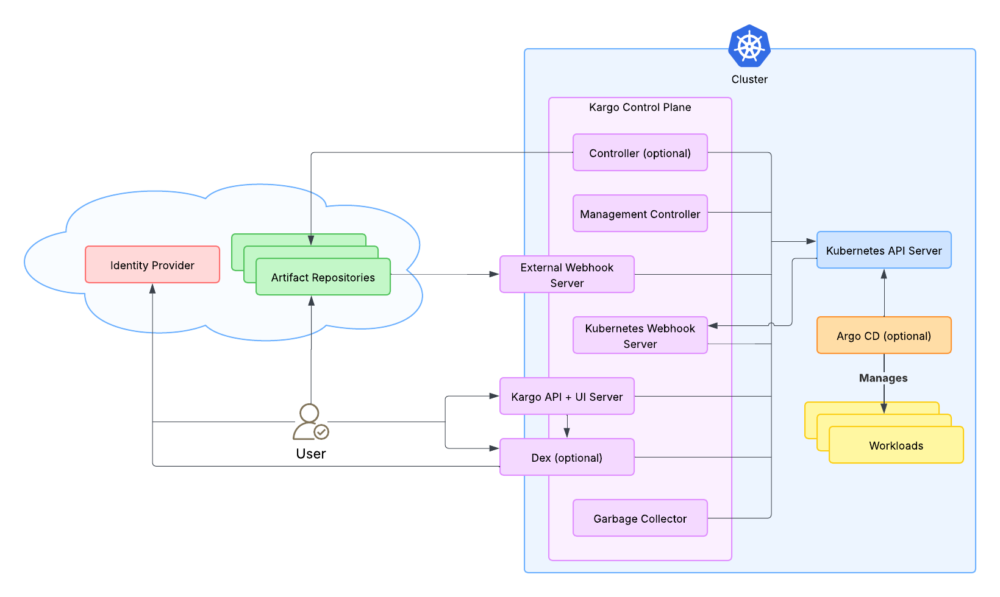
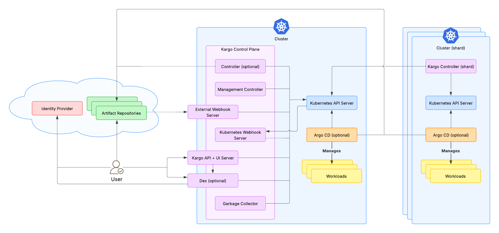

# Architecture and Topology

## Overview

This document describes Kargo's architecture and topology, explaining how
components interact in both standalone and distributed configurations.
Understanding this architecture will help you grasp how Kargo achieves
scalability and security through its agent-based design.

This content assumes you have a strong grasp of Kubernetes fundamentals.

## Understanding Kargo's Data Model

Kargo's primary component is a custom Kubernetes controller. All of Kargo's data
is represented as Kubernetes resources -- instances of custom resource
definitions (CRDs) such as `Project`s, `Warehouse`s, `Stage`s, `Freight`, and
`Promotion`s.

:::info

You can read more about the concepts behind these CRDs in the
[Core Concepts](https://docs.kargo.io/user-guide/core-concepts/) section of
the documentation.

:::

A Kubernetes cluster running most of Kargo's components and hosting all its data
is called a **Kargo control plane**.

## Components

The following components make up a complete Kargo installation:

### API Server

**Runs in:** The control plane

The API server provides the back end services that both the Kargo [UI](#ui) and
[CLI](#cli) depend upon. It also serves the static content for the UI, which is
a single-page application (SPA).

:::info

This is one of only two internet-facing components in Kargo.

:::

### UI

**Runs in:** Your browser

The UI is the primary interface for interacting with Kargo. It's accessed by
navigating to the [API server's](#api-server) base address in a web browser.

### CLI

**Runs in:** A terminal

The `kargo` CLI provides a secondary interface to Kargo, offering rich,
domain-specific functionality beyond what's easily accomplished with `kubectl`
alone.

:::info

Because Kargo's data are Kubernetes resources, it's also practical and not
uncommon for users to interact with Kargo using the standard `kubectl` CLI.

:::

### Controller

**Runs in:** The control plane and/or other clusters

*This is Kargo's most important component.* Controller instances perform the
core work of monitoring repositories for new artifacts and executing
user-defined promotion processes.

In Kargo's simplest configuration, just a single controller instance runs in the
control plane. In more complex configurations, multiple controller instances are
distributed across many clusters, each servicing a specific subset (shard) of
data that lives in the control plane.

**Why distribute controllers?** Several reasons:

- **Firewalls:** Some artifact repositories may only be accessible from behind
  specific firewalls.

- **Scalability:** Distributing workloads across multiple controllers improves
  performance.

- **Argo CD integration:** Controllers are designed to interact with the
  centralized Kargo control plane and, at most, one Argo CD control plane. In
  enterprises with multiple Argo CD control planes, Kargo controllers exist in
  1:1 proportion with those Argo CD instances.

### Garbage Collector

**Runs in:** The control plane

Absent routine cleanup, storing data as Kubernetes resources can lead to
degraded cluster performance over time. The garbage collector is responsible for
deleting old data.

### Kubernetes Webhooks Server

**Runs in:** The control plane

This server implements Kubernetes validating webhooks
([dynamic admission controls](https://kubernetes.io/docs/reference/access-authn-authz/extensible-admission-controllers/))
and mutating (defaulting) webhooks. These webhooks are registered in the control
plane cluster and allow the Kubernetes API server to hook into Kargo-specific
logic as Kargo resources are created, modified, and deleted.

:::caution

**This webhook server is not an optional component. It is critical to Kargo's
proper function.**

:::

:::note

This webhook server is *not internet-facing*. Its only client is the Kubernetes
API server *within the same cluster.* It *must* use TLS. (The Kubernetes API
server will not interact with webhook servers that do not.) Self-signed
certificates are generally sufficient for this purpose.

:::

:::info

This component is distinct from the external webhooks server. (See next
section.)

:::

### External Webhooks Server (Optional)

**Runs in:** The control plane

This server's role is to receive and handle inbound HTTP/S requests from
external systems. For example, if you configure a GitHub repository to send a
request to Kargo when a new commit is pushed, this server receives that
request and initiates appropriate actions in response.

:::info

This is Kargo's second internet-facing component (after the API server).

:::

### Management Controller

**Runs in:** The control plane

This secondary controller handles critical clerical work. One of its most
important functions is dynamically managing the permissions of other components.

:::caution

**This is not an optional component. It is critical to Kargo's proper
function.**

:::

:::info

Because some components are internet-facing (the API server and external
webhooks Server) and others (controllers) can be distributed to other clusters,
operators are often reluctant to provide these components with broad access to
sensitive resources, particularly Kubernetes Secrets in the control plane. To
mitigate this, the management controller, which is neither internet-facing nor
distributed, is granted broad permissions and dynamically expands and contracts
*narrower* sets of permissions for other components and Kargo users as
`Project`s are created and deleted.

:::

### Dex (Optional)

**Runs in:** The control plane

Dex is an open-source OpenID Connect identity provider (IdP). Kargo relies on
third-party identity providers for user management and can work directly with
most IdPs that implement the required protocols. However, some IdPs do not and
Dex serves as an adapter for such cases.

:::info

**Example:** GitHub doesn't implement OpenID Connect at all, but Dex can
integrate with GitHub while providing a compliant interface to Kargo, allowing
users to sign in with their GitHub accounts.

:::

:::info

For many IdPs, like Microsoft Entra ID (formerly Azure Active Directory), Okta,
or Google Cloud Identity Platform, Dex is not needed.

In simple, "kick the tires" configurations, Kargo uses Dex's built-in mock IdP
or disables integration with identity providers entirely and uses a built-in
admin account instead. **We recommend never enabling the admin account in
production.**

:::

## Topology

### The Kargo Control Plane

The Kargo control plane is a Kubernetes cluster running most of Kargo's
components and hosting all of Kargo's data. The control plane *may* include a
controller instance, but controllers can also be entirely distributed to other
clusters.

When controllers are distributed, each operates on a specific subset of the data
in the control plane. This subset and its controller are called a **shard**.

### Standalone Configuration

In the simplest configuration, all Kargo components, including a single
controller, run within the Kargo control plane cluster:

This configuration is suitable for testing and very small-scale deployments.

### Distributed Configuration

In larger environments, Kargo leverages an **agent-based architecture**
where controllers are distributed across multiple clusters, with each controller
"phoning home" to the centralized Kargo control plane:

In this configuration:

- The Kargo control plane hosts all data and core services, but may or may not
  run a controller instance.

- Controllers are distributed to individual clusters (shards), each typically
  corresponding to an Argo CD control plane.

- All controllers connect back to the Kargo control plane.

- *The control plane itself has no privileged access to the clusters where
  controllers are deployed.*

### Why This Architecture?

Kargo's agent-based architecture is informed by lessons learned from Argo CD
and attempts to avoid the weaknesses of Argo CD's common topologies:

**Hub-and-spoke:**

- ✅ **High observability:** A centralized control plane amounts to a "single
  pane of glass."

- ❌ **Security risks:** A centralized controller with privileged access to many
  clusters represents a high-value target and a single point of catastrophic
  failure if compromised.

- ❌ **Limited scalability:** A centralized controller's performance will degrade
  as it becomes responsible for more and more clusters.

**Control plane per cluster:**

- ✅ **More secure:** Having no centralized control plane eliminates a high value
  target and a single point of catastrophic failure if compromised.

- ✅ **More scalable:** Each controller's workload is smaller.

- ❌ **Low observability:** No "single pane of glass."

**Kargo's agent-based architecture:**

Kargo's architecture employs an agent-based approach that marries the
observability of a centralized control plane with the security and scalability
of decentralized controllers:

- ✅ **High observability:** A centralized control plane amounts to a "single
  pane of glass."

- ✅ **More secure:** Distributed controllers that "phone home" to the
  centralized control plane mean the control plane has no privileged access to
  other clusters.

- ✅ **Scales well:** Distributed controllers, each operating on a subset of
  control plane data, have smaller workloads.

## Configuration Considerations

Provisioning Kargo in a distributed configuration is non-trivial and involves
creating a Kubernetes `ServiceAccount` in the control plane for each controller,
then distributing configuration with the corresponding tokens to the many
clusters throughout your enterprise.

:::info

[Documentation for Kargo's Helm chart](https://github.com/akuity/kargo/blob/main/charts/kargo/README.md)
explains most aspects of this in great detail, *but why not let the Kargo
experts handle it for you?*

Experienced Kubernetes operators may well succeed in provisioning Kargo in a
distributed configuration as described above, but developing the automation to
enable it at great scale can be a significant challenge. Kargo users operating
at large scale are encouraged to consider using the
[Akuity Platform](https://akuity.io/), which can seamlessly provision hosted
Kargo control planes as well as credentials and configuration for any number of
distributed controllers, which can be deployed to your own clusters in just
seconds.

:::
