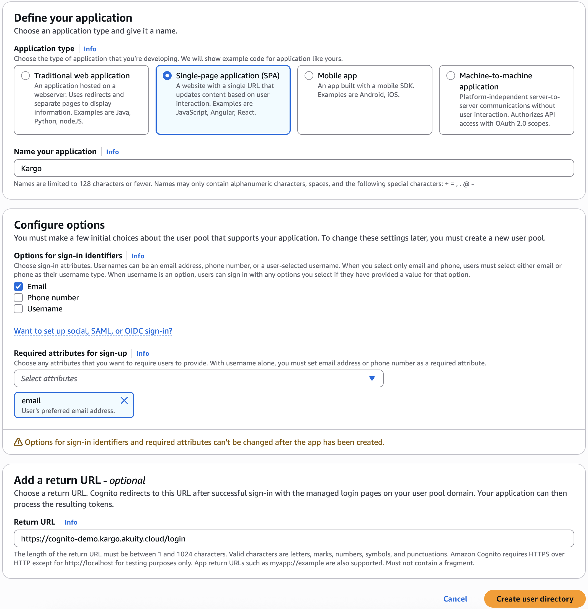
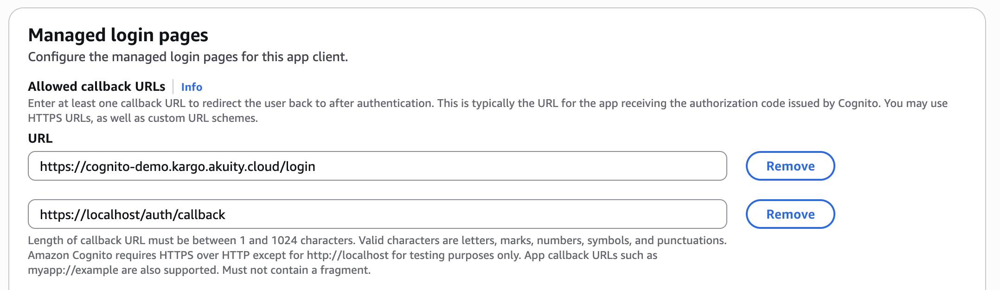
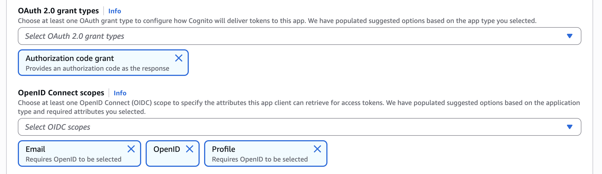

# AWS Cognito OIDC Configuration Guide

This guide explains how to configure AWS Cognito as an OIDC provider for Kargo.

## Step 1. Create a User Pool

Cognito requires a **User Pool** for authentication.  Create a new User Pool 
(or use an existing one if already set up).

## Step 2. Create an Application Client

Next, create an **Application Client** with the following settings:

- **Application type:** Single-page application (SPA)
- **Name:** Choose any descriptive name (e.g., `Kargo`)
- **Sign-in identifier:** Email
- **Required attributes for sign-up:** `email`
- **Return URL:** `https://<kargo-hostname>/login`

## Step 3. Configure CLI Login

To enable login via the `kargo` CLI:

1. Go to the **Login Pages** tab.  
2. Edit the **Managed login pages configuration**.  
3. Add the following callback URL: `https://localhost/auth/callback`

## Step 4. Add the `profile` Scope

Still under **Managed login pages configuration**, update the scopes to include the `profile` scope.  

## Step 5. Retrieve Client Configuration

Open the **Quick setup guide** for your application client. In the example code block, note the following values:

- **Authority**  
- **Client ID**  

Finally, enter these values into the Kargo system configuration:  

- **Client ID:** use the value from Cognito  
- **Issuer URL:** set this to the Cognito **Authority** value  
