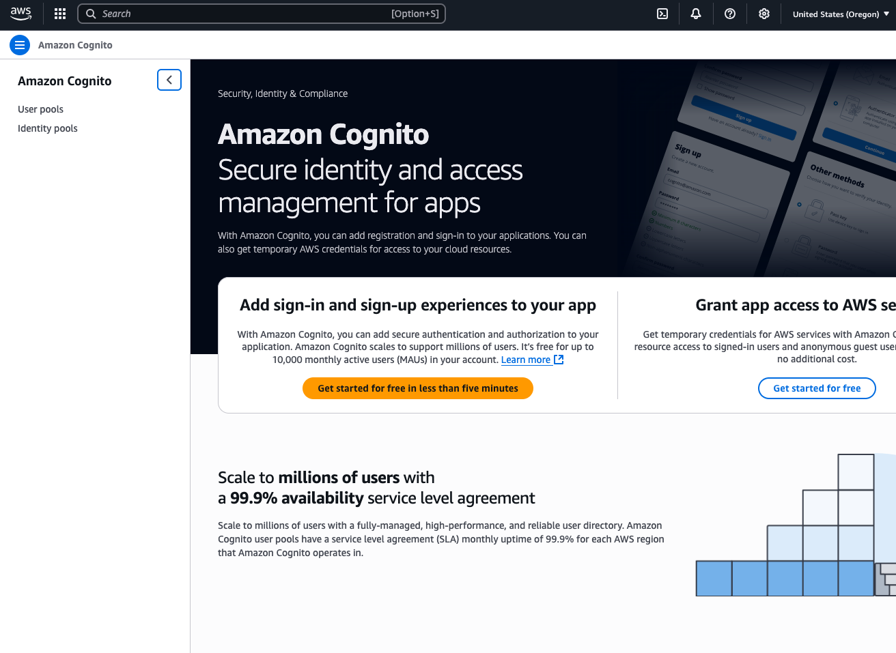

# AWS Cognito OIDC Configuration Guide

This guide explains how to configure AWS Cognito as an OIDC identity provider
for Kargo.

:::important

The forms you will complete to enable Kargo to authenticate users against
Cognito are _different_ depending on whether you are:

* Registering Kargo as a new application client for an existing user pool.

* Creating a brand new user pool.

Be certain to follow the steps below that are appropriate to your scenario.

:::

## Using an Existing User Pool

1. Navigate to Cognito in your AWS dashboard.

    The left sidebar may be collapsed by default. If it is, expand it by
    clicking the "hamburger" icon in the upper left corner of the page.

    

1. Select <Hlt>User pools</Hlt>.

1. Select the pool to which you would like to add Kargo as a client.

1. Select <Hlt>App clients</Hlt> from the left sidebar.

1. Click the <Hlt>Create app client</Hlt> button on the upper right of the page.

1. Complete the <Hlt>Create app client</Hlt> form:

    

    1. Under <Hlt>Application type</Hlt>, select
       <Hlt>Single-page application (SPA)</Hlt>.

    1. Complete the <Hlt>Name your application</Hlt> field with a descriptive
       name, such as `kargo`.

    1. Complete the <Hlt>Return URL</Hlt> field with a URL of the form
       `https://<kargo-hostname>/login`.

    1. Click <Hlt>Create app client</Hlt>.

1. Skip ahead to the [Configuring the App Client](#configuring-the-app-client)
   section of this page.

## Creating a New User Pool

1. Navigate to Cognito in your AWS dashboard.

    The left sidebar may be collapsed by default. If it is, expand it by
    clicking the "hamburger" icon in the upper left corner of the page.

    

1. Select <Hlt>User pools</Hlt>.

1. Click the <Hlt>Create user pool</Hlt> button in the upper right of the page.

1. Complete the <Hlt>Set up resources for your application</Hlt> form:

    

    :::important

    This single form asks you to _both_ configure the user pool _and_ register
    an app client.

    Also note that you have no control over the name of the user pool. A unique
    name will be generated for you upon submission of this form.
    :::

    1. Under <Hlt>Application type</Hlt>, select
       <Hlt>Single-page application (SPA)</Hlt>.

    1. Complete the <Hlt>Name your application</Hlt> field with a descriptive
       name, such as `kargo`.

    1. Under <Hlt>Options for sign-in identifiers</Hlt>, select one or more
       identifiers for users to use when signing in.

        :::note

        This is a feature of the _user pool_ and not the client app.
        :::

    1. Under <Hlt>Required attributes for sign-up</Hlt>, select all pieces of
       information you will require from users included in this user pool. At
       minimum, <Hlt>email</Hlt> must be selected.

        :::info

        Kargo is unopinionated about _how_ users actually authenticate to OIDC,
        identity providers (e.g. with username/email and password, social login,
        etc.) however, Kargo _does_ depend on the user's email address being
        available in the
        [standard claim](https://openid.net/specs/openid-connect-core-1_0.html#StandardClaims)
        `email` of the user's OIDC identity token. 
        :::

    1. Complete the <Hlt>Return URL</Hlt> field with a URL of the form
       `https://<kargo-hostname>/login`.

    1. Click <Hlt>Create user directory</Hlt>.

       This creates the user pool _and_ the app client.

1. Navigate to your newly created client app:

    1. Select <Hlt>User pools</Hlt> from the left sidebar.

    1. Select the user pool you just created.

    1. Select <Hlt>App clients</Hlt> from the left sidebar.

    1. Select the app client you just created.

1. Continue on to the [Configuring the App Client](#configuring-the-app-client)
   section of this page.

## Configuring the App Client

After completing the steps from either the
[Using an Existing User Pool](#using-an-existing-user-pool) or
[Creating a New User Pool](#creating-a-new-user-pool) section:

1. Select the <Hlt>Login pages</Hlt> tab.

1. In the <Hlt>Managed login pages configuration</Hlt> section, click
   <Hlt>Edit</Hlt>.

1. Complete the <Hlt>Edit managed login pages configuration</Hlt> form:

    

    1. Under <Hlt>URL</Hlt>, include _both_ of the following:

        * `https://<kargo-hostname>/login`

          This is where users of the Kargo UI will be redirected to after
          logging in.

        * `http://localhost/auth/callback`

           This is where users of the `kargo` CLI will be redirected to
           redirected to after logging in. (The CLI launches a server to serve
           the request and complete the login process.)

    1. Under <Hlt>OAuth 2.0 grant types</Hlt>, ensure
       <Hlt>Authorization code grant</Hlt> is selected.

    1. Under <Hlt>OpenID Connect scopes</Hlt>, ensure that, at a minimum,
       <Hlt>Email</Hlt>, <Hlt>OpenID</Hlt>, and <Hlt>Profile</Hlt> are all
       selected.

       You may additionally select any other scopes that permit access to other
       user information you'd like to make available to Kargo.

    1. Click <Hlt>Save changes</Hlt>.

## Configure Kargo

After Kargo has been registered as a client application for your Cognito user
pool, all that remains is to retrieve relevant details and use them in
installing or updating Kargo. The details you will require are:

* The user pool's issuer URL

* The client app's client ID

The unofficial, but most convenient way to locate both of these is in the
<Hlt>React</Hlt> code sample in the <Hlt>Quick setup guide</Hlt>:

After making note of these values, use them as the values of the
`api.oidc.issuerURL` and `api.oidc.clientID` settings when installing or
updating Kargo using its Helm chart
[as documented here](../../20-openid-connect/index.md#configuring-kargo).

:::info

Using Cognito as an identity provider, there is no need to create separate
client apps for the Kargo UI and the `kargo` CLI, and as such, the _same_ client
ID should be used for _both_ the `api.oidc.clientID` and `api.oidc.cliClientID`
settings.

:::
