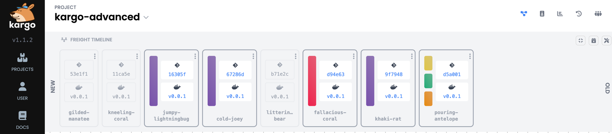

# Kargo's Core Concepts

Kargo is an unopinionated continuous [promotion](#promotions) platform that
helps developers orchestrate the movement of new code and configuration through
the various [stages](#stages) of their applications' lifecycles using GitOps
principles.

Kargo is light on new terminology and the few new terms it introduces should
be easy to understand. This page is here to present a high-level overview and
get you up to speed quickly without getting mired in technical details.

## Promotions

_Kargo is all about promotions._

If you have some familiarity with GitOps, you know that _GitOps agents_ like
[Argo CD](https://argoproj.github.io/cd/) excel at making the actual state of a
Kubernetes cluster reflect _desired state_ that is expressed declaratively and
stored in a Git repository.

GitOps provides no specific guidance, however, on how desirable changes can be
propagated from the desired state of one stage in an application's lifecycle to
the desired state of the next. Any means by which such a thing might be
accomplished, we would consider to be a "promotion process," and it is exactly
these sort of processes that Kargo is designed to help you implement and manage.

If you've ever made a change to your "test" environment, were satisfied with the
change, and then either manually applied the same change to another environment,
such as "staging," or else grappled with how to automate such a process, then
you're already familiar with the idea of a promotion.

:::note
Promotions are different from _deployments_. Promotions focus on propagating
changes to the _desired state_ of each stage in your application's lifecycle.
The job of _deploying_ -- making the actual state of a Kubernetes cluster
reflect the desired state -- is left to a GitOps agent like Argo CD.
:::

## Stages

Many users equate stages with _environments_, and that's a fine way to think of
them if it suits your use case.

Technically, a stage is a _promotion target_. It represents some desired state
that needs to be altered by a promotion process. The underlying resources that a
GitOps agent will reconcile against that desired state can be varied according
to your needs. It could be a particular instance of your entire application or
just a few microservices that are part of a larger whole. It could even be an
entire Kubernetes cluster if that's what fits your use case.

Quite importantly, stages can be linked together to form a promotion pipeline
that defines the flow of state changes through your application's lifecycle.

## Freight

Freight is a new term, but one we hope is easy to understand.

The state changes that flow through your promotion pipelines are meant to effect
upgrades to new revisions of various artifacts. These artifacts could be
container images containing your application's binaries. They could be
configuration (Kubernetes manifests) in the form of a Helm chart or a commit in
a Git repository. Often, it is a set of _multiple artifacts_ that must make the
journey together from one end of the pipeline to the other.

Formally, freight is a "meta-artifact" that references specific revisions of
artifacts like images and manifests, but it is easiest to think of freight as
_boxes_ containing multiple artifacts.

If you order multiple items from an online retailer and the fulfillment center
packages them together in a single box, you can be assured that those items
will remain together through the shipping process, all the way to your door.
This is a solid analogy for how freight works in Kargo.

## Warehouses

If freight can be conceptualized as boxes, then warehouses are the places those
boxes come from.

In more technical terms, a warehouse monitors one or more repositories for new
revisions of artifacts, and when it finds them, it packages the latest revision
of each together as a new piece of freight that will enter the promotion
pipeline.

## Projects

Kargo projects are units of tenancy for defining policies and organizing and
managing the related resources that make up one or more promotion pipelines.

On a technical level, every Kargo project is associated with a Kubernetes
namespace, which makes it convenient to manage access to resources within the
project using standard Kubernetes RBAC.

## What next?

For more technical coverage of the concepts presented here, please refer to the
corresponding [How-to Guides](../how-to-guides).
