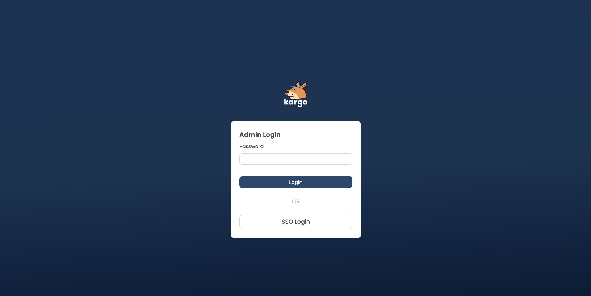
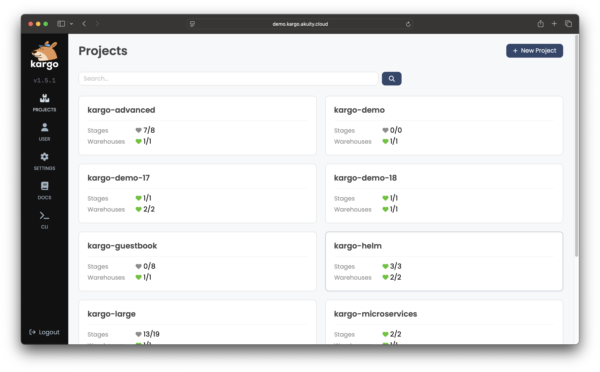

# Logging In

Whether you wish to interact with Kargo through its web-based UI or through
it's [CLI](../../05-installing-the-cli/index.md), you will need to log in first.

1. Obtain the address of your Kargo API server.

    Unless you installed the cluster-side components of Kargo yourself, you
    can obtain the address of the Kargo API server from the operator who did.

    The remaining steps will use the fictional address
    `https://kargo.example.com`.

1.  <Tabs groupId="logging-in">
    <TabItem value="ui" label="Using the UI">

    1. Open your web browser and navigate to the address of your Kargo API
       server.

        :::info
        The Kargo API server also serves the web-based UI.
        :::

        You will be presented with the login screen, where you may have the
        option to log in as the admin, using SSO (Single Sign-On), or possibly
        both, as depicted below:

        

        :::info
        It is common for local installations of Kargo to have the admin
        user enabled, while production installations are more likely to have
        SSO enabled and the admin user disabled.

        If the admin user is enabled, the password can be obtained from the
        operator who installed Kargo's cluster-side components.
        :::

    1. Enter the admin user's password and click <Hlt>Login</Hlt>.

       OR

       Click <Hlt>SSO Login</Hlt> and follow the instructions to authenticate
       to your identity provider.

       When you have successfully authenticated, you will be redirected to the
       UI's main screen, which displays a list of Kargo `Project`s.

       


    </TabItem>
    <TabItem value="cli" label="Using the CLI">

    * To log in as the admin user, run the following command and
      then enter the admin user's password when prompted:

      ```shell
      kargo login https://kargo.example.com --admin
      ```

      :::info
      It is common for local installations of Kargo to have the admin
      user enabled, while production installations are more likely to have
      SSO enabled and the admin user disabled.

      If the admin user is enabled, the password can be obtained from the
      operator who installed Kargo's cluster-side components.
      :::

      OR

    * To log in using SSO, run the following command:

      ```shell
      kargo login https://kargo.example.com --sso
      ```

      This will open your system's default web browser. Follow the instructions
      to authenticate to your identity provider.

      When you have successfully authenticated, you will be redirected to a
      splash page that will indicate you may proceed with using the CLI.

      

    </TabItem>
    </Tabs>
