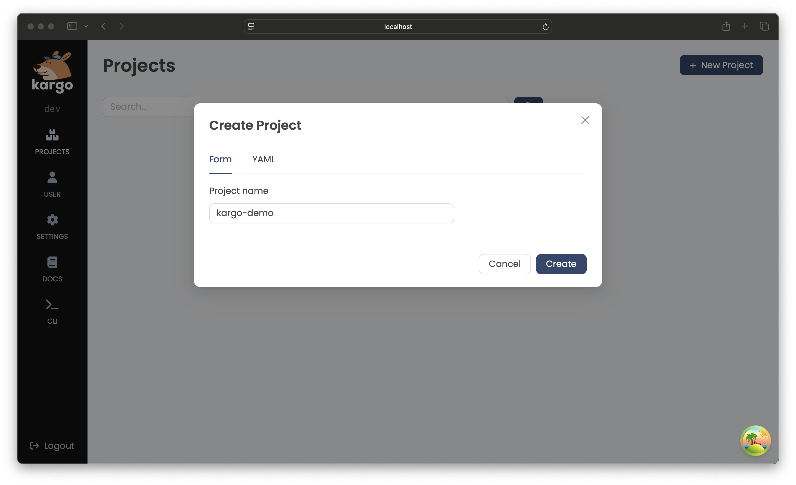
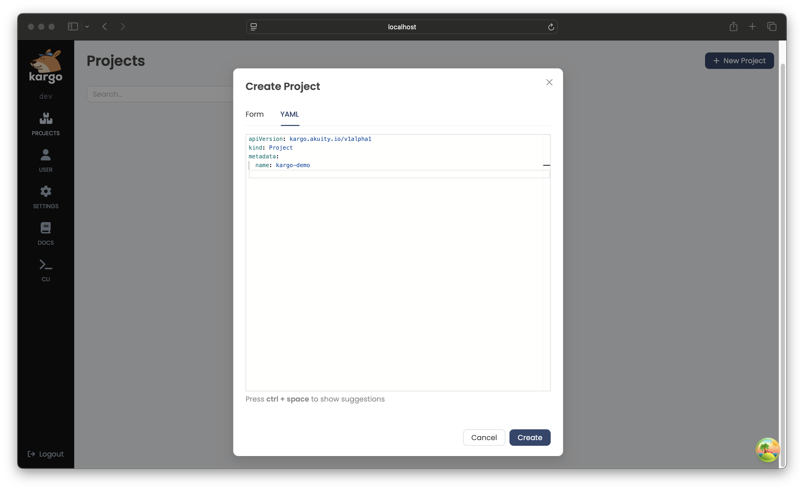
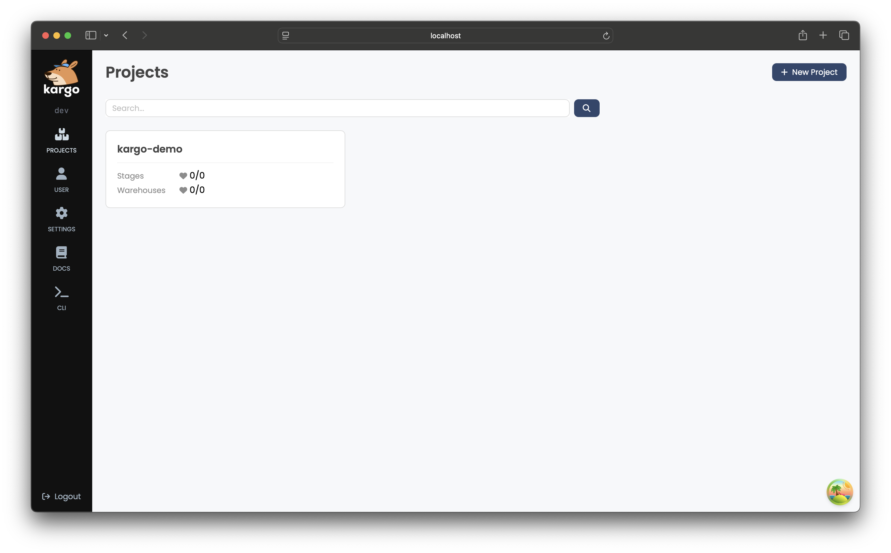
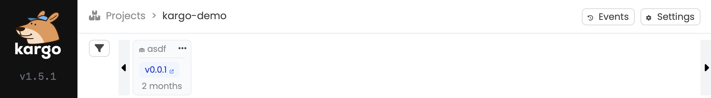
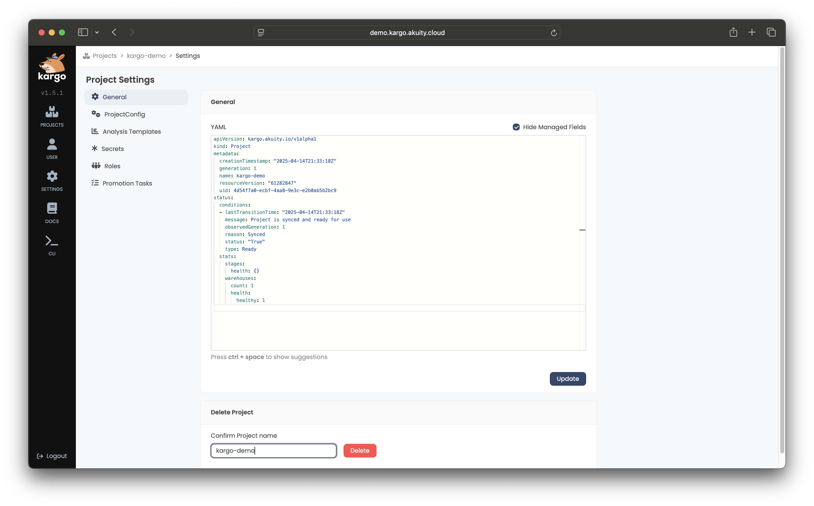

# Working with Projects

Each Kargo project is represented by a cluster-scoped Kubernetes resource of
type `Project`. Reconciliation of such a resource effects all boilerplate
project initialization, including the creation of a specially-labeled
`Namespace` with the same name as the `Project`. All resources belonging to a
given `Project` should be grouped together in that `Namespace`.

A minimal `Project` resource looks like the following:

```yaml
apiVersion: kargo.akuity.io/v1alpha1
kind: Project
metadata:
  name: example
```

:::note
Deletion of a `Project` resource results in the deletion of the corresponding
`Namespace`. For convenience, the inverse is also true -- deletion of a
project's `Namespace` results in the deletion of the corresponding `Project`
resource.
:::

:::info
There are compelling advantages to using `Project` resources instead of
permitting users to create `Namespace` resources directly:

* The required label indicating a `Namespace` is a Kargo project cannot be
forgotten or misapplied.

* Users can be granted permission to indirectly create `Namespace` resources for
Kargo projects _only_ without being granted more general permissions to create
_any_ new `Namespace` directly.

* Boilerplate configuration is automatically created at the time of `Project`
creation. This includes things such as project-level RBAC resources and
`ServiceAccount` resources.
:::

## Promotion Policies

A `ProjectConfig` resource defines project-level configuration for an associated
`Project`. At present, this only includes **promotion policies** that describe
which `Stage`s are eligible for automatic promotion of newly available `Freight`.

The `ProjectConfig` resource must have the same name as its associated `Project`
and be created in the `Namespace` of the `Project`. This separation of
configuration from the `Project` resource enables more granular RBAC control.
Users can be granted permission to modify project configurations via
`ProjectConfig` resources without necessarily having broader access to `Project`
resources themselves.

In the example below, the `test` and `uat` `Stage`s are eligible for automatic
promotion of newly available `Freight`, but any other `Stage`s in the `Project`
are not:

```yaml
---
apiVersion: kargo.akuity.io/v1alpha1
kind: Project
metadata:
   name: example
---
apiVersion: kargo.akuity.io/v1alpha1
kind: Project
metadata:
  name: example
  namespace: example
spec:
  promotionPolicies:
  - stage: test
    autoPromotionEnabled: true
  - stage: uat
    autoPromotionEnabled: true
```

## Namespace Adoption

At times, `Namespace`s may require specific configuration to
comply with regulatory or organizational requirements. To
account for this, Kargo supports the adoption of pre-existing
`Namespace`s that are labeled with `kargo.akuity.io/project: "true"`.
This enables pre-configuring such `Namespace`s according to your
own requirements.

:::info
Requiring a `Namespace` to have the `kargo.akuity.io/project: "true"` label to
be eligible for adoption by a new `Project` is intended to prevent accidental or
willful hijacking of an existing `Namespace`.
:::

The following example demonstrates adoption of a `Namespace` that's been
pre-configured with a label unrelated to Kargo:

```yaml
apiVersion: v1
kind: Namespace
metadata:
  name: example
labels:
  kargo.akuity.io/project: "true"
  example.com/org: platform-eng
---
apiVersion: kargo.akuity.io/v1alpha1
kind: Project
metadata:
  name: example
spec:
  # ...
```

## Interacting with Projects

Kargo provides tools to manage `Project`s using either its UI or
CLI. This section explains how to handle `Project`s effectively through both interfaces.


### Creating a Project

<Tabs groupId="create-project">
<TabItem value="ui" label="Using the UI" default>

1. Navigate to the Kargo UI and select <Hlt>Create</Hlt> in the top right corner.

   A <Hlt>Form</Hlt> tab will appear where you can enter the name of your `Project`:

   

   Alternatively, you can define the `Project` and other related configurations using the <Hlt>YAML</Hlt> tab:

   

1. After completing the <Hlt>Form</Hlt> or defining the `Project` in the <Hlt>YAML</Hlt> tab, click <Hlt>Create</Hlt>. 

   The new `Project` will appear a card on the UI's home page:

   

</TabItem>
<TabItem value="cli" label="Using the CLI">

1. To create a `Project` using the CLI, run:

   ```bash
   kargo create project <project>
   ```

   Alternatively, define the `Project` in a YAML file, for example:

   ```yaml
   apiVersion: kargo.akuity.io/v1alpha1
   kind: Project
   metadata:
     name: <project>
   ```

   Save the file and run:

   ```shell
   kargo create -f <filename>
   ```

1. To verify creation of the `Project`, run:

   ```shell
   kargo get project <project>
   ```

</TabItem>
</Tabs>

### Deleting a Project

<Tabs groupId="delete-project">
<TabItem value="ui" label="Using the UI" default>

1. Select the `Project` you want to remove.

1. Click the dropdown next to the `Project`'s name in the upper left corner of the `Project` dashboard and click <Hlt>Delete</Hlt>:

   

1. To confirm deletion, enter the `Project`'s name and click <Hlt>Delete</Hlt> to permanently remove it:

   

</TabItem>
<TabItem value="cli" label="Using the CLI">

To delete a `Project` using the CLI, run:

```shell
kargo delete project <project>
```

</TabItem>
</Tabs>
