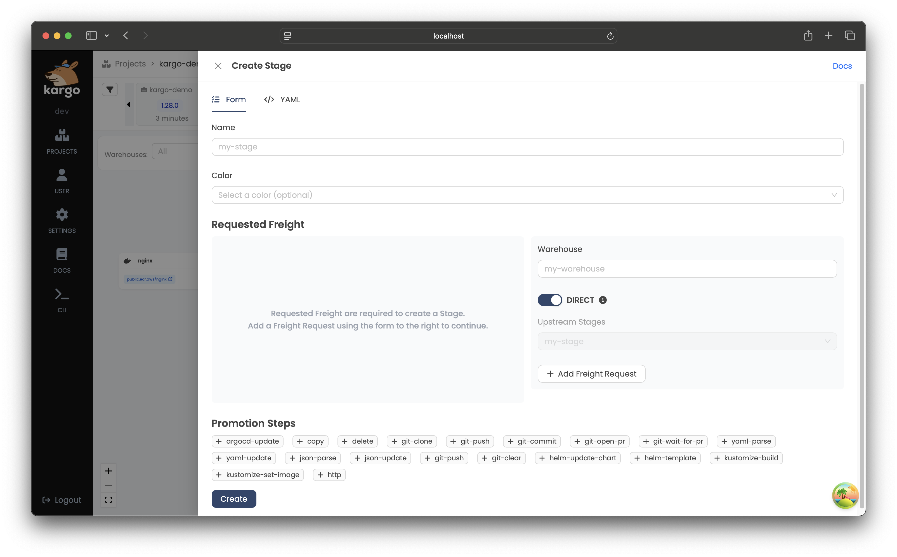

# Working with Stages

Each Kargo Stage is represented by a Kubernetes resource of type `Stage`.

## The `Stage` Resource Type

Like most Kubernetes resources, a `Stage` is composed of a user-defined `spec`
field and a system-populated `status` field.

A `Stage` resource's `spec` field is itself composed of four main areas of
concern:

* Variables

* Requested Freight

* Promotion template

* Verification

The following sections will explore each of these as well as `status` in
greater detail.

### Variables

The `spec.vars` field allows you to define variables that can be referenced
anywhere in the `Stage` specification that supports expressions, including the
[promotion template](#promotion-templates) and
[verification configuration](#verification).

```yaml
apiVersion: kargo.akuity.io/v1alpha1
kind: Stage
metadata:
  name: test
  namespace: kargo-demo
spec:
  vars:
    - name: gitopsRepo
      value: https://github.com/example/kargo-demo.git
    - name: targetBranch
      value: stage/test
    - name: imageRepo
      value: public.ecr.aws/nginx/nginx
  # ...
```

Stage-level variables are merged with promotion template-level variables, with
promotion template variables taking precedence for any conflicting names. This
allows you to define common variables at the `Stage` level while still being
able to override or supplement them at the promotion level as needed.

:::info

Variables defined at the Stage level can be referenced using
`${{ vars.<variable-name> }}` syntax throughout the `Stage` specification,
including in promotion templates and verification arguments.

:::

### Requested Freight

The `spec.requestedFreight` field is used to describe one or more "types" of
`Freight`, as specified by an `origin`, that the `Stage`'s promotion process, as
specified by `spec.promotionTemplate`, will operate on, and the acceptable
sources from which to obtain that `Freight`. Those sources may include the
origin itself (e.g. a `Warehouse`) and/or any number of "upstream" `Stage`
resources.

:::info

`Warehouse`s are the only type of origin at present, but it is anticipated that
future versions of Kargo will introduce additional origin types. This is why
"types" of `Freight` are described by an `origin` field having `kind` and `name`
subfields instead of being described only by the name of a `Warehouse`.

:::

#### Freight Availability

When a `Stage` accepts `Freight` directly from its origin, _all_ new `Freight`
created by that origin (e.g. a `Warehouse` ) are immediately available for
promotion to that `Stage`.

When a `Stage` accepts `Freight` from one or more "upstream" `Stage`s, `Freight`
is considered available for promotion to that `Stage` only after being
_verified_ in the upstream `Stage`(s). A `requestedFreight`'s
`sources.availabilityStrategy` field specifies whether `Freight` must be
verified in _any_ upstream `Stage` or _all_ upstream `Stage`s before becoming
available.

Valid strategies are:

* `OneOf` (default): `Freight` is available for promotion after being verified
  in at least one of the upstream `Stage`s.
* `All`: `Freight` is available for promotion only after being verified in all
  upstream `Stage`s listed in the `sources`.

Last, any `Freight` that has been explicitly _approved_ for promotion to the
`Stage` is available, without requiring upstream verification.

:::info

Explicit approvals are a useful method for applying the occasional "hotfix"
without waiting for a `Freight` resource to traverse the entirety of a pipeline.

:::

#### Auto-Promotion

When [auto-promotion](./20-working-with-projects.md#promotion-policies) is
enabled for a `Stage` through the project's `ProjectConfig`, `Stage`s will
periodically search for available `Freight` according to the rules defined in
the previous section and automatically initiate a promotion when suitable
`Freight` are found to be available.

:::info

Auto-promotion being enabled through Project-level configuration is a security
measure.

If it were possible to enabled auto-promotion at the `Stage`-level, users with
the requisite permissions to update a `Stage` resource, but _without_ the
permissions to promote to that same `Stage` could effect a promotion regardless
by enabling auto-promotion.

Keeping enablement of auto-promotion defined at the Project-level ensures that
(in practice) only a Project's administrator has the authority to enable or
disable auto-promotion for any `Stage`.

:::

The definition of "suitable" `Freight` is dependent on the `requestedFreight`'s
`sources.autoPromotionOptions.selectionPolicy`.

Valid policies are:

* `NewestFreight`: (default): The _newest_ `Freight` that's been suitably
  verified or approved will be auto-promoted to the `Stage` on a continuous
  basis.

* `MatchUpstream`: The `Freight` currently in use _immediately upstream_, if
  suitably verified or approved, will be be auto-promoted to the `Stage` on a
  continuous basis. This option is valid only when the `Stage` accepts `Freight`
  from _exactly one_ upstream `Stage`.

#### Examples

In the following example, the `test` `Stage` requests `Freight` that has
originated from the `my-warehouse` `Warehouse` and indicates that it will accept
new `Freight` _directly_ from that origin. If auto-promotion has been enabled
(at the Project-level), the newest `Freight` will be auto-promoted to this
`Stage` on a continuous basis:

```yaml
apiVersion: kargo.akuity.io/v1alpha1
kind: Stage
metadata:
  name: test
  namespace: kargo-demo
spec:
  requestedFreight:
  - origin:
      kind: Warehouse
      name: my-warehouse
    sources:
      direct: true
      # These are the default options and could be omitted
      autoPromotionOptions:
        selectionPolicy: NewestFreight
  # ...
# ...
```

In this example, the `qa` `Stage` requests `Freight` that has originated from
the `my-warehouse` `Warehouse`, and indicates that it will accept such `Freight`
only after it has been _verified_ in the `test` `Stage`. It additionally
specifies that (if enabled at the Project-level), `Freight` currently in use by
the `test` `Stage`, if suitably verified or approved, will continuously be
auto-promoted:

```yaml
apiVersion: kargo.akuity.io/v1alpha1
kind: Stage
metadata:
  name: qa
  namespace: kargo-demo
spec:
  requestedFreight:
  - origin:
      kind: Warehouse
      name: my-warehouse
    sources:
      stages:
      - test
      autoPromotionOptions:
        selectionPolicy: MatchUpstream
  # ...
```

In this example, the `uat` `Stage` requests `Freight` that has originated from
the `my-warehouse` `Warehouse`, and indicates that it will accept such `Freight`
only after it has been _verified_ in the `test` `Stage`:

```yaml
apiVersion: kargo.akuity.io/v1alpha1
kind: Stage
metadata:
  name: uat
  namespace: kargo-demo
spec:
  requestedFreight:
  - origin:
      kind: Warehouse
      name: my-warehouse
    sources:
      stages:
      - test
  # ...
```

In the next example, the `prod` `Stage` requests `Freight` that has originated
from the `my-warehouse` `Warehouse`, and indicates that it will accept such
`Freight` only after it has been verified in _both_ the `qa` and `uat`
`Stage`s:

```yaml
apiVersion: kargo.akuity.io/v1alpha1
kind: Stage
metadata:
   name: prod
   namespace: kargo-demo
spec:
  requestedFreight:
  - origin:
      kind: Warehouse
      name: my-warehouse
    sources:
      availabilityStrategy: All
      stages:
      - qa
      - uat
  # ...
```

Stages may also request `Freight` from multiple sources. The following example
illustrates a `Stage` that requests `Freight` from both a `microservice-a` and
`microservice-b` `Warehouse`:

```yaml
apiVersion: kargo.akuity.io/v1alpha1
kind: Stage
metadata:
  name: test
  namespace: kargo-demo
spec:
  requestedFreight:
  - origin:
      kind: Warehouse
      name: microservice-a
    sources:
      direct: true
  - origin:
      kind: Warehouse
      name: microservice-b
    sources:
      direct: true
  # ...
```

:::info

By requesting `Freight` from multiple sources, a `Stage` can effectively
participate in _multiple pipelines_ that may each deliver different collections
of artifacts independently of the others.

__This is _advanced_ configuration. If you're very new to Kargo
and requesting `Freight` from multiple origins, you probably
didn't mean to.__

:::

### Promotion Templates

The `spec.promotionTemplate` field is used to describe _how_ to transition
`Freight` into the `Stage`. The `spec.promotionTemplate.steps` field describes
the discrete steps of a promotion process in detail.

In the following, very common example, the `promotionTemplate` describes steps
to:

1. Clone a Git repository containing Kubernetes manifests and Kustomize
   configuration, checking out two different branches to two different
   directories.

1. Clears the contents of one working tree, with intentions to fully replace its
   contents.

1. Runs the equivalent of `kustomize edit set image` to update a
   `kustomization.yaml` file with a reference to an updated
   `public.ecr.aws/nginx/nginx` container image.

1. Renders the updated manifests using the equivalent of `kustomize build`.

1. Commits the updated manifests and pushes them to the `stage/test` of the
   remote repository.

1. Forces Argo CD to sync the `kargo-demo-test` application to the latest commit
   of the `stage/test` branch.

```yaml
promotionTemplate:
  spec:
    vars:
    - name: gitopsRepo
      value: https://github.com/example/repo.git
    - name: imageRepo
      value: public.ecr.aws/nginx/nginx
    - name: srcPath
      value: ./src
    - name: outPath
      value: ./out
    - name: targetBranch
      value: stage/${{ ctx.stage }}
    steps:
    - uses: git-clone
      config:
        repoURL: ${{ vars.gitopsRepo }}
        checkout:
        - branch: main
          path: ${{ vars.srcPath }}
        - branch: stage/${{ ctx.stage }}
          create: true
          path: ${{ vars.outPath }}
    - uses: git-clear
      config:
        path: ${{ vars.outPath }}
    - uses: kustomize-set-image
      as: update-image
      config:
        path: ${{ vars.srcPath }}/base
        images:
        - image: ${{ vars.imageRepo }}
    - uses: kustomize-build
      config:
        path: ${{ vars.srcPath }}/stages/${{ ctx.stage }}
        outPath: ${{ vars.outPath }}/manifests.yaml
    - uses: git-commit
      as: commit
      config:
        path: ${{ vars.outPath }}
        message: ${{ outputs['update-image'].commitMessage }}
    - uses: git-push
      config:
        path: ${{ vars.outPath }}
        branch: ${{ vars.targetBranch }}
    - uses: argocd-update
      config:
        apps:
        - name: kargo-demo-${{ ctx.stage }}
          sources:
          - repoURL: ${{ vars.gitopsRepo }}
            desiredRevision: ${{ outputs.commit.commit }}
```

:::info

For complete documentation of all Kargo's built-in promotion steps, refer
to the [Promotion Steps Reference](../60-reference-docs/30-promotion-steps/index.md).

:::

### Verification

The `spec.verification` field is used to describe optional verification
processes that should be executed after a `Promotion` has successfully deployed
`Freight` to a `Stage`, and if applicable, after the `Stage` has reached a
healthy state. The following example depicts a `Stage` resource that references
an `AnalysisTemplate` named `integration-test` to validate the `dev` `Stage` after
any successful promotion:

```yaml
apiVersion: kargo.akuity.io/v1alpha1
kind: Stage
metadata:
  name: dev
  namespace: guestbook
spec:
  # ...
  verification:
    analysisTemplates:
    - name: integration-test
```

:::info

For complete documentation of how to perform verification, refer to the
[Verification Guide](./60-verification.md).

:::

### Status

The `status` field of a `Stage` resource records:

  * Conditions containing the last observations of the `Stage`'s current state.

  * The current phase of the `Stage`'s lifecycle (distilled from the conditions).

  * Details about the last `Promotion` and any in-progress `Promotion`.

  * History of `Freight` that has been deployed to the `Stage` (from most to
    least recent) along with the results of any associated verification processes.

  * The health status of related Argo CD `Application` resources.

For example:

```yaml
status:
  freightHistory:
  - id: 101bca5b0e18ca7913978a1da956308d2544f741
    items:
      Warehouse/my-warehouse:
        commits:
        - healthCheckCommit: 111eaf55aa41f21bb9bb707ba1baa748b83ec51e
          id: 961cfaedbc53aacdb65110028839a2c1c281290d
          repoURL: https://github.com/example/kargo-demo.git
        images:
        - digest: sha256:b2487a28589657b318e0d63110056e11564e73b9fd3ec4c4afba5542f9d07d46
          repoURL: public.ecr.aws/nginx/nginx
          tag: 1.27.0
        name: 666209fd9755a1e48bec6b27f5f447747410dd9e
        origin:
          kind: Warehouse
          name: my-warehouse
    verificationHistory:
    - analysisRun:
        name: test.01j2w7aknhf3j7jteyqs72hnbg.101bca5
        namespace: kargo-demo
        phase: Successful
      finishTime: "2024-07-15T22:13:57Z"
      id: 5535a484-bbd0-4f12-8cf4-be2c8e0041c9
      phase: Successful
      startTime: "2024-07-15T22:13:34Z"
  health:
    argoCDApps:
    - healthStatus:
        status: Healthy
      name: kargo-demo-test
      namespace: argocd
      syncStatus:
        revision: 111eaf55aa41f21bb9bb707ba1baa748b83ec51e
        status: Synced
    status: Healthy
  lastPromotion:
    finishedAt: "2024-07-15T22:13:25Z"
    freight:
      commits:
      - healthCheckCommit: 111eaf55aa41f21bb9bb707ba1baa748b83ec51e
        id: 961cfaedbc53aacdb65110028839a2c1c281290d
        repoURL: https://github.com/example/kargo-demo.git
      name: 666209fd9755a1e48bec6b27f5f447747410dd9e
      origin:
        kind: Warehouse
        name: kargo-demo
    name: test.01j2w7a15cxjjgejresfyw6ysp.666209f
    status:
      finishedAt: "2024-07-15T22:13:25Z"
      freight:
        commits:
        - healthCheckCommit: 111eaf55aa41f21bb9bb707ba1baa748b83ec51e
          id: 961cfaedbc53aacdb65110028839a2c1c281290d
          repoURL: https://github.com/example/kargo-demo.git
        name: 666209fd9755a1e48bec6b27f5f447747410dd9e
        origin:
          kind: Warehouse
          name: kargo-demo
      freightCollection:
        id: 101bca5b0e18ca7913978a1da956308d2544f741
        items:
          Warehouse/kargo-demo:
            commits:
            - healthCheckCommit: 111eaf55aa41f21bb9bb707ba1baa748b83ec51e
              id: 961cfaedbc53aacdb65110028839a2c1c281290d
              repoURL: https://github.com/example/kargo-demo.git
            name: 666209fd9755a1e48bec6b27f5f447747410dd9e
            origin:
              kind: Warehouse
              name: kargo-demo
        verificationHistory:
        - analysisRun:
            name: test.01j2w7aknhf3j7jteyqs72hnbg.101bca5
            namespace: kargo-demo
            phase: ""
          id: 5535a484-bbd0-4f12-8cf4-be2c8e0041c9
          phase: Pending
          startTime: "2024-07-15T22:13:34Z"
      phase: Succeeded
  observedGeneration: 1
  phase: Steady
```

## Interacting with Stages

Kargo provides tools to manage Stages using either its UI or
CLI. This section explains how to handle Stages effectively through both interfaces.

:::info

Users with credentials for and sufficient permissions within the Kargo control plane's Kubernetes cluster can also manage `Stage` resources using `kubectl`.

:::

### Creating a Stage

<Tabs groupId="create-stage">
<TabItem value="ui" label="Using the UI" default>

1. In the `Project` view, click <Hlt>Create</Hlt> in the upper right corner of
   the pipeline section to open a dropdown, then select <Hlt>Stage</Hlt>:

   

   A form will appear to input details for a new `Stage`:

   

1. Complete the form with the necessary details and submit it.

   The new `Stage` will be added to the pipeline, connected to other
   `Stage`s based on your configuration:

   

</TabItem>

<TabItem value="cli" label="Using the CLI">

1. Define the `Stage` in a YAML file, for example:

    ```yaml
    apiVersion: kargo.akuity.io/v1alpha1
    kind: Stage
    metadata:
      name: <stage>
      namespace: <project>
    spec:
      ### Add your Stage specifications here
    ```

1. Save the file and run:

    ```shell
    kargo create -f <filename>
    ```

1. Verify the creation by listing `Stage`s:

    ```shell
    kargo get stage <stage> --project <project>
    ```

</TabItem>
</Tabs>

### Promoting Freight to a Stage

<Tabs groupId="promoting">
<TabItem value="ui" label="Using the UI" default>

1. To promote `Freight` to a `Stage`, click the truck icon in the
   header of that node and then select <Hlt>Promote</Hlt>:

   

1. From the timeline at the top of the screen, select the `Freight` you'd like
   to promote into the `Stage` by clicking <Hlt>Select</Hlt>:

   

1. Confirm the action by clicking <Hlt>Promote</Hlt>:

   

   A summary of the `Promotion` will pop up and will be updated in real-time as
   the steps of the promotion process complete. Once they have all completed,
   the `Promotion`'s status will change to <Hlt>Succeeded</Hlt>:

   

   You will also notice the freight timeline has been automatically updated.
   Every piece of `Freight` in the timeline is color-coded to indicate which
   `Stage`s (if any) are actively using it. You will see the one piece of
   `Freight` currently in the timeline is marked with the same color as the
   `Stage`'s node you recently promoted in the pipeline. This indicates this
   piece of `Freight` is currently used by that `Stage`.

</TabItem>
<TabItem value="cli" label="Using the CLI">

To promote `Freight` to a `Stage` using the CLI, run:

```shell
kargo promote \
  --project kargo-demo \
  --freight f5f87aa23c9e97f43eb83dd63768ee41f5ba3766 \
  --stage prod
```

Alternatively, you can reference the `Freight` you wish to promote using its alias:

```shell
kargo promote \
  --project kargo-demo \
  --freight-alias frozen-tauntaun \
  --stage prod
```

</TabItem>
</Tabs>

### Deleting a Stage

<Tabs groupId="delete-stage">
<TabItem value="ui" label="Using the UI" default>

1. Open the `Stage` view by clicking the staggered bars icon in the header of 
   the `Stage` node within the pipeline.

   

1. In the `Stage` view, click <Hlt>Settings</Hlt>, scroll to the bottom, and
   click <Hlt>Delete</Hlt>.

   

1. A confirmation popup will appear, click <Hlt>Confirm</Hlt> to proceed.

   

</TabItem>

<TabItem value="cli" label="Using the CLI">

To delete a `Stage` using the CLI, run:

```shell
kargo delete stage <stage> --project <project>
```

</TabItem>
</Tabs>

### Refreshing a Stage

Refreshing a `Stage` triggers its reconciliation process, which
includes checking for any newly-completed Promotions, queueing
up the next, pending Promotion, when applicable, and executing
any applicable health check processes.

<Tabs groupId="refresh-stage">
<TabItem value="ui" label="Using the UI" default>

1. Open the `Stage` view by clicking the staggered bars icon in the header of 
   the `Stage` node that you want to refresh and click <Hlt>Refresh</Hlt> in the top-right corner of the pop-up window:

   

</TabItem>

<TabItem value="cli" label="Using the CLI">

To refresh a `Stage`, run:

```shell
kargo refresh stage <stage> --project <project>
```

</TabItem>
</Tabs>

### Reverifying a Stage's Current Freight

Verification processes, which run automatically following each successful Promotion,
can also be re-run on-demand. This is useful for re-attempting a failed verification
process or just to validate that applications within the `Stage` are performing
as desired.

<Tabs groupId="verify-stage">
<TabItem value="ui" label="Using the UI" default>

1. Open the `Stage` view by clicking the staggered bars icon in the header of 
   the `Stage` node that you want to reverify and click <Hlt>Reverify</Hlt> at the top of the menu:

   

    :::note

    If you wish to stop the in-progress verification, you can click <Hlt>Abort Verification</Hlt>.
    :::

1. To check the `Stage`s where the `Freight` has been successfully verified, return to 
    the `Freight` timeline and select the `Freight`. Verified `Stage` names will appear under <Hlt>VERIFIED IN</Hlt>:

    

</TabItem>

<TabItem value="cli" label="Using the CLI">

1. To rerun verification using the CLI, run:

    ```shell
    kargo verify stage <stage> --project <project>
    ```

    If you want to *stop* this ongoing verification process, use:

    ```shell
    kargo verify stage <stage> --project <project> --abort
    ```
1. To check the `Stage`s where the `Freight` has been successfully verified, run:

    ```shell
    kargo get freight \
    --project <project> \
    --output jsonpath-as-json={.status}
    ```

</TabItem>
</Tabs>
