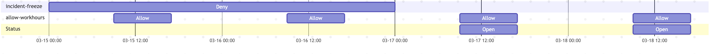

# Promotion Windows

<span class="tag professional"></span>
<span class="tag beta"></span>

:::info

Promotion windows are a Kargo Enterprise feature, available in Kargo v1.12 and
above. The `promotionWindows` API is present in Kargo OSS for compatibility, as
it is for other Enterprise-only fields such as
[`autoRollback`](./20-working-with-projects.md#auto-rollback), but the schedule
is only ever evaluated and enforced by Kargo Enterprise. In OSS the field is
accepted and ignored.

:::

_Promotion windows_ let you control _when_ `Promotion`s may be created for a
`Stage`. A window is either an **allow** window, which permits promotions only
while it is active, or a **deny** window (a _freeze_), which forbids promotions
while it is active. You can use them to restrict promotions to business hours,
to a weekly release slot, or to freeze an environment during an incident or a
change-control blackout.

Windows are configured on
[`ProjectConfig`](./20-working-with-projects.md#project-configuration) (for a
single Project) and on
[`ClusterConfig`](../../40-operator-guide/35-cluster-configuration.md) (across
Projects). A `Stage`'s _effective window status_ is the **union** of every window
that matches it, drawn from both.

## How It Works

Promotion windows gate the **creation** of a `Promotion`, not its execution.

- When a window is closed for a `Stage`, an admission webhook **rejects new
  `Promotion`s** for that `Stage`. A person promoting manually receives a
  synchronous, descriptive rejection; automatic promotion is denied and simply
  retried on a later reconciliation.
- A `Promotion` that was **already running** when a window closes is **never
  interrupted** — it runs to completion.
- A `Promotion` that was admitted while the window was open but is still
  `Pending` when the window closes is **deleted** by an Enterprise
  controller, so it does not dispatch inside a freeze. See
  [Effect on Promotions](#effect-on-promotions) below.

Because promotions are denied at creation time, no backlog of pending
`Promotion`s accumulates during a freeze. When a window reopens, automatic
promotion creates a single `Promotion` for the **newest** eligible `Freight` —
intermediate versions are coalesced rather than replayed.

## Configuration

### Project-Level Windows

Windows on a `ProjectConfig` apply only within that Project. The example below
freezes all promotions in the Project during a one-day change blackout, and
separately restricts the `prod` `Stage` to a weekday business-hours window:

```yaml
apiVersion: kargo.akuity.io/v1alpha1
kind: ProjectConfig
metadata:
  name: example
  namespace: example
spec:
  promotionWindows:
  # A one-shot freeze covering every Stage in the Project.
  - name: end-of-year-freeze
    kind: Deny
    description: "Company-wide change freeze; see CHG-4821"
    dtstart: "20261224T000000"
    dtend: "20261227T000000"
  # A recurring business-hours window that constrains only the prod Stage.
  - name: prod-business-hours
    kind: Allow
    stageSelector:
      name: prod
    rrule: FREQ=WEEKLY;BYDAY=MO,TU,WE,TH,FR
    dtstart: "TZID=America/New_York:20260105T090000"
    dtend: "TZID=America/New_York:20260105T170000"
```

### Cluster-Level Windows

Windows on the `ClusterConfig` apply across Projects. They support the same
fields as `ProjectConfig` windows, plus `projectSelector` to narrow which
Projects a window covers (a cluster-wide window omits it). A cluster-level
window is useful for an organization-wide "stop the line" freeze or for a
release schedule that every Project shares:

```yaml
apiVersion: kargo.akuity.io/v1alpha1
kind: ClusterConfig
metadata:
  name: cluster
spec:
  promotionWindows:
  # Freeze production promotions across every Project.
  - name: global-prod-freeze
    kind: Deny
    stageSelector:
      name: glob:prod-*
    dtstart: "20260701T000000"
    dtend: "20260702T000000"
  # Restrict a group of Projects to a weekly release slot.
  - name: friday-release-slot
    kind: Allow
    projectSelector:
      matchLabels:
        team: payments
    rrule: FREQ=WEEKLY;BYDAY=FR
    dtstart: "TZID=America/New_York:20260102T130000"
    dtend: "TZID=America/New_York:20260102T170000"
```

:::note

A cluster may have at most one `ClusterConfig` resource, and it must be named
`cluster`. See
[Cluster Level Configuration](../../40-operator-guide/35-cluster-configuration.md).

:::

### Promotion window fields

Each entry in `promotionWindows` describes one window:

| Field | Required | Description |
|---|---|---|
| `name` | Yes | A symbolic name for the window, unique within the list. It appears in rejection messages and events. |
| `kind` | Yes | Either `Allow` or `Deny`. |
| `description` | No | Human-readable text explaining the window: a reason, an author, or a link to a change ticket. |
| `disabled` | No | When `true`, the window is skipped when evaluating the window status. Defaults to `false`. Useful for temporarily turning a window off without deleting it. |
| `stageSelector` | No | Selects the `Stage`s the window applies to. When omitted, it applies to all `Stage`s in scope. See [Selecting Stages](#selecting-stages). |
| `projectSelector` | No | **`ClusterConfig` only.** Selects the Projects the window applies to. When omitted on a `ClusterConfig` window, it applies to all Projects. It is rejected on `ProjectConfig` windows, where the Project is implicit. |
| `rrule` | No | An [RFC 5545](https://datatracker.ietf.org/doc/html/rfc5545) recurrence rule (e.g. `FREQ=DAILY`) that makes the window recurring. When omitted, the window is a one-shot interval. See [Scheduling](#scheduling). |
| `dtstart` | No | The window's start as an iCal date-time, with an optional `TZID=` prefix carrying a time zone. See [Scheduling](#scheduling). |
| `dtend` | No | The window's end, in the same format as `dtstart`. With `rrule`, `dtend − dtstart` is the duration of each occurrence. |

### Selecting Stages

`stageSelector` (and `projectSelector` on `ClusterConfig` windows) reuses the
same `PromotionPolicySelector` used by
[promotion policies](./20-working-with-projects.md#advanced-promotion-policies-with-selectors),
so it matches by exact name, glob or regex pattern, or Kubernetes label
selector:

```yaml
promotionWindows:
- name: prod-freeze
  kind: Deny
  stageSelector:
    # Exact name, or "glob:prod-*", or "regex:prod-.*"
    name: glob:prod-*
    matchLabels:
      environment: production
  dtstart: "20260701T000000"
  dtend: "20260702T000000"
```

When both a name pattern and a label selector are given, a `Stage` must match
both. When `stageSelector` is omitted entirely, the window applies to every
`Stage` in scope.

:::warning

Pattern and label matching carry the same security considerations as they do for
promotion policies: a user who can create or label `Stage`s could craft names or
labels to fall outside an intended freeze. Using exact names is the most
predictable option.

:::

## Scheduling

A window's timing is expressed with iCal-style values:

- **`dtstart` / `dtend`** are iCal date-times, formatted `YYYYMMDDThhmmss`. An
  optional `TZID=<zone>:` prefix carries an IANA time zone, e.g.
  `TZID=America/New_York:20260105T090000`. **When no `TZID=` is given, the time
  is interpreted as UTC.** Supplying a zone lets a window follow local working
  hours across daylight-saving changes rather than drifting by an hour.
- **`rrule`** is an optional RFC 5545 recurrence rule. When omitted, the window
  is a **one-shot** interval — it occurs exactly once, from `dtstart` to
  `dtend`. When present, the window **recurs**: `dtstart` anchors the first
  occurrence, `rrule` defines the cadence, and `dtend − dtstart` fixes the
  duration of every occurrence.

**`dtend` must be after `dtstart`.**

Some common patterns:

```yaml
# One-shot freeze: a fixed interval, no recurrence.
- name: incident-freeze
  kind: Deny
  dtstart: "20260315T000000"
  dtend: "20260316T000000"

# Daily off-hours allow window (17:00–08:00 the next day, New York time).
- name: nightly-window
  kind: Allow
  rrule: FREQ=DAILY
  dtstart: "TZID=America/New_York:20260101T170000"
  dtend: "TZID=America/New_York:20260102T080000"

# Weekly Friday-afternoon release window.
- name: friday-release
  kind: Allow
  rrule: FREQ=WEEKLY;BYDAY=FR
  dtstart: "TZID=America/New_York:20260102T130000"
  dtend: "TZID=America/New_York:20260102T170000"
```

### Allow and Deny Precedence

A `Stage`'s effective window status is the union of all matching windows. At any
instant, the status is **closed** (promotions prohibited) when:

1. There is a matching **`Deny`** window currently active (current time inside the window bounds) **OR**
1. There are matching **`Allow`** windows, none of which are currently active

Inversely, the scedule is **open** (promotions permitted) when:

1. There is no matching **`Deny`** window currently active **AND**
1. There is no matching **`Allow`** windows, or at least one matching **`Allow`** window currently active

In other words:

- **Windows constrain only the `Stage`s they match.**
- **Deny wins.** An active `Deny` window always closes the `Stage` window status, regardless
  of any `Allow` windows. A freeze is simply a `Deny` window.
- **Allow windows constrain all promotion outside the window.** If any `Allow`
  window matches a `Stage`, that `Stage` is closed except while one of its
  `Allow` windows is active.
- **No matching windows means always open.** A `Stage` that no window matches is
  never gated.

For example if we have an `Allow` window permitting daily from 09:00 to 17:00, like this:
```yaml
- name: allow-workhours
  kind: Allow
  rrule: FREQ=DAILY
  dtstart: "TZID=America/New_York:20260101T090000"
  dtend: "TZID=America/New_York:20260102T170000"
```

And we have a `Deny` window blocking promotions at specific day, like this:
```yaml
- name: incident-freeze
  kind: Deny
  dtstart: "20260315T000000"
  dtend: "20260317T000000"
```

Then the `Stage` window status will be open between 09:00 and 17:00 only on the days when it's not blocked:




## Effect on Promotions

Promotion windows gate all promotions uniformly — automatic, manual, and
[auto-rollback](./20-working-with-projects.md#auto-rollback). There is no class
scoping; a closed window blocks every kind of `Promotion` for the `Stage`,
including rollbacks and hotfixes. To promote during a closed window, an
administrator must edit or remove the responsible window (governed by RBAC on
`ProjectConfig` / `ClusterConfig`).

**Manual promotion.** Creating a `Promotion` for a `Stage` whose window status is
closed is rejected at admission with a `Forbidden` error naming the responsible
window and, where one can be determined, the time promotions resume:

```text
promotion of Stage "prod" is not permitted at this time:
Promotion freeze "end-of-year-freeze" is active;
promotions resume at 2026-12-27T00:00:00Z
```

Nothing is persisted — there is no `Pending` object to clean up, and the
promoter decides whether to wait or to escalate.

**Automatic promotion.** When a `Stage` window status is closed, no automatic `Promotion`s
will be created. Kargo only logs attempts with `DEBUG` log level.
When the window reopens the successful promotion attempt will succeed for the newest eligible `Freight`. 
A scheduled open (or an administrator lifting a freeze) takes effect within a few minutes, on the
`Stage` controller's normal resync.

**Auto-rollback.** Automatic rollbacks are gated the same way. A short freeze
resumes a pending rollback automatically when it reopens; a long freeze may
outlast the rollback controller's recovery horizon, handing recovery to a human
— consistent with the intent of the freeze.

:::note

Because automatic promotions happen in reconcile loop, there is no audit events indicating
a failure to promote when the window is closed. Kargo only logs those with `DEBUG` level.

One should check the `Stage` status field `promotionWindowStatus` to investigate stages which appear "stuck".

:::

**The window-close sweep.** A `Promotion` can be admitted while a window is open
and then sit `Pending` past the moment the window closes — for example when the
`Stage` controller defers dispatch until the previous `Freight` finishes
verifying. To keep such a `Promotion` from dispatching inside a freeze, an
Enterprise controller **deletes** still-`Pending` `Promotion`s for the
affected `Stage`s when a window closes, recording a `PromotionDiscarded` event
for the audit trail. Deletion (rather than abort) leaves nothing behind, so
auto-promotion cleanly recreates a `Promotion` for the newest `Freight` when the
window reopens.

:::note

A `Promotion` that the `Stage` controller dispatches at the very moment the
sweep runs wins the race and runs to completion, like any already-running
`Promotion`. This is bounded by a single promotion's duration.

:::

## Stage Status

Kargo Enterprise reports each `Stage`'s current window state in
`status.promotionWindowStatus`, so a user interface can explain a freeze
_before_ a user runs into it. For a `Stage` that is currently frozen:

```yaml
status:
  promotionWindowStatus:
    closed: true
    reason: Promotion freeze "end-of-year-freeze" is active
    nextOpen: "2026-12-27T00:00:00Z"
```

For a `Stage` that is currently open but has an upcoming freeze:

```yaml
status:
  promotionWindowStatus:
    closed: false
    nextClose: "2026-12-24T00:00:00Z"
    nextCloseReason: Promotion freeze "end-of-year-freeze" begins
```

The fields are:

| Field | Description |
|---|---|
| `closed` | `true` when the configured windows currently forbid promotion of the `Stage`. |
| `reason` | Set whenever `closed` is `true`; a human-readable explanation naming the responsible freeze. It carries the same explanation as the admission rejection. |
| `nextOpen` | When promotions are next expected to be permitted. Optional even while `closed` — its absence means no reopening is known (e.g. an elapsed one-shot `Allow` window), i.e. "frozen, with no known end". |
| `nextClose` | When promotions are next expected to become forbidden. Meaningful only while `closed` is `false`; lets a client warn of an approaching freeze. |
| `nextCloseReason` | Set whenever `nextClose` is set; names the freeze that will take effect. |

:::caution

`promotionWindowStatus` is **advisory**. It is only as current as the last
reconciliation of the `Stage`, so clients must not treat it as authorization.
Admission remains the sole arbiter of whether a given `Promotion` is permitted;
the status exists to _explain_ a freeze, not to decide anything.

:::

## Limitations

- Rollbacks and hotfixes are gated by a closed window too; there is no built-in
  bypass. Break-glass is an administrator editing or removing the window.
- A `Promotion` already running when a window closes is never aborted.
- Missed intermediate versions are not replayed. At reopening, auto-promotion
  coalesces to the newest `Freight`; the intermediates were never created.
- Window **closes** take effect promptly (the Enterprise controller wakes at
  each window boundary). Window **opens** for automatic promotion take effect on
  the `Stage` controller's normal resync, within a few minutes.
