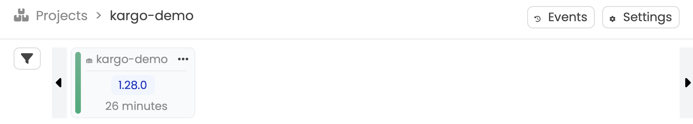
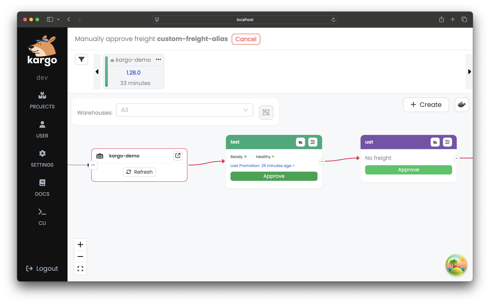

# Working With Freight

**Freight** is an important Kargo concept. A single "piece of freight" is a set
of references to one or more versioned artifacts, which may include one or more:

* Container images (from image repositories)

* Kubernetes manifests (from Git repositories)

* Helm charts (from chart repositories)

Freight can therefore be thought of as a sort of meta-artifact. Freight is what
Kargo seeks to progress from one stage to another.

:::info
To learn the fundamentals of freight and the warehouses that produce freight,
see [Core Concepts](../10-core-concepts/index.md).
:::

The remainder of this page describes features of freight that will enable you
to work more effectively.

## Names

Like all Kubernetes resources, Kargo `Freight` resources have a `metadata.name`
field, which uniquely identifies each resource of that type within a given Kargo
project (a specially labeled Kubernetes namespace). When a `Warehouse` produces
a new `Freight` resource, it will compute a canonical representation of the
artifacts referenced by that resource and use that, in turn, to compute a SHA-1
hash. This becomes the value of the `metadata.name` field. The deterministic
method of computing this value makes it a unique "fingerprint" of the
collection of artifacts referenced by the `Freight` resource.

## Aliases

While the `metadata.name` field contains a predictably computed SHA-1 hash,
such identifiers are, unarguably, not very user-friendly.
To make `Freight` resources easier for human users to identify, `Warehouse`s
automatically generate a human-friendly alias for every `Freight` resource they
produce and apply it as the value of the `Freight` resource's
`kargo.akuity.io/alias`
[label](https://kubernetes.io/docs/concepts/overview/working-with-objects/labels/).

:::info
Generating aliases of the form `<adjective>-<animal>` is a strategy borrowed
from Docker, which generates similar names for containers not explicitly named
by users.
:::

:::info
Why a label?

Kubernetes enforces the immutability of the `metadata.name` field for all
resources.

Kubernetes
[labels](https://kubernetes.io/docs/concepts/overview/working-with-objects/labels/),
by contrast, are both mutable and indexed, which makes them ideal for use as
secondary identifiers.
:::

When using the Kargo CLI to query for `Freight` resources, the `alias` field is
always displayed:

```shell
kargo get freight --project kargo-demo
```

Sample output:

```shell
NAME                                       ALIAS              AGE
f5f87aa23c9e97f43eb83dd63768ee41f5ba3766   mortal-dragonfly   35s
```

Sample output:

```shell
NAME                                       ALIAS              AGE
f5f87aa23c9e97f43eb83dd63768ee41f5ba3766   mortal-dragonfly   35s
```

:::info
The Kargo UI, to make efficient use of screen real estate, displays aliases
only, but a `Freight` resource's `name` can always be discovered by hovering
over its alias.
:::

:::note
Kargo CLI commands will accept `Freight` aliases as an alternative to a
`Freight` name. Refer to the help text for the `kargo` command for more
information.
:::

### Updating Aliases

While every `Freight` resource is automatically assigned an alias, users may
sometimes wish to override that alias with one of their own choosing. This can
make it easier to identify a particularly important (or problematic) `Freight`
resource as it progresses through the `Stage`s of a pipeline.

To update the `Freight` Alias:

<Tabs groupId="update-alias">
<TabItem value="ui" label="Using the UI" default>

1. Click the three dots on the `Freight` in the <Hlt>Freight Timeline</Hlt>,
   then select <Hlt>Change Alias</Hlt>:

   

1. Specify a value in the <Hlt>New Alias</Hlt> field and click <Hlt>Submit</Hlt>:

   

</TabItem>
<TabItem value="cli" label="Using the CLI">

```shell
kargo update freight \
  --project kargo-demo \
  --name f5f87aa23c9e97f43eb83dd63768ee41f5ba3766 \
  --new-alias frozen-tauntaun
```
Alternatively, you can reference the `Freight` to which you want to assign a new alias using its existing alias:

```shell
kargo update freight \
  --project kargo-demo \
  --old-alias mortal-dragonfly \
  --new-alias frozen-tauntaun
```

</TabItem>
</Tabs>

## Manual Approvals

The [Core Concepts](../10-core-concepts/index.md) describes the
usual process by which `Freight` resources are _verified_ at each `Stage` in a
pipeline before becoming available to the next `Stage` or `Stage`s. In brief, it
typically requires the `Stage` to reach a healthy state _and_, if applicable,
any user-defined verification processes to complete with favorable results.

This is suitable for the average case wherein a new `Freight` resource is
expected to traverse the entirety of a pipeline on its way to production,
however, it is nearly inevitable that the occasional need for a "hotfix" will
arise, in which case it may sometimes be desirable to bypass one or more
`Stage`s in the pipeline.

To enable this, Kargo provides the ability to manually approve a `Freight`
resource for promotion to any given `Stage`. To manually approve the `Freight`:

<Tabs groupId="manual-approval">
<TabItem value="ui" label="Using the UI" default>

1. Click the three dots on the `Freight` in the <Hlt>Freight Timeline</Hlt>,
   then select <Hlt>Manually Approve</Hlt>:

   

1. Select <Hlt>Approve</Hlt> on the `Stage` for which you want to approve promotion of the `Freight`:

   

</TabItem>
<TabItem value="cli" label="Using the CLI">

```shell
kargo approve \
  --project kargo-demo \
  --freight f5f87aa23c9e97f43eb83dd63768ee41f5ba3766 \
  --stage prod
```

</TabItem>
</Tabs>

:::note
Manually granting approval for a `Freight` resource to be promoted to any given
`Stage` requires the same level of permissions as would be required to carry out
that promotion, although, granting manual approval does _not_ automatically
create a corresponding `Promotion` resource.
:::

After successfully granting manual approval for a `Freight` resource to be
promoted to a given `Stage`, the `Freight` resource's `status` field will
reflect that approval.

The following depicts a `Freight` resource that has been verified in a `test`
`Stage` through the usual process, but has been manually approved for promotion
to the `prod` `Stage`. i.e. Any `Stage`s between `test` and `prod` may be
bypassed:

<Tabs groupId="freight-status">
<TabItem value="ui" label="Using the UI" default>

1. Click on the `Freight` in the <Hlt>Freight Timeline</Hlt>:

   

</TabItem>
<TabItem value="cli" label="Using the CLI">

```shell
kargo get freight \
  --project kargo-demo \
  --output jsonpath-as-json={.status}
```

```shell
[
    {
        "approvedFor": {
            "prod": {}
        },
        "verifiedIn": {
            "test": {}
        }
    }
]
```

</TabItem>
</Tabs>

## Promoting Freight to a Stage

<Tabs groupId="promoting">
<TabItem value="ui" label="Using the UI" default>

1. Click the three dots on the `Freight` in the <Hlt>Freight Timeline</Hlt>,
   then select <Hlt>Promote</Hlt>:

   

2. Select the `Stage` and click <Hlt>Promote</Hlt>:

   

</TabItem>
<TabItem value="cli" label="Using the CLI">

To promote `Freight` to a `Stage` using the CLI, run:

```shell
kargo promote \
  --project kargo-demo \
  --freight f5f87aa23c9e97f43eb83dd63768ee41f5ba3766 \
  --stage prod
```

Alternatively, you can reference the `Freight` you wish to promote using its alias:

```shell
kargo promote \
  --project kargo-demo \
  --freight-alias frozen-tauntaun \
  --stage prod
```

</TabItem>
</Tabs>

## OCI Image Annotations

Kargo understands 
[OCI Image Annotations](https://github.com/opencontainers/image-spec/blob/main/annotations.md)
and uses them to generate helpful links in the UI. When the following 
annotations are present in your container images, Kargo can display
direct references to the source code and revision:
* `org.opencontainers.image.source`
* `org.opencontainers.image.revision`

   

### Adding Annotations with GitHub Actions

If you're using Docker's `build-and-push` GitHub Action, you can
automatically  include these annotations using the 
[`metadata-action` action](https://github.com/docker/metadata-action?tab=readme-ov-file#annotations).
Here's an example workflow snippet:

```yaml
  - name: Docker meta
    id: meta
    uses: docker/metadata-action@v5
    with:
      images: akuity/guestbook
    env:
      DOCKER_METADATA_ANNOTATIONS_LEVELS: manifest,index  

  - name: Build and push
    uses: docker/build-push-action@v6
    with:
      tags: ${{ steps.meta.outputs.tags }}
      annotations: ${{ steps.meta.outputs.annotations }}
```

### Adding Annotations with `docker buildx`

If you're building images manually using `docker buildx`,
you can add annotations using the `--annotation`
[flag](https://docs.docker.com/reference/cli/docker/buildx/build/#annotation):

```
GIT_SHA=$(git rev-parse --short HEAD)
docker buildx build \
  --push \
  --platform linux/amd64,linux/arm64 \
  --tag akuity/guestbook:latest
  --annotation index,manifest:org.opencontainers.image.source=https://github.com/akuity/guestbook \
  --annotation index,manifest:org.opencontainers.image.revision=${GIT_SHA} \
  .
```

By including these annotations, you enable Kargo to provide
rich context around your container images directly in the UI.