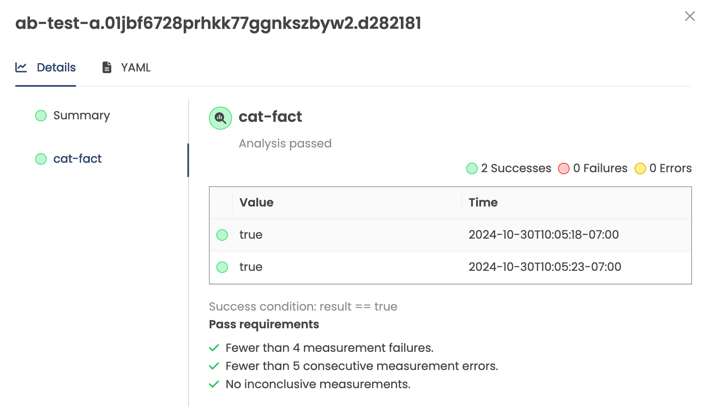

# Verifying Freight in a Stage

Following a successful `Promotion` (i.e. the _process_ succeeded), it is often
desired to assert whether updated code or configuration meets expectations.
Verification is an optional, user-defined process to test the `Freight` in a
given `Stage`. Common examples of verification include:

* Executing containerized integration test scripts
* Querying monitoring tools (e.g. DataDog, Prometheus) and measuring
  application KPIs
* Performing HTTP requests to internal services or systems and interpreting
  responses as success/fail
* Running load generation tests

When a `Stage` with verification is upstream from other `Stage`s, `Freight`
must pass verification there before becoming eligible to be promoted downstream.

## Configuring Verification

A `Stage` can be configured with verification by referencing one or more
`AnalysisTemplates` in its `spec.verification` field. In the following example
the `dev` `Stage` references an `AnalysisTemplate` named `integration-test`,
which executes after any successful `Promotion`:

```yaml
apiVersion: kargo.akuity.io/v1alpha1
kind: Stage
metadata:
  name: dev
  namespace: guestbook
spec:
  # ...
  verification:
    analysisTemplates:
    - name: integration-test
```

## Configuring AnalysisTemplates

An [AnalysisTemplate](../60-reference-docs/50-analysis-templates.md)
defines instructions for how to perform verification. It might include running
a Kubernetes `Job`, querying monitoring tools, interpreting their result,
performing HTTP requests, or any combination of these actions.
`AnalysisTemplate`s reside in the same project namespace as the `Stage` from
which they are referenced. The following simple `AnalysisTemplate` example wil
create a Kubernetes `Job` that runs an alpine container that sleeps for 10
seconds:

```yaml
apiVersion: argoproj.io/v1alpha1
kind: AnalysisTemplate
metadata:
  name: integration-test
  namespace: guestbook
spec:
  metrics:
  - name: integration-test
    provider:
      job:
        spec:
          template:
            spec:
              containers:
              - name: sleep
                image: alpine:latest
                command: [sleep, "10"]
              restartPolicy: Never
          backoffLimit: 1
```

:::info
For further documentation and examples of `AnalysisTemplate`s, refer to the
[`AnalysisTemplate` reference](../60-reference-docs/50-analysis-templates.md).
:::

## How Verification Works

After a successful `Promotion`, a `Stage` enters the `Verifying` phase. Any
`AnalysisTemplate`s which were referenced by the `Stage` are are used to spawn
a resource called an `AnalysisRun`, which represents a single execution of
those templates.

When the `AnalysisRun` completes and is `Successful`, the verification is
considered successful and the `Freight` is marked as "verified" in that `Stage`,
which makes it available for promotion to any immediate downstream `Stage`s,
either automatically (with auto-promotion) or manually (via the UI, API, or
CLI). `Freight` which have not passed verification in a `Stage` are blocked
from continuing further downstream.

:::tip
It is sometimes desired to skip the verification process entirely (e.g. a 
hotfix needs to be fast-tracked to production). Verification (and the entire
Pipeline for that matter) can be bypassed by
[manually approving](./50-working-with-freight.md#manual-approvals) `Freight`
for a specified `Stage`.
:::

While a `Stage` is verifying (i.e. the `AnalysisRun` is not yet completed) no
other `Promotion`s to that `Stage` will run until verification has completed
(either successfully or unsuccessfully). Once verification has completed, the
next queued `Promotion` will run.

## AnalysisRun

An `AnalysisRun` is a resource representing a verification attempt for a
`Freight` + `Stage` pair. `AnalysisRun`s have a lifecycle (e.g. `Running`,
`Successful`, `Failed`) and also record measurements taken during the run.
`AnalysisRun`s appear in the Kargo UI under the <Hlt>Verifications</Hlt> tab
of a `Stage`:



The following might be an example of an `AnalysisRun` spawned from the
`integration-test` template:

```yaml
apiVersion: argoproj.io/v1alpha1
kind: AnalysisRun
metadata:
  creationTimestamp: 2025-01-28T20:47:50Z
  generation: 3
  labels:
    kargo.akuity.io/freight-collection: 55d452301040a73e9fd05289b1f8ddbec1791222
    kargo.akuity.io/stage: dev
  annotations:
    kargo.akuity.io/promotion: dev.01jjpfgfwkzk18k7cyq61jehf4.319ddec
  name: dev.01jjqaq7qacfn766tcp1nqz2zv.55d4523
  namespace: guestbook
  ownerReferences:
    - apiVersion: kargo.akuity.io/v1alpha1
      blockOwnerDeletion: false
      kind: Freight
      name: 319ddec6bbfbd808d499a0357b027e773aa3707f
      uid: fb0db653-92af-420b-9092-0c7bf9be290e
  resourceVersion: "54013326"
  uid: 8cb745cb-554b-4141-80ee-e0df181cd56e
spec:
  metrics:
  - name: integration-test
    provider:
      job:
        spec:
          template:
            spec:
              containers:
              - name: sleep
                image: alpine:latest
                command: [sleep, "10"]
              restartPolicy: Never
          backoffLimit: 1
status:
  dryRunSummary: {}
  message: Metric "integration-test" assessed Failed due to failed (1) > failureLimit (0)
  metricResults:
    - count: 1
      failed: 1
      measurements:
        - finishedAt: 2025-01-28T20:50:31Z
          metadata:
            job-name: 8cb745cb-554b-4141-80ee-e0df181cd56e.integration-test.1
            job-namespace: guestbook
          phase: Failed
          startedAt: 2025-01-28T20:47:50Z
      name: integration-test
      phase: Failed
  phase: Failed
  runSummary:
    count: 1
    failed: 1
  startedAt: 2025-01-28T20:47:50Z
```

:::note
__`AnalysisTemplate` vs `AnalysisRun`__

An `AnalysisTemplate` _defines_ a verification process, while an `AnalysisRun`
tracks the _progress and result_ of an execution of that process.
:::

##  Arguments and Metadata

It is also possible to specify additional labels, annotations, and arguments
that should be applied to `AnalysisRun` resources spawned from the referenced
`AnalysisTemplate`:

```yaml
apiVersion: kargo.akuity.io/v1alpha1
kind: Stage
metadata:
  name: test
  namespace: kargo-demo
spec:
  # ...
  verification:
    analysisTemplates:
    - name: kargo-demo
    analysisRunMetadata:
      labels:
        foo: bar
      annotations:
        bat: baz
    args:
    - name: foo
      value: bar
```

The values specified in `args` support
[expressions](../60-reference-docs/40-expressions.md) to dynamically set values
based on the context of the `Freight` being verified.

For example, the following defines an argument `commit` with a value set to the
commit hash that is being verified using the
[`commitFrom` expression function](../60-reference-docs/40-expressions.md#commitfromrepourl-freightorigin):

```yaml
apiVersion: kargo.akuity.io/v1alpha1
kind: Stage
metadata:
  name: test
  namespace: kargo-demo
spec:
  # ...
  verification:
    analysisTemplates:
      - name: kargo-demo
    args:
      - name: commit
        value: ${{ commitFrom("https://github.com/example/repo.git").ID }}
```

:::caution
Kargo promotion processes require expressions to be enclosed within `${{ }}`,
Argo Rollouts `AnalysisTemplate`s require expressions to be enclosed within
`{{ }}` (i.e. without `$`).

Ensure that expressions are enclosed within the correct syntax for the
type of resource you are working with, recognizable by the `apiVersion` and
`kind` fields.
:::

## Implicit Argo CD Verification

It is usually desirable for changes to be fully rolled out before performing
any verification. For example, it would be premature to start running tests if
a `Deployment`'s `Pod`s were still starting or not fully transitioned to the
desired version. `Promotion`s that integrate with Argo CD do wait for any sync
operations they initiate to complete, but it is possible for an Argo CD
`Application` to still be `Progressing` even after sync operations have
completed and the `Promotion` process is considered complete.

In order to prevent verification from starting before `Application`s are ready,
Kargo has a built-in understanding of
[Argo CD `Application` health](https://argo-cd.readthedocs.io/en/latest/operator-manual/health/)
and will delay verification until `Application`s have reached a `Healthy` state.

:::note
If a `Stage` references one or more Argo CD `Application`s as part of its
promotion process, but does not explicitly define any verification process,
successful verification is implicitly contingent on the `Application`s reaching
a `Healthy` state.
:::

## Soak Times

In some scenarios, automated testing may be unavailable or insufficient to
ensure confidence before promoting software to critical environments. To
mitigate this, users often resort to letting the release run in a lower
environment for a period of time, monitoring its behavior and stability
before proceeding with promotion. This practice is commonly known as
"soaking" or "baking" the release before it reaches production.

`Stage`s may optionally specify a "soak time" when requesting `Freight` from
upstream `Stage`s. To configure this, a duration can be specified using the
`spec.requestedFreight[].requiredSoakTime` field. Valid durations are expressed
in seconds, minutes or hours (e.g. `180s`, `30m`, `48h`). This duration is the
minimum duration (following a successful promotion), for which the requested
`Freight` must have continuously occupied ("soaked in") in an upstream `Stage`
before becoming available for promotion to this `Stage`. Both automated and
manual promotions are blocked until the soak time requirement is met.

```yaml
apiVersion: kargo.akuity.io/v1alpha1
kind: Stage
metadata:
  name: prod
  namespace: guestbook
spec:
  requestedFreight:
  - origin:
      kind: Warehouse
      name: guestbook
    sources:
      stages:
      - uat
    requiredSoakTime: 1h
 # Omitted for brevity...
```

:::note
Soak time is not technically a verification feature, but is documented alongside
it because both relate to preventing `Freight` from moving downstream until
required conditions have been met. These two features may even be used in
conjunction with one another.
:::

:::info
[Manually approving](./50-working-with-freight.md#manual-approvals) `Freight`
for a `Stage` makes it immediately available to that `Stage` _regardless_ of
whether any required soak time has elapsed.
:::

## ClusterAnalysisTemplates

Referencing `ClusterAnalysisTemplate`s is currently unsupported but is expected
to be possible in a future release.
