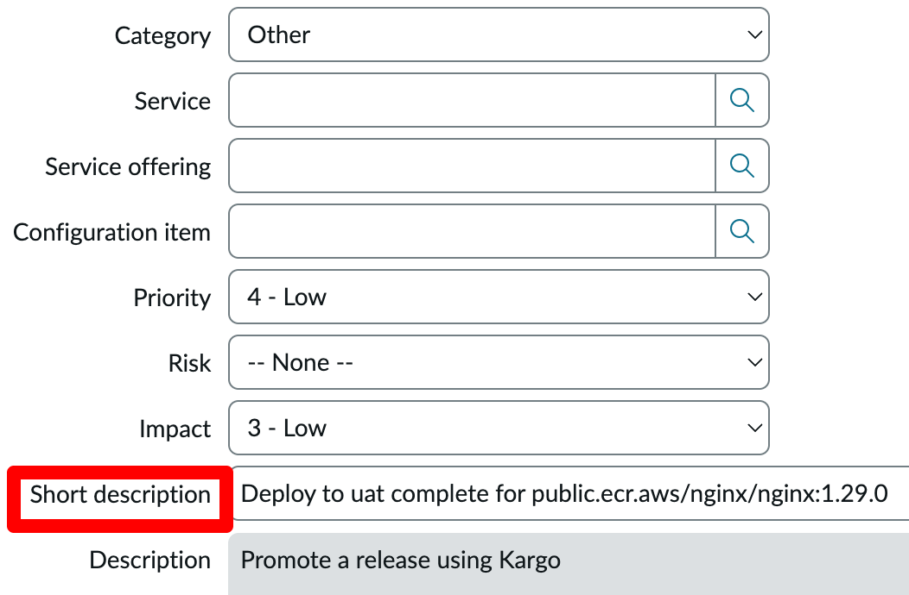
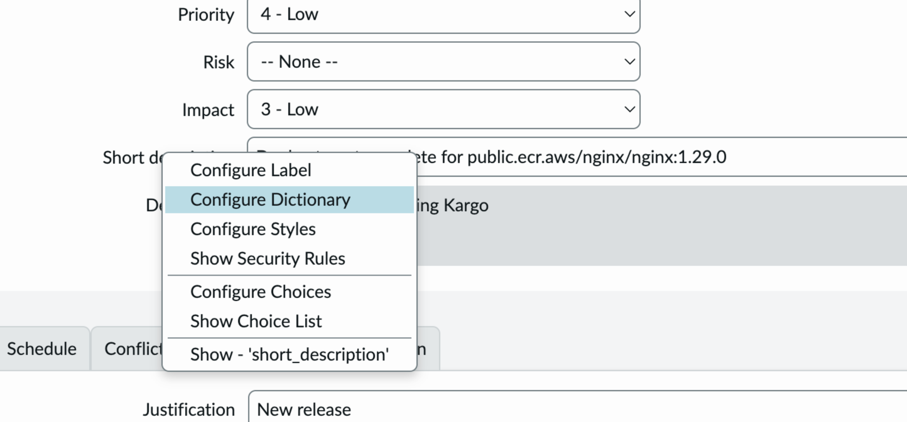
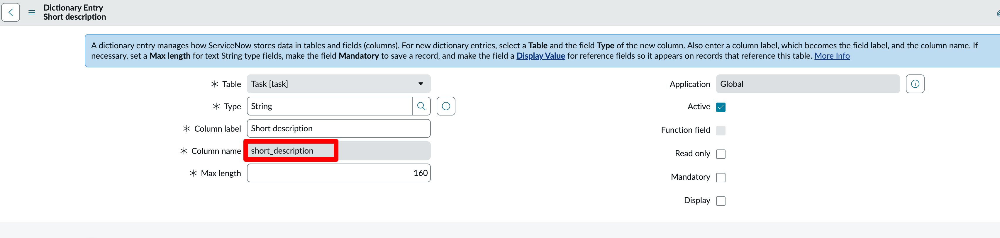
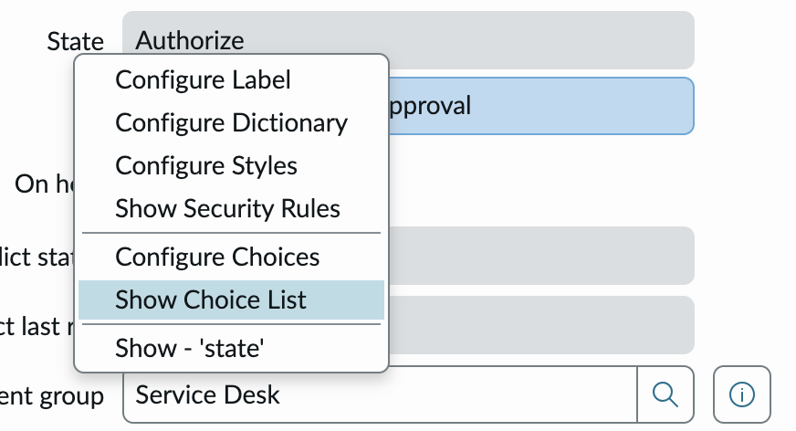
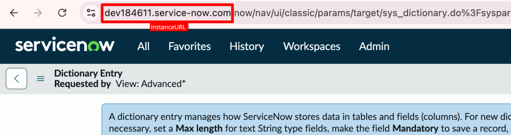

# `snow-update`

<span class="tag professional"></span>
<span class="tag beta"></span>

:::info
This promotion step is only available in Kargo on the
[Akuity Platform](https://akuity.io/akuity-platform), versions v1.9.0 and above.
:::

This page is for `snow-update` step. You can update a ServiceNow record using this step. Check below for other ServiceNow promotion steps.

ServiceNow integration for kargo is a group of promotion steps:  
1. [snow-create](./snow-create.md) 
2. [snow-update](./snow-update.md)
3. [snow-delete](./snow-delete.md)
4. [snow-query-for-records](./snow-query-for-records.md)
5. [snow-wait-for-condition](./snow-wait-for-condition.md)

These steps provide a comprehensive integration with ServiceNow, allowing you to create, update, delete, query for records, and track
promotion workflows. This is particularly useful for maintaining traceability between
your promotion processes and project management activities.

All the steps above support different record types in ServiceNow including managing Change Requests, Incidents, 
Problems etc.,. This integration also provides condition tracking through `snow-wait-for-condition`, making it a powerful tool 
for promotion workflows that require coordination with project management systems.

:::info
This step supports [Change Management API](https://www.servicenow.com/docs/bundle/zurich-api-reference/page/integrate/inbound-rest/concept/change-management-api.html) for managing Change Requests and [Table API](https://www.servicenow.com/docs/bundle/zurich-api-reference/page/integrate/inbound-rest/concept/c_TableAPI.html) for all record types. 
:::

## Finding field values for step configuration

Most of the time you cannot use the field labels you see in the ServiceNow UI as keys in the step configuration. 
For example, if you want to set the value for the “Short description” field:



You can't use `Short description` in the step configuration parameters. You need to use `short_description` as the key.
To find the correct key for a field, right-click on the field and click `Configure Dictionary`:



`column_name` is the key:



To see choices available for a particular field e.g., `State`, right click on the field and click on `Show Choice List` to see the available choices for use in the steps:



For example `New` is `-1` and `Scheduled` is `-2`


## Credentials

All ServiceNow operations require proper authentication credentials stored in a Kubernetes
`Secret`.

| Name                     | Type     | Required | Description                                                                                     |
| ------------------------ | -------- | -------- | ----------------------------------------------------------------------------------------------- |
| `credentials.secretName` | `string` | N        | Name of the `Secret` containing the ServiceNow credentials in the project namespace.            |
| `credentials.sharedSecretName` | `string` | N  | Name of the `Secret` containing the ServiceNow credentials in the `shared-resources-namespace`. |
| `credentials.type`       | `string` | Y        | Type of ServiceNow credentials to use for authentication (either `api-token` or `basic`).       |

:::info

Either `credentials.secretName` or `credentials.sharedSecretName` must be set, but not both.

:::

For `credentials.type: api-token` the referenced `Secret` should contain the following keys:

- `apiToken`: ServiceNow API Token (see [this blog post](https://www.servicenow.com/community/developer-advocate-blog/inbound-rest-api-keys/ba-p/2854924) for how to create an API token in ServiceNow).
- `instanceURL`: Your ServiceNow instance URL.



For `credentials.type: basic` the referenced `Secret` should contain the following keys:

- `username`: Username of the ServiceNow user (you may want to [create a user](https://www.servicenow.com/docs/bundle/zurich-platform-administration/page/administer/users-and-groups/task/t_CreateAUser.html) specifically for this integration).
- `password`: Password of the ServiceNow user (for how to set the password for a user, see [this](https://www.servicenow.com/docs/bundle/zurich-platform-security/page/integrate/authentication/task/reset-your-password.html)).
- `instanceURL`: Your ServiceNow instance URL.

## Configuration

| Name            | Type         | Required | Description                                                                                                                     |
| --------------- | ------------ | -------- | ------------------------------------------------------------------------------------------------------------------------------- |
| `parameters`    | `string map` | Y        | Parameters/fields of the record.                                                                                                |
| `tableName`     | `string`     | Y        | Table name of the record type you want to update (e.g., `incident`, `problem`, `change_request`).                              |
| `ticketId`      | `string`     | Y        | Ticket ID (`sys_id`) of the record you want to update.                                                                          |
| `template`      | `object`     | N        | Specify this to update a Change Request using the Change Management API (if omitted, the Table API is used).                    |
| `template.type` | `string`     | Y/N      | Template type (`standard`, `emergency`, or `normal`). Required if `template` is specified; otherwise optional.                 |

## Output

This step does not produce any output.

## Example

This example updates a Change Request using the Change Management API:

```yaml
steps:
  - as: snowupdate
    config:
      credentials:
        secretName: snow-creds
        type: api-token
      parameters:
        short_description: Update deployment for ${{ vars.imageRepo }}:${{
          imageFrom(vars.imageRepo).Tag }} to done
      tableName: change_request
      template:
        type: standard
      ticketId: 9d41c061c611228700edc88b231ec47c
    uses: snow-update
```

This example updates an Incident using the Table API:

```yaml
steps:
  - config:
      ticketId: ${{ task.outputs.snowquery.sys_id }}
      credentials:
        secretName: snow-creds
        type: api-token
      parameters:
        short_description: Update deployment incident for ${{ vars.imageRepo }}:${{ imageFrom(vars.imageRepo).Tag }} to resolved
      tableName: incident
    uses: snow-update
```

This example updates a Change Request using the Table API (notice how the `template` field is omitted):

```yaml
steps:
  - as: snowupdate
    config:
      credentials:
        secretName: snow-creds
        type: api-token
      parameters:
        short_description: Update deployment incident for ${{ vars.imageRepo }}:${{
          imageFrom(vars.imageRepo).Tag }} to resolved
      tableName: change_request
      ticketId: ${{ task.outputs.snowquery.sys_id }}
    uses: snow-update
```


## Different E2E Workflows

These examples demonstrate the different steps supported for ServiceNow integration.

### Change API Workflow

```yaml
  - as: snowcreate
    config:
      credentials:
        secretName: snow-creds
        type: api-token
      parameters:
        impact: "3"
        short_description: Deploy to ${{ ctx.stage }} complete for ${{ vars.imageRepo
          }}:${{ imageFrom(vars.imageRepo).Tag }}
        urgency: "3"
      tableName: change_request
      template:
        templateId: ed89b72c83c172104517e470ceaad30a
        type: standard
    uses: snow-create
  - as: snowquery
    config:
      credentials:
        namespace: kargo-demo
        secretName: snow-creds
        type: api-token
      query:
        number: ${{ task.outputs.snowcreate.number }}
      tableName: change_request
    uses: snow-query-records
  - as: snowupdate
    config:
      credentials:
        secretName: snow-creds
        type: api-token
      parameters:
        short_description: Update deployment for ${{ vars.imageRepo }}:${{
          imageFrom(vars.imageRepo).Tag }} to resolved
      tableName: change_request
      template:
        type: standard
      ticketId: ${{ task.outputs.snowquery.sys_id }}
    uses: snow-update
  - as: snow-wait-for-condition
    config:
      condition: state=-2
      credentials:
        namespace: kargo-demo
        secretName: snow-creds
        type: api-token
      tableName: change_request
      ticketId: ${{ task.outputs.snowquery.sys_id }}
    uses: snow-wait-for-condition
  - as: snowdelete
    config:
      credentials:
        secretName: snow-creds
        type: api-token
      tableName: change_request
      template:
        type: standard
      ticketId: ${{ task.outputs.snowquery.sys_id }}
    uses: snow-delete
```

### Table API Workflow

Here's a Table API workflow with Change Request:

```yaml
  - as: snowcreate
    config:
      credentials:
        secretName: snow-creds
        type: api-token
      parameters:
        impact: "3"
        short_description: Deploy to ${{ ctx.stage }} complete for ${{ vars.imageRepo
          }}:${{ imageFrom(vars.imageRepo).Tag }}
        urgency: "3"
      tableName: change_request
    uses: snow-create
  - as: snowquery
    config:
      credentials:
        namespace: kargo-demo
        secretName: snow-creds
        type: api-token
      query:
        number: ${{ task.outputs.snowcreate.number }}
      tableName: change_request
    uses: snow-query-records
  - as: snowupdate
    config:
      credentials:
        secretName: snow-creds
        type: api-token
      parameters:
        short_description: Update deployment incident for ${{ vars.imageRepo }}:${{
          imageFrom(vars.imageRepo).Tag }} to resolved
      tableName: change_request
      ticketId: ${{ task.outputs.snowquery.sys_id }}
    uses: snow-update
  - as: snow-wait-for-condition
    config:
      condition: state=-2
      credentials:
        namespace: kargo-demo
        secretName: snow-creds
        type: api-token
      tableName: change_request
      ticketId: ${{ task.outputs.snowquery.sys_id }}
    uses: snow-wait-for-condition
  - as: snowdelete
    config:
      credentials:
        secretName: snow-creds
        type: api-token
      tableName: change_request
      ticketId: ${{ task.outputs.snowquery.sys_id }}
    uses: snow-delete
```