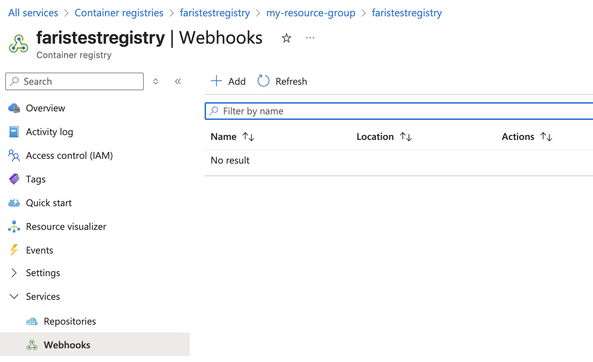
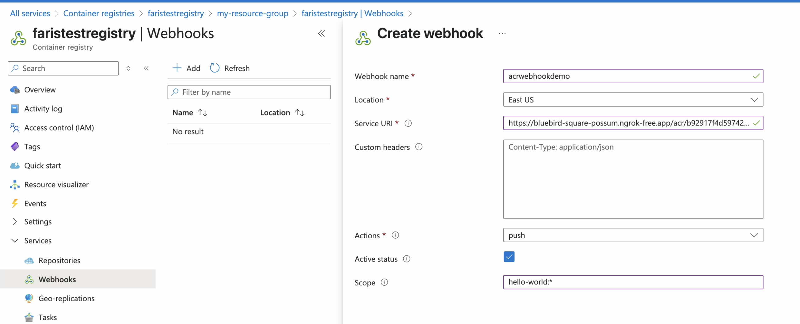
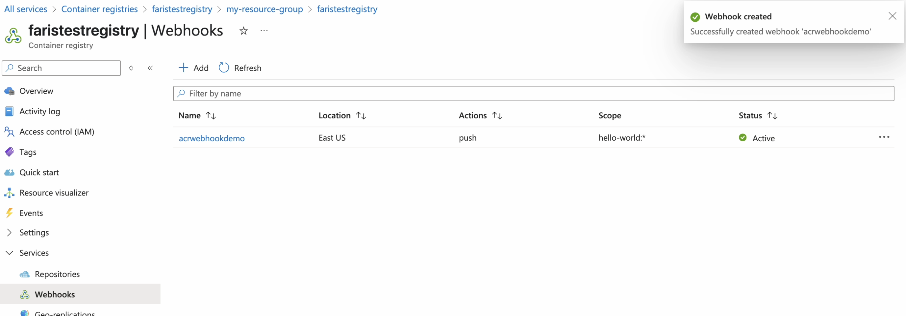
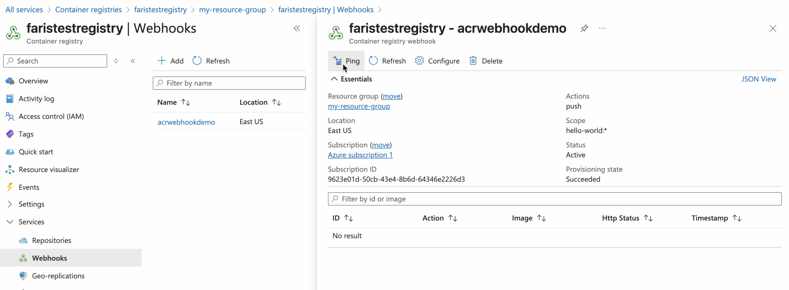
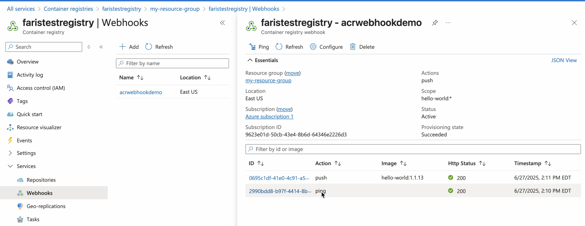

# ACR Webhook Receiver

The ACR webhook receiver responds to push and ping events originating
from Azure Container Registry repositories.

The receiver unconditionally responds to `ping` events with an HTTP `200` status
code.

The receiver responds to `push` events by _refreshing_ all `Warehouse` resources
subscribed to the repositories that correspond to the event.

:::info
"Refreshing" a `Warehouse` resource means enqueuing it for immediate
reconciliation by the Kargo controller, which will execute the discovery of new
artifacts from all repositories to which that `Warehouse` subscribes.
:::

## Configuring the Receiver

An ACR webhook receiver must reference a Kubernetes `Secret` resource with a
`secret-token` key in its data map.

:::info
_This secret will not be shared directly with Azure Container Registry._

ACR does not natively implement any mechanism whereby receivers may
authenticate inbound webhook requests. To compensate for this, Kargo
incorporates the secret into the generation of a hard-to-guess URL for the
receiver. This URL serves as a _de facto_
[shared secret](https://en.wikipedia.org/wiki/Shared_secret) and authentication
mechanism.
:::

:::note
The following commands are suggested for generating and base64-encoding a
complex secret:

```shell
secret_token=$(openssl rand -base64 48 | tr -d '=+/' | head -c 32)
echo "Secret token: $secret_token"
echo "Encoded secret token: $(echo -n $secret_token | base64)"
```
:::

```yaml
apiVersion: kargo.akuity.io/v1alpha1
kind: Project
metadata:
  name: kargo-demo
---
apiVersion: v1
kind: Secret
metadata:
  name: acr-wh-secret
  namespace: kargo-demo
data:
  secret-token: <base64-encoded secret token>
---
apiVersion: kargo.akuity.io/v1alpha1
kind: ProjectConfig
metadata:
  name: kargo-demo
  namespace: kargo-demo
spec:
  webhookReceivers: 
    - name: acr-wh-receiver
      acr:
        secretRef:
          name: acr-wh-secret
```

## Retrieving the Receiver's URL

Kargo will generate a hard-to-guess URL from the receiver's configuration. This
URL can be obtained using a command such as the following:

```shell
kubectl get projectconfigs kargo-demo \
  -n kargo-demo \
  -o=jsonpath='{.status.webhookReceivers}'
```

## Registering with ACR

1. In your <Hlt>Azure portal</Hlt>, on the left-hand side, click on 
<Hlt>Services</Hlt>.

1. Click on <Hlt>Webhooks</Hlt>.

1. Now in your <Hlt>Webhooks dashboard</Hlt>, click <Hlt>Add</Hlt> at the top of 
the screen.

    

1. Fill out the <Hlt>Create webhook</Hlt> form.

    

    1. Enter a descriptive name in the <Hlt>Webhook name</Hlt> field.

    1. Select the <Hlt>Location</Hlt> closest to where your Kargo instance
       is running.

    1. Complete the <Hlt>Service URI</Hlt> filed using the URL
       [for the webhook receiver](#retrieving-the-receivers-url).

    1. From the <Hlt>Actions</Hlt> drop-down menu, select `push`.

    1. Ensure <Hlt>Active</Hlt> is checked.

    1. Set the <Hlt>Scope</Hlt> using the format `<repository>:<tag>`.

    1. Click <Hlt>Create</Hlt>.

:::note
Wild-cards are supported in both the `repository` and `tag` part of the 
<Hlt>Scope</Hlt>
string.
:::

    1. Back in your <Hlt>Webhooks dashboard</Hlt>, click on the newly created
    webhook.

    

    1. Click <Hlt>Ping</Hlt>.

    1. Click <Hlt>Refresh</Hlt>.

    

    1. Confirm a 200 <Hlt>Http Status</Hlt> for the <Hlt>Ping</Hlt> action.

    


:::info
For additional information on configuring ACR webhooks, refer directly to
the [ACR Docs](https://learn.microsoft.com/en-us/azure/container-registry/container-registry-webhook#create-webhook---azure-portal).
:::
