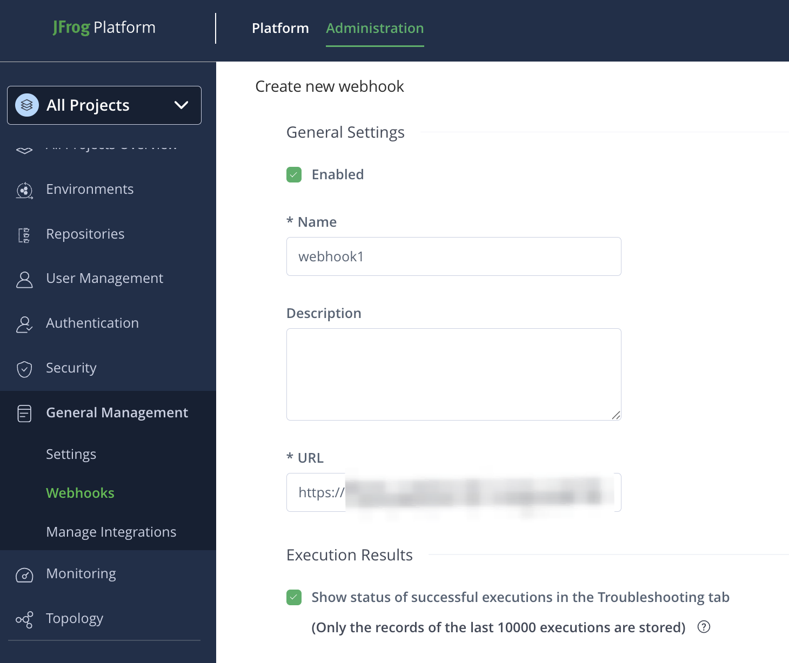

# Artifactory Webhook Receiver

The Artifactory Webhook Receiver responds to `pushed` events originating from 
Artifactory repositories by _refreshing_ all `Warehouse` resources subscribed to 
those repositories.

:::warning
This webhook receiver does not respond to events where `domain` is `artifact`
and `event_type` is `deployed`.
:::

:::info
"Refreshing" a `Warehouse` resource means enqueuing it for immediate
reconciliation by the Kargo controller, which will execute the discovery of
new artifacts from all repositories to which that `Warehouse` subscribes.
:::

## Configuring the Receiver

An Artifactory webhook receiver must reference a Kubernetes `Secret` resource 
with a `secret-token` key in its data map. This
[shared secret](https://en.wikipedia.org/wiki/Shared_secret) will be used by
Artifactory to sign requests and by the receiver to verify those signatures.

:::note
The following commands are suggested for generating and base64-encoding a
complex secret:

```shell
secret_token=$(openssl rand -base64 48 | tr -d '=+/' | head -c 32)
echo "Secret token: $secret_token"
echo "Encoded secret token: $(echo -n $secret_token | base64)"
```
:::

```yaml
apiVersion: v1
kind: Secret
metadata:
  name: artifactory-wh-secret
  namespace: kargo-demo
  labels:
    kargo.akuity.io/cred-type: generic
data:
  secret-token: <base64-encoded secret token>
---
apiVersion: kargo.akuity.io/v1alpha1
kind: ProjectConfig
metadata:
  name: kargo-demo
  namespace: kargo-demo
spec:
  webhookReceivers: 
  - name: artifactory-wh-receiver
    artifactory:
      secretRef:
        name: artifactory-wh-secret
```

## Retrieving the Receiver's URL

Kargo will generate a hard-to-guess URL from the receiver's configuration. This
URL can be obtained using a command such as the following:

```shell
kubectl get projectconfigs kargo-demo \
  -n kargo-demo \
  -o=jsonpath='{.status.webhookReceivers}'
```

## Registering with Artifactory

1. Navigate to 
   `https://<jfrog-instance>.jfrog.io/ui/admin/configuration/webhooks`, where
   `<jfrog-instance>` has been replaced with an Artifactory instance for which 
   you are an administrator.

1. Click <Hlt>New Webhook</Hlt>.

    

1. Complete the <Hlt>Create new webhook</Hlt> form:

    

    1. Enter a descriptive name in the <Hlt>Name</Hlt> field.

    1. Complete the <Hlt>URL</Hlt> field using the URL
       [for the webhook receiver](#retrieving-the-receivers-url).

    1. Under <Hlt>Execution Results</Hlt> check
       <Hlt>Show status of successful executions in the Troubleshooting tab</Hlt>.

        :::info
        Although Artifactory supports sending test events to the URL, such
        events are _not_ displayed in the troubleshooting tab; only actual
        events are.
        :::

    1. Under <Hlt>Events</Hlt>, select
       <Hlt>Docker and OCI</Hlt> ⃗ <Hlt>Tag was pushed</Hlt>.

        

        :::info
        Artifactory supports many different types of registries and repositories.
        This webhook responds only to events originating from repositories in OCI
        registries. No other type of repository, including legacy (HTTP/S) Helm
        chart repositories, is supported.
        :::

    1. Complete the dialog that appears:

       

        1. Check boxes corresponding to repositories from which you would like
           to receive events.

        1. Click <Hlt>></Hlt> to move selected repositories into the selected window.

            Upon moving repositories to the selected section, the
            <Hlt>Save</Hlt> button will be enabled.

            

        1. Click <Hlt>Save</Hlt>.

    1. Under <Hlt>Authentication</Hlt>, complete the <Hlt>Secret token</Hlt>
       field using the (unencoded) value of the `secret-token` key in the
       `Secret` resource referenced by the
       [webhook receiver's configuration](#configuring-the-receiver).

        

    1. Select <Hlt>Use secret for payload signing</Hlt>.

        :::caution
        The webhook receiver won't accept unsigned requests.
        :::

    1. Click <Hlt>Save</Hlt>.

        You will be redirected to the <Hlt>Webhooks Dashboard</Hlt> where the newly
        created webhook will appear.

        