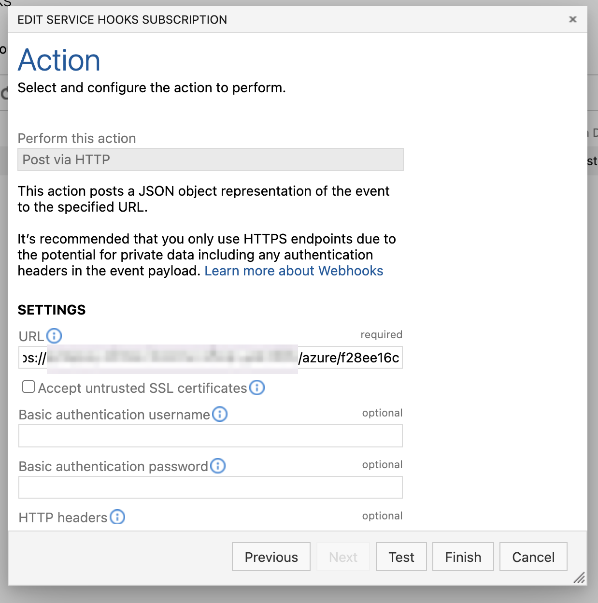

# Azure Webhook Receiver

The Azure webhook receiver responds to `push` and `ping` events originating
from Azure Container Registry repositories and `git.push` events originating
from Azure DevOps repositories.

The receiver unconditionally responds to `ping` events with an HTTP `200` status
code.

The receiver responds to `push` and `git.push` events by _refreshing_ all
`Warehouse` resources subscribed to the repositories that correspond to the
event.

:::info

"Refreshing" a `Warehouse` resource means enqueuing it for immediate
reconciliation by the Kargo controller, which will execute the discovery of new
artifacts from all repositories to which that `Warehouse` subscribes.

:::

## Configuring the Receiver

An Azure webhook receiver must reference a Kubernetes `Secret` resource with a
`secret` key in its data map.

:::info

_This secret will not be shared directly with Azure._

Azure does not natively implement any mechanism whereby receivers may
authenticate inbound webhook requests. To compensate for this, Kargo
incorporates the secret into the generation of a hard-to-guess URL for the
receiver. This URL serves as a _de facto_
[shared secret](https://en.wikipedia.org/wiki/Shared_secret) and authentication
mechanism.

:::

:::note

The following commands are suggested for generating and base64-encoding a
complex secret:

```shell
secret=$(openssl rand -base64 48 | tr -d '=+/' | head -c 32)
echo "Secret: $secret"
echo "Encoded secret: $(echo -n $secret | base64)"
```

:::

```yaml
apiVersion: v1
kind: Secret
metadata:
  name: azure-wh-secret
  namespace: kargo-demo
  labels:
    kargo.akuity.io/cred-type: generic
data:
  secret: <base64-encoded secret>
---
apiVersion: kargo.akuity.io/v1alpha1
kind: ProjectConfig
metadata:
  name: kargo-demo
  namespace: kargo-demo
spec:
  webhookReceivers: 
  - name: azure-wh-receiver
    azure:
      secretRef:
        name: azure-wh-secret
```

## Retrieving the Receiver's URL

Kargo will generate a hard-to-guess URL from the receiver's configuration. This
URL can be obtained using a command such as the following:

```shell
kubectl get projectconfigs kargo-demo \
  -n kargo-demo \
  -o=jsonpath='{.status.webhookReceivers}'
```

## Registering with Azure

The Azure webhook receiver supports both Azure Container Registry and Azure
DevOps services.

### Azure Container Registry

1. In your <Hlt>Azure Container Registry</Hlt> portal, on the left-hand side,
   navigate to <Hlt>Services</Hlt> → <Hlt>Webhooks</Hlt>.

1. At the top of the screen, click <Hlt>Add</Hlt>.

    

1. Complete the <Hlt>Create webhook</Hlt> form:

    

    1. Enter a descriptive name in the <Hlt>Webhook name</Hlt> field.

    1. Select the <Hlt>Location</Hlt> closest to where your Kargo instance
       is running.

    1. Complete the <Hlt>Service URI</Hlt> field using the URL
       [for the webhook receiver](#retrieving-the-receivers-url).

    1. From the <Hlt>Actions</Hlt> drop-down menu, select `push`.

    1. Ensure <Hlt>Active</Hlt> is checked.

    1. Set the <Hlt>Scope</Hlt> using the format `<repository>:<tag>`.

        :::note

        Wildcards are supported in both the `repository` and `tag` part of the
        <Hlt>Scope</Hlt> string.
        :::

    1. Click <Hlt>Create</Hlt>.

    1. Return to the <Hlt>Webhooks dashboard</Hlt> and select the newly created
       webhook.

       

    1. Click <Hlt>Ping</Hlt>.

    1. Click <Hlt>Refresh</Hlt>.

       

    1. Confirm a 200 <Hlt>Http Status</Hlt> for the <Hlt>Ping</Hlt> action.

       

:::info

For additional information on configuring ACR webhooks, refer directly to
the [ACR Docs](https://learn.microsoft.com/en-us/azure/container-registry/container-registry-webhook#create-webhook---azure-portal).

:::

### Azure DevOps

1. Navigate to `https://dev.azure.com/<org>/<project>/_settings/serviceHooks`,
   where`<org>` has been replaced with an organization name
   and `<project>` has been replaced with the name of a project belonging
   to that account and for which you are an administrator.

1. On the left-hand-side menu under <Hlt>General</Hlt>, click
   <Hlt>Service Hooks</Hlt>.

1. Click <Hlt>Create Subscription</Hlt>.

    

1. In the <Hlt>New Service Hooks Subscription</Hlt> modal, scroll down to
   <Hlt>Webhooks</Hlt> on the left-hand-side.

1. Click <Hlt>Webhooks</Hlt>.

1. Click <Hlt>Next</Hlt>.

  

1. Complete the <Hlt>Trigger</Hlt> form:

    

    1. Select <Hlt>Code Pushed</Hlt> from the drop-down menu labeled
       <Hlt>Trigger on this type of event</Hlt>.

    1. Select the <Hlt>Repositories</Hlt>, <Hlt>Branches</Hlt>, and
       <Hlt>Users</Hlt> for which the event will trigger for.

    1. Click <Hlt>Next</Hlt>.

1. Complete the Action form:

    

    1. Complete the <Hlt>Service URI</Hlt> field
       using the URL [for the webhook receiver](#retrieving-the-receivers-url).

    1. Click <Hlt>Test</Hlt>.

       

1. After receiving a <Hlt>Succeeded</Hlt> notification, click <Hlt>Close</Hlt>.

1. Click <Hlt>Finish</Hlt>.

:::info

For additional information on configuring Azure DevOps webhooks, refer directly
to the
[Azure DevOps Docs](https://learn.microsoft.com/en-us/azure/devops/service-hooks/services/webhooks?view=azure-devops).

:::
