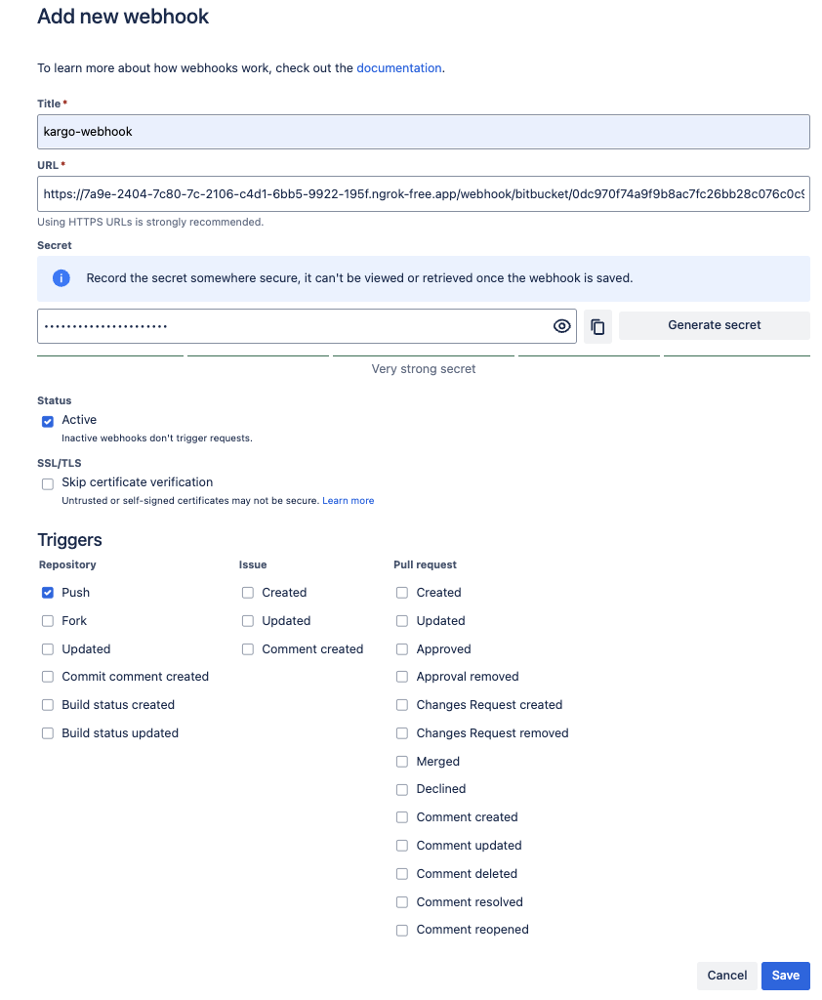
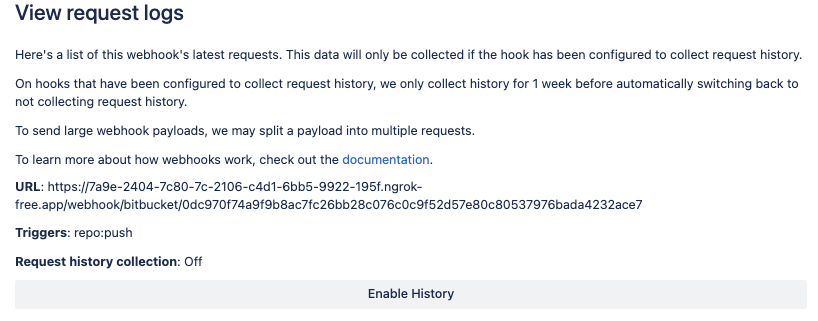
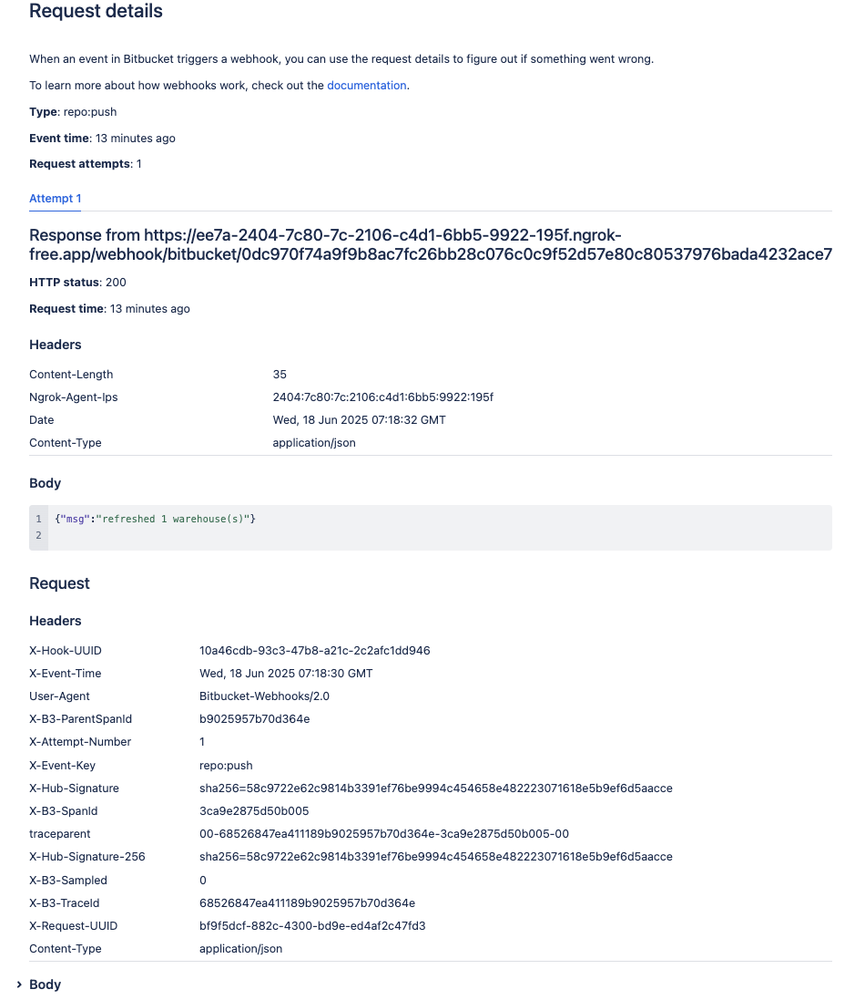

# The Bitbucket Webhook Receiver

The Bitbucket Webhook Receiver will respond to `repo:push` events originating from
Bitbucket repositories.

In response to a `repo:push` event, the receiver "refreshes" `Warehouse's`
subscribed to the Bitbucket repository from which the event originated.

:::info
"Refreshing" a `Warehouse` resource means enqueuing it for immediate
reconciliation by the Kargo controller, which will execute the discovery of
new artifacts from all repositories to which that `Warehouse` subscribes.
:::

## Configuring the Receiver

The Bitbucket webhook receiver will need to reference a Kubernetes `Secret` with a
`secret` key in its data map. This [shared
secret](https://en.wikipedia.org/wiki/Shared_secret) will be used by Bitbucket to
sign requests. The receiver will use it to authenticate those requests by
verifying their signatures.

:::note
The following command is suggested for generating a complex secret:

```shell
openssl rand -base64 48 | tr -d '=+/' | head -c 32
```
:::

```yaml
apiVersion: v1
kind: Secret
metadata:
  name: bb-wh-secret
  namespace: kargo-demo
stringData:
  secret: <your-secret-here>
---
apiVersion: kargo.akuity.io/v1alpha1
kind: ProjectConfig
metadata:
  name: kargo-demo
  namespace: kargo-demo
spec:
  webhookReceivers: 
  - name: bb-wh-receiver
    bitbucket:
      secretRef:
        name: bb-wh-secret
```

## Retrieving the Receiver's URL

Kargo will generate a hard-to-guess URL from the configuration. We can obtain 
this URL using the following command:

```
kubectl \
    get projectconfigs \
    kargo-demo \
    -n kargo-demo \
    -o=jsonpath='{.status.webhookReceivers}'
```

## Registering with Bitbucket

1. Navigate to
   `https://bitbucket.org/<workspace>/<repository_name>/admin/webhooks` where
   `<workspace>` has been replaced with your Bitbucket workspace for which you
   are an administrator and `<repository_name>` has been replaced with the name
   of a repository belonging to that workspace.

1. Click the <Hlt>Add webhook</Hlt> button to create a webhook for the repository.

1. Complete the <Hlt>Add new webhook</Hlt> form:
   
   1. Enter a <Hlt>Title</Hlt> with a short description.
   
   1. Set <Hlt>URL</Hlt> to the URL [for the webhook
      receiver](#retrieving-the-receivers-url).

   1. Set <Hlt>Secret</Hlt> to the value assigned to the `secret` key
      of the `Secret` referenced by the [webhook receiver's
      configuration](https://main.docs.kargo.io/user-guide/reference-docs/webhook-receivers/github/#configuring-the-receiver).
    
      :::note
      Do not use the **Generate secret** button in the Bitbucket UI. Instead,
      define the secret yourself and use the same value when configuring the
      receiver. This ensures the webhook URL remains consistent and avoids the
      need to reconfigure it later.
      :::
   
   1. (Optional) If you're using a self-signed certificate and want to disable certificate verification, select <Hlt>Skip certificate verification</Hlt>.

   1. By default, the trigger for the Bitbucket webhook is a repository push, as demonstrated by the **Repository push** field.

   1. Click <Hlt>Save</Hlt>.

    

1. Verify that the webhook appears under <Hlt>Repository hook</Hlt>.. 
   
   1. Click on <Hlt>View requests</Hlt> under <Hlt>Actions</Hlt>
   
   1. In the <Hlt> View request logs </Hlt> page, click on <Hlt>Enable History</Hlt>.
   
   

1. Verify connectivity: To test the connectivity, push your changes to the Bitbucket repository that the Warehouse is subscribed to. Once the changes have been pushed, the <Hlt>Request details</Hlt> page will indicate that a successful response was returned.

  

When these steps are complete, the repository will send events to the webhook
receiver.

:::info
For additional information on configuring webhooks, refer directly to the
[Bitbucket Docs](https://support.atlassian.com/bitbucket-cloud/docs/manage-webhooks/).
:::
