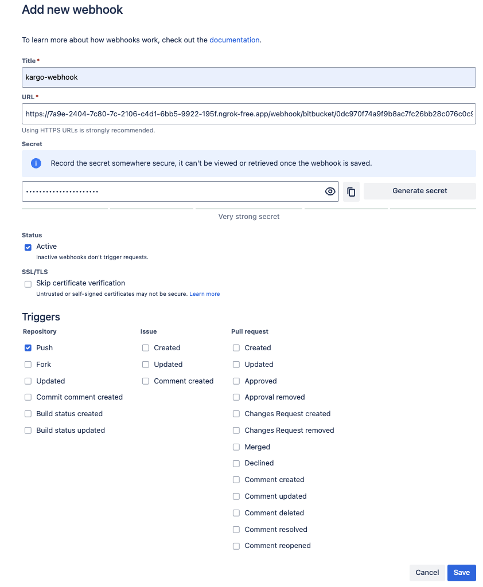
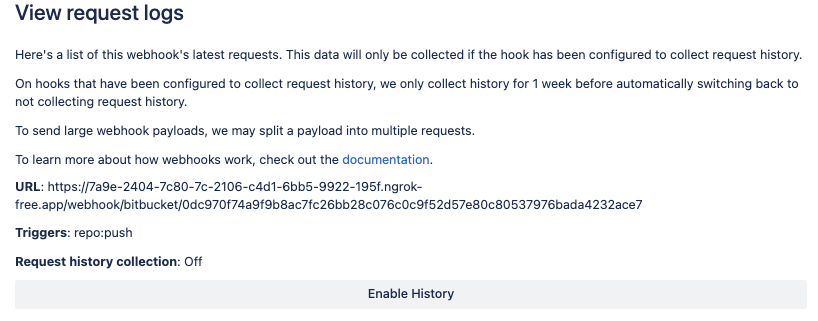

# Bitbucket Webhook Receiver

The Bitbucket webhook receiver responds to `repo:push` events originating from
Bitbucket repositories by _refreshing_ all `Warehouse` resources subscribed to
those repositories.

:::info

"Refreshing" a `Warehouse` resource means enqueuing it for immediate
reconciliation by the Kargo controller, which will execute the discovery of new
artifacts from all repositories to which that `Warehouse` subscribes.

:::

:::info

The Bitbucket webhook receiver also works with Bitbucket Server and Bitbucket
Data Center, although some URLs in this document may need to be adjusted
accordingly.

:::

## Configuring the Receiver

A Bitbucket webhook receiver must reference a Kubernetes `Secret` resource with
a `secret` key in its data map. This
[shared secret](https://en.wikipedia.org/wiki/Shared_secret) will be used by
Bitbucket to sign requests and by the receiver to verify those signatures.

:::note

The following commands are suggested for generating and base64-encoding a
complex secret:

```shell
secret=$(openssl rand -base64 48 | tr -d '=+/' | head -c 32)
echo "Secret: $secret"
echo "Encoded secret: $(echo -n $secret | base64)"
```

:::

```yaml
apiVersion: v1
kind: Secret
metadata:
  name: bb-wh-secret
  namespace: kargo-demo
  labels:
    kargo.akuity.io/cred-type: generic
data:
  secret: <base64-encoded secret>
---
apiVersion: kargo.akuity.io/v1alpha1
kind: ProjectConfig
metadata:
  name: kargo-demo
  namespace: kargo-demo
spec:
  webhookReceivers: 
  - name: bb-wh-receiver
    bitbucket:
      secretRef:
        name: bb-wh-secret
```

## Retrieving the Receiver's URL

Kargo will generate a hard-to-guess URL from the receiver's configuration. This
URL can be obtained using a command such as the following:

```shell
kubectl get projectconfigs kargo-demo \
  -n kargo-demo \
  -o=jsonpath='{.status.webhookReceivers}'
```

## Registering with Bitbucket

To configure a single Bitbucket repository to notify a receiver of `repo:push`
events:

1. Navigate to
   `https://bitbucket.org/<workspace>/<repository>/admin/webhooks` where
   `<workspace>` has been replaced with a Bitbucket workspace and `<repository>`
   has been replaced with the name of a repository belonging to that workspace
   and for which you are an administrator.

1. Click <Hlt>Add webhook</Hlt>.

1. Complete the <Hlt>Add new webhook</Hlt> form:

    

    1. Enter a descriptive name in the <Hlt>Title</Hlt> field.

    1. Complete the <Hlt>URL</Hlt> field using the URL
       [for the webhook receiver](#retrieving-the-receivers-url).

    1. Complete the <Hlt>Secret</Hlt> field using the (unencoded) value assigned
       to the `secret` key of the `Secret` resource referenced by the
       [webhook receiver's configuration](#configuring-the-receiver).

        :::danger

        Do not use the <Hlt>Generate secret</Hlt> button in the Bitbucket UI.

        Kargo incorporates the secret's value into the URL it generates for the
        webhook receiver. Using a secret in this field other than the one
        already referenced by the receiver's configuration will require
        revisiting that configuration _and doing so will change the receiver's
        URL._
        :::

    1. Under <Hlt>Status</Hlt>, ensure <Hlt>Active</Hlt> is selected.

    1. Under <Hlt>Triggers</Hlt> → <Hlt>Repository</Hlt>, ensure <Hlt>Push</Hlt>
       is selected.

    1. Click <Hlt>Save</Hlt>.

1. Verify that the new webhook appears under <Hlt>Repository hooks</Hlt>.

1. If you'd like to record outbound webhook requests for troubleshooting
   purposes:

    1. Click the <Hlt>View requests</Hlt> link next to your webhook.

    1. Click on <Hlt>Enable History</Hlt>.

    

When these steps are complete, the repository will send events to the webhook
receiver.

:::info

For additional information on configuring webhooks, refer directly to the
[Bitbucket Docs](https://support.atlassian.com/bitbucket-cloud/docs/manage-webhooks/).

:::
