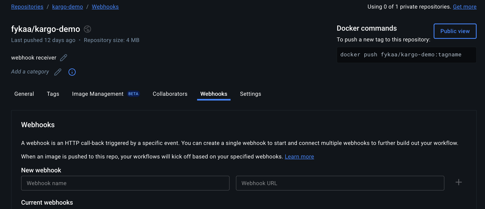
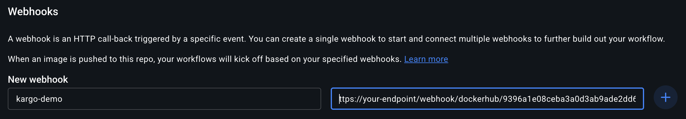
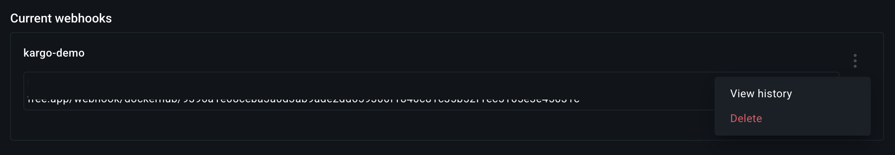
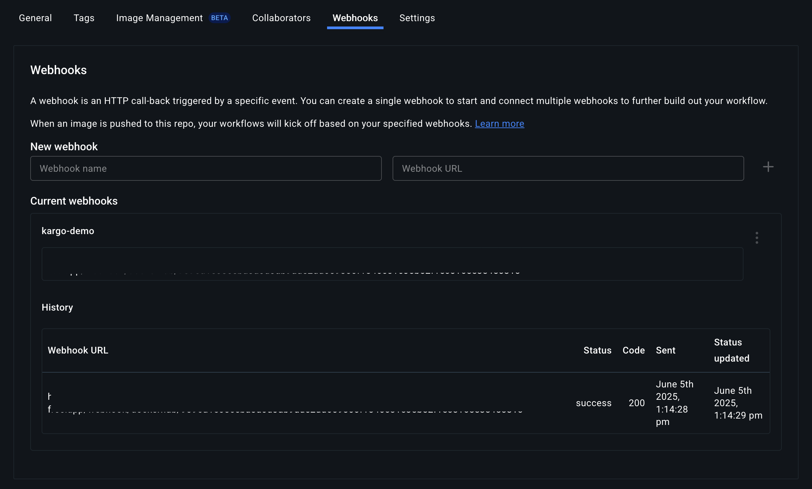

# Docker Hub Webhook Receiver

The Docker Hub Webhook Receiver responds to `push` events originating from
Docker Hub repositories.

In response to a `push` event, the receiver "refreshes" `Warehouse` resources
subscribed to the corresponding Docker Hub repository.

:::info
"Refreshing" a `Warehouse` means enqueuing it for immediate reconciliation by
the Kargo controller, which will attempt to discover new artifacts from all
subscribed repositories.
:::

:::note
Docker Hub webhook payloads are **not** signed. Kargo uses a static token for
basic validation.
:::

## Configuring the Receiver

To enable webhook support for Docker Hub, you must configure a Kubernetes
`Secret` and reference it in your `ProjectConfig`.

The `Secret` must include a `secret` key under `stringData`. This value is used
to generate a unique, hard-to-guess URL for the webhook receiver, providing
basic protection against unauthorized requests.

```yaml
apiVersion: v1
kind: Secret
metadata:
  name: dh-wh-secret
  namespace: kargo-demo
stringData:
  secret: <your-static-token-here>
```

Next, reference this `Secret` in your `ProjectConfig`:

```yaml
apiVersion: kargo.akuity.io/v1alpha1
kind: ProjectConfig
metadata:
  name: kargo-demo
  namespace: kargo-demo
spec:
  webhookReceivers:
    - name: dockerhub-receiver
      dockerhub:
        secretRef:
          name: dh-wh-secret
```

## Retrieving the Receiver's URL

After applying the `ProjectConfig`, you can retrieve the unique URL for the
Docker Hub webhook receiver using the following command:

```shell
kubectl get projectconfigs kargo-demo \
  -n kargo-demo \
  -o=jsonpath='{.status.webhookReceivers}'
```

## Registering with Docker Hub

To configure a Docker Hub repository to send events to the webhook receiver:

1. Navigate to your Docker Hub repository and select the <Hlt>Webhooks</Hlt> tab.

   

1. In the <Hlt>Webhooks</Hlt> form:

   

   1. Provide a name for the webhook.

   1. Set <Hlt>Webhook URL</Hlt> to the
      [receiver URL](#retrieving-the-receivers-url).

   1. Click <Hlt>+</Hlt> to create webhook.

      

## Verifying Webhook Delivery

To verify your webhook is correctly registered and working as expected, after
pushing a new image to your Docker Hub repository:

1. Return to the <Hlt>Webhooks</Hlt> tab of your repository.

1. In the <Hlt>Current Webhooks</Hlt> section, hover over your webhook, select
the *menu options* icon, and click <Hlt>View History</Hlt>.

   

1. Check the delivery log to confirm a successful webhook request.

   

   Ensure the response status is `200 OK`.

When these steps are complete, Kargo will automatically refresh the
corresponding `Warehouse` and initiate artifact discovery from your updated
Docker Hub repository.
