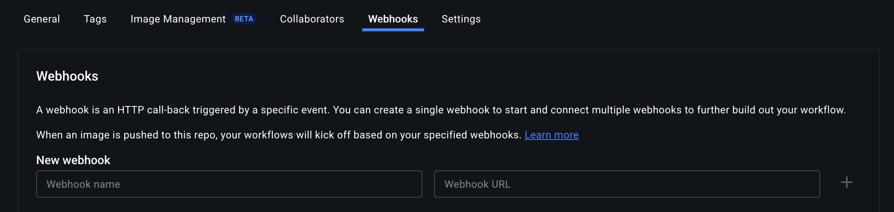

# Docker Hub Webhook Receiver

The Docker Hub webhook receiver responds to events originating from Docker Hub
repositories by _refreshing_ all `Warehouse` resources subscribed to those
repositories.

:::info

"Refreshing" a `Warehouse` resource means enqueuing it for immediate
reconciliation by the Kargo controller, which will execute the discovery of new
artifacts from all repositories to which that `Warehouse` subscribes.

:::

## Configuring the Receiver

A Docker Hub webhook receiver must reference a Kubernetes `Secret` resource with
a `secret` key in its data map.

:::info

_This secret will not be shared directly with Docker Hub._

Docker Hub does not natively implement any mechanism whereby receivers may
authenticate inbound webhook requests. To compensate for this, Kargo
incorporates the secret into the generation of a hard-to-guess URL for the
receiver. This URL serves as a _de facto_
[shared secret](https://en.wikipedia.org/wiki/Shared_secret) and authentication
mechanism.

:::

:::note

The following commands are suggested for generating and base64-encoding a
complex secret:

```shell
secret=$(openssl rand -base64 48 | tr -d '=+/' | head -c 32)
echo "Secret: $secret"
echo "Encoded secret: $(echo -n $secret | base64)"
```

:::

```yaml
apiVersion: v1
kind: Secret
metadata:
  name: dh-wh-secret
  namespace: kargo-demo
  labels:
    kargo.akuity.io/cred-type: generic
data:
  secret: <base64-encoded secret>
---
apiVersion: kargo.akuity.io/v1alpha1
kind: ProjectConfig
metadata:
  name: kargo-demo
  namespace: kargo-demo
spec:
  webhookReceivers:
    - name: dh-wh-receiver
      dockerhub:
        secretRef:
          name: dh-wh-secret
```

## Retrieving the Receiver's URL

Kargo will generate a hard-to-guess URL from the receiver's configuration. This
URL can be obtained using a command such as the following:

```shell
kubectl get projectconfigs kargo-demo \
  -n kargo-demo \
  -o=jsonpath='{.status.webhookReceivers}'
```

## Registering with Docker Hub

To configure a single Docker Hub repository to notify a receiver when objects
(like container images or Helm charts) have been pushed to it:

1. Navigate to a Docker Hub repository for which you are an administrator.

1. Select the <Hlt>Webhooks</Hlt> tab.

   

1. Complete the <Hlt>New webhook</Hlt> form:

    

    1. Enter a descriptive name in the <Hlt>Webhook name</Hlt> field.

    1. Complete the <Hlt>Webhook URL</Hlt> field using the URL
       [for the webhook receiver](#retrieving-the-receivers-url).

    1. Click <Hlt>+</Hlt>.

    

1. Verify the new webhook appears under <Hlt>Current webhooks</Hlt>.

:::note

If you'd like to review outbound webhook requests for troubleshooting purposes,
select the three dots to the right of a webhook, then select
<Hlt>View history</Hlt> from the context menu.

:::

When these steps are complete, the repository will send events to the webhook
receiver.

:::info

For additional information on configuring webhooks, refer directly to the
[Docker Hub Docs](https://docs.docker.com/docker-hub/repos/manage/webhooks/).

:::
