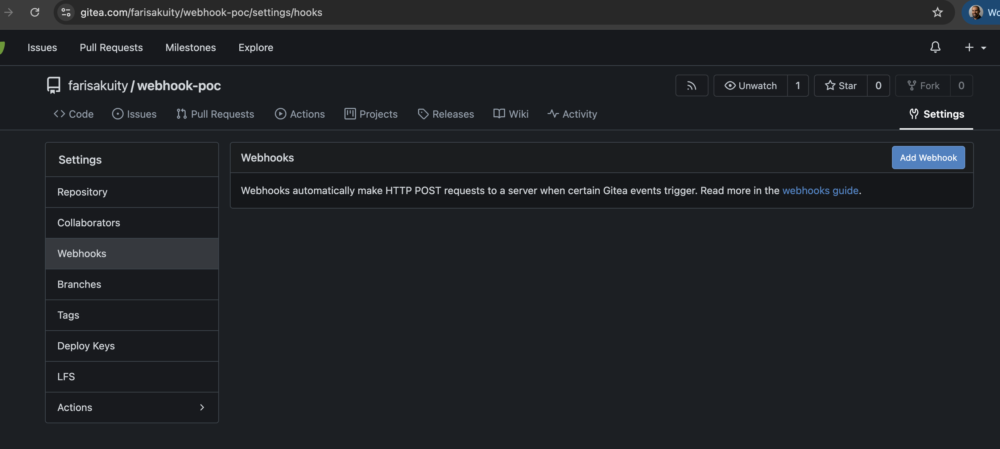
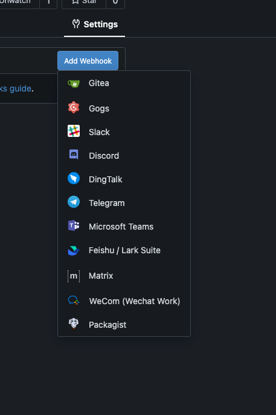
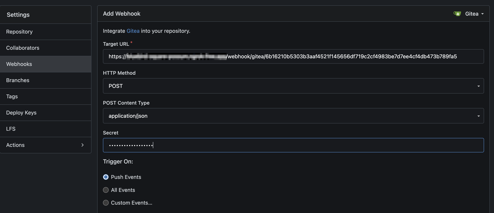

# The Gitea Webhook Receiver

The Gitea webhook receiver responds to `push` and `pull_request` events
originating from Gitea repositories.

The receiver responds to `push` events by _refreshing_ `Warehouse` resources
subscribed to those repositories. When a Warehouse has `includePaths` or
`excludePaths` configured, the receiver extracts the list of changed files from
the push event and only refreshes the Warehouse if the changed files match those
path filters.

The receiver responds to `pull_request` events with a `closed` action by
_refreshing_ all running `Promotion` resources that are waiting on the closed
pull request via a [`git-wait-for-pr`](../../30-promotion-steps/git-wait-for-pr.md)
step. This enables near-instant detection of PR merges and closures instead of
relying on the default polling interval. Events with other actions (e.g.
`opened`, `synchronized`) are acknowledged with an HTTP `200` status code but
produce no side effects.

:::note

Gitea limits the `commits` array in push webhook payloads to a configurable
number of commits (default: **5**, controlled by `UI.FEED_MAX_COMMIT_NUM` in
Gitea's `app.ini`). If a push contains more commits than this limit, Kargo
detects the truncation and skips path filtering for that event, refreshing all
matching Warehouses unconditionally.

:::

:::info

"Refreshing" a `Warehouse` resource means enqueuing it for immediate
reconciliation by the Kargo controller, which will execute the discovery of
new artifacts from all repositories to which that `Warehouse` subscribes.

:::

:::info

"Refreshing" a `Promotion` resource means enqueuing it for immediate
reconciliation. The
[`git-wait-for-pr`](../../30-promotion-steps/git-wait-for-pr.md) step will then
call the Git provider's API to detect whether the PR has been merged or closed,
and proceed accordingly.

:::

:::info

The Gitea webhook receiver also works with Gitea Enterprise and Gitea Cloud.

:::

## Configuring the Receiver

A Gitea webhook receiver must reference a Kubernetes `Secret` resource with a
`secret` key in its data map. This
[shared secret](https://en.wikipedia.org/wiki/Shared_secret) will be used by
Gitea to sign requests and by the receiver to verify those signatures.

:::note

The following commands are suggested for generating and base64-encoding a
complex secret:

```shell
secret=$(openssl rand -base64 48 | tr -d '=+/' | head -c 32)
echo "Secret: $secret"
echo "Encoded secret: $(echo -n $secret | base64)"
```

:::

```yaml
apiVersion: v1
kind: Secret
metadata:
  name: gitea-wh-secret
  namespace: kargo-demo
  labels:
    kargo.akuity.io/cred-type: generic
data:
  secret: <base64-encoded secret>
---
apiVersion: kargo.akuity.io/v1alpha1
kind: ProjectConfig
metadata:
  name: kargo-demo
  namespace: kargo-demo
spec:
  webhookReceivers: 
  - name: gitea-wh-receiver
    gitea:
      secretRef:
        name: gitea-wh-secret
```

## Retrieving the Receiver's URL

Kargo will generate a hard-to-guess URL from the receiver's configuration. This
URL can be obtained using a command such as the following:

```shell
kubectl get projectconfigs kargo-demo \
  -n kargo-demo \
  -o=jsonpath='{.status.webhookReceivers}'
```

## Registering with Gitea

1. Navigate to the webhooks dashboard.

    Where you can find these settings varies based on the scope at which you'd
    like to enable your webhooks. Webhooks can be enabled for a single
    repository, for all repositories within an organization, or for all
    repositories belonging to an individual user.

    <Tabs groupId="navigation">
    <TabItem value="repo-scope" label="Repo Scope" default>

    Navigate to `https://gitea.com/<namespace>/<repo>/settings/hooks`, where
    `<namespace>` has been replaced with a Gitea username or group name and
    `<project>` has been replaced with the name of a project belonging to that
    namespace and for which you are an administrator.

    </TabItem>
    <TabItem value="org-scope" label="Org Scope">

    Navigate to `https://gitea.com/org/<org>/settings/hooks`, where
    `<org>` has been replaced by a Gitea organization for which you are an
    administrator.

    </TabItem>
    <TabItem value="user-scope" label="User Scope">

    Navigate to `https://gitea.com/org/user/settings/hooks`.
 
    </TabItem>
    </Tabs>

    

1. Click <Hlt>Add Webhook</Hlt>.

1. Click <Hlt>Gitea</Hlt> from the dropdown menu.

    

1. Complete the <Hlt>Webhooks</Hlt> form:

    

    1. Set the <Hlt>Target URL</Hlt> to the URL
       [for the webhook receiver](#retrieving-the-receivers-url).

    1. Set <Hlt>Secret</Hlt> to the value assigned to the `secret`
       key of the `Secret` referenced by the
       [webhook receiver's configuration](#configuring-the-receiver).

    1. In the <Hlt>Trigger On</Hlt> section, ensure <Hlt>Push Events</Hlt> is
       checked.

        If you use PR-based promotion workflows (i.e. promotions that include a
        [`git-wait-for-pr`](../../30-promotion-steps/git-wait-for-pr.md) step),
        also check <Hlt>Pull Request Events</Hlt>. This enables Kargo to detect
        PR merges and closures near-instantly instead of relying on the default
        polling interval.

    1. Click <Hlt>Add Webhook</Hlt>.

       This will return you to the list of all webhooks registered at the
       selected scope.

:::info

For additional information on configuring Gitea webhooks, refer directly to the
[Gitea Docs](https://docs.gitea.com/usage/webhooks).

:::
