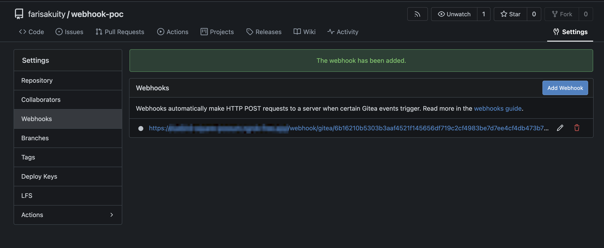

# The Gitea Webhook Receiver

The Gitea webhook receiver responds to `push` events originating from Gitea
repositories by _refreshing_ all `Warehouse` resources subscribed to those
repositories.

:::info
"Refreshing" a `Warehouse` resource means enqueuing it for immediate
reconciliation by the Kargo controller, which will execute the discovery of
new artifacts from all repositories to which that `Warehouse` subscribes.
:::

:::info
The Gitea webhook receiver also works with Gitea Enterprise Gitea Cloud.
:::

## Configuring the Receiver

A Gitea webhook receiver must reference a Kubernetes `Secret` resource with a
`secret` key in its data map. This
[shared secret](https://en.wikipedia.org/wiki/Shared_secret) will be used by
Gitea to sign requests and by the receiver to verify those signatures.

:::note
The following commands are suggested for generating and base64-encoding a
complex secret:

```shell
secret=$(openssl rand -base64 48 | tr -d '=+/' | head -c 32)
echo "Secret: $secret"
echo "Encoded secret: $(echo -n $secret | base64)"
```
:::

```yaml
apiVersion: kargo.akuity.io/v1alpha1
kind: Project
metadata:
  name: kargo-demo
---
apiVersion: v1
kind: Secret
metadata:
  name: gitea-wh-secret
  namespace: kargo-demo
data:
  secret: <base64-encoded secret>
---
apiVersion: kargo.akuity.io/v1alpha1
kind: ProjectConfig
metadata:
  name: kargo-demo
  namespace: kargo-demo
  labels:
    kargo.akuity.io/cred-type: generic
spec:
  webhookReceivers: 
  - name: gitea-wh-receiver
    gitlab:
      secretRef:
        name: gitea-wh-secret
```

## Retrieving the Receiver's URL

Kargo will generate a hard-to-guess URL from the receiver's configuration. This
URL can be obtained using a command such as the following:

```shell
kubectl get projectconfigs kargo-demo \
  -n kargo-demo \
  -o=jsonpath='{.status.webhookReceivers}'
```

## Registering with Gitea

1. Navigating to the webhooks dashboard will vary based on scope.

### Repo scope

1. Navigate to `https://gitea.com/<namespace>/<repo>/settings/hooks`, where
   `<namespace>` has been replaced with a Gitea username or group name and
   `<project>` has been replaced with the name of a project belonging to that
   namespace and for which you are an administrator.

### Org scope

1. Navigate to `https://gitea.com/org/<org>/settings/hooks`, where 
    `<org>` has been replaced by a Gitea organization for which you are an
    administrator.

### User scope

1. Navigate to `https://gitea.com/org/user/settings/hooks`.

    

1. Click <Hlt>Add Webhook</Hlt>.

1. Click <Hlt>Gitea</Hlt> from the dropdown menu.

    

1. Complete the <Hlt>Webhooks</Hlt> form:

    

    1. Set the <Hlt>Target URL</Hlt> to the URL
       [for the webhook receiver](#retrieving-the-receivers-url).

    1. Set <Hlt>Secret</Hlt> to the value assigned to the `secret`
       key of the `Secret` referenced by the
       [webhook receiver's configuration](#configuring-the-receiver).

    1. In the <Hlt>Trigger On</Hlt> section, ensure <Hlt>Push Events</Hlt> is
       checked.

    1. Click <Hlt>Add Webhook</Hlt>.

1. From the <Hlt>Webhooks settings</Hlt> click on the newly created webhook.

    

1. Scroll down to <Hlt>Recent Deliveries</Hlt>.

1. Click <Hlt>Test Delivery</Hlt>.

    

    :::note
    This will trigger a `Warehouse` refresh. It's ok if none are configured.
    This will simply result in a 200 stating 0 `Warehouse`s were refreshed.
    :::

1. Scroll down to <Hlt>Recent Deliveries</Hlt> again.

    

1. Click on the delivery.

1. Click the <Hlt>Response</Hlt> tab and verify it was successful.

    
:::info
For additional information on configuring Gitea webhooks, refer directly to the
[Gitea Docs](https://docs.gitea.com/usage/webhooks).
:::
