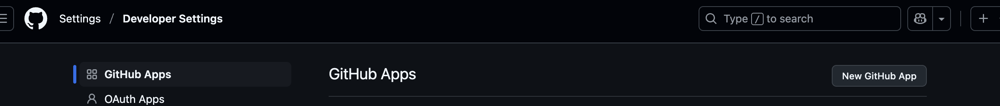
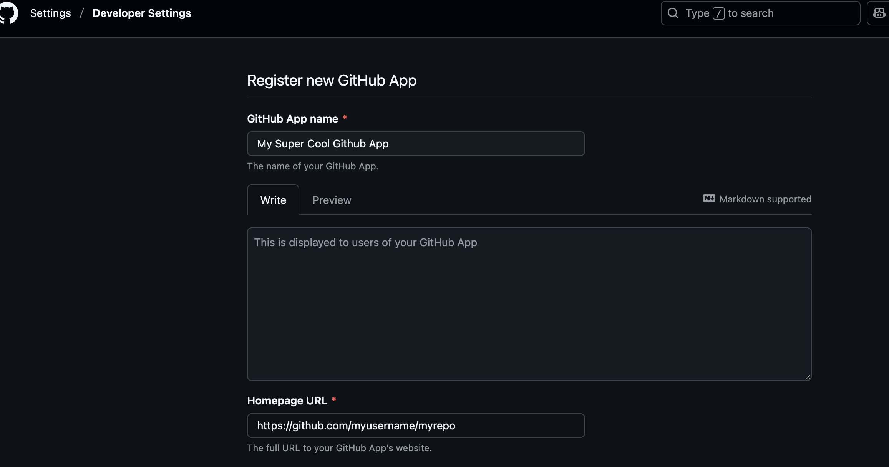
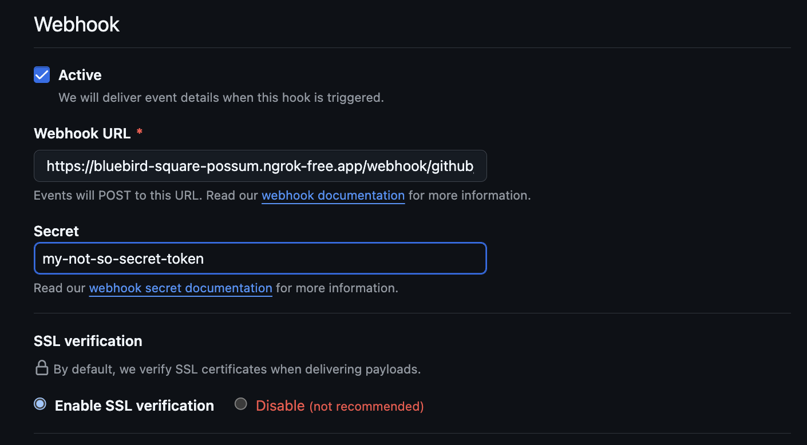
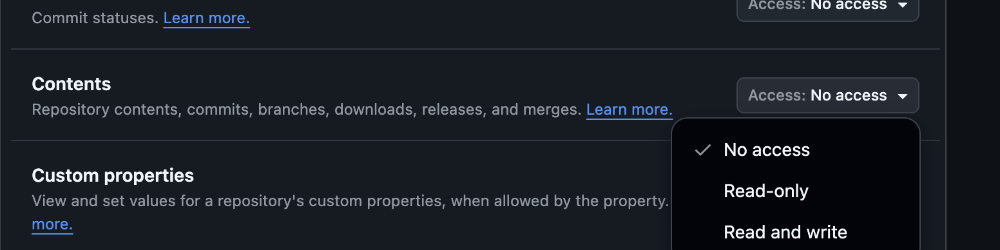
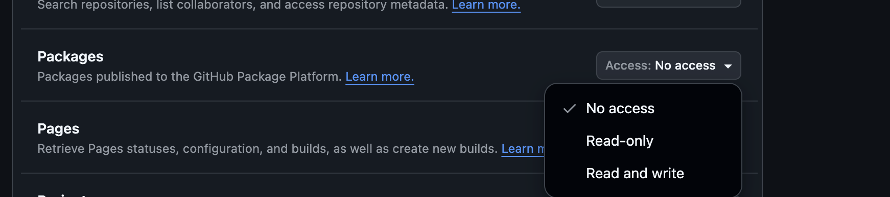
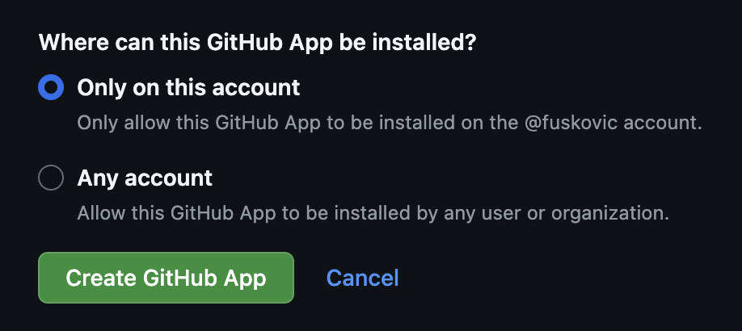
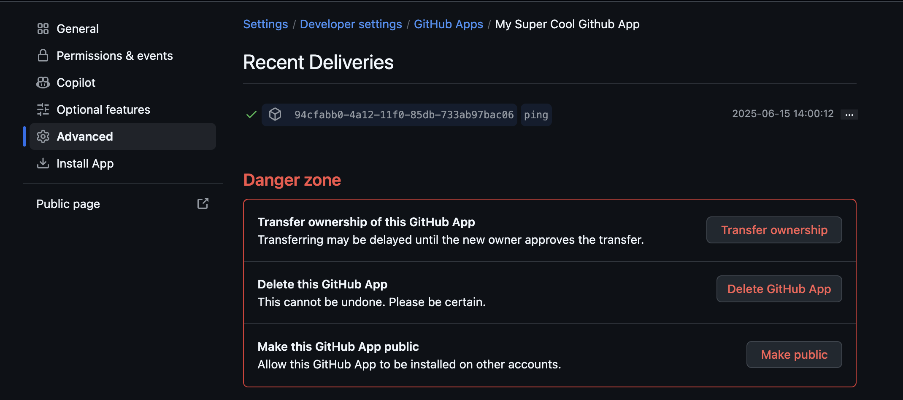

# The GitHub Webhook Receiver

The Github Webhook Receiver will respond to ping, push, and package events.
For ping events, a 200 is returned to verify connectivity. Push events refresh
any Warehouses subscribed to the repository from which the event originated. A
package event refreshes any Warehouses subscribed to images from a ghcr.io
package registry.

:::info
The Github webhook receiver also works with Github Enterprise Cloud and GitHub
Enterprise Server.
:::

## Configuring the Receiver

The GitHub webhook receiver will need to reference a Kubernetes `Secret` with a
`secret` key in its data map. This
[shared secret](https://en.wikipedia.org/wiki/Shared_secret) will be used by
GitHub to sign requests. The receiver will use it to authenticate those requests
by verifying their signatures.

:::note
The following command is suggested for generating a complex secret:

```shell
openssl rand -base64 48 | tr -d '=+/' | head -c 32
```

:::

```yaml
apiVersion: v1
kind: Secret
metadata:
  name: gh-wh-secret
  namespace: kargo-demo
stringData:
  secret: <your-secret-here>
---
apiVersion: kargo.akuity.io/v1alpha1
kind: ProjectConfig
metadata:
  name: kargo-demo
  namespace: kargo-demo
spec:
  webhookReceivers: 
    - name: gh-wh-receiver
      github:
        secretRef:
          name: gh-wh-secret
```

## Retrieving the Receiver's URL

Kargo will generate a hard-to-guess URL from the configuration. We can obtain 
this URL using the following command:

```shell
  kubectl \
    get projectconfigs \
    kargo-demo \
    -n kargo-demo \
    -o=jsonpath='{.status.webhookReceivers}'
```

## Registering with Github

When configuring on Github, you can configure either a webhook or an app. We will outline instructions for both, starting with webhooks.

### Webhooks

1. Navigate to `https://github.com/<account>/<repository>/settings/hooks` where
   `<account>` has been replaced with your GitHub username or an organization
   for which you are an administrator and `repository` has been replaced with
   the name of a repository belonging to that account.

1. Click <Hlt>Add webhook</Hlt>.


1. Complete the <Hlt>Add webhook</Hlt> form:

    1. Set <Hlt>Payload URL</Hlt> to the URL we
        [retrieved earlier](#retrieving-the-receivers-url).

    1. Set <Hlt>Content type</Hlt> to `application/json`.

    1. Set <Hlt>Secret</Hlt> to the value previously assigned to the `secret`
        key of the `Secret` referenced by the
        [webhook receiver's configuration](#configuring-the-receiver).

    1. Under <Hlt>Which events would you like to trigger this webhook?</Hlt>:
        Leave <Hlt>Just the push event.</Hlt> selected, unless you would
        like to receive events when container images or Helm charts are
        pushed to associated GHCR repositories.
        To receive such events, select
        <Hlt>Let me select individual events.</Hlt>, then ensure
        <Hlt>Pushes</Hlt> and <Hlt>Packages</Hlt> are both checked.
        
        :::note
        You will only receive events from those GHCR repositories explicitly
        associated with your Git repository.
        For more information on this topic, refer to
        [these GitHub docs](https://docs.github.com/en/packages/learn-github-packages/connecting-a-repository-to-a-package).
        :::

    1. Ensure <Hlt>Active</Hlt> remains checked.
    
    1. Click <Hlt>Add webhook</Hlt>.

1. Verifying Connectivity

From your Webhooks Dashboard, click on the webhook you just created.


Navigate to <Hlt>Recent Deliveries</Hlt>.


Click on the <Hlt>ping</Hlt> event and ensure a successful response was returned.


### Apps

It may be tedious to configure webhooks for each of your Github repositories. 
You can instead opt to configure a 
[Github App](https://docs.github.com/en/apps); allowing you to receive events 
from all or select repositories.

1. Navigate to Github Apps dashboard

    1. To create a new GitHub App owned by your own account and installable into
   your own repositories, navigate to https://github.com/settings/apps.
    OR
    To create a new GitHub App owned by an organization, of which you are an
    administrator, and installable into that organization's repositories,
    navigate to `https://github.com/organizations/<org name>/settings/apps`,
    where `<org name>` has been replaced with the organization's actual name.
    1. From there, click <Hlt>New Github App</Hlt>.




1. Register a new Github App

    1. Set a unique name in the <Hlt>Github App name</Hlt> field.

    :::note
    This must be globally unique for all of GitHub.
    :::

    1. For the <Hlt>Homepage URL</Hlt> field you can use an arbitrary URL
    or the repository URL.

    

    1. Set the <Hlt>Webhook URL</Hlt> to the value we retrieved from the 
    [Retrieving the Receiver's URL](#retrieving-the-receivers-url) section.

    1. Set the <Hlt>Secret</Hlt> field to the value we set to the `secret` key 
    from the [Configuring the Receiver](#configuring-the-receiver) 
    step.

    
    
    1. Scroll down to <Hlt>Configure Permissions</Hlt> -> 
    <Hlt>Repository Permissions</Hlt>.

     :::note
      For the option to subscribe to repo push events, we will need 
      <Hlt>read + write</Hlt> access for the <Hlt>Contents</Hlt> permission. For the option to subscribe to registry push events(ghcr), we will need <Hlt>read + write</Hlt>
      access for the <Hlt>Packages</Hlt> permission.
    :::

    

    

    1. Scroll down to <Hlt>Subscribe to events</Hlt>

    1. Select options based on your choices for the previous section.

    :::note
      If you set the <Hlt>Contents</Hlt> permission to <Hlt>read + write</Hlt> 
      you will have the <Hlt>Push</Hlt> option available to you. If you set <Hlt>Packages</Hlt> to <Hlt>read + write</Hlt> you will have the <Hlt>Registry package</Hlt> option available to you.
    :::

    

    1. Finally, click <Hlt>Create GitHub App</Hlt>.
    

1. Verifying Connectivity
  
    1. In your new App's dashboard, click <Hlt>Advanced</Hlt> on the left-hand 
    side.

    1. Click <Hlt>Recent Deliveries</Hlt>.

    1. Click on the <Hlt>ping</Hlt> event.

    

    1. Click <Hlt>Response</Hlt> and verify a 200 was received.

    

#### Additional Documentation

For more additional information on configuring Github Webhooks or Apps, refer 
to the [Github Docs](https://docs.github.com/en/webhooks/using-webhooks/creating-webhooks)

