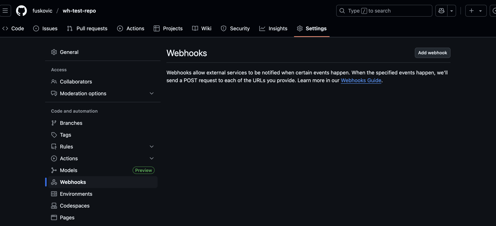
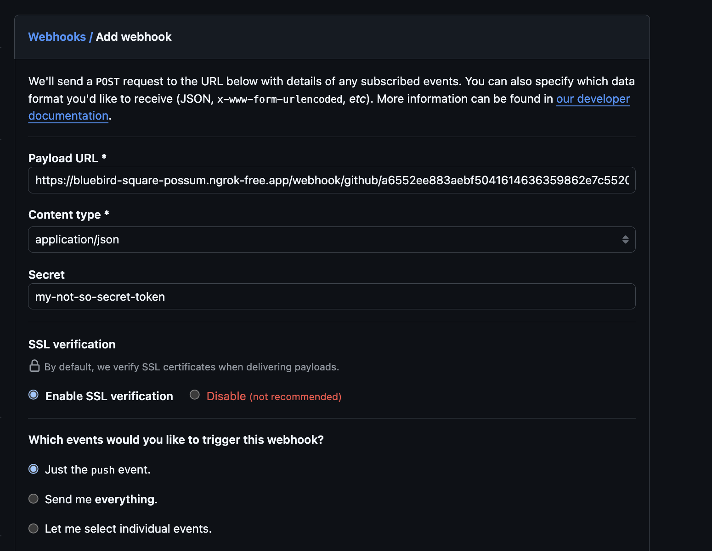
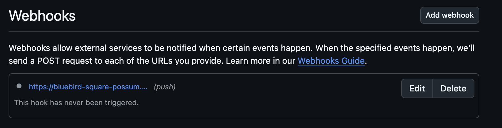
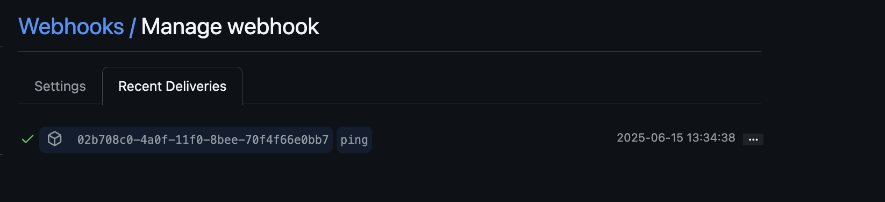
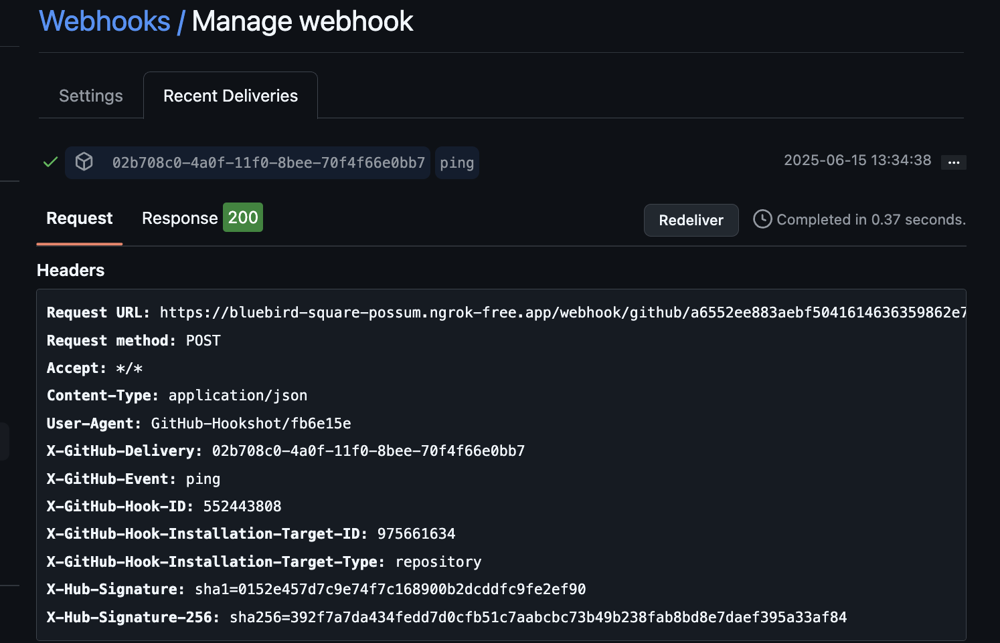
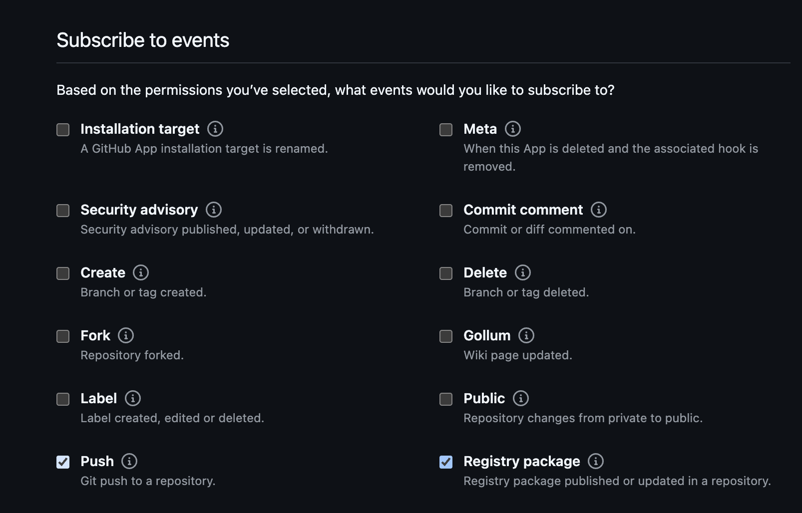

# The GitHub Webhook Receiver

The Github Webhook Receiver will respond to `ping`, `push`, and `package`
events originating from GitHub repositories. 

The receiver unconditionally responds to `ping` events with an HTTP `200` status
code.

In response a `push` event, the receiver "refreshes" `Warehouse`s subscribed
to the Git repository from which the event originated.

In response to a `package` event, the receiver "refreshes" `Warehouse`s
subscribed to the GHCR repository from which the event originated.

:::info
"Refreshing" a `Warehouse` resource means enqueuing it for immediate
reconciliation by the Kargo controller, which will execute the discovery of
new artifacts from all repositories to which that `Warehouse` subscribes.
:::

:::info
The Github webhook receiver also works with Github Enterprise Cloud and GitHub
Enterprise Server.
:::

## Configuring the Receiver

The GitHub webhook receiver will need to reference a Kubernetes `Secret` with a
`secret` key in its data map. This
[shared secret](https://en.wikipedia.org/wiki/Shared_secret) will be used by
GitHub to sign requests. The receiver will use it to authenticate those requests
by verifying their signatures.

:::note
The following command is suggested for generating a complex shared secret:

```shell
openssl rand -base64 48 | tr -d '=+/' | head -c 32
```

:::

```yaml
apiVersion: v1
kind: Secret
metadata:
  name: gh-wh-secret
  namespace: kargo-demo
stringData:
  secret: <your-secret-here>
---
apiVersion: kargo.akuity.io/v1alpha1
kind: ProjectConfig
metadata:
  name: kargo-demo
  namespace: kargo-demo
spec:
  webhookReceivers: 
    - name: gh-wh-receiver
      github:
        secretRef:
          name: gh-wh-secret
```

## Retrieving the Receiver's URL

Kargo will generate a hard-to-guess URL from the configuration. We can obtain 
this URL using the following command:

```shell
  kubectl \
    get projectconfigs \
    kargo-demo \
    -n kargo-demo \
    -o=jsonpath='{.status.webhookReceivers}'
```

## Registering with Github

There are two options whereby GitHub repositories can be configured to send
events to the webhook receiver:

1. Configure webhooks directly for a single repository.

    The advantage of this approach is that is is comparatively simple, however,
    its large disadvantage is that it is tedious and most likely infeasible to
    repeat this configuration for a large number of repositories.

1. Create a [Github App](https://docs.github.com/en/apps).

    The disadvantage of this approach is that it is comparatively complex,
    however, its large advantage is that once created and configured, the App
    can be easily [installed]() into any number of GitHub repositories
    (belonging to the same account that owns the App).

In the following sections, we will present instructions for both options.

### Webhooks

To configure a single repository to notify the receiver of relevant events:

1. Navigate to `https://github.com/<account>/<repository>/settings/hooks`, where
   `<account>` has been replaced with your GitHub username or an organization
   for which you are an administrator and `repository` has been replaced with
   the name of a repository belonging to that account.

1. Click <Hlt>Add webhook</Hlt>.



1. Complete the <Hlt>Add webhook</Hlt> form:

    

    1. Set <Hlt>Payload URL</Hlt> to the URL we
       [retrieved earlier](#retrieving-the-receivers-url).

    1. Set <Hlt>Content type</Hlt> to `application/json`.

    1. Set <Hlt>Secret</Hlt> to the value previously assigned to the `secret`
       key of the `Secret` referenced by the
       [webhook receiver's configuration](#configuring-the-receiver).

    1. Under <Hlt>Which events would you like to trigger this webhook?</Hlt>:
       Leave <Hlt>Just the push event.</Hlt> selected, unless you would
       like to receive events when container images or Helm charts are
       pushed to associated GHCR repositories.

        To receive such events, select
        <Hlt>Let me select individual events.</Hlt>, then ensure
        <Hlt>Pushes</Hlt> and <Hlt>Packages</Hlt> are both checked.

        :::note
        You will only receive events from those GHCR repositories explicitly
        associated with your Git repository.

        For more information on this topic, refer to
        [these GitHub docs](https://docs.github.com/en/packages/learn-github-packages/connecting-a-repository-to-a-package).
        :::

    1. Ensure <Hlt>Active</Hlt> remains checked.

    1. Click <Hlt>Add webhook</Hlt>.

1. Verify connectivity:

    1. From the <Hlt>Webhooks</Hlt> dashboard, select the webhook you registered
       above.
        

    1. Select the <Hlt>Recent Deliveries</Hlt> tab.
        

    1. Select the <Hlt>ping</Hlt> event and ensure an HTTP response status of
       `200` was received from the webhook receiver.
        


### GitHub Apps

It may be tedious to configure webhooks for each of your Github repositories. 
You can instead opt to configure a 
[Github App](https://docs.github.com/en/apps); allowing you to receive events 
from all or select repositories.

1. Navigate to https://github.com/settings/apps to create a new GitHub App
   owned by your own account

    OR
    
    Navigate to `https://github.com/organizations/<org name>/settings/apps`,
    where `<org name>` has been replaced with an organization for which you are
    an administrator, to create a new GitHub App owned by that organization.


1. Complete the <Hlt>Register new GitHub App</Hlt> form:

    1. Set <Hlt>Github App name</Hlt> to a name of your choosing.

        :::note
        This name must be _globally unique_ across all of GitHub.

        Unfortunately, you will not learn whether your selected name is
        unavailable until you have submitted the form.
        :::

    1. Set <Hlt>Homepage URL</Hlt> to a URL of your choosing. The value of this
       field is unimportant.

    1. Skip the <Hlt>Identifying and authorizing users</Hlt> and
       <Hlt>Post installation</Hlt> sections of the form. These are not relevant
       to our present goal.

    1. Set <Hlt>Webhook URL</Hlt> to the URL we
       [retrieved earlier](#retrieving-the-receivers-url).

    1. Set <Hlt>Secret</Hlt> to the value previously assigned to the `secret`
       key of the `Secret` referenced by the
       [webhook receiver's configuration](#configuring-the-receiver).
    
    1. In the <Hlt>Permissions</Hlt> section of the form, expand
       <Hlt>Repository Permissions</Hlt>.

    1. Ensure <Hlt>Contents</Hlt> is set to <Hlt>Read-only</Hlt>.

    1. If you would like to receive events when container images or Helm charts
       are pushed to associated GHCR repositories, set <Hlt>Packages</Hlt> to
       <Hlt>Read-only</Hlt>.

        :::note
        You will only receive events from those GHCR repositories explicitly
        associated with your Git repository.

        For more information on this topic, refer to
        [these GitHub docs](https://docs.github.com/en/packages/learn-github-packages/connecting-a-repository-to-a-package).
        :::

    1. In the <Hlt>Subscribe to events</Hlt> section of the form, ensure
       <Hlt>Push</Hlt> is checked.

        If you would like to receive events when container images or Helm charts
        are pushed to associated GHCR repositories, ensure
        <Hlt>Registry package</Hlt> is also checked.

        :::note
        The events available for selection in this section of the form are
        dynamic and dependent on your selections in the <Hlt>Permissions</Hlt>
        section.
        :::

        

    1. Under <Hlt>Where can this GitHub App be installed?</Hlt> ensure
       <Hlt>Only this account</Hlt> is selected.

        :::danger
        If you select the other option (<Hlt>Any account</Hlt>), your
        App will be installable into any repository in GitHub, regardless
        of what account owns it. _All_ repositories into which your App
        is installed will send events to the webhook receiver. __You almost
        certainly do not want this!__
        :::

    1. Click <Hlt>Create GitHub App</Hlt>.

1. Verify connectivity:
    1. From the new App's settings page, select <Hlt>Advanced</Hlt> from the
       left sidebar.

    1. Under <Hlt>Recent Deliveries</Hlt>, select the <Hlt>ping</Hlt> event and
       ensure an HTTP response status of `200` was received from the webhook
       receiver.

        

#### Additional Documentation

For more additional information on configuring Github Webhooks or Apps, refer 
to the [Github Docs](https://docs.github.com/en/webhooks/using-webhooks/creating-webhooks)

