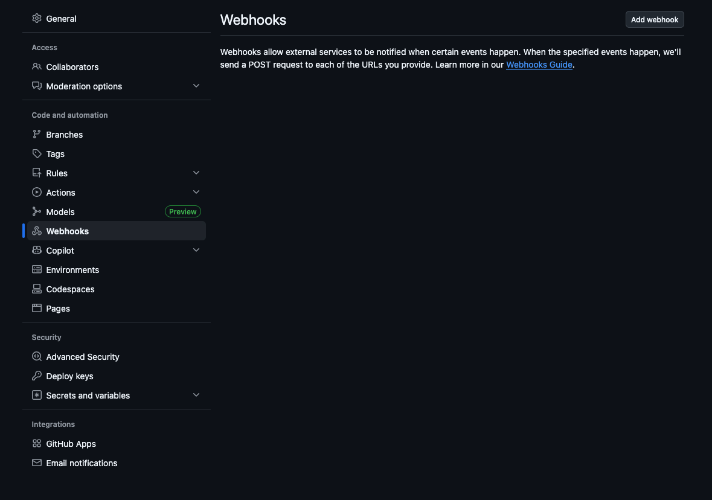
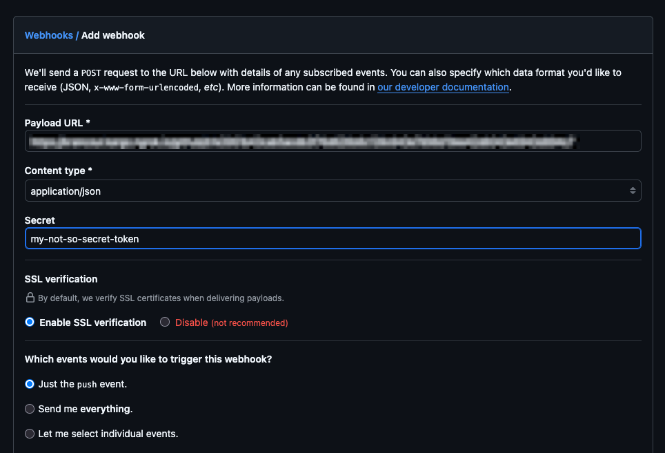
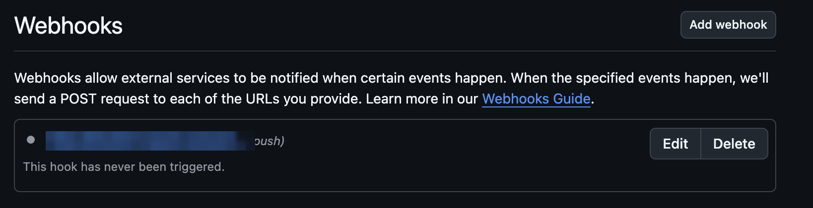
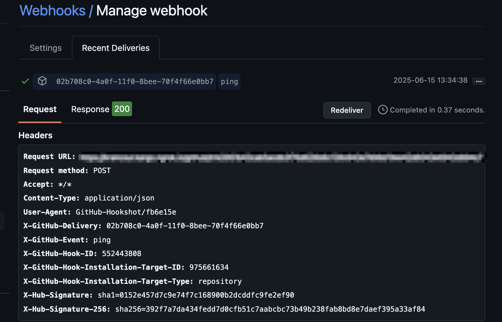
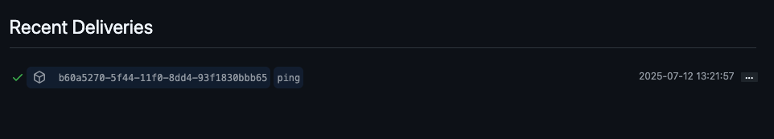
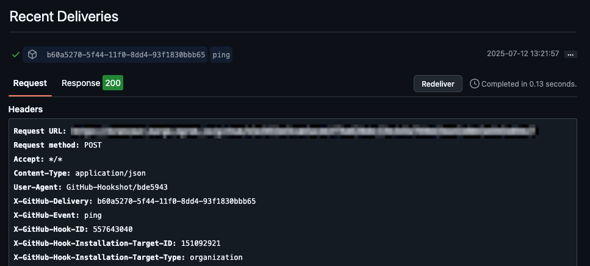
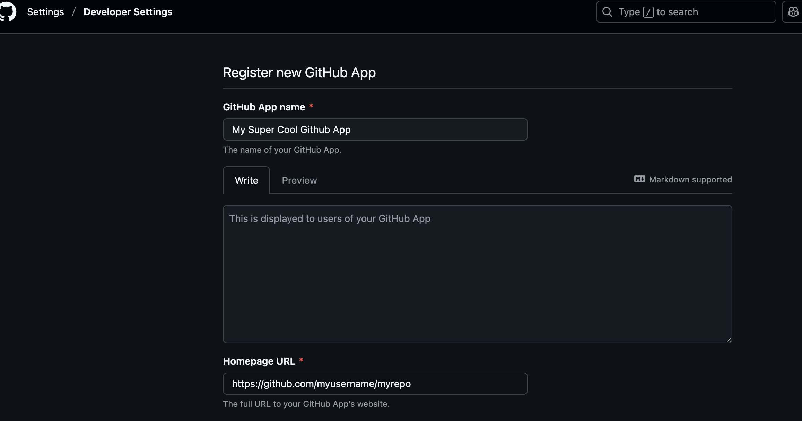
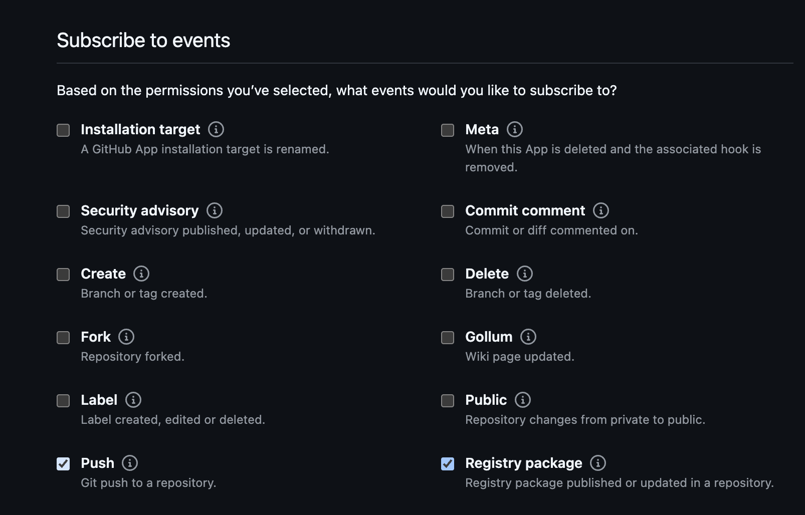
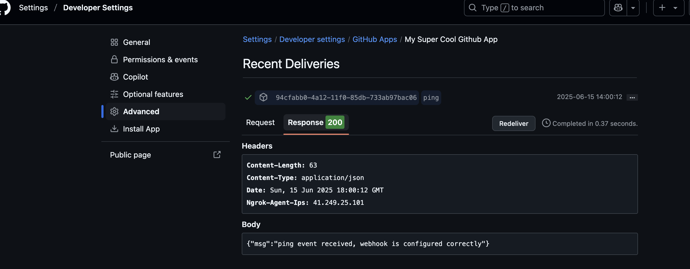

# GitHub Webhook Receiver

The GitHub webhook receiver responds to `ping`, `push`, `package`, and
`registry_package` events originating from GitHub.

The receiver unconditionally responds to `ping` events with an HTTP `200` status
code.

The receiver responds to `push` events by _refreshing_ all `Warehouse` resources
subscribed to the Git repositories from which those events originated.

The receiver responds to  `package` events by _refreshing_ all `Warehouse`
resources subscribed to the GHCR repositories from which those events
originated.

:::info

"Refreshing" a `Warehouse` resource means enqueuing it for immediate
reconciliation by the Kargo controller, which will execute the discovery of new
artifacts from all repositories to which that `Warehouse` subscribes.

:::

:::info

The GitHub webhook receiver also works with GitHub Enterprise Cloud and GitHub
Enterprise Server, although some URLs in this document may need to be adjusted
accordingly.

:::

## Configuring the Receiver

A GitHub webhook receiver must reference a Kubernetes `Secret` resource with a
`secret` key in its data map. This
[shared secret](https://en.wikipedia.org/wiki/Shared_secret) will be used by
GitHub to sign requests and by the receiver to verify those signatures.

:::note

The following commands are suggested for generating and base64-encoding a
complex secret:

```shell
secret=$(openssl rand -base64 48 | tr -d '=+/' | head -c 32)
echo "Secret: $secret"
echo "Encoded secret: $(echo -n $secret | base64)"
```

:::

```yaml
apiVersion: v1
kind: Secret
metadata:
  name: gh-wh-secret
  namespace: kargo-demo
  labels:
    kargo.akuity.io/cred-type: generic
data:
  secret: <base64-encoded secret>
---
apiVersion: kargo.akuity.io/v1alpha1
kind: ProjectConfig
metadata:
  name: kargo-demo
  namespace: kargo-demo
spec:
  webhookReceivers: 
    - name: gh-wh-receiver
      github:
        secretRef:
          name: gh-wh-secret
```

## Retrieving the Receiver's URL

Kargo will generate a hard-to-guess URL from the receiver's configuration. This
URL can be obtained using a command such as the following:

```shell
kubectl get projectconfigs kargo-demo \
  -n kargo-demo \
  -o=jsonpath='{.status.webhookReceivers}'
```

## Registering with GitHub

There are three options whereby GitHub repositories can be configured to send
events to the webhook receiver:

1. Configure webhooks directly for a single repository.

    The advantage of this approach is that it is comparatively simple, however,
    its large disadvantage is that it is tedious and most likely infeasible to
    repeat this configuration for a large number of repositories.

1. Configure webhooks directly at the organization level.

    The advantage of this approach is that it is simple and applies to all
    repositories in the organization, however, its disadvantage is that it
    requires organization-level permissions and will send events from all
    repositories in the organization.

1. Create a [GitHub App](https://docs.github.com/en/apps).

    The disadvantage of this approach is that it is comparatively complex,
    however, its large advantage is that once created and configured, the App
    can be easily
    [installed](https://docs.github.com/en/apps/using-github-apps/installing-your-own-github-app)
    into any number of GitHub repositories (belonging to the same account that
    owns the App).

In the sections below, you will find instructions for all three options.

### Webhooks from a Single Repository

To configure a single GitHub repository to notify a receiver of relevant events:

1. Navigate to `https://github.com/<account>/<repository>/settings/hooks`, where
   `<account>` has been replaced with a GitHub username or organization name
   and `<repository>` has been replaced with the name of a repository belonging
   to that account and for which you are an administrator.

    

1. Click <Hlt>Add webhook</Hlt>.

1. Complete the <Hlt>Add webhook</Hlt> form:

    

    1. Complete the <Hlt>Payload URL</Hlt> field using the URL
       [for the webhook receiver](#retrieving-the-receivers-url).

    1. Set <Hlt>Content type</Hlt> to `application/json`.

    1. Complete the <Hlt>Secret</Hlt> field using to the (unencoded) value
       assigned to the `secret` key of the `Secret` resource referenced by the
       [webhook receiver's configuration](#configuring-the-receiver).

    1. Under <Hlt>Which events would you like to trigger this webhook?</Hlt>:

        Leave <Hlt>Just the push event.</Hlt> selected, unless you would
        like to receive events when container images or Helm charts are
        pushed to associated GHCR repositories.

        To receive such events, select
        <Hlt>Let me select individual events.</Hlt>, then ensure
        <Hlt>Pushes</Hlt> and <Hlt>Packages</Hlt> are both selected.

        :::note

        You will only receive events from those GHCR repositories explicitly
        associated with your Git repository.

        For more information on this topic, refer to
        [these GitHub docs](https://docs.github.com/en/packages/learn-github-packages/connecting-a-repository-to-a-package).
        :::

    1. Ensure <Hlt>Active</Hlt> is selected.

    1. Click <Hlt>Add webhook</Hlt>.

1. Verify connectivity:

    1. From the <Hlt>Webhooks</Hlt> dashboard, select the new webhook.

        

    1. Select the <Hlt>Recent Deliveries</Hlt> tab.

        

    1. Select the <Hlt>ping</Hlt> event and ensure an HTTP response status of
       `200` was received from the webhook receiver.

        

When these steps are complete, the repository will send events to the webhook
receiver.

:::info

For additional information on configuring webhooks, refer directly to the
[GitHub Docs](https://docs.github.com/en/webhooks/using-webhooks/creating-webhooks).

:::

### Webhooks from an Organization

To configure an organization to notify the receiver of relevant events from all
repositories in the organization:

1. Navigate to `https://github.com/organizations/<organization>/settings/hooks`,
   where `<organization>` has been replaced with the name of an organization for
   which you are an administrator.

    

1. Click <Hlt>Add webhook</Hlt>.

1. Complete the <Hlt>Add webhook</Hlt> form:

    

    1. Complete the <Hlt>Payload URL</Hlt> field using the URL
       [for the webhook receiver](#retrieving-the-receivers-url).

    1. Set <Hlt>Content type</Hlt> to `application/json`.

    1. Complete the <Hlt>Secret</Hlt> field using to the (unencoded) value
       assigned to the `secret` key of the `Secret` resource referenced by the
       [webhook receiver's configuration](#configuring-the-receiver).

    1. Under <Hlt>Which events would you like to trigger this webhook?</Hlt>:

        Leave <Hlt>Just the push event.</Hlt> selected, unless you would
        like to receive events when container images or Helm charts are
        pushed to associated GHCR repositories.

        To receive such events, select
        <Hlt>Let me select individual events.</Hlt>, then ensure
        <Hlt>Pushes</Hlt> and <Hlt>Packages</Hlt> are both selected.

        :::note

        You will only receive events from those GHCR repositories explicitly
        associated with your Git repository.

        For more information on this topic, refer to
        [these GitHub docs](https://docs.github.com/en/packages/learn-github-packages/connecting-a-repository-to-a-package).
        :::

    1. Ensure <Hlt>Active</Hlt> is selected.

    1. Click <Hlt>Add webhook</Hlt>.

1. Verify connectivity:

    1. From the organization <Hlt>Webhooks</Hlt> dashboard, select the new webhook.

        

    1. Scroll down to the <Hlt>Recent Deliveries</Hlt> section.

        

    1. Select the <Hlt>ping</Hlt> event and ensure an HTTP response status of
       `200` was received from the webhook receiver.

        

When these steps are complete, all repositories in the organization will send
events to the webhook receiver.

:::info

For additional information on configuring organization webhooks, refer directly
to the
[GitHub Docs](https://docs.github.com/en/webhooks/using-webhooks/creating-webhooks#creating-organization-webhooks).

:::

### Webhooks from a GitHub App

To configure a [GitHub App](https://docs.github.com/en/apps) to notify the
receiver of relevant events from any repository into which it's been installed:

1. Navigate to
   [https://github.com/settings/apps](https://github.com/settings/apps)
   to create a new GitHub App owned by your own account

    OR

    Navigate to `https://github.com/organizations/<organization>/settings/apps`,
    where `<organization>` has been replaced with an organization for which you
    are an administrator to create a new GitHub App owned by that organization.

1. Complete the <Hlt>Register new GitHub App</Hlt> form:

    

    1. Complete the <Hlt>GitHub App name</Hlt> field using a name of your
       choosing.

        :::note

        This name must be _globally unique_ across all of GitHub.

        Unfortunately, you will not learn whether the name you've selected is
        available or not until you have submitted the form.
        :::

    1. Complete the <Hlt>Homepage URL</Hlt> field using a URL of your choosing.

        :::info

        This is a required field, but for our purposes, its value is
        unimportant.
        :::

    1. Skip the <Hlt>Identifying and authorizing users</Hlt> and
       <Hlt>Post installation</Hlt> sections of the form.

        :::info

        These sections are not relevant to webhook delivery.
        :::

    1. Complete the <Hlt>Webhook URL</Hlt> field using the URL
       [for the webhook receiver](#retrieving-the-receivers-url).

    1. Complete the <Hlt>Secret</Hlt> field using the (unencoded) value
       assigned to the `secret` key of the `Secret` resource referenced by the
       [webhook receiver's configuration](#configuring-the-receiver).

    1. In the <Hlt>Permissions</Hlt> section of the form, expand
       <Hlt>Repository Permissions</Hlt>.

    1. Ensure <Hlt>Contents</Hlt> is set to <Hlt>Read-only</Hlt>.

    1. If you would like to receive events when container images or Helm charts
       are pushed to associated GHCR repositories, set <Hlt>Packages</Hlt> to
       <Hlt>Read-only</Hlt>.

        :::note

        You will only receive events from those GHCR repositories explicitly
        associated with your Git repository.

        For more information on this topic, refer to
        [these GitHub docs](https://docs.github.com/en/packages/learn-github-packages/connecting-a-repository-to-a-package).
        :::

    1. In the <Hlt>Subscribe to events</Hlt> section of the form, ensure
       <Hlt>Push</Hlt> is selected.

        If you would like to receive events when container images or Helm charts
        are pushed to associated GHCR repositories, ensure
        <Hlt>Registry package</Hlt> is also selected.

        :::note

        The events available for selection in this section of the form are
        dynamic and dependent on your selections in the <Hlt>Permissions</Hlt>
        section.
        :::

        

    1. Under <Hlt>Where can this GitHub App be installed?</Hlt> ensure
       <Hlt>Only this account</Hlt> is selected.

        :::danger

        If you select the other option (<Hlt>Any account</Hlt>), your
        App will be installable into any repository in GitHub, regardless
        of what account owns it. _Every_ repository into which your App is
        installed will send events to the webhook receiver. __You almost
        certainly do not want this!__
        :::

    1. Click <Hlt>Create GitHub App</Hlt>.

1. Verify connectivity:

    1. From the new App's settings page, select <Hlt>Advanced</Hlt> from the
       left sidebar.

    1. Under <Hlt>Recent Deliveries</Hlt>, select the <Hlt>ping</Hlt> event and
       ensure an HTTP response status of `200` was received from the webhook
       receiver.

        

1. Install the new GitHub App into one or more repositories:

    1. Select <Hlt>Install App</Hlt> from the left sidebar.

        You will be presented with a list of accounts (users or organizations)
        into which you may install the App. If you followed the instructions for
        creating the App as presented above, _only_ the account owning the App
        should be listed here.

    1. Click <Hlt>Install</Hlt> next to the account into which you wish to
       install the App.

        An installation dialog will appear.

    1. Under <Hlt>for these repositories</Hlt>, select:

        * <Hlt>All repositories</Hlt> if you wish for all repositories owned
          by the account to send events to the webhook receiver.

            :::note

            Selecting this option will result in the App also being installed
            in _new_ repositories belonging to the account as they are created.
            :::

        * <Hlt>Only select repositories</Hlt> if you wish for only specific,
          existing repositories owned by the account to send events to the
          webhook receiver.

            :::note

            If this option is selected, the installation process can be
            repeated in the future to install the App into additional
            repositories.
            :::

    1. Click <Hlt>Install</Hlt>.

When these steps are complete, all repositories into which your GitHub App has
been installed will send events to the webhook receiver.

:::info

For additional information on configuring webhooks for GitHub Apps, refer
directly to the
[GitHub Docs](https://docs.github.com/en/apps/creating-github-apps/registering-a-github-app/using-webhooks-with-github-apps).

:::
