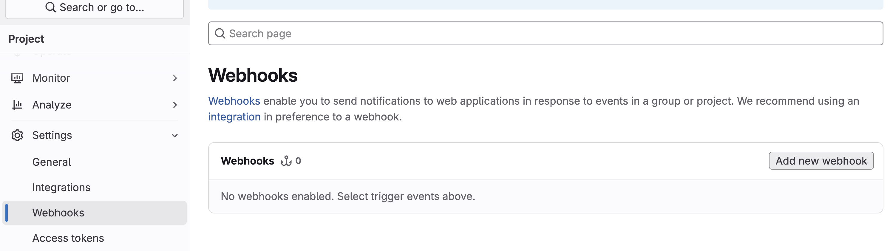
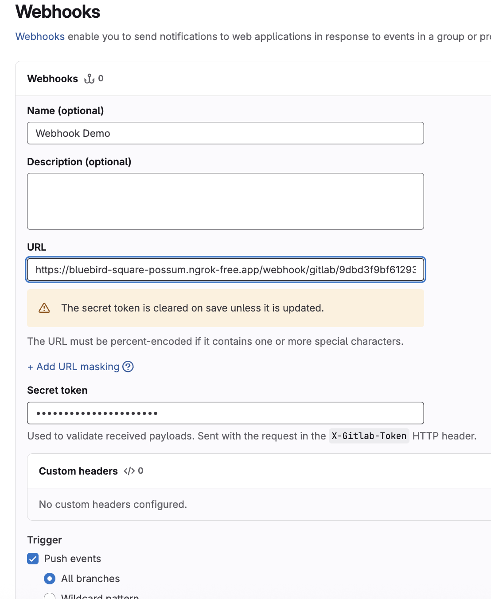
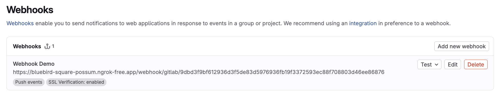
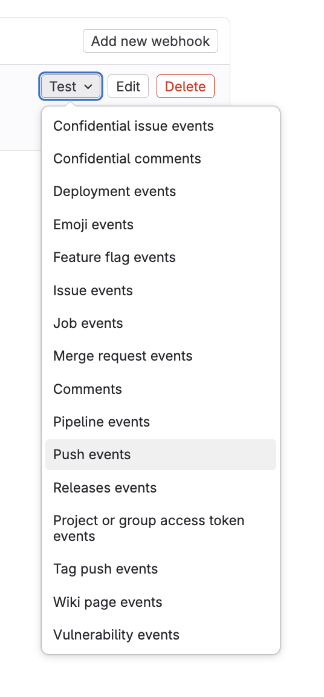

# GitLab Webhook Receiver

The GitLab Webhook Receiver responds to `push` events originating from GitLab
repositories by _refreshing_ all `Warehouse` resources subscribed to those
repositories.

:::info

"Refreshing" a `Warehouse` resource means enqueuing it for immediate
reconciliation by the Kargo controller, which will execute the discovery of
new artifacts from all repositories to which that `Warehouse` subscribes.

:::

:::info

The GitLab webhook receiver also works with GitLab Dedicated and GitLab
Self Managed, although some URLs in this document may need to be adjusted
accordingly.

:::

## Configuring the Receiver

A GitLab webhook receiver must reference a Kubernetes `Secret` resource with a
`secret-token` key in its data map. This
[shared secret](https://en.wikipedia.org/wiki/Shared_secret) will be used by
GitLab to sign requests and by the receiver to verify those signatures.

:::note

The following commands are suggested for generating and base64-encoding a
complex secret:

```shell
secret_token=$(openssl rand -base64 48 | tr -d '=+/' | head -c 32)
echo "Secret token: $secret_token"
echo "Encoded secret token: $(echo -n $secret_token | base64)"
```

:::

```yaml
apiVersion: kargo.akuity.io/v1alpha1
kind: Project
metadata:
  name: kargo-demo
---
apiVersion: v1
kind: Secret
metadata:
  name: gl-wh-secret
  namespace: kargo-demo
  labels:
    kargo.akuity.io/cred-type: generic
data:
  secret-token: <base64-encoded secret token>
---
apiVersion: kargo.akuity.io/v1alpha1
kind: ProjectConfig
metadata:
  name: kargo-demo
  namespace: kargo-demo
spec:
  webhookReceivers: 
    - name: gl-wh-receiver
      gitlab:
        secretRef:
          name: gl-wh-secret
```

## Retrieving the Receiver's URL

Kargo will generate a hard-to-guess URL from the receiver's configuration. This
URL can be obtained using a command such as the following:

```shell
kubectl get projectconfigs kargo-demo \
  -n kargo-demo \
  -o=jsonpath='{.status.webhookReceivers}'
```

## Registering with GitLab

1. Navigate to the webhooks dashboard.

    Where you can find these settings varies based on the scope at which you'd
    like to enable your webhooks. Webhooks can be enabled for a single project
    (repository) or for all projects (repositories) in a group.

    <Tabs groupId="navigation">
    <TabItem value="project-scope" label="Project Scope" default>

    Navigate to `https://gitlab.com/<namespace>/<project>/-/hooks`, where
    `<namespace>` has been replaced with a GitLab username and
    `<project>` has been replaced with the name of a project belonging to that
    namespace and for which you are an administrator.

    </TabItem>
    <TabItem value="group-scope" label="Group Scope" default>

    Navigate to `https://gitlab.com/groups/<group>/-/hooks`, where
    `<group>` has been replaced with a GitLab group name for which you are an
    owner of the group.

    </TabItem>
    </Tabs>

    :::caution

    If you configure identical webhooks affecting a given project at _both_
    the project level and group level, both webhooks will be triggered by
    applicable events in that project.
    :::

1. Click <Hlt>Add new webhook</Hlt>.

    

1. Complete the <Hlt>Webhooks</Hlt> form:

    

    1. Enter a descriptive name in the <Hlt>Name</Hlt> field.

    1. Complete the <Hlt>URL</Hlt> field using the URL
       [for the webhook receiver](#retrieving-the-receivers-url).

    1. Complete the <Hlt>Secret token</Hlt> field using to the (unencoded) value
       assigned to the `secret-token` key of the `Secret` resource referenced by
       the
       [webhook receiver's configuration](#configuring-the-receiver).

    1. In the <Hlt>Trigger</Hlt> section, ensure <Hlt>Push events</Hlt> is
       selected.

    1. Click <Hlt>Add webhook</Hlt>.

1. From the <Hlt>Webhooks settings</Hlt> page, verify connectivity by expanding
   the <Hlt>Test</Hlt> dropdown menu next to your webhook and selecting
   <Hlt>Push events</Hlt>.

    

    

    :::note

    This is safe to do because the test payload will lack the necessary
    details to successfully refresh `Warehouse` resources subscribed to the
    repository.
    :::

    If the test `push` event was delivered successfully, a success message will
    appear at the top of the <Hlt>Webhooks settings</Hlt> page.

    :::info

    If the test event is not successful, troubleshoot by clicking the
    <Hlt>Edit</Hlt> button next to your webhook, then scrolling down to the
    <Hlt>Recent events</Hlt> section to view details of the failed request.
    :::

:::info

For additional information on configuring GitLab webhooks, refer directly to the
[GitLab Docs](https://docs.gitlab.com/user/project/integrations/webhooks/).

:::
