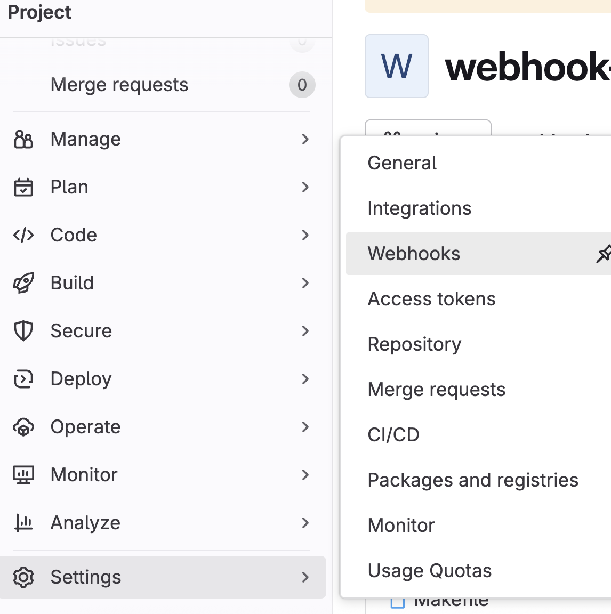
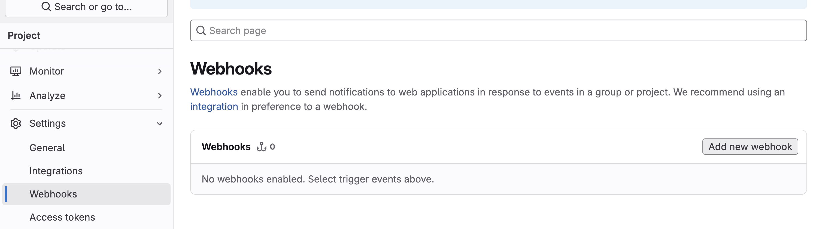
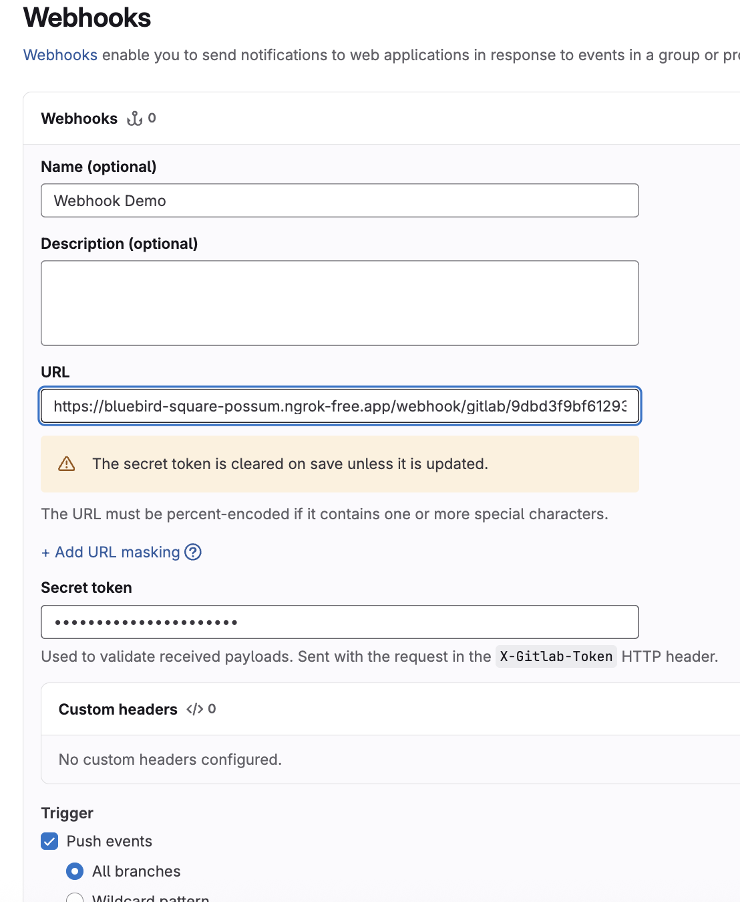
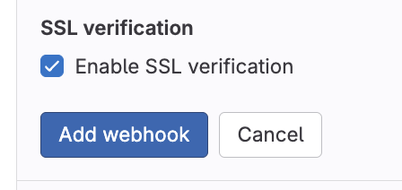
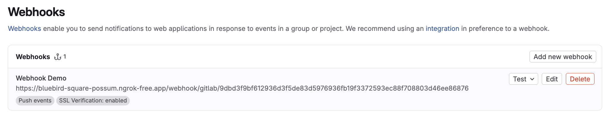
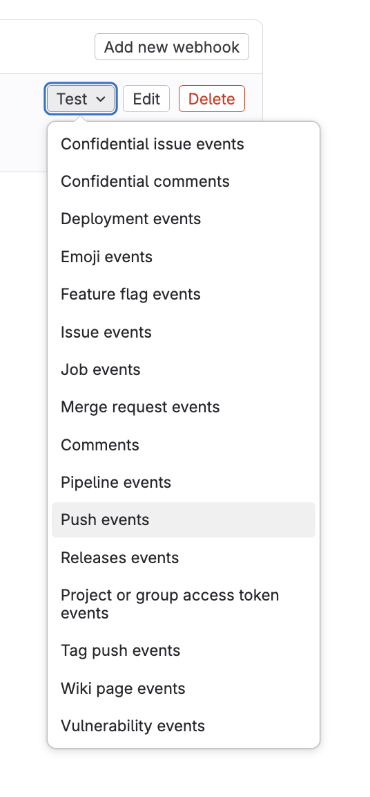
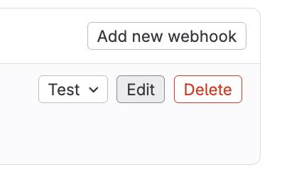
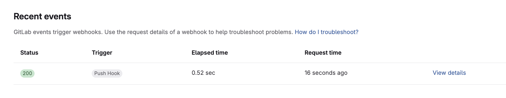

# The GitLab Webhook Receiver

The GitLab Webhook Receiver responds to push events
by refreshing any Warehouses subscribed to the repository from which the event originated.

:::info
The GitLab webhook receiver also works with GitLab Dedicated and GitLab Self-Managed.
:::

## Configuring the Receiver

The GitLab webhook receiver will need to reference a Kubernetes `Secret` with a
`secret-token` key in its data map. This
[shared secret](https://en.wikipedia.org/wiki/Shared_secret) will be used by
GitLab to provision an `X-Gitlab-Token` HTTP header. The receiver will check
the request for the presence of this header and ensure it's value matches
the one configured.

:::note
The following command is suggested for generating a complex secret:

```shell
openssl rand -base64 48 | tr -d '=+/' | head -c 32
```

:::

```yaml
apiVersion: v1
kind: Secret
metadata:
  name: gl-wh-secret
  namespace: kargo-demo
stringData:
  secret-token: <your-secret-here>
---
apiVersion: kargo.akuity.io/v1alpha1
kind: ProjectConfig
metadata:
  name: kargo-demo
  namespace: kargo-demo
spec:
  webhookReceivers: 
    - name: gl-wh-receiver
      gitlab:
        secretRef:
          name: gl-wh-secret
```

## Retrieving the Receiver's URL

Kargo will generate a hard-to-guess URL from the configuration. We can obtain 
this URL using the following command:

```shell
  kubectl \
    get projectconfigs \
    kargo-demo \
    -n kargo-demo \
    -o=jsonpath='{.status.webhookReceivers}'
```


## Registering with GitLab

1. Navigating to the Webhooks Dashboard

  1. From the repository dashboard of your choosing, hover over 
  <Hlt>Settings</Hlt> on the left-hand-side. This will render a new menu
  containing a <Hlt>Webhooks</Hlt> option.
  1. Click <Hlt>Webhooks</Hlt>.



1. In the Webhooks dashboard, click <Hlt>Add new webhook</Hlt>.



1. Set the <Hlt>URL</Hlt> to the value we retrieved from the 
    [Retrieving the Receiver's URL](#retrieving-the-receivers-url) section.

2. In the <Hlt>Secret token</Hlt> field, we will input the value we assigned to the `secret-token` key from the [Configuring the Receiver](#configuring-the-receiver) section.



1. Click <Hlt>Add webhook</Hlt>



1. Back in your Webhooks dashboard, you'll see the newly created webhook listed.



1. Select the <Hlt>Push events</Hlt> option from the <Hlt>Test</Hlt> dropdown menu.



1. Click <Hlt>Edit</Hlt>.



1. Scroll down to <Hlt>Recent Events</Hlt> and click <Hlt>View Details</Hlt>.



1. Confirm a successful response.


For additional information on configuring GitLab webhooks, refer to the [GitLab Docs](https://docs.gitlab.com/user/project/integrations/webhooks/).