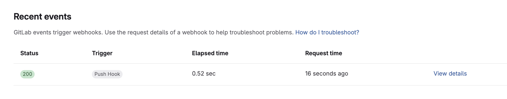
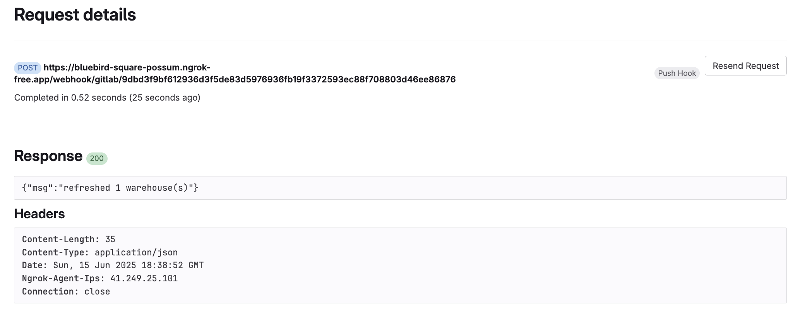

# The GitLab Webhook Receiver

The GitLab Webhook Receiver will respond to `push` events originating from GitLab repositories.

In response to a push event, the receiver "refreshes" Warehouses subscribed to the Git repository from which the event originated.

:::info
"Refreshing" a `Warehouse` resource means enqueuing it for immediate
reconciliation by the Kargo controller, which will execute the discovery of
new artifacts from all repositories to which that `Warehouse` subscribes.
:::

:::info
The GitLab webhook receiver also works with GitLab Dedicated and GitLab Self-Managed.
:::

## Configuring the Receiver

The GitLab webhook receiver will need to reference a Kubernetes `Secret` with a
`secret-token` key in its data map. This
[shared secret](https://en.wikipedia.org/wiki/Shared_secret) will be used by
GitLab to provision an `X-Gitlab-Token` HTTP header. The receiver will check
the request for the presence of this header and ensure it's value matches
the one configured.

:::note
The following command is suggested for generating a complex shared secret:

```shell
openssl rand -base64 48 | tr -d '=+/' | head -c 32
```

:::

```yaml
apiVersion: v1
kind: Secret
metadata:
  name: gl-wh-secret
  namespace: kargo-demo
stringData:
  secret-token: <your-secret-here>
---
apiVersion: kargo.akuity.io/v1alpha1
kind: ProjectConfig
metadata:
  name: kargo-demo
  namespace: kargo-demo
spec:
  webhookReceivers: 
    - name: gl-wh-receiver
      gitlab:
        secretRef:
          name: gl-wh-secret
```

## Retrieving the Receiver's URL

Kargo will generate a hard-to-guess URL from the configuration. We can obtain 
this URL using the following command:

```shell
  kubectl \
    get projectconfigs \
    kargo-demo \
    -n kargo-demo \
    -o=jsonpath='{.status.webhookReceivers}'
```


## Registering with GitLab

1. Navigate to `https://gitlab.com/<account>/<repository>/-/hooks`
   `<account>` has been replaced with your GitLab username or an organization
   for which you are an administrator and `<repository>` has been replaced with
   the name of a repository belonging to that account.


1. Click <Hlt>Add new webhook</Hlt>.

1. Complete the <Hlt>Add webhook</Hlt> form:

    

    1. Set the <Hlt>URL</Hlt> to the URL
        [retrieved for the webhook receiver](#retrieving-the-receivers-url).

    1. Set <Hlt>Secret token</Hlt> to the value assigned to the `secret-token` key from the [Configuring the Receiver](#configuring-the-receiver) section.

    1. Click <Hlt>Add webhook</Hlt>

1. Verify connectivity:

    1. From the <Hlt>Webhooks</Hlt> dashboard select the <Hlt>Push events</Hlt> option 
    from the <Hlt>Test</Hlt> 
    dropdown menu.

    

    

    1. Click <Hlt>Edit</Hlt>.

    1. Scroll down to <Hlt>Recent Events</Hlt> and click <Hlt>View Details</Hlt>.

    

    1. Confirm a successful response.

    

For additional information on configuring GitLab webhooks, refer to the [GitLab Docs](https://docs.gitlab.com/user/project/integrations/webhooks/).