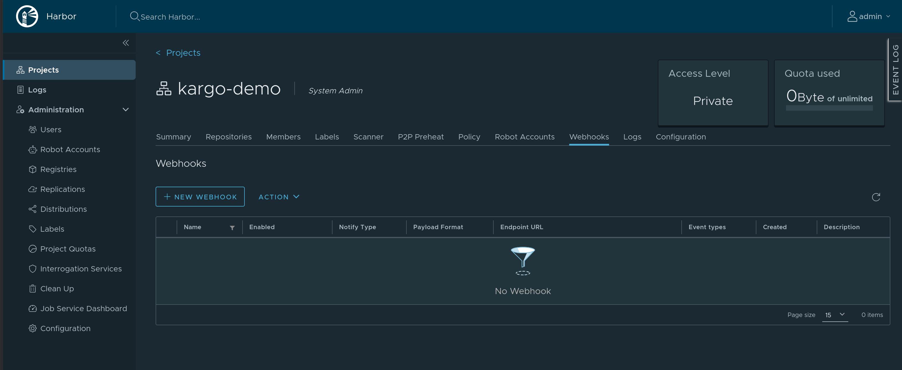
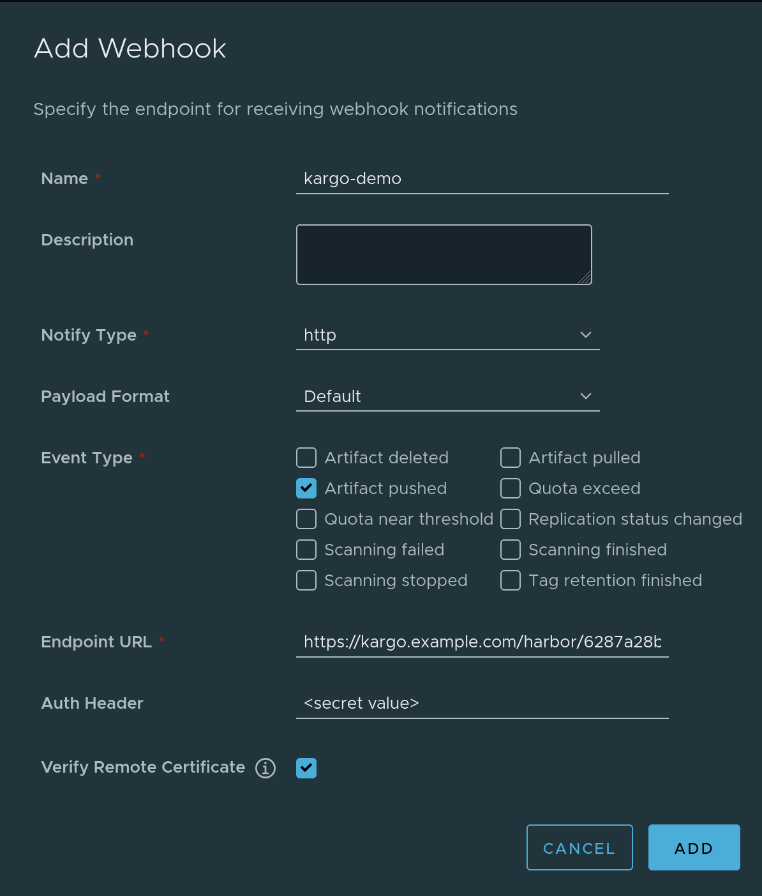
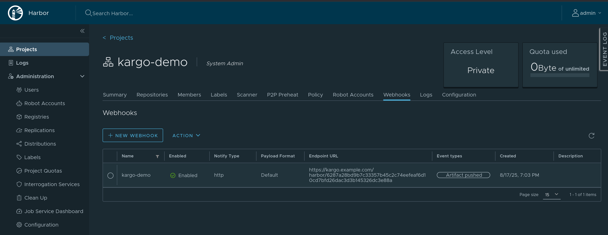

# Harbor Webhook Receiver

The Harbor Webhook Receiver responds to `PUSH_ARTIFACT` events originating from
Harbor repositories by _refreshing_ all `Warehouse` resources subscribed to
those repositories.

:::info

"Refreshing" a `Warehouse` resource means enqueuing it for immediate
reconciliation by the Kargo controller, which will execute the discovery of
new artifacts from all repositories to which that `Warehouse` subscribes.

:::

## Configuring the Receiver

A Harbor webhook receiver must reference a Kubernetes `Secret` resource
with an `auth-header` key in its data map. This
[shared secret](https://en.wikipedia.org/wiki/Shared_secret) will be passed in
the `Authorization` header of the webhook request sent by Harbor and verified by
Kargo.

:::info

While supplying an "Auth Header" is optional in Harbor, Kargo requires using
this.

:::

:::note

The following commands are suggested for generating and base64-encoding a
complex secret:

```shell
auth_header=$(openssl rand -base64 48 | tr -d '=+/' | head -c 32)
echo "Auth header: $auth_header"
echo "Encoded auth header: $(echo -n $auth_header | base64)"
```

:::

```yaml
apiVersion: v1
kind: Secret
metadata:
  name: harbor-wh-secret
  namespace: kargo-demo
  labels:
    kargo.akuity.io/cred-type: generic
data:
  auth-header: <base64-encoded auth header>
---
apiVersion: kargo.akuity.io/v1alpha1
kind: ProjectConfig
metadata:
  name: kargo-demo
  namespace: kargo-demo
spec:
  webhookReceivers:
  - name: harbor-wh-receiver
    harbor:
      secretRef:
        name: harbor-wh-secret
```

## Retrieving the Receiver's URL

Kargo will generate a hard-to-guess URL from the receiver's configuration. This
URL can be obtained using a command such as the following:

```shell
kubectl get projectconfigs kargo-demo \
  -n kargo-demo \
  -o=jsonpath='{.status.webhookReceivers}'
```

## Registering with Harbor

1. Navigate to
   `https://<harbor-instance>/harbor/projects/<project_id>/webhook`, where
   `<harbor-instance>` and `<project_id>` have been replaced with a Harbor
   instance and project for which you are an administrator.

1. Click <Hlt>New Webhook</Hlt>.

    

1. Complete the <Hlt>Add Webhook</Hlt> form:

    

    1. Enter a descriptive name in the <Hlt>Name</Hlt> field.

    1. Check <Hlt>Event type</Hlt> <Hlt>Artifact pushed</Hlt>. Uncheck all other
       event types.

    1. Complete the <Hlt>Endpoint URL</Hlt> field using the URL
       [for the webhook receiver](#retrieving-the-receivers-url).

    1. Complete the <Hlt>Auth Header</Hlt> field using shared secret
       [generated above](#configuring-the-receiver).

        :::note

        Use the unencoded value; not the base64-encoded value.
        :::

    1. Check <Hlt>Verify Remote Certificate</Hlt>.

    1. Click <Hlt>Add</Hlt>

1. The webhook should now be registered with Harbor. You can test it by pushing
   an artifact to the repository. This should trigger a webhook run, which you
   can review by clicking the name of your webhook. You can then check the
   status of the run and verify that the run was successful, as well as review
   the logs for any errors or issues if it was not.

   
