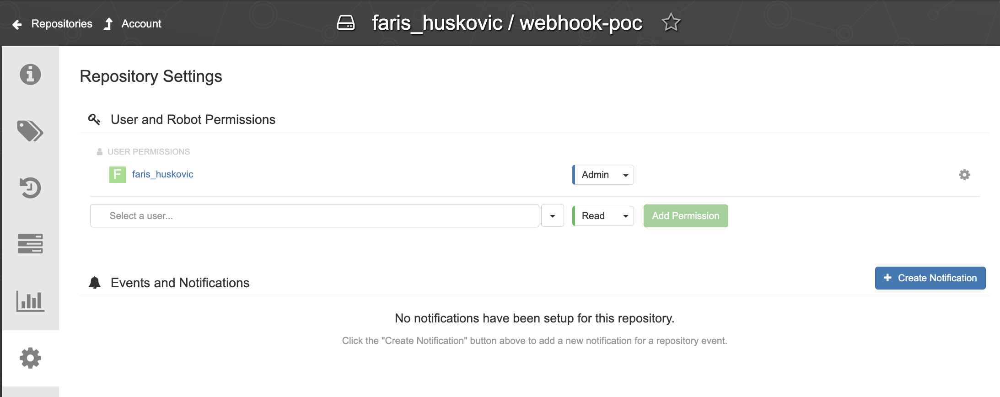
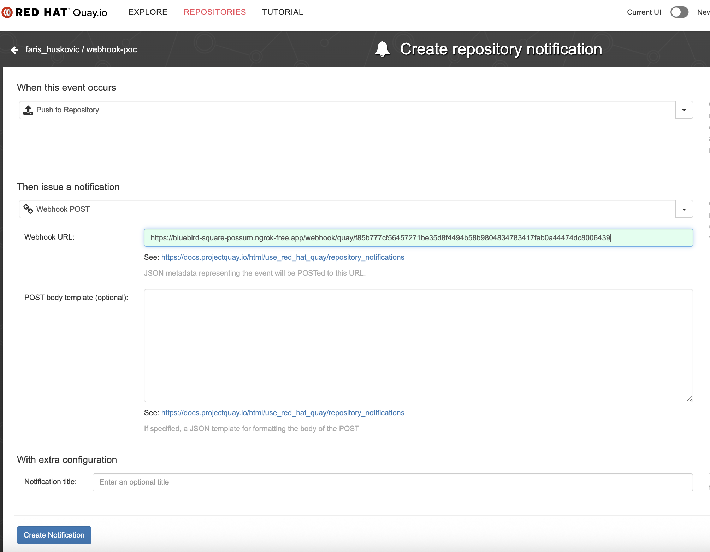
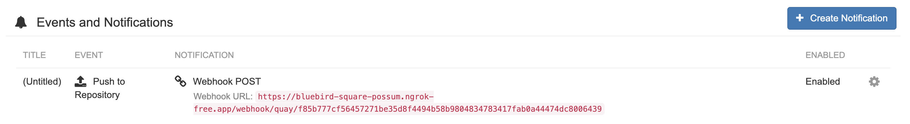

# Quay.io Webhook Receiver

The Quay.io webhook receiver responds to "Push to Repository" events originating
from Quay.io repositories by "refreshing" all `Warehouse` resources subscribed
to those repositories.

:::info

"Refreshing" a `Warehouse` resource means enqueuing it for immediate
reconciliation by the Kargo controller, which will execute the discovery of new
artifacts from all repositories to which that `Warehouse` subscribes.

:::

## Configuring the Receiver

A Quay.io webhook receiver must reference a Kubernetes `Secret` resource with a
`secret` key in its data map.

:::info

_This secret will not be shared directly with Quay.io._

Quay.io does not natively implement any mechanism whereby receivers may
authenticate inbound webhook requests. To compensate for this, Kargo
incorporates the secret into the generation of a hard-to-guess URL for the
receiver. This URL serves as a _de facto_
[shared secret](https://en.wikipedia.org/wiki/Shared_secret) and authentication
mechanism.

:::

:::note

The following commands are suggested for generating and base64-encoding a
complex secret:

```shell
secret=$(openssl rand -base64 48 | tr -d '=+/' | head -c 32)
echo "Secret: $secret"
echo "Encoded secret: $(echo -n $secret | base64)"
```

:::

```yaml
apiVersion: v1
kind: Secret
metadata:
  name: q-wh-secret
  namespace: kargo-demo
  labels:
    kargo.akuity.io/cred-type: generic
data:
  secret: <base64-encoded secret>
---
apiVersion: kargo.akuity.io/v1alpha1
kind: ProjectConfig
metadata:
  name: kargo-demo
  namespace: kargo-demo
spec:
  webhookReceivers: 
    - name: q-wh-receiver
      quay:
        secretRef:
          name: q-wh-secret
```

## Retrieving the Receiver's URL

Kargo will generate a hard-to-guess URL from the receiver's configuration. This
URL can be obtained using a command such as the following:

```shell
kubectl get projectconfigs kargo-demo \
  -n kargo-demo \
  -o=jsonpath='{.status.webhookReceivers}'
```

## Registering with Quay.io

To configure a single Quay.io repository to notify a receiver when objects (like
container images or Helm charts) have been pushed to it:

1. Navigate to `https://quay.io/repository/<account>/<repository>?tab=settings`,
   where `<account>` has been replaced with a Quay.io username or organization
   name and `<repository>` has been replaced with the name of a repository
   belonging to that account and for which you are an administrator.

    

1. In the <Hlt>Events and Notifications</Hlt> section, click
   <Hlt>Create Notification</Hlt>.

1. Complete the <Hlt>Create repository notification</Hlt> form.

    

    1. In the <Hlt>When this event occurs</Hlt> dropdown, select
       <Hlt>Push to Repository</Hlt>.

    1. In the <Hlt>Then issue a notification</Hlt> dropdown, select
       <Hlt>Webhook POST</Hlt>.

    1. Complete the <Hlt>Webhook URL</Hlt> field using the URL
       [for the webhook receiver](#retrieving-the-receivers-url).

    1. Click <Hlt>Create Notification</Hlt>.

    

:::info

Verifying delivery of webhook requests can be difficult as Quay.io offers a
mechanism for submitting test webhook requests, but offers no way to view the
results of such a request.

:::

:::info

For additional information on configuring Quay.io webhooks, refer directly to
the [Quay.io Docs](https://docs.quay.io/guides/notifications.html).

:::
