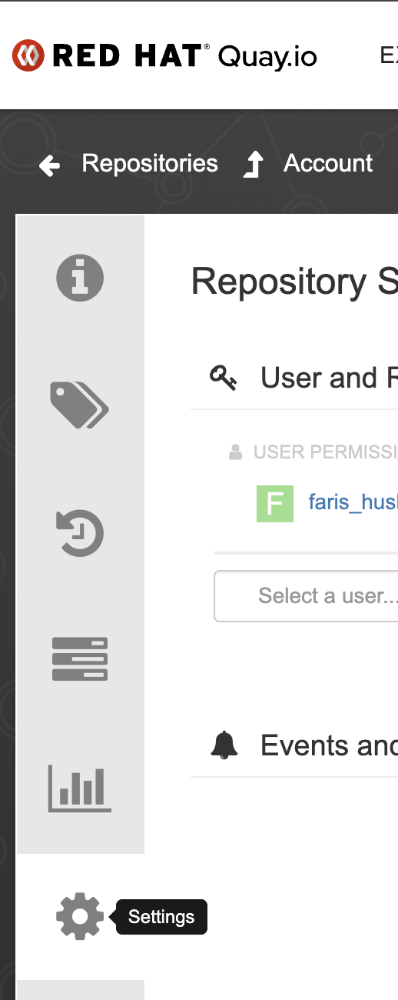
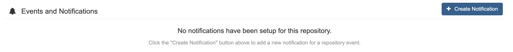
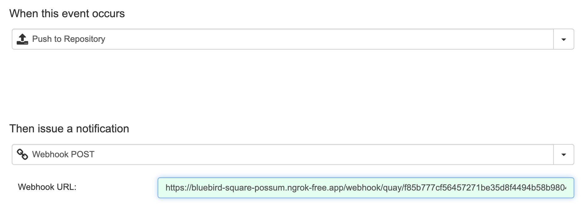
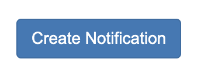
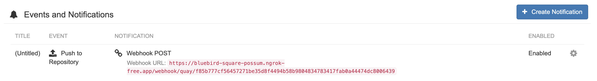

# The Quay Webhook Receiver

The Quay Webhook Receiver will respond to push events by refreshing any 
Warehouses subscribed to the repository from which the event originated.

## Configuring the Receiver

The Quay webhook receiver will need to reference a Kubernetes `Secret` with a
`secret` key in its data map.

:::note
The following command is suggested for generating a complex secret:

```shell
openssl rand -base64 48 | tr -d '=+/' | head -c 32
```

:::

```yaml
apiVersion: v1
kind: Secret
metadata:
  name: q-wh-secret
  namespace: kargo-demo
stringData:
  secret: <your-secret-here>
---
apiVersion: kargo.akuity.io/v1alpha1
kind: ProjectConfig
metadata:
  name: kargo-demo
  namespace: kargo-demo
spec:
  webhookReceivers: 
    - name: q-wh-receiver
      github:
        secretRef:
          name: q-wh-secret
```

## Retrieving the Receiver's URL

Kargo will generate a hard-to-guess URL from the configuration. We can obtain 
this URL using the following command:

```shell
  kubectl \
    get projectconfigs \
    kargo-demo \
    -n kargo-demo \
    -o=jsonpath='{.status.webhookReceivers}'
```


## Registering with Quay

1. In your repository dashboard, click <Hlt>Settings</Hlt> on the
  left-hand-side.



1. Scroll down to <Hlt>Events and Notifications</Hlt>.

1. Click <Hlt>Create Notification</Hlt>.



1. Select <Hlt>Push to Repository</Hlt> from the first dropdown menu( This is the only supported event for Quay at this time).

1. Select <Hlt>Webhook POST</Hlt> from the second dropdown menu.

 1. Set the <Hlt>Webhook URL</Hlt> to the value we retrieved from the 
    [Retrieving the Receiver's URL](#retrieving-the-receivers-url) section.



1. Click the <Hlt>Create Notification</Hlt> button.



1. You'll be redirected to your repository settings dashboard where you
  will see the webhook listed.



For additional information on configuring Quay notifications/webhooks, refer to the [Quay Docs](https://docs.quay.io/guides/notifications.html).
