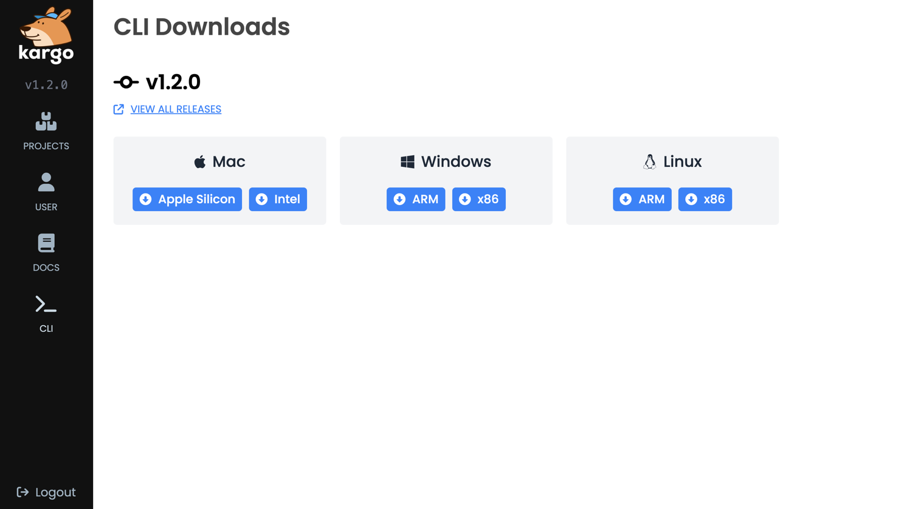

# Installing the Kargo CLI

Although its web-based UI provides the best user experience, Kargo also offers a
command line interface (CLI) for users who may prefer it.

1. Download the CLI binary.
    The easiest method of downloading the binary is by selecting
    <Hlt>CLI</Hlt> tab from the left navbar of the UI. There, you can select
    the appropriate binary for your operating system and CPU architecture.

    CLI downloads offered at this location will automatically match the version
    of your Kargo API server for optimum compatibility.

    Your downloaded binary will be suffixed with your OS and CPU architecture
    (e.g. `kargo-darwin-arm64`), so be sure to rename it to simply `kargo` (or
    `kargo.exe` for Windows).

    

    If you prefer, the following commands will download the latest version of
    the CLI for your specific OS and CPU architecture and will also rename the
    binary to `kargo` (or `kargo.exe` on Windows.)

    <Tabs groupId="os">
    <TabItem value="mac-linux-wsl" label="Mac, Linux, or WSL" default>

    ```shell
    arch=$(uname -m)
    [ "$arch" = "x86_64" ] && arch=amd64
    curl -L -o kargo https://github.com/akuity/kargo/releases/latest/download/kargo-"$(uname -s | tr '[:upper:]' '[:lower:]')-${arch}"
chmod +x kargo
    ```

    </TabItem>
    <TabItem value="windows" label="Windows Powershell">

    ```shell
    Invoke-WebRequest -URI https://github.com/akuity/kargo/releases/latest/download/kargo-windows-amd64.exe -OutFile kargo.exe
    ```

    </TabItem>
    </Tabs>

1. Regardless of your chosen download method, complete the installation by
   moving the binary to a location in your file system that is included in the
   value of your `PATH` environment variable.