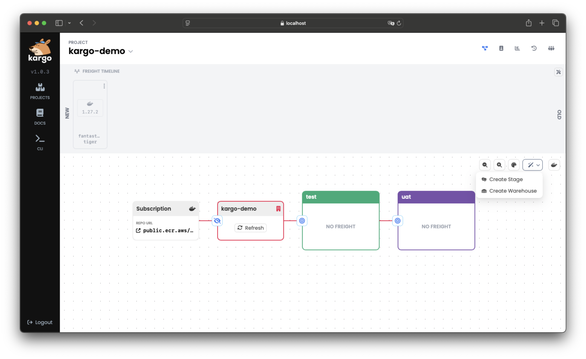
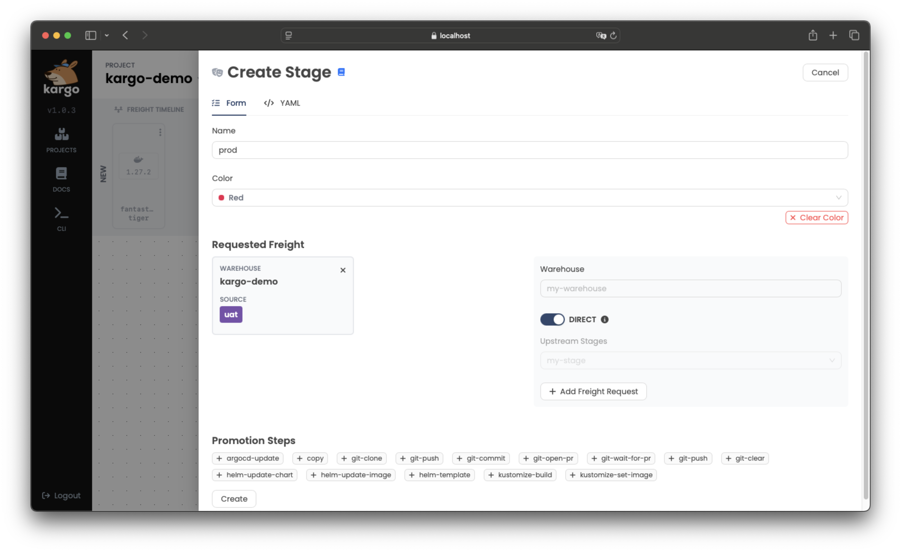
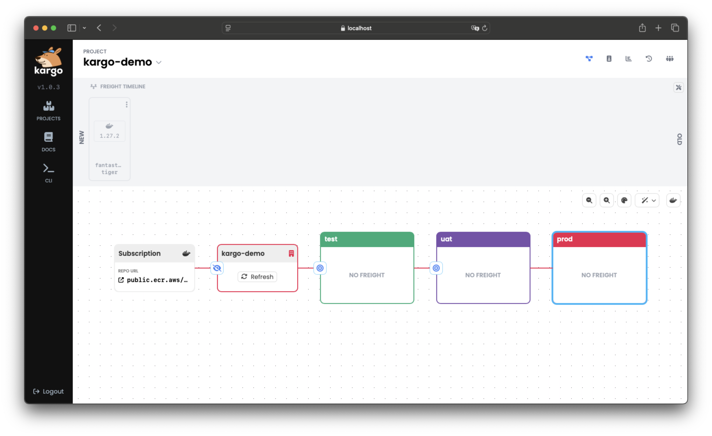
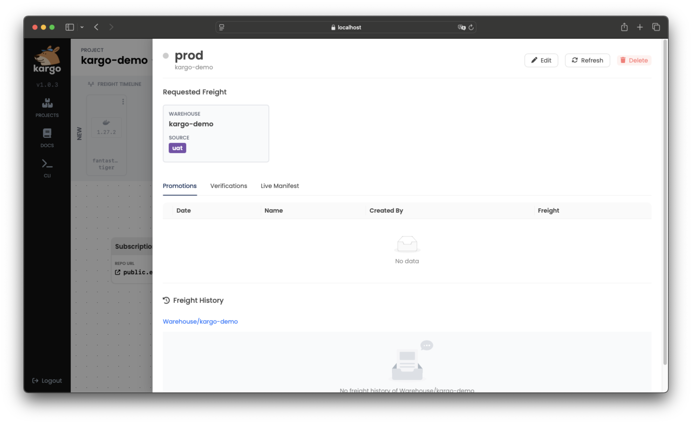
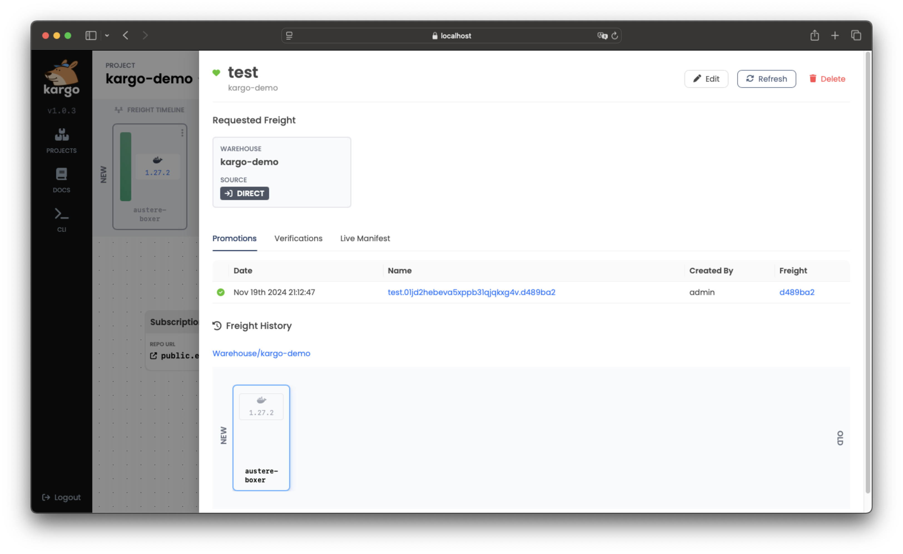
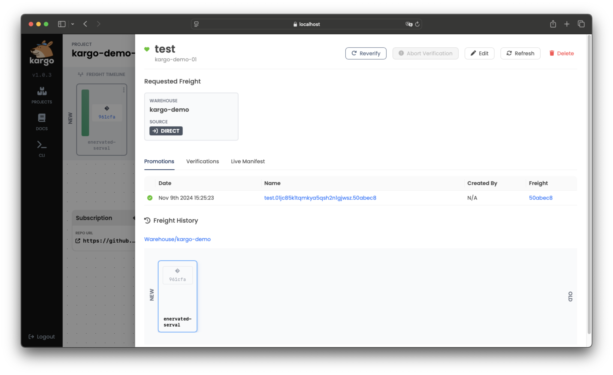
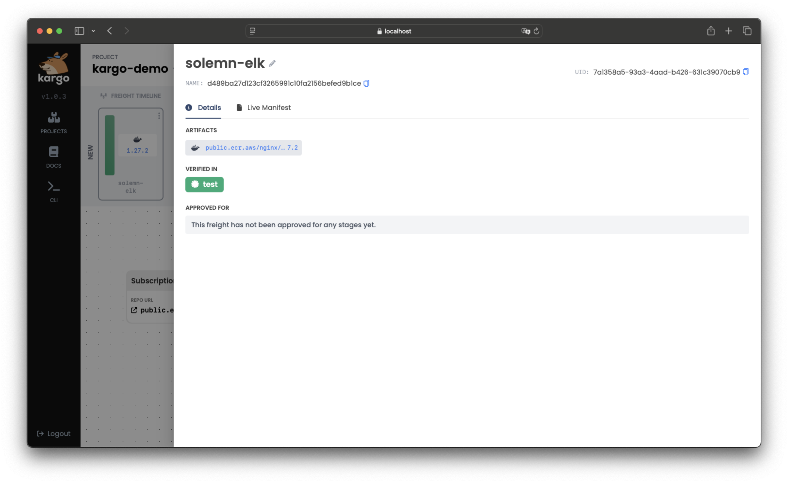

# Working with Stages

Each Kargo Stage is represented by a Kubernetes resource of type `Stage`.

## The `Stage` Resource Type

Like most Kubernetes resources, a `Stage` is composed of a user-defined `spec` field
and a system-populated `status` field.

A `Stage` resource's `spec` field is itself composed of three main areas of concern:

* Requested Freight

* Promotion template

* Verification

The following sections will explore each of these `spec` sections as well as `status` in greater detail.

### Requested Freight

The `spec.requestedFreight` field is used to describe one or more "types" of
`Freight`, as specified by an `origin`, that the `Stage`'s promotion process, as
specified by `spec.promotionTemplate`, will operate on, and the acceptable
sources from which to obtain that `Freight`. Those sources may include the
origin itself (e.g. a `Warehouse`) and/or any number of "upstream" `Stage`
resources.

:::info
`Warehouse`s are the only type of origin at present, but it is anticipated that
future versions of Kargo will introduce additional origin types. This is why
"types" of `Freight` are described by an `origin` field having `kind` and `name`
subfields instead of being described only by the name of a `Warehouse`.
:::

For each `Stage`, the Kargo controller will periodically check for `Freight`
resources that are newly available for promotion to that `Stage`.

When a `Stage` accepts `Freight` directly from its origin, _all_ new `Freight`
created by that origin (e.g. a `Warehouse` ) are immediately available for
promotion to that `Stage`.

When a `Stage` accepts `Freight` from one or more "upstream" `Stage` resources,
`Freight` is considered available for promotion to that `Stage` only after being
_verified_ in at least one of the upstream `Stage`s. Alternatively, users with
adequate permissions may manually _approve_ `Freight` for promotion to any given
`Stage` without requiring upstream verification.

:::tip
Explicit approvals are a useful method for applying the occasional "hotfix"
without waiting for a `Freight` resource to traverse the entirety of a pipeline.
:::

In the following example, the `test` `Stage` requests `Freight` that has
originated from the `my-warehouse` `Warehouse` and indicates that it will accept
new `Freight` _directly_ from that origin:

```yaml
apiVersion: kargo.akuity.io/v1alpha1
kind: Stage
metadata:
  name: test
  namespace: kargo-demo
spec:
  requestedFreight:
  - origin:
      kind: Warehouse
      name: my-warehouse
    sources:
      direct: true
  # ...
# ...
```

In this example, the `uat` `Stage` requests `Freight` that has originated from
the `my-warehouse` `Warehouse`, but indicates that it will accept such `Freight`
only after it has been _verified_ in the `test` `Stage`:

```yaml
apiVersion: kargo.akuity.io/v1alpha1
kind: Stage
metadata:
  name: uat
  namespace: kargo-demo
spec:
  requestedFreight:
  - origin:
      kind: Warehouse
      name: my-warehouse
    sources:
      stages:
      - test
  # ...
```

Stages may also request `Freight` from multiple sources. The following example
illustrates a `Stage` that requests `Freight` from both a `microservice-a` and
`microservice-b` `Warehouse`:

```yaml
apiVersion: kargo.akuity.io/v1alpha1
kind: Stage
metadata:
  name: test
  namespace: kargo-demo
spec:
  requestedFreight:
  - origin:
      kind: Warehouse
      name: microservice-a
    sources:
      direct: true
  - origin:
      kind: Warehouse
      name: microservice-b
    sources:
      direct: true
  # ...
```

:::tip
By requesting `Freight` from multiple sources, a `Stage` can effectively
participate in _multiple pipelines_ that may each deliver different collections
of artifacts independently of the others.

__This is _advanced_ configuration. If you're very new to Kargo
and requesting `Freight` from multiple origins, you probably
didn't mean to.__
:::

### Promotion Templates

The `spec.promotionTemplate` field is used to describe _how_ to transition
`Freight` into the `Stage`. The `spec.promotionTemplate.steps` field describes
the discrete steps of a promotion process in detail.

In the following, very common example, the `promotionTemplate` describes steps
to:

1. Clone a Git repository containing Kubernetes manifests and Kustomize
   configuration, checking out two different branches to two different
   directories.

1. Clears the contents of one working tree, with intentions to fully replace its
   contents.

1. Runs the equivalent of `kustomize edit set image` to update a
   `kustomization.yaml` file with a reference to an updated
   `public.ecr.aws/nginx/nginx` container image.

1. Renders the updated manifests using the equivalent of `kustomize build`.

1. Commits the updated manifests and pushes them to the `stage/test` of the
   remote repository.

1. Forces Argo CD to sync the `kargo-demo-test` application to the latest commit
   of the `stage/test` branch.

```yaml
promotionTemplate:
  spec:
    vars:
    - name: gitopsRepo
      value: https://github.com/example/repo.git
    - name: imageRepo
      value: public.ecr.aws/nginx/nginx
    - name: srcPath
      value: ./src
    - name: outPath
      value: ./out
    - name: targetBranch
      value: stage/${{ ctx.stage }}
    steps:
    - uses: git-clone
      config:
        repoURL: ${{ vars.gitopsRepo }}
        checkout:
        - branch: main
          path: ${{ vars.srcPath }}
        - branch: stage/${{ ctx.stage }}
          create: true
          path: ${{ vars.outPath }}
    - uses: git-clear
      config:
        path: ${{ vars.outPath }}
    - uses: kustomize-set-image
      as: update-image
      config:
        path: ${{ vars.srcPath }}/base
        images:
        - image: ${{ vars.imageRepo }}
    - uses: kustomize-build
      config:
        path: ${{ vars.srcPath }}/stages/${{ ctx.stage }}
        outPath: ${{ vars.outPath }}/manifests.yaml
    - uses: git-commit
      as: commit
      config:
        path: ${{ vars.outPath }}
        messageFromSteps:
        - update-image
    - uses: git-push
      config:
        path: ${{ vars.outPath }}
        branch: ${{ vars.targetBranch }}
    - uses: argocd-update
      config:
        apps:
        - name: kargo-demo-${{ ctx.stage }}
          sources:
          - repoURL: ${{ vars.gitopsRepo }}
            desiredRevision: ${{ outputs.commit.commit }}
```

:::info
For complete documentation of all Kargo's built-in promotion steps, refer
to the [Promotion Steps Reference](../60-reference-docs/30-promotion-steps/index.md).
:::

### Verification

The `spec.verification` field is used to describe optional verification
processes that should be executed after a `Promotion` has successfully deployed
`Freight` to a `Stage`, and if applicable, after the `Stage` has reached a
healthy state. The following example depicts a `Stage` resource that references
an `AnalysisTemplate` named `integration-test` to validate the `dev` `Stage` after
any successful promotion:

```yaml
apiVersion: kargo.akuity.io/v1alpha1
kind: Stage
metadata:
  name: dev
  namespace: guestbook
spec:
  # ...
  verification:
    analysisTemplates:
    - name: integration-test
```

:::info
For complete documentation of how to perform verification, refer to the
[Verification Guide](./16-verification.md).
:::

### Status

The `status` field of a `Stage` resource records:

  * Conditions containing the last observations of the `Stage`'s current state.

  * The current phase of the `Stage`'s lifecycle (distilled from the conditions).

  * Details about the last `Promotion` and any in-progress `Promotion`.

  * History of `Freight` that has been deployed to the `Stage` (from most to
    least recent) along with the results of any associated verification processes.

  * The health status of related Argo CD `Application` resources.

For example:

```yaml
status:
  freightHistory:
  - id: 101bca5b0e18ca7913978a1da956308d2544f741
    items:
      Warehouse/my-warehouse:
        commits:
        - healthCheckCommit: 111eaf55aa41f21bb9bb707ba1baa748b83ec51e
          id: 961cfaedbc53aacdb65110028839a2c1c281290d
          repoURL: https://github.com/example/kargo-demo.git
        images:
        - digest: sha256:b2487a28589657b318e0d63110056e11564e73b9fd3ec4c4afba5542f9d07d46
          repoURL: public.ecr.aws/nginx/nginx
          tag: 1.27.0
        name: 666209fd9755a1e48bec6b27f5f447747410dd9e
        origin:
          kind: Warehouse
          name: my-warehouse
    verificationHistory:
    - analysisRun:
        name: test.01j2w7aknhf3j7jteyqs72hnbg.101bca5
        namespace: kargo-demo
        phase: Successful
      finishTime: "2024-07-15T22:13:57Z"
      id: 5535a484-bbd0-4f12-8cf4-be2c8e0041c9
      phase: Successful
      startTime: "2024-07-15T22:13:34Z"
  health:
    argoCDApps:
    - healthStatus:
        status: Healthy
      name: kargo-demo-test
      namespace: argocd
      syncStatus:
        revision: 111eaf55aa41f21bb9bb707ba1baa748b83ec51e
        status: Synced
    status: Healthy
  lastPromotion:
    finishedAt: "2024-07-15T22:13:25Z"
    freight:
      commits:
      - healthCheckCommit: 111eaf55aa41f21bb9bb707ba1baa748b83ec51e
        id: 961cfaedbc53aacdb65110028839a2c1c281290d
        repoURL: https://github.com/example/kargo-demo.git
      name: 666209fd9755a1e48bec6b27f5f447747410dd9e
      origin:
        kind: Warehouse
        name: kargo-demo
    name: test.01j2w7a15cxjjgejresfyw6ysp.666209f
    status:
      finishedAt: "2024-07-15T22:13:25Z"
      freight:
        commits:
        - healthCheckCommit: 111eaf55aa41f21bb9bb707ba1baa748b83ec51e
          id: 961cfaedbc53aacdb65110028839a2c1c281290d
          repoURL: https://github.com/example/kargo-demo.git
        name: 666209fd9755a1e48bec6b27f5f447747410dd9e
        origin:
          kind: Warehouse
          name: kargo-demo
      freightCollection:
        id: 101bca5b0e18ca7913978a1da956308d2544f741
        items:
          Warehouse/kargo-demo:
            commits:
            - healthCheckCommit: 111eaf55aa41f21bb9bb707ba1baa748b83ec51e
              id: 961cfaedbc53aacdb65110028839a2c1c281290d
              repoURL: https://github.com/example/kargo-demo.git
            name: 666209fd9755a1e48bec6b27f5f447747410dd9e
            origin:
              kind: Warehouse
              name: kargo-demo
        verificationHistory:
        - analysisRun:
            name: test.01j2w7aknhf3j7jteyqs72hnbg.101bca5
            namespace: kargo-demo
            phase: ""
          id: 5535a484-bbd0-4f12-8cf4-be2c8e0041c9
          phase: Pending
          startTime: "2024-07-15T22:13:34Z"
      phase: Succeeded
  observedGeneration: 1
  phase: Steady
```

## Interacting with Stages

Kargo provides tools to manage Stages using either its UI or
CLI. This section explains how to handle Stages effectively through both interfaces.

:::info
Users with credentials for and sufficient permissions within the Kargo control plane's Kubernetes cluster can also manage `Stage` resources using `kubectl`.
:::

### Creating a Stage

<Tabs groupId="create-stage">
<TabItem value="ui" label="Using the UI" default>

1. Navigate to your Project in the Kargo UI and locate the action menu in the upper right corner of the pipeline:

   

1. Click the magic wand icon to open the dropdown, then select <Hlt>Create Stage</Hlt>.

   A form will appear to input details for a new `Stage`:

   

1. Complete the form with the necessary details and submit it.

   The new `Stage` will be added to the pipeline, connected to other
   `Stage`s based on your configuration:

   

</TabItem>

<TabItem value="cli" label="Using the CLI">

1. Define the `Stage` in a YAML file, for example:

    ```yaml
    apiVersion: kargo.akuity.io/v1alpha1
    kind: Stage
    metadata:
      name: <stage>
      namespace: <project>
    spec:
      ### Add your Stage specifications here
    ```

1. Save the file and run:

    ```shell
    kargo create -f <filename>
    ```

1. Verify the creation by listing `Stage`s:

    ```shell
    kargo get stage <stage> --project <project>
    ```

</TabItem>
</Tabs>

### Promoting Freight to a Stage

:::note
**Maintainers Note**

Placeholder
:::

### Deleting a Stage

<Tabs groupId="delete-stage">
<TabItem value="ui" label="Using the UI" default>

1. Select the `Stage` you want to remove.

1. Click <Hlt>Delete</Hlt> in the upper right corner of the pop-up window:

   

</TabItem>

<TabItem value="cli" label="Using the CLI">

To delete a `Stage` using the CLI, run:

```shell
kargo delete stage <stage> --project <project>
```

</TabItem>
</Tabs>

### Refreshing a Stage

Refreshing a `Stage` triggers its reconciliation process, which
includes checking for any newly-completed Promotions, queueing
up the next, pending Promotion, when applicable, and executing
any applicable health check processes.

<Tabs groupId="refresh-stage">
<TabItem value="ui" label="Using the UI" default>

1. Select the `Stage` you want to refresh.

1. Click <Hlt>Refresh</Hlt> in the top-right corner of the pop-up window:

   

</TabItem>

<TabItem value="cli" label="Using the CLI">

To refresh a `Stage`, run:

```shell
kargo refresh stage <stage> --project <project>
```

</TabItem>
</Tabs>

### Reverifying a Stage's Current Freight

Verification processes, which run automatically following each successful Promotion,
can also be re-run on-demand. This is useful for re-attempting a failed verification
process or just to validate that applications within the `Stage` are performing
as desired.

<Tabs groupId="verify-stage">
<TabItem value="ui" label="Using the UI" default>

1. Select the `Stage` you want to reverify and click <Hlt>Reverify</Hlt> at the top of the menu:

    

    :::note
    If you wish to stop the in-progress verification, you can click <Hlt>Abort Verification</Hlt>.
    :::

1. To check the `Stage`s where the `Freight` has been successfully verified, return to 
    the <Hlt>Freight Timeline</Hlt> and select the `Freight`. Verified `Stage` names will appear under <Hlt>VERIFIED IN</Hlt>:

    

</TabItem>

<TabItem value="cli" label="Using the CLI">

1. To rerun verification using the CLI run:

    ```shell
    kargo verify stage <stage> --project <project> 
    ```

    If you want to *stop* this ongoing verification process, use:

    ```shell
    kargo verify stage <stage> --project <project> --abort
    ```
1. To check the `Stage`s where the `Freight` has been successfully verified, run:

    ```shell
    kargo get freight \
    --project <project> \
    --output jsonpath-as-json={.status}
    ```

</TabItem>
</Tabs>
