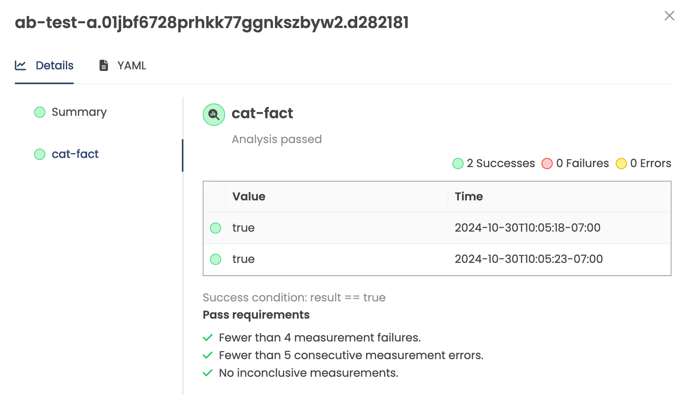

# Verifying a Stage after Promotion

After successfully promoting a Freight into a Stage, it is often desired to verify the update was successful. Verification is an optional, user-defined process that qualifies Freight in a Stage. Common examples of verification include:
* Executing containerized integration test scripts
* Querying monitoring tools (e.g. DataDog, Prometheus) and measuring application KPIs
* Performing HTTP requests to internal services or systems and interpreting response as success/fail
* Running load generation tests

When a Stage with verification acts as an upstream to other Stages, Freight must pass verification in that Stage before it is eligible to be promoted to the downstream Stages in the pipeline.

## Configuring Verification

A Stage can be configured with verification by referencing one or more `AnalysisTemplates` in its `spec.verification` field. In the following example, the `dev` `Stage` references an `AnalysisTemplate` named `integration-test`, which executes after any successful Promotion.

```yaml
apiVersion: kargo.akuity.io/v1alpha1
kind: Stage
metadata:
  name: dev
  namespace: guestbook
spec:
  # ...
  verification:
    analysisTemplates:
    - name: integration-test
```

## Configuring AnalysisTemplates

An [AnalysisTemplate](../60-reference-docs/50-analysis-templates.md) defines instructions how to perform verification. It might include running a Kubernetes Job, query monitoring tools, interpreting their result, performing HTTP requests, or any combination of these actions. AnalysisTemplates reside in the same `Project` Namespace of the `Stage` from which they are referenced. The following simple `AnalysisTemplate` example will create a Kubernetes `Job` that runs an alpine container that sleeps for 10 seconds.

```yaml
apiVersion: argoproj.io/v1alpha1
kind: AnalysisTemplate
metadata:
  name: integration-test
  namespace: guestbook
spec:
  metrics:
  - name: integration-test
    provider:
      job:
        spec:
          template:
            spec:
              containers:
              - name: sleep
                image: alpine:latest
                command: [sleep, "10"]
              restartPolicy: Never
          backoffLimit: 1
```

:::info
For further documentation and examples of AnalysisTemplates, refer to the
[`AnalysisTemplate` reference](../60-reference-docs/50-analysis-templates.md).
:::

## How Verification Works

Upon successful promotion, a Stage enters the `Verifying` phase. Any AnalysisTemplates which were referenced in the Stage are invoked into an resource called an `AnalysisRun`, which represents a single invocation of the templates into a batch-like object. 


When the `AnalysisRun` completes and is `Successful`, the verification is considered successful and Freight is marked as "verified" in that Stage. This makes it possible for the Freight to promoted to any immediate downstream Stages, either automatically (with auto-promotion) or manually (via UI, API, CLI). Freight which have not passed verification in a Stage are blocked from being able to continue to downstream Stages.


:::tip
It is sometimes desired to skip the verification process entirely (e.g. a hotfix needs to be fast-tracked to production). Verification (and the entire Pipeline for that matter) can be bypassed by [manually approving](working-with-freight#manual-approvals) a Freight for a specified Stage.
:::


While a Stage is verifying (i.e. the `AnalysisRun` is not yet completed) no new Promotions will run until verification has completed (either successfully or unsuccessfully). Once verification has completed, the next queued Promotion will run.

## AnalysisRun

An AnalysisRun is a resource representing a verification attempt for a combination of Freight and Stage. AnalysisRuns have a lifecycle (e.g. Running, Successful, Failed) and record the measurements taken during the run. AnalysisRuns appear in the Kargo UI under the Verifications tab of a stage:



The following might be an example of a `AnalysisRun` spawned from the `integration-test` template:

```yaml
apiVersion: argoproj.io/v1alpha1
kind: AnalysisRun
metadata:
  creationTimestamp: 2025-01-28T20:47:50Z
  generation: 3
  labels:
    kargo.akuity.io/freight-collection: 55d452301040a73e9fd05289b1f8ddbec1791222
    kargo.akuity.io/promotion: dev.01jjpfgfwkzk18k7cyq61jehf4.319ddec
    kargo.akuity.io/stage: dev
  name: dev.01jjqaq7qacfn766tcp1nqz2zv.55d4523
  namespace: guestbook
  ownerReferences:
    - apiVersion: kargo.akuity.io/v1alpha1
      blockOwnerDeletion: false
      kind: Freight
      name: 319ddec6bbfbd808d499a0357b027e773aa3707f
      uid: fb0db653-92af-420b-9092-0c7bf9be290e
  resourceVersion: "54013326"
  uid: 8cb745cb-554b-4141-80ee-e0df181cd56e
spec:
  metrics:
  - name: integration-test
    provider:
      job:
        spec:
          template:
            spec:
              containers:
              - name: sleep
                image: alpine:latest
                command: [sleep, "10"]
              restartPolicy: Never
          backoffLimit: 1
status:
  dryRunSummary: {}
  message: Metric "integration-test" assessed Failed due to failed (1) > failureLimit (0)
  metricResults:
    - count: 1
      failed: 1
      measurements:
        - finishedAt: 2025-01-28T20:50:31Z
          metadata:
            job-name: 8cb745cb-554b-4141-80ee-e0df181cd56e.integration-test.1
            job-namespace: guestbook
          phase: Failed
          startedAt: 2025-01-28T20:47:50Z
      name: integration-test
      phase: Failed
  phase: Failed
  runSummary:
    count: 1
    failed: 1
  startedAt: 2025-01-28T20:47:50Z
```

:::note
The difference between an `AnalysisTemplate` versus an `AnalysisRun` is that an `AnalysisTemplate` is the _definition_ how to perform verification, and the `AnalysisRun` tracks the _progress and result_ of an run of one or more template(s).
:::


##  Arguments and Metadata

It is also possible to specify additional labels, annotations, and arguments
that should be applied to `AnalysisRun` resources spawned from the referenced
`AnalysisTemplate`:

```yaml
apiVersion: kargo.akuity.io/v1alpha1
kind: Stage
metadata:
  name: test
  namespace: kargo-demo
spec:
  # ...
  verification:
    analysisTemplates:
    - name: kargo-demo
    analysisRunMetadata:
      labels:
        foo: bar
      annotations:
        bat: baz
    args:
    - name: foo
      value: bar
```

## Implicit Argo CD Verification

It is usually the desire to wait until a deployment is fully rolled out and updated, before performing any testing and verification. For example, it would be premature to start running tests if a Deployment's Pods were still coming up and or not fully updated to the desired version. Promotions might only include the apply/sync of new manifests to the cluster, but do not not necessarily wait until the rollout was fully complete (which might take minutes depending on many factors like Pod startup time).

In order to prevent verification from starting before Applications are ready, Kargo has a built in understanding of Argo CD health, and will delay beginning verification until the Application had reached a Healthy state.

If a Stage references one ore more Argo CD Applications as part of its promotion steps, after Promotion, Kargo will automatically wait until the Argo CD Applications reach a `Healthy` state. This is an built-in, "implicit" form of verification that is not configured explicitly in the `spec.verifications`. After the Applications reaches the `Healthy` state, Kargo will then run the specified verifications in `spec.verifications` (if any). This ensures that testing begins only after all resources of the Application have been successfully updated after the promotion.


## Soak Times

In some scenarios, automated testing may be unavailable or insufficient to ensure confidence before promoting software to critical environments. To mitigate this, users often resort to letting the release run in a lower environment for a period of time, monitoring its behavior and stability before proceeding with promotion. This practice is commonly known as 'soaking' or 'baking' the release before it reaches production.

Kargo features a "soak time" option in Stages when it requests Freight from upstream stages. To configure a soak time, a duration string can `spec.requestedFreight[].requiredSoakTime`. Valid durations are in seconds, minutes or hours (e.g. `180s`, `30m`, `48h`). This duration is the minimum duration (beginning after successful promotion), for which the requested Freight must have continuously occupied ("soaked in") in an upstream Stage before becoming available for promotion to this Stage. Automated and manual promotions would be blocked until the soakTime requirement was met.

```yaml
apiVersion: kargo.akuity.io/v1alpha1
kind: Stage
metadata:
  name: prod
  namespace: guestbook
spec:
  requestedFreight:
  - origin:
      kind: Warehouse
      name: guestbook
    sources:
      stages:
      - uat
    requiredSoakTime: 1h
 # Omitted for brevity...
```

:::note
Soak Time is not technically a verification feature, but is documented alongside verification since both features are closely related and may be used in conjunction with each other. Both relate to prevention of Freight promotion from upstream Stages based on required conditions and behavior.
:::


## ClusterAnalysisTemplates

References to ClusterAnalysisTemplates are currently unsupported but is expected to be in a future release.
