# Patterns

With Kargo being mostly unopinionated, the full range of what you can accomplish
with it is vast. Sometimes, that open-endedness can be overwhelming. This
section attempts to enumerate, describe, and assign names to common solutions
for common use cases. 

As tends to be the case with patterns, these were not invented so much as they
were _discovered_. What we describe here is a distillation of things that have
worked well for us and for other users. Importantly, the patterns described here
can be tweaked to suit your needs and can even be _combined_ with one another to
address more complex use cases.

All patterns presented here will assume Argo CD as the GitOps agent.

:::note
The intent of this section is _not_ to constrain solutions to these patterns,
but to provide inspiration and guidance on how Kargo's flexibility can be
leveraged creatively.
:::

## Pipeline Structure

"Pipelines" are not a formal concept in Kargo, but a term we casually use to
reference the directed acyclic graph (DAG) of resources like `Warehouse`s and
`Stage`s that define the flow of artifacts from their sources to their ultimate
destinations.

The patterns in this section are structural in nature. They describe common
scenarios and strategies for addressing them _through careful pipeline design._

### Image Updater

This simple pattern fills a similar niche to that of
[Argo CD Image Updater](https://argocd-image-updater.readthedocs.io/en/stable/).
You might consider applying this if your only concern is updating the image used
by some application as new versions become available. One advantage of
approaching this with Kargo is that updates are rolled out stage by stage, with
a failure in a "test" stage, for instance, preventing the same update from
progressing to other stages, including production.

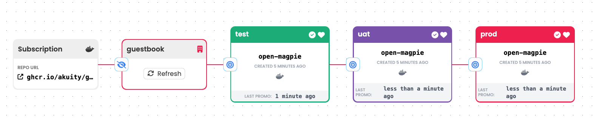

To apply this pattern:

1. Create a single `Warehouse` that subscribes to an image repository with
   appropriate criteria so as to continuously identify the image revision you
   would consider to be newest. Each time it discovers a new image revision, the
   `Warehouse` will produce a new `Freight` resource that references it.

1. Connect any number of `Stage`s to this `Warehouse`. As `Freight` originating
   from it are promoted to each `Stage`, they will utilize a simple promotion
   process that:
    1. Updates some stage-specific configuration in a Git repository to
       reference the new image revision.
    1. Triggers an associated Argo CD `Application` to sync with the updated
       configuration.

### Config Updater

This simple pattern continuously monitors a Git repository for configuration
changes. A distinct advantage of this pattern is that a single configuration
change that is intended to be rolled out to _all_ stages can be applied just
once in the application's "base" configuration, but Kargo can _still_ promote
the change stage by stage.

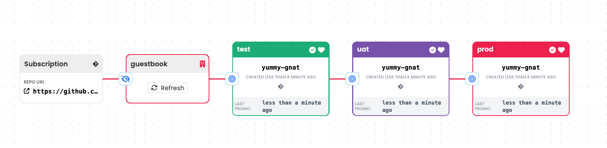

To apply this pattern:

1. Create a single `Warehouse` that subscribes to a Git repository with
   appropriate criteria so as to continuously identify the commit containing
   the configuration you would consider to be newest. Typically this is simply
   whatever commit is at the head of your `main` branch. Each time it discovers
   a new commit, the `Warehouse` will produce a new `Freight` resource that
   references it.

1. Connect any number of `Stage`s to this `Warehouse`. As `Freight` originating
   from it are promoted to each `Stage`, they will utilize a simple promotion
   process that:
    1. Uses a configuration management tool like Kustomize or Helm to combine
       the application's "base" configuration with stage-specific configuration.
    1. Writes the combined configuration to a Git repository.
    1. Triggers an associated Argo CD `Application` to sync with the combined
       configuration.

:::note
The combined configuration can be written to the same Git repository that is
monitored by the `Warehouse` or an entirely separate repository.

If writing to the same repository, the combined configuration should be written
to a different (possibly stage-specific) branch _or_ to a specific path within
the `main` branch that is _ignored_ by the `Warehouse` so as not to
created a "feedback loop."

This is discussed in greater details in the [Storage Options](#storage-options)
section.
:::

:::info
This pattern can still update the image used by an application, but it treats
such a change as it would any other configuration change. i.e. It does not occur
automatically as in the [Image Updater](#image-updater) pattern, but any
user-initiated update of application configuration to reference a new image
revision will be rolled out in the same way as any other configuration change.
:::

### Common Case

The common case combines the qualities of the [Image Updater](#image-updater)
and [Config Updater](#config-updater) patterns.

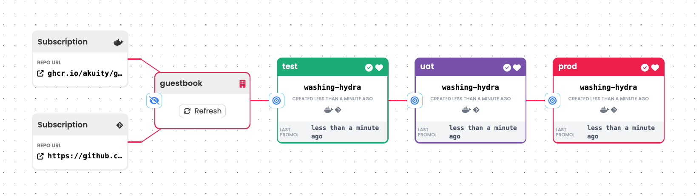

To apply this pattern:

1. Create a single `Warehouse` that subscribes to an image repository _and_ a
   Git repository with appropriate criteria so as to continuously identify the
   image revision and commit you would consider to be newest. Each time it
   discovers a new image revision, a new commit, _or both_, the `Warehouse` will
   produce a new `Freight` resource referencing both an image revision _and_ a
   commit. Being referenced by a single `Freight` resource, the two artifacts
   will be promoted from stage to stage _together as a unit_.

1. Connect any number of `Stage`s to this `Warehouse`. As `Freight` originating
   from it are promoted to each `Stage`, they will utilize a simple promotion
   process that:
    1. Updates some stage-specific configuration to reference the new image
       revision _and_ uses a configuration management tool like Kustomize or
       Helm to combine the application's "base" configuration with the updated
       stage-specific configuration.
    1. Writes the combined configuration to a Git repository.
    1. Triggers an associated Argo CD `Application` to sync with the combined
       configuration.

:::note
The combined configuration can be written to the same Git repository that is
monitored by the `Warehouse` or an entirely separate repository.

If writing to the same repository, the combined configuration should be written
to a different (possibly state-specific) branch _or_ to a specific path within
the `main` branch that is _ignored_ by the `Warehouse` so as not to
created a "feedback loop."

This is discussed in greater details in the [Storage Options](#storage-options)
section.
:::

### Parallel Pipelines

Kargo does not require that all resources within a single `Project` participate
in a single DAG. Multiple, disconnected DAGs can exist within a single `Project`
to effect completely independent workflows for different applications.

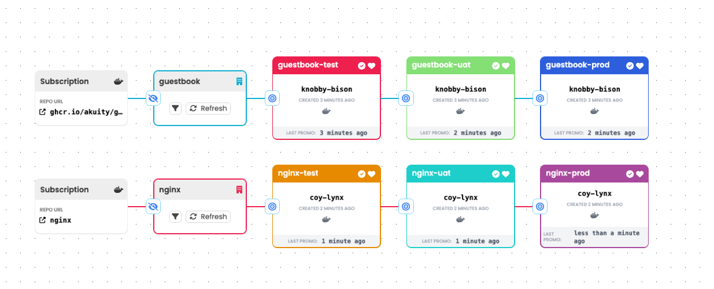

:::info
The choice to define multiple, independent pipelines within a single `Project`
might be made on the basis of organizational structure. If, for instance, a
single team is responsible for multiple, related microservices, it may make
sense to manage them together in a single `Project`.
:::

### Pre-Pipelines

A "pre-pipeline" can be used to "convert" pipelines implementing patterns such
as the [Common Case](#common-case) into a simpler pipeline such as one
implementing the [Config Updater](#config-updater) pattern.

To apply this pattern, a single `Stage` in the "pre-pipeline" can create new
artifacts that are subscribed to by a second pipeline's `Warehouse`:

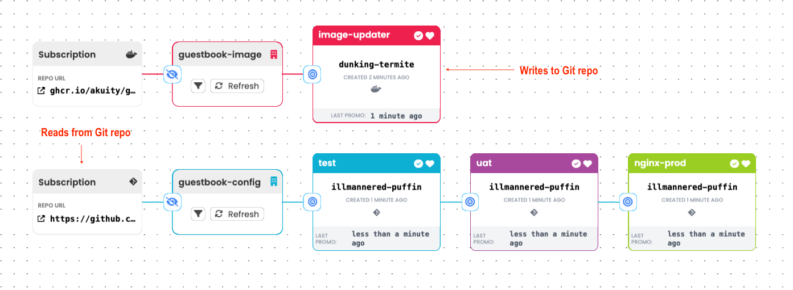

### Grouped Services

In an ideal world, the lifecycles of all services or microservices would be
completely independent of one another. That flexibility, after all, is one of
the main benefits of a microservice architecture. But we don't live in an ideal
world and it's not uncommon, for instance, that changes to the front end of an
application cannot be promoted without also promoting corresponding updates to
the back end.

Two specific features of Kargo can help to manage such scenarios:

1. Artifacts referenced by a single `Freight` resource are promoted from stage
   to stage _together as a unit_.

1. "Stage" can mean whatever your use case requires it to mean.

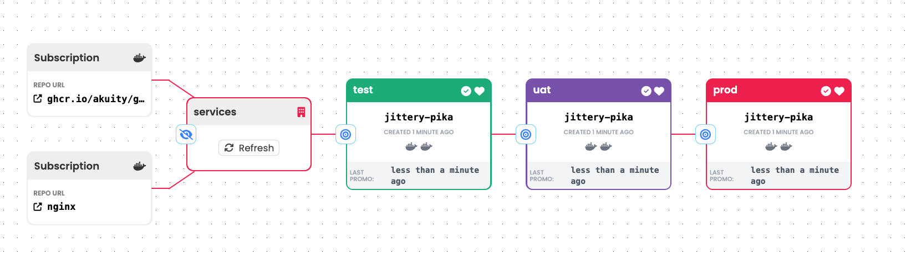

To move related artifacts through a pipeline together:

1. Create a single `Warehouse` that subscribes to the repositories of all
   relevant artifacts. Each time it discovers a new revision of any, _or all_,
   of them the `Warehouse` will produce a new `Freight` resource referencing one
   revision of each. Being referenced by a single `Freight` resource, these
   artifacts will be promoted from stage to stage _together as a unit_.

1. Connect any number of `Stage`s to this `Warehouse`. Here, each `Stage`
   represents a promotion target for _multiple services_. As `Freight`
   originating from the one `Warehouse` are promoted to each `Stage`, they will:
    1. Use a suitable process to combine the artifacts into stage-specific
       configuration(s).
    1. Write the combined configurations to a Git repository.
    1. Trigger _one or more_ associated Argo CD `Application` resources to sync
       with the combined configurations.

:::info
A single Argo CD `Application` resource _can_ manage the deployment of multiple
related services -- a fact you may sometimes wish to leverage in the case of
services that are tightly coupled.
:::

:::warning
If you find yourself creating `Warehouse` resources that subscribe to a large
number of repositories to create `Freight` resources that reference a large
number of artifacts that will all be promoted from stage to stage _together as a
unit_, it is advisable to stop and ask yourself if coupling the promotion of so
many artifacts was truly your intent. In many cases, users who have found
themselves doing something such as this have done so without understanding the
options that may have served their use case better.
:::

### Ordered Services

In a variation on the [Grouped Services](#grouped-services) pattern, you may
further require that related services be updated in a specific order. For
instance, it would not be uncommon to require that changes to an application's
back end be promoted prior to any changes to its front end. There are a number
of ways to approach this.

1. Leverage Your GitOps Agent

   Argo CD, for instance, has a feature called
   [sync waves](https://argo-cd.readthedocs.io/en/stable/user-guide/sync-waves/)
   that can be used to control the order in which resources are synchronized.

1. Serialize `Application` syncs

   Instead of concluding a promotion process by triggering one or more Argo CD
   `Application` resources to sync all at once, a promotion process may be
   designed to trigger `Application` syncs _sequentially_, either at the end of
   the process, or one at a time as other specific steps of the process are
   completed.

1. Leverage the flexible definition of "stage"

   By defining a pipeline like so, a _subset_ of artifacts referenced by a
   `Freight` resource can be "dropped off" at each `Stage`:

   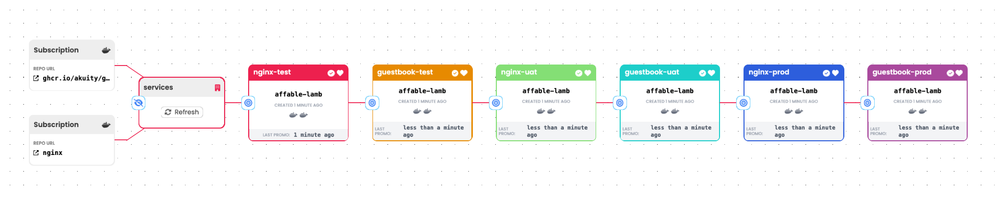

   :::note
   In this example, with alternating stages promoting a _different subsets_ of
   the artifacts referenced by a `Freight` resource, there are two (slightly)
   _different_ promotion processes used by alternating stages.
   :::

### Fanning Out / In

When assembling a promotion pipeline from many `Stage` resources, it is not
required that the pipeline be strictly linear.

It is plausible, for instance, that after a `Freight` resource has been promoted
to a "test" stage and passed some battery of tests, that it should next be
promoted to two _different_ stages for distinct purposes. Perhaps, for instance,
it may be promoted to _both_ a "qa" stage and a "uat" stage. In the "qa" stage,
QA engineers will try their hardest to break the application, which could be
disruptive to a product owner attempting to validate that business requirements
have been met -- if not for the product owner's own "uat" stage. This is an
example of "fanning out."

When fanning out is applied, it is also possible to promote `Freight` to
multiple "downstream" stages simultaneously.

"Fanning in" is the inverse of fanning out. It is a case where a single stage
can have `Freight` promoted to it after passing required tests in any one of
multiple "upstream" stages.

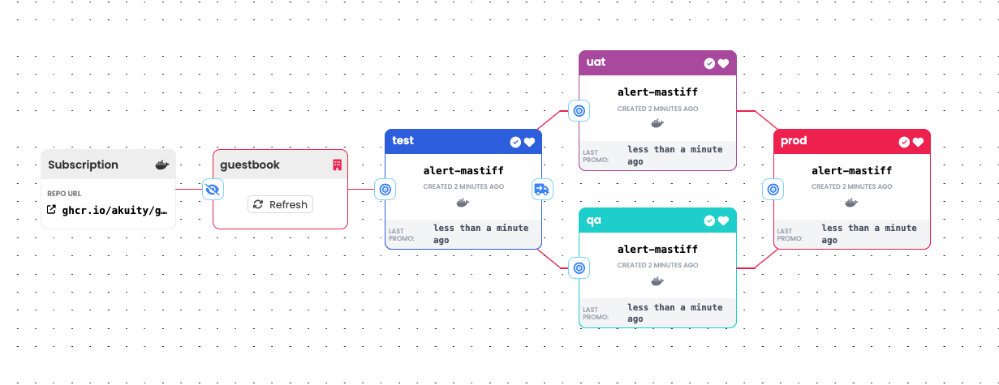

Fanning out and back in can also be an effective way to implement A/B testing.
Here, different `Freight` resources referencing different revisions of a
container image have been promoted into the "A" and "B" stages. When one of
these or the other has been deemed suitable for production, that one can be
promoted:

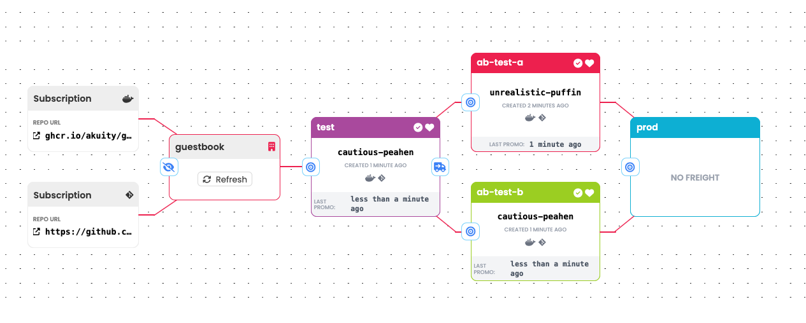

:::info
It is common for pipelines to fan in or out (or both) at
[Control Flow Stages](#control-flow-stages).
:::

### Control Flow Stages

Control flow stages are stages that define no promotion process. Their utility
is only to de-clutter a pipeline (see [Fanning Out / In](#fanning-out--in)) or
to provide an additional interaction point within it.

A "tangled" pipeline:

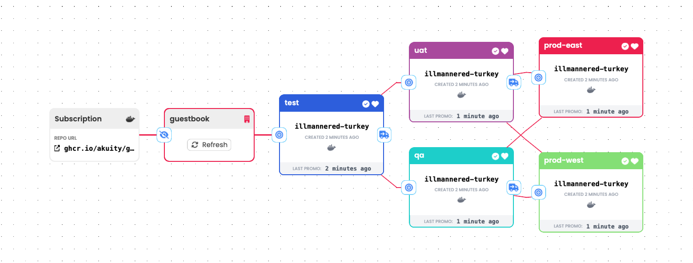

Using a control flow stage:

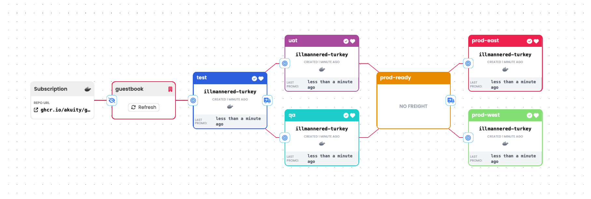

### Multiple Warehouses

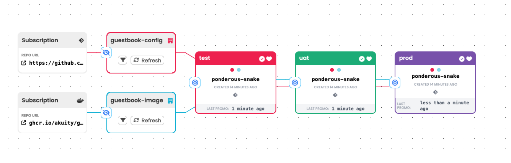

This pattern is in some ways the inverse of the
[Grouped Services](#grouped-services) pattern. In the Grouped Services pattern,
we learned that a single `Warehouse` that subscribes to multiple repositories
produces `Freight` that reference multiple artifacts that will be promoted from
stage to stage _together as a unit_.

A corollary to this is that artifacts in _different_ `Freight` resources can
be promoted from stage to stage _independently_ of one another.

Consider a scenario wherein it is common to promote new revisions of a container
image from stage to stage, all the way to production, rapidly and many times per
day, whilst configuration changes are more rare and are promoted more slowly,
with greater deliberation. In such a case, "packaging" image revisions and
configuration changes into a single `Freight` resource would make it all but
impossible to promote the image revisions and configuration changes at different
cadences.

The solution to the above is to create two separate `Warehouse` resources, with
one subscribing to the container image repository and the other subscribing to a
Git repository containing configuration. Each `Warehouse` will produce `Freight`
resources that reference just a single revision of an artifact. Both
`Warehouse`s can be connected to the _same_ `Stage`s, so that each `Stage`
effectively has two parallel pipelines running through it, with each of those
delivering one type of artifact or the other.

### Freight Assembly

At times, when applying other patterns such as the [Common Case](#common-case)
or [Grouped Services](#grouped-services) -- any pattern that involves `Freight`
resources referencing multiple artifacts -- you may encounter a specific
difficulty: Sometimes there is a time delay between the discovery of a new
revision of one artifact and the discovery of a new revision of another.

To illustrate this difficulty, imagine that new versions of a container image
_frequently_ require corresponding changes to application configuration -- for
instance, new environment variables that must be set. If a `Warehouse` that
watches for new revisions of the image and the configuration frequently
discovered new revisions of the image _without_ a new revision of the
configuration, the `Freight` resources it produces would frequently pair new
image revisions with incompatible configuration.

One strategy for dealing with this is to configure the `Warehouse` to
continuously discover new revisions of artifacts, but _without_ automatically
producing `Freight` resources. This configuration permits a user to use the
"Freight Assembly" feature to manually select a compatible combination of
revisions to promote.

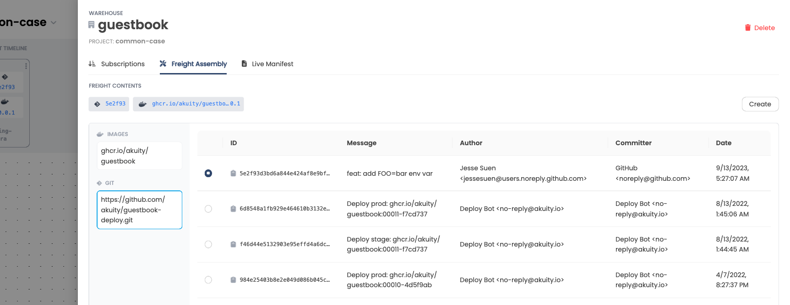

:::info
Additional features have been proposed to limit the automatic production of
`Freight` that may reference incompatible revisions of different artifacts,
which, in time, are likely to be implemented as well.
:::

### Mixed Promotion Modes

Promotion policies can be configured to allow or disallow new `Freight`
resources being promoted to each stage automatically. It is common for policies
to permit new `Freight` to progress from stage to stage automatically _up to a
point_, with promotions beyond that point, and into production, being manual.

There are less obvious uses for this feature, however.

Revisiting the problem posed in the introduction of the
[Freight Assembly](#freight-assembly)
pattern (incompatible artifact revisions), it is possible to leave automatic
`Freight` production enabled on the `Warehouse`, but disallow auto-promotions to
the leftmost `Stage` ("test," perhaps). In this way, any invalid combinations of
artifact revisions will not be immediately promoted to the "test" stage.
Instead, a user can manually select a `Freight` resources referencing a valid
combination of artifact revisions for promotion to that `Stage`.

### Gatekeeper Stage

Once again touching on the problem of `Freight` referencing incompatible
artifact revisions, if resources permit, it is possible to introduce a
"gatekeeper" `Stage` at the far left side of a pipeline. This is a `Stage`
wherein _things are allowed to fail_.

With a gatekeeper `Stage` in place, your `Warehouse` can continue producing
`Freight` resources automatically and new `Freight` resources can be promoted
automatically to the gatekeeper `Stage`. `Freight` resource can also be
promoted automatically _from_ the gatekeeper `Stage` to the next `Stage`, but
_failures_ in the gatekeeper `Stage` will block incompatible combinations of
artifact revisions from progressing further.

A `Freight` resource referencing incompatible revisions of different artifacts
is likely to be succeeded shortly by a new `Freight` resource that references
_compatible_ revisions of the artifacts, which will successfully clear the
gatekeeper `Stage`.

## Repository Patterns

This section documents common strategies for organizing Git repositories housing
application configurations. In general, the layout of any such repository must
provide for the separation of common, "base" configuration applicable to all
from stage-specific configuration that is unique to each.

As with all patterns presented in this document, you should not consider
yourself constrained by them. They are presented here as a starting point for
your own creativity.

### Layout with Helm

If your Git repository contains configuration in the form of a Helm chart, it is
common that the chart's `values.yaml` file, which provides default options
during chart installation, will contain "base" configuration. Stage-specific
configuration can be provided by supplemental values files that amend or
override defaults found in the base `values.yaml`.

A typical layout for such a repository may resemble this one:

```console
.
├── Chart.yaml
├── stages
│   ├── prod
│   │   └── values.yaml
│   ├── test
│   │   └── values.yaml
│   └── uat
│       └── values.yaml
├── templates
│   ├── _helpers.tpl
│   ├── deployment.yaml
│   └── service.yaml
└── values.yaml
```

### Layout with Kustomize

If you utilize Kustomize for configuration management, it is common to organize
configuration with a common "base" and stage-specific overlays.

A typical layout for such a repository may resemble this one:

```console
.
├── base
│   ├── deploy.yaml
│   ├── kustomization.yaml
│   └── service.yaml
├── charts
│   └── kargo-demo
└── stages
    ├── prod
    │   └── kustomization.yaml
    ├── test
    │   └── kustomization.yaml
    └── uat
        └── kustomization.yaml
```

### Monorepo Layout

When working with monorepos containing configuration for multiple applications,
it is common to organize configurations by application and then by stage.

A typical layout for such a monorepo storing many Helm charts may resemble this:

```console
.
├── guestbook
│   ├── Chart.yaml
│   ├── stages
│   │   ├── prod
│   │   │   └── values.yaml
│   │   ├── test
│   │   │   └── values.yaml
│   │   └── uat
│   │       └── values.yaml
│   ├── templates
│   │   ├── _helpers.tpl
│   │   ├── deployment.yaml
│   │   └── service.yaml
│   └── values.yaml
└── portal
    ├── Chart.yaml
    ├── stages
    │   ├── prod
    │   │   └── values.yaml
    │   ├── test
    │   │   └── values.yaml
    │   └── uat
    │       └── values.yaml
    ├── templates
    │   ├── _helpers.tpl
    │   ├── deployment.yaml
    │   └── service.yaml
    └── values.yaml
```

A typical layout for a monorepo storing many Kustomize configurations may
resemble this:

```console
.
├── guestbook
│   ├── base
│   │   ├── deploy.yaml
│   │   ├── kustomization.yaml
│   │   └── service.yaml
│   └── stages
│       ├── prod
│       │   └── kustomization.yaml
│       ├── test
│       │   └── kustomization.yaml
│       └── uat
│           └── kustomization.yaml
└── portal
    ├── base
    │   ├── deploy.yaml
    │   ├── kustomization.yaml
    │   └── service.yaml
    └── stages
        ├── prod
        │   └── kustomization.yaml
        ├── test
        │   └── kustomization.yaml
        └── uat
            └── kustomization.yaml
```

:::warning
When storing configuration for many applications in a single repository, any
`Warehouse` resources that subscribe to that repository should be carefully
configured with path filters such that only changes to _relevant_ configuration
are detected. A `guestbook` `Warehouse`, for instance, should be unconcerned
with changes to `portal` configuration.
:::

### Storage Options

Toward the conclusion of most promotion processes, output of some kind must be
written to a Git repository so it can be picked up and applied by a GitOps agent
such as Argo CD. There are a few viable options by which to approach this:

1. **Stage-Specific Branches**

   This is decidedly the maintainers' preferred approach, but it is by no means
   required.

   :::info
   The practice of storing stage-specific configuration in dedicated branches
   seems to have been unfairly maligned through misunderstanding of a certain
   infamous blog post, which was actually asserting that _GitFlow_ has no place
   in GitOps.

   Some users also object to this approach on the grounds that they don't wish
   to maintain a large number of branches. In fact (this is not GitFlow), it is
   never incumbent upon users to _merge_ changes between branches. Thus, we
   encourage users to view stage-specific branches _not_ as a maintenance
   burden, but simply as _storage_. If it helps to conceptualize it, each
   branch may as well be an S3 bucket.
   :::

1. **Writing Back to `main`**

   Users who truly prefer to work with only a single branch may choose to write
   the output of any promotion process _back_ to their `main` (trunk) branch,
   _however_, doing so requires some deliberate care. The _output_ of promotion
   processes should be written to paths within the repository that are
   _distinct_ from the _input_ to those processes.

   For example, the following repository layout keeps the input to promotion
   processes in the `src` directory and the output in the `builds` directory.

   :::warning
   Any `Warehouse` resources that subscribe to this repository must carefully
   apply path filters to ensure that changes within the `builds` directory do
   not trigger the production of new `Freight` resources. Failure to do so may
   result in a "feedback loop."
   :::

   ```console
   .
   ├── builds
   │   ├── guestbook
   │   │   ├── prod
   │   │   ├── test
   │   │   └── uat
   │   └── portal
   │       ├── prod
   │       ├── test
   │       └── uat
   └── src
      ├── guestbook
      │   ├── base
      │   │   ├── deploy.yaml
      │   │   ├── kustomization.yaml
      │   │   └── service.yaml
      │   └── stages
      │       ├── prod
      │       │   └── kustomization.yaml
      │       ├── test
      │       │   └── kustomization.yaml
      │       └── uat
      │           └── kustomization.yaml
      └── portal
         ├── base
         │   ├── deploy.yaml
         │   ├── kustomization.yaml
         │   └── service.yaml
         └── stages
               ├── prod
               │   └── kustomization.yaml
               ├── test
               │   └── kustomization.yaml
               └── uat
                  └── kustomization.yaml
     ```

1. **Writing to a Separate Repository**

   Kargo does not require that the output of promotion processes be written to
   the same repository that is monitored by `Warehouse` resources. If it suits
   your use case, it is plausible to write the output of promotion processes to
   one or multiple branches of an entirely separate repository.

## Promotion Patterns

Being mostly unopinionated, Kargo does not pre-define any specific promotion
processes. Instead, it provides a number of fine-grained
[Promotion Steps](../60-reference-docs/30-promotion-steps/index.md) that can
be combined to implement a user-defined promotion process.

This section documents a "typical" promotion process as well as a few common
techniques.

:::info
Support for custom / third-party promotion steps is coming in a future release.
:::

### The Common Case

Details vary, but a common promotion process might look something like this:

1. Clone a Git repository containing the application's configuration, possibly
   checking out multiple commits or branches.

1. Perform small edits on specific files. This might, for instance, involve
   updating a `values.yaml` file in a Helm chart to reference a new revision of
   a container image.

1. Combining the application's "base" configuration with stage-specific
   configuration. This could be as simple as copying relevant configuration to
   some other location or could involve a configuration management tool like
   Kustomize or Helm as described in the [Rendered Configs](#rendered-configs)
   pattern below.

1. Write the updated and combined configuration to a Git repository using any
   option laid out in the [Storage Options](#storage-options) section.

1. Trigger an associated Argo CD `Application` resource to sync with the newly
   promoted configuration.

### Rendered Configs

This common pattern is easily combined with most others and, in fact, we've
alluded to it in some of the other patterns:

> Uses a configuration management tool like Kustomize or Helm to combine
> the application's "base" configuration with stage-specific configuration.

To make a finer point of this, "rendering" configs means using (Kargo's
equivalent of) commands like `helm template` or `kustomize build` to generate
Kubernetes manifests that are _plain YAML_ and require no further processing to
be applied to a cluster.

While Kargo does not require that you do this, it is a technique we highly
recommend chiefly because diffing plain YAML (whist reviewing a PR, perhaps)
promotes a comprehensive understanding of the changes to be applied. By
contrast, diffing changes to a Helm `values.yaml` file or a Kustomize overlay
both require knowledge of those tools and some degree of mental gymnastics to
reason over the changes that will be applied after the GitOps agent has
performed the rendering.

:::info
Pre-rendering configuration in this manner can also boost the performance of
your GitOps agent, which will be relieved of any responsibility for executing
configuration management tools.
:::

### Pseudo-GitOps

This pattern is intentionally presented last because it's not _real GitOps_ in
that desired state is not declared (or not _entirely_ declared) in a Git
repository.

Kargo does permit user-defined promotion processes to directly mutate the state
of Argo CD `Application` resources. This can be used, for instance, to update
Helm-specific or Kustomize-specific attributes of an `Application` resource. It
can also be used to update the `source.targetRevision` field to effectively
change the Git commit or Helm chart version to which the `Application` syncs.

Kargo implements these capabilities mainly to reduce the overhead of simply
experimenting with Kargo, but we _strongly_ recommend against applying this
pattern in a production setting.
