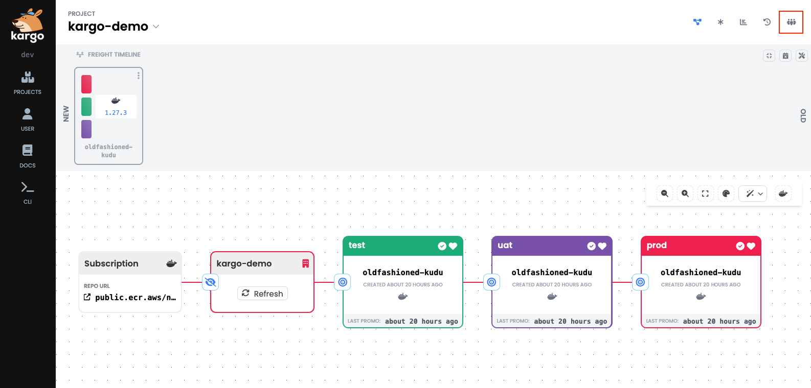
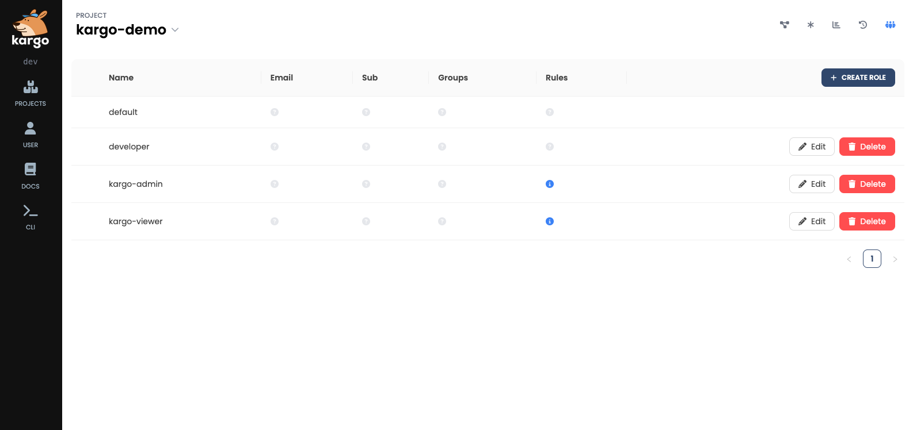
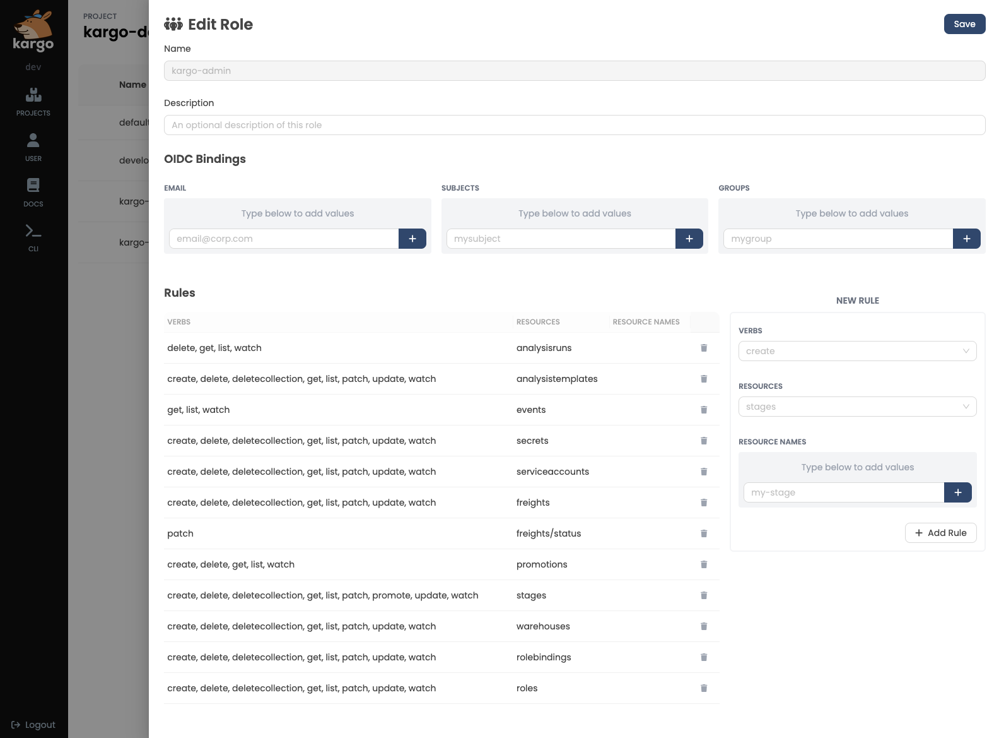

# Access Controls

Most access controls in Kargo are within the purview of highly-privileged
_users_ -- ones who might be considered to be "project admins." Such users are
the intended audience for this document.

:::note
__Not what you were looking for?__

If you're an operator looking to understand more about access controls,
especially the few outside the purview of project admins, you may find some
value in this document, but most of what you need to know can be found in the
[Operator Guide's Access Controls](../../../40-operator-guide/40-security/30-access-controls.md)
section.
:::

## Overview

Kargo is usually configured to support single-sign-on (SSO) using an identity
provider (IDP) that implements the
[OpenID Connect](https://openid.net/developers/how-connect-works/) (OIDC)
protocol. Configuring this is the responsibility of the operator and is
discussed in-depth in the dedicated
[OpenID Connect](../../../40-operator-guide/40-security/20-openid-connect.md)
section of the Operator Guide.

Kargo also implements access controls through _pure Kubernetes
[RBAC](https://kubernetes.io/docs/reference/access-authn-authz/rbac/)._

:::info
Kargo's creators learned from previous experience that when APIs are modeled as
Kubernetes resources, it is best to rely solely on Kubernetes-native
authorization mechanisms. By doing so, access controls are enforced even for
users with direct access to the Kargo control plane's underlying cluster who
might shun the Kargo CLI and UI in favor of `kubectl`.
:::

There is a natural _impedance_ between users authenticating to _Kargo_ through
some IDP and access controls being implemented through pure _Kubernetes_ RBAC.
To make a finer point of it: _It is impossible for a Kubernetes cluster to
enforce RBAC for users it does not recognize._ Most operators will not wish to
resolve this by granting direct cluster access to a large number of developers
and training them to use `kubectl`, so a different solution is required.

Kargo resolves this impedance through a simple scheme that permits users
authenticated via the IDP to be _mapped_ to Kubernetes `ServiceAccount`
resources. For the most part, these mappings are best managed at the project
level by project admins.

## User to `ServiceAccount` Mappings

First, project admins should understand how the mapping of users to
`ServiceAccount` resources works.

Most Kargo users interact with Kargo via its API server, using its UI or CLI as
a client. In either case, those users are authenticated by a bearer token issued
by the IDP.

For every request, the Kargo API server validates and decodes the token to
obtain trusted information about the user which, importantly, includes _claims_
such as username, email address, and group membership. The exact claims
available depend on the IDP and how the operator has configured the Kargo API
server.

Also for every request, the Kargo API server queries the Kubernetes API server
to obtain a list of all `ServiceAccount` resources to which the user has been
mapped. This search is mostly limited to `ServiceAccount` resources in Kargo
project namespaces only (i.e. only those labeled with
`kargo.akuity.io/project: "true"`).

ServiceAccount resources may be mapped to users through the use of annotations
whose key begins with `rbac.kargo.akuity.io/claim.`. The value of the annotation
may be a single value, or a comma-delimited list of values.

In the following example, the `ServiceAccount` resource is mapped to all of:

* Users with a `sub` claim identifying them as either `alice` or `bob`.
* A user with the `email` claim `carl@example.com`.
* All users with a `groups` claim  containing _either_ the `devops` or
  `kargo-admin` group.

```yaml
apiVersion: v1
kind: ServiceAccount
metadata:
  name: admin
  namespace: kargo-demo
  annotations:
    rbac.kargo.akuity.io/claim.sub: alice,bob
    rbac.kargo.akuity.io/claim.email: carl@example.com
    rbac.kargo.akuity.io/claim.groups: devops,kargo-admin
```

A user may be mapped to multiple `ServiceAccount` resources. A user's effective
permissions are therefore the _union_ of the permissions associated with all
such `ServiceAccount` resources.

### Managing Mappings and Permissions

Unless the operator has disabled it, project admins can manage
user-to-`ServiceAccount` mappings as well as the permissions associated with
those `ServiceAccount` resources via either the UI or CLI.

In either case, Kargo abstracts a trio of `ServiceAccount`, `Role`, and
`RoleBinding` resources as a single "Kargo role." This abstraction offers UI and
CLI users the convenience of a simplified interface for managing
user-to-`ServiceAccount` mappings and the permissions associated with those
`ServiceAccount` resources.

Three such "Kargo roles" are pre-defined in a project's namespace when a new
`Project` resource is created:

1. `default`: This Kargo role exists by virtue of the existence of the `default`
   `ServiceAccount` resource that Kubernetes automatically creates in any new
    namespace, including those associated with a Kargo project. This
    `ServiceAccount` lacks the annotations that would identify it as being
    Kargo-managed, and as such, cannot be modified or deleted via the Kargo UI
    or CLI. You can effectively ignore this Kargo role.

1. `kargo-admin`: This Kargo role is a trio of `ServiceAccount`, `Role`, and
   `RoleBinding` resources created by the Kargo management controller. Its
   permissions are pre-defined as those necessary to manage _all_ aspects of the
   project. It is not initially mapped to any users. All three resources are
   annotated as being Kargo-managed, and as such, the "Kargo role" that
   abstracts them can be modified or deleted via the UI or CLI.

1. `kargo-viewer`: This Kargo role is a trio of `ServiceAccount`, `Role`, and
   `RoleBinding` resources created by the Kargo management controller. Its
   permissions are pre-defined as those necessary to view, but not modify or
   delete all project resources. It is not initially mapped to any users. All
   three resources are annotated as being Kargo-managed, and as such, the "Kargo
   role" that abstracts them can be modified or deleted via the UI or CLI.

#### Managing Kargo Roles with the UI

To see all Kargo roles in a project, navigate to your project and click the
"people" icon in the upper right corner of the screen:



Kargo will display a list of all Kargo roles in the project:



This interface also permits users with appropriate permissions to create,
modify, or delete Kargo roles:



:::info
The Kargo API server translates all such creations, modifications, and deletions
into the appropriate actions on the underlying `ServiceAccount`, `Role`, and
`RoleBinding` resources.
:::

#### Managing Kargo Roles With the CLI

* All Kargo roles associated with a project can be listed using the
  `kargo get roles` command:

  ```shell
  kargo get roles --project kargo-demo
  ```

  ```shell
  NAME           KARGO MANAGED   AGE
  default        false           18h
  kargo-admin    true            18h
  kargo-viewer   true            18h
  ```

* The details of a specific role can be examined by naming the role and
  requesting a YAML representation:

  ```shell
  kargo get role kargo-admin --project kargo-demo --output yaml
  ```

* Users with appropriate permissions can create, modify, or delete Kargo roles.

* To create a new role named `developer`:

  ```shell
  kargo create role developer --project kargo-demo 
  ```

  ```shell
  role.rbac.kargo.akuity.io/developer created
  ```

* To grant the new role to users with `developer` in their `groups` claim:

  ```shell
  kargo grant --role developer \
    --claim groups=developer \
    --project kargo-demo
  ```

  ```shell
  role.rbac.kargo.akuity.io/developer updated
  ```

* To grant broad permissions on `Stage` resources to the new role:

  ```shell
  kargo grant --role developer \
    --verb '*' --resource-type stages \
    --project kargo-demo
  ```

  ```shell
  role.rbac.kargo.akuity.io/developer updated
  ```

* The `kargo revoke` command can be used identically to the `kargo grant` command,
  but has the opposite effects.

* It may sometimes be useful to view a Kargo Role's underlying `ServiceAccount`,
  `Role`, and `RoleBinding` resources. This may be useful, for instance, to
  users who have managed Project-level permissions imperatively up to a point
  and now wish to make the transition to GitOps'ing those permissions.

  ```shell
  kargo get role developer --as-kubernetes-resources --project kargo-demo
  ```

  ```yaml
  NAME        K8S SERVICE ACCOUNT   K8S ROLE BINDINGS   K8S ROLES   AGE
  developer   developer             developer           developer   13m
  ```

* It is also possible to request alternative representations of the underlying
  resources:

  ```shell
  kargo get role developer \
    --as-kubernetes-resources -o yaml \
    --project kargo-demo
  ```

  :::note
  Output of the above command is not shown here due to its length.
  :::

* Last, it is, of course, possible to delete a role:

  ```shell
  kargo delete role developer --project kargo-demo
  ```

  ```shell
  role.rbac.kargo.akuity.io/developer deleted
  ```

#### Managing Kargo Roles Declaratively

Whether it is because your operator has disabled management of Kargo roles via
the UI and CLI, or because you simply prefer to manage your project
declaratively (perhaps evens with GitOps), you can do so by simply
`ServiceAccount`, `Role`, and `RoleBinding` resources 
[in the usual fashion](https://kubernetes.io/docs/reference/access-authn-authz/rbac/).

With the exception of the claim-mapping annotations on `ServiceAccount`
resources, these resources do not need to be labeled or annotated in any special
way.

#### Global Mappings

As previously mentioned, _most_ access controls are managed at the project level
by project admins, however, there are two exceptions to this which put some
control in the hands of the operator, and you should be aware of them.

1. Operators are able to map users with specific claims to pre-defined
   `kargo-admin` or `kargo-viewer` `ServiceAccount`s in the same namespace in
   which Kargo is installed.

    :::note
    It is common for operators to map _all_ authenticated users to the
    `kargo-viewer` `ServiceAccount` to effect broad read-only permissions. These
    permissions _do not_ extend to credentials and other project `Secret`s.
    :::

1. Operators can designate one or more namespaces as containing "global"
   `ServiceAccount` resources, which they may also pre-define and pre-map
   to users with specific claims.

    Optionally, operators may use `ClusterRoleBinding`s to grant any necessary
    system-wide permissions to such `ServiceAccount` resources.

    Importantly, operators who have designated such namespaces and populated
    them with `ServiceAccount` resources, have essentially pre-defined different
    classes of users. You, as a project admin, can use `RoleBinding`s within
    your own project namespaces to grant permissions to such classes of user
    without needing to define them yourself or know much about OIDC claims,
    although this requires a declarative approach to managing the `Role`s and
    `RoleBinding`s.

    :::info
    "Global" is a misnomer. `ServiceAccount` resources in designated namespaces
    are not truly global because they are still mapped to users according to the
    rules described in the previous sections.
    :::
