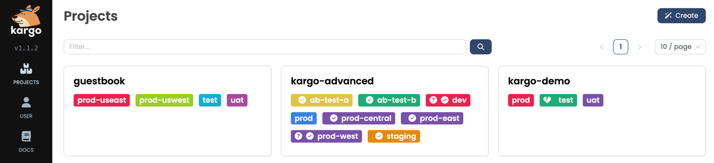
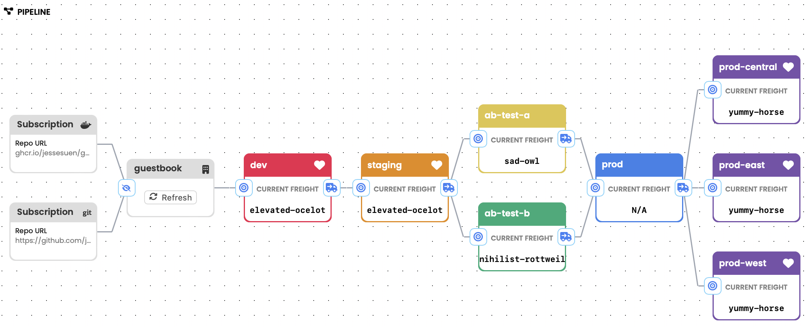
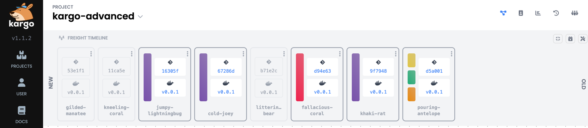
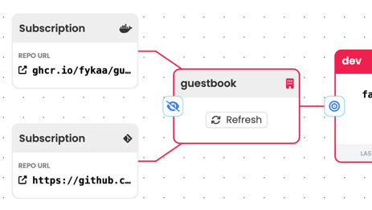

# Kargo's Core Concepts

## Overview

Kargo is designed to simplify and automate the promotion of applications across multiple environments in
a cloud-native setup. At the heart of Kargo are several key components: `Projects`, `Warehouses`, `Freight`, `Stages`, and `Promotions`.

These components work together to create a pipeline for application deployment and promotion,
adhering to GitOps principles. Each subsequent section will dive into these elements, explaining their
roles and how they integrate to make Kargo an efficient orchestration tool for application deployment.

## The Basics

### Projects

A `Project` in Kargo serves as the foundational unit for organizing and managing related resources that make up
one or more delivery pipelines.
It is the basic structure for organization and tenancy in Kargo, acting as a container for everything related
to your application's promotion lifecycle.

Every `Project` resource is tied to a namespace, ensuring a 1:1 mapping between the  `Project` 's name and its
corresponding namespace. This mapping simplifies the management of resources and ensures a clean separation
between different  `Project` s.

When a `Project` is created, Kargo automatically sets up the necessary boilerplate configuration,
including policies such as RBAC. These rules at the `Project` level allow administrators to control access and define policies,
like whether certain `Stage`s in the pipeline are eligible for automatic promotions of new `Freight`.

 `Project` serves as the entry point to understanding the next major component: `Stage`s.
These `Stage`s outline the sequential steps that an application goes through within the pipeline, which we'll explore in the next part.

### Stages

In Kargo, a `Stage` represents a critical step within the delivery pipeline,
designed to capture the purpose of an application instance rather than its location.
The concept of `Stage`s eliminates the ambiguity often associated with the term "environment",
which can vary in meaning depending on the role of the person describing it.
A developer might see an environment as a specific instance of an application,
while a DevOps engineer might view it as a segment of infrastructure. To eliminate this confusion,
Kargo adopts the term `Stage`.

`Stage`s are integral to Kargo’s architecture. They can be linked together in a
directed acyclic graph (DAG) to form a delivery pipeline with earlier `Stage`s
like "dev" leading to later `Stage`s like "prod".
This structure allows for a clear and logical progression of applications through various
`Stage`s of development and deployment.

With `Stage`s setting the direction for your application's lifecycle, the next part will explore `Freight`,
the component that progresses through these `Stage`s.

### Freight

`Freight` is Kargo's second most essential concept after `Stage`, serving as a set of references to
versioned artifacts that progress through the delivery pipeline.

A single piece of `Freight` can include:
- Container images (from image repositories)
- Kubernetes manifests (from Git repositories)
- Helm charts (from chart repositories)

In essence, `Freight` can be thought of as a meta-artifact that Kargo seeks to progress from one `Stage` to another.

Next, we'll see `Warehouse`s, where this `Freight` is stored and managed throughout its journey in the pipeline.

### Warehouses

A `Warehouse` is a source of `Freight`. It subscribes to one or more:

- Container image repositories
- Git repositories
- Helm charts repositories

Whenever a `Warehouse` detects new artifacts in any subscribed repository, it produces a new piece of `Freight`,
which can then move through the `Stage`s of the delivery pipeline. This aligns with the GitOps principle of automatic
pulling, ensuring that the latest changes are continuously integrated.

With `Warehouse`s managing the inflow of `Freight`, the next part will talk about `Promotion`s, which *governs*
how `Freight` progresses through the `Stage`s in the pipeline.

### Promotions

The *process* of moving `Freight` to a specified `Stage` is called `Promotion`.
This ensures that changes are systematically and safely propagated across the pipeline.

In Kargo, this promotion process is represented by a Kubernetes resource of type `Promotion`.

The essential fields within a `Promotion` are:
- The piece of `Freight` to be promoted.
- The target `Stage` for the promotion.

## What next?

This page covered the high level overview of several Kargo components, for detailed technical information of the resource types please refer to the corresponding [How-to Guides](./how-guides).
